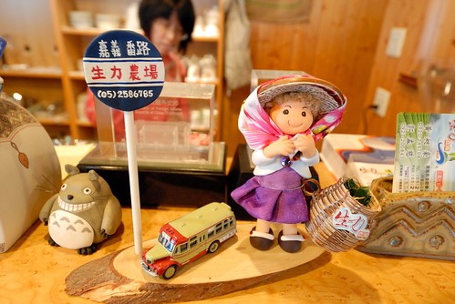
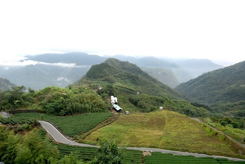

最近的中午或晚上 我總會坐在電腦前打開網誌編輯畫面 覺得應該努力把草稿狀態的幾篇紀錄給完成 但總是開了檔案 發呆幾分鐘後便又默默關上 心裡說著"明天再寫吧" 我想一定是因為連日又濕又冷的天氣讓人低迷 加上近來極度耗腦的工作讓我空了 然後補上個感冒侵略而讓我耗竭了.... 因著以上種種讓我更加懷念兩週前跟徹爸上阿里山隙頂買茶的那下午 原先單純的只是要買茶 但農場老闆娘卻一眼就認出我們而且還熱情的招呼我們 一杯農場自產的好咖啡 一段一兩小時的聊天談話 聊民宿 聊我跟老闆娘都最愛的台東旅行 我驚喜於人跟人之間的距離可以這樣容易就拉近 且緣分原來一直存在著且被珍惜著.... 現在每天泡杯農場的烏龍茶喝 每口的回甘也是那天下午的幸福回味  

一直很喜歡農場餐廳望出去的這片景像 那天老闆娘處理房客事情時 我站在窗台旁看著這片景 忍不住伸了大懶腰 呼了好大一口氣 真棒~ 不是嗎~ 
