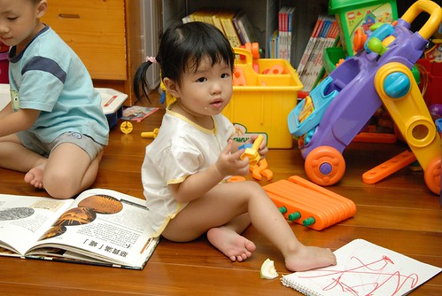
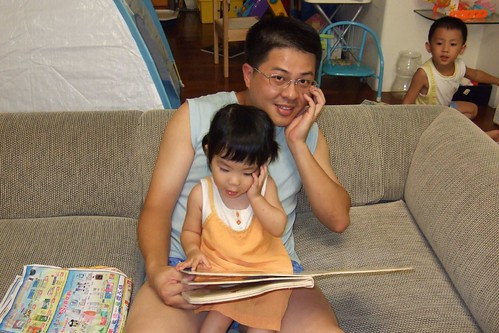
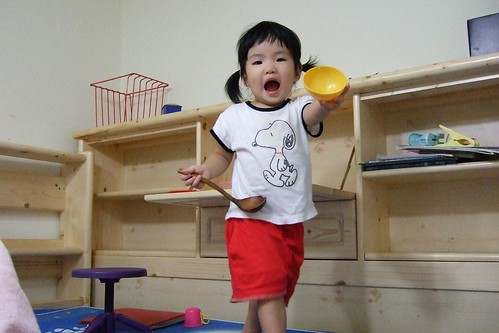
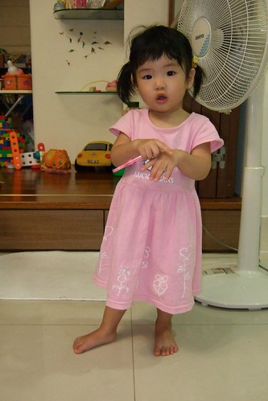
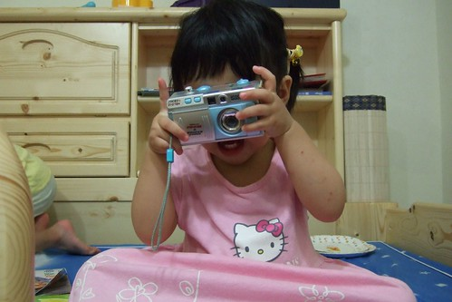
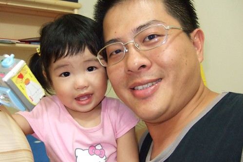

小愛最近有點跌破爸媽眼鏡的難搞  
除了腦袋越來越有想法堅持外  
也會靈活運用"不要 不要 不要~"(常連說3-4個以上的不要)表達她的拒絕  
其實明白這樣的叛逆是成長必經的一個過程(甚至有點高興總算開始成長了)  
但也許因為太習慣於她的靜懿貼心 所以熊熊有點難以接受這樣的她  
可仔細回想阿徹在這1歲7-8個月時不也這麼難搞 愛哭 甚至常常哭到吐  
那時候徹爸常說"就讓你哭 反正吐了洗一洗 換個衣服就好"  
只是徹爸對於小愛妹妹的包容性明顯高於對阿徹哥哥阿  
(徹爸抵死不承認他對小愛比較好 他只能接受"包容性"較高這樣的說法)  
  
回嘉義的週六夜晚 因傍晚的半杯紅茶   
小愛破紀錄的耗到半夜一點才入睡    
其實媽媽很能體會疲累卻失眠的痛苦 但...你的精神會不會太好了點阿  
  
(深夜12點多 獨剩母女倆的客廳)  
  

小愛從小就不是個愛看電視的人  
看電視的專注度很少超過5分鐘以上  
可最近會拿著遙控器要爸爸媽媽開電視  
且知道不同電視或是放映機 要用不一樣的遙控器(三隻不同用途分的很清哩)  
加上最近徹爸會幫阿徹錄下迪士尼頻道的米奇妙妙屋跟粉紅豬小妹  
小愛似乎跟著哥哥一起看出興趣  
露出難得的專注樣且會隨著劇情大呼小叫或搖擺  
甚至在哥哥到廁所找媽媽詢問"可以看佩佩豬嗎"  
小妮子也尾隨其後的在哥哥離開後 探出小臉用有點請求的表情問我"珮珮 珮珮??"  
當我回答"可以ㄚ"後便也雀躍的跑去電視前  
總算....小愛有個她喜愛的卡通了(回想阿徹在一歲半時就已經看海底總動員看的嚇嚇叫了)  
有時候甚至一早起床就喊著"珮珮 珮珮~"  
對小愛來說 珮珮似乎快與電視畫上等號了  
  
搬到兒童房加上戒奶嘴 小愛這陣子很難入眠  
不若以往一切打理妥當後 塞個奶嘴放入嬰兒床 不消10分鐘即沉靜睡去  
現在常見從床頭翻轉到床尾 然後唉唉叫裝可憐 再沒人理便開始大哭  
曾經爸媽很狠心的就讓她哭了半小時 然後哭累到睡著  
但大半的時候還是投降的抱起他秀秀秀  
雖然徹爸說"抱在懷裡哄睡還挺令人回味的"(其實徹爸真的很戀小愛的)  
但小妮子竟也拿翹的每晚這樣搞 而且越搞越誇張...  
我跟徹爸也才驚覺小妮子的戒奶嘴陣痛期竟然這麼久而且越拖越痛....  
已經3-4週 還是偶而問起她的"嘴嘴"甚至吃起她的小手  
徹爸忍不住說 給她奶嘴塗辣椒好了  
聽的媽媽氣的大喊"啥咪 都戒這麼久了 還拿出來勒" (爸爸果然都比較容易心軟吧)  
唉~媽媽也知道這段路不好走(想你哥當年也是這模樣)但還是希望大家都要堅持下去ㄚ  
路~就不遠矣  通過這段顛波就有休息站可以休憩尿尿了啦...要加油 ~  
  
  
一個人叛逆的時候 好像做起什麼事也都會故意表現差一點 讓人想扁她  
好久沒有尿濕褲子的小愛 前陣子常就這麼的給她"嘩"了下來  
尿濕罵她也不若往常"秀皮"的一罵就哭  
唉~臉皮果然還是薄一點好 這樣比較有反省跟ㄍㄧㄥ的能力  
  
  
  
我跟徹爸還是比較愛這樣"咪咪阿笑"的小愛  
  
  
  
可是這年紀的小孩大半時候都是這樣猴猴 皮皮的   
  
  
有時候轉移注意力 親子共讀稍能緩和焦躁不安的情緒 (徹爸很故意的學小愛擺pose)  
  
  
  
經過這陣子的叛逆期  
媽媽我覺得 小愛畢竟(果然)是我跟我徹爸生的小孩 阿徹的妹妹  
就是 拗脾氣  急性子  太有主見  調皮好動....  
唉~真是種什麼瓜得什麼瓜  
  
  
  
這身裝扮有媽媽以前很排斥的東西: 粉紅色& kitty  
但不得不承認小女生穿上粉紅色 穿上小洋裝 綁起小辮子 氣質真的都不一樣了  
  
  
  
長腦袋的證明之二就是越來越會玩玩具了  
當然也越來越會跟哥哥搶玩具  
而且最好還要以跟哥哥相同規格對待她  
隨便呼哢打發她也不行 小妮子會不賞臉的   
  
  
吃的喝的 哥哥有的當然也不能少給她  
  
  
  
小女生天生就是多了份甜蜜 撒嬌的氣質與本能  
把自己的老爸迷的神昏顛倒 心甘情願拜倒群柳下  
  
  
  
連阿嬤也被小愛給臣服了  
當我們數落小愛哪不對時  
阿嬤連說"小愛那麼小哪會懂" "你小時候也是這樣'...之類幫她孫女解套的理由  
小愛也很回報阿公阿嬤這些疼愛她的人  
被罵時躺在阿嬤懷裡秀秀  
吃飽後拿起鞋子給阿公 要阿公帶出門散步玩耍  
很好~已經知道什麼人是會對自己好 會帶自己去玩  可以不用爸爸媽媽隨俟在旁了   
不需要爸爸媽媽是成長的第三個證明  
  
  
稞稞阿嬤也是寵員之一  
真是不枉費阿嬤給你吃了這麼多碗稞  
  

