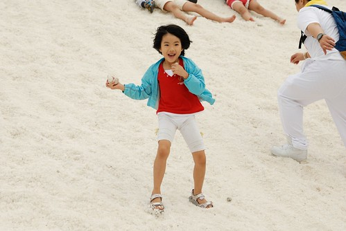
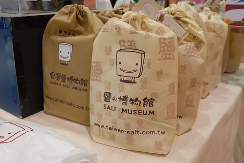
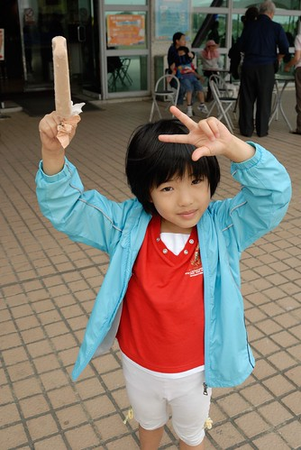
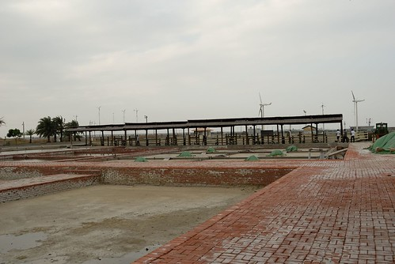
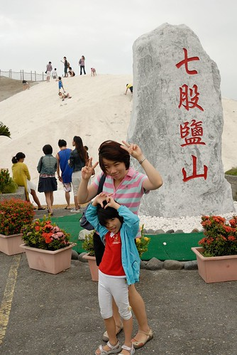
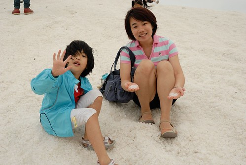
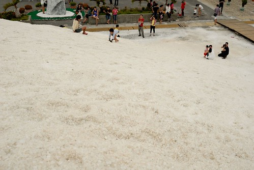
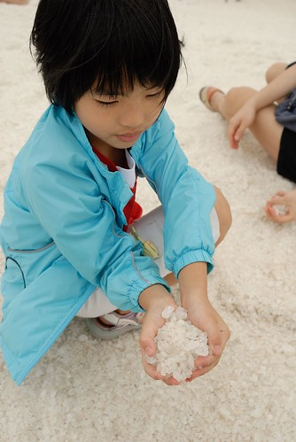
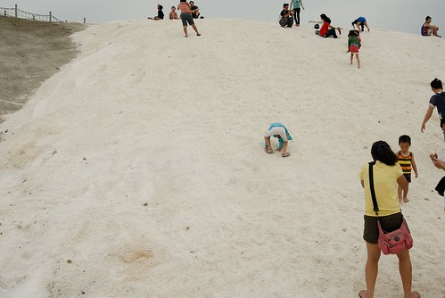
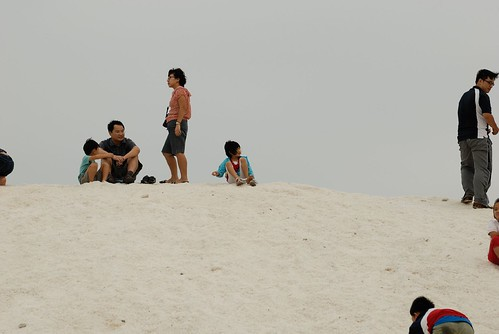

今年一直很想找個機會去看鹽田 雖然張嬤們都說"台灣早就不曬鹽啦 就只剩下看的鹽山而已" 但我莫名的就是想看白色的田 九月底回嘉義的週末 總算徹爸許了我 帶我去台南看鹽田 嘉南地區有幾處有名的鹽田 布袋 七股與北門 徹爸選擇先去有鹽博物館的七股 想說都有博物館應該比較豐富 結果沒想到 風蕭蕭然的秋天傍晚更突顯出七股鹽田/山的沒落與逝去 看著僅有的一座鹽山與一望無際的荒涼 我哀號著"這不是我要看的鹽田阿" 我滿是失望.... 回程的時候明明天都快黑了 徹爸卻異於往常的積極與堅持要再帶我去北門走走 徹爸說"那裏好像有些老建物可以看 還不錯的樣子" 我想徹爸是想cheer me up 果然~ 北門街道的好氛圍讓我們好是喜歡 回家後我上網搜尋想多了解北門  這一查查出了北門的田仔腳瓦盤鹽田 網友照片裡的一畝畝堆著小鹽山的田 尤其伴著夕陽餘暉的時後 真是美呆了... 讓我迫不及待著下一次的回嘉義 然後三週後我們從台北直殺北門 廟口前的午餐 遊客中心裡的嬉遊 北門嶼教堂的寧靜 田仔腳鹽田的感動與黑腹燕鷗飛來的驚喜 我第一次迷上一個花東以外的小鎮 ... 這一篇其實很沒點但因為是個重要的"引子" 所以一定要記上一筆 而我那個很想寫的遊記也才能開始...  

 

我們循著導航系統的指引 約莫一個鐘頭的時間從嘉義來到台南七股 首先先去台鹽的鹽博物館探探 研究下這個鹽可以怎麼賞  只是沒想到博物館的入門票竟然一個人就要一百元多些 嘖嘖嘖~  讓我們完全沒有動機與衝動 倒是可以隨意進出的紀念品販售區裡賣的相關產品很有趣 很多產品被賦予新的個性與商機  我們買了隻鹽冰棒吃  想說沒看到鹽那起碼吃隻特別的鹽冰棒 加了鹽味的奶茶冰棒意外的令人覺得好吃  從鹽博物館依稀可見稍遠處的鹽山 本來我們打算邊吃著冰棒邊邊散步過去 那應該也挺愜意的 只是沒想到鋪設良好 連接著兩處的小路竟然限制著只有小火車可以駛 這... 再一次覺得這裡實在太OOXX 一個人小火車來回的票價接近百元其實也是很超出我們可以接受範圍的 但因為今日阿徹為了想玩電腦又拗脾氣沒跟著我們出門 為了給愛愛"特別的招待" 我二話不說的花下去了  隨著小火車的前進 眼前的"山"形越來越明顯 只是怎麼是灰的 好像砂石廠阿?!  而沿途除了數處的整修外 更是什麼都沒看見 納ㄟ阿ㄋㄟ...  幸好到達目的地後 堂堂立著七股鹽山的眼前還有一小座山是白的  雖然跟10年前的盛況相比實在不可同日而語 (旅遊DM上一定都是用10多年前的照片 才讓我抱這樣大的期望)  不過像雪一樣的鹽山還是會讓來到這裡的大人小人想攀上山頭  我們坐在鹽地上 抓一把鹽摸摸看 聞聞看 哇! 還真的是鹽耶!  而不小心跑到涼鞋裡的鹽粒還會讓腳底痛的哇哇叫  不過我們還是努力爬上約莫三層樓高的山頂  坐在山頂上吹著帶有鹽味的涼風  俯瞰下方的人事物... 好像大家看到這座鹽山都是好開心阿  愛愛如玩沙般的玩著鹽  也幫我跟徹爸照張相  愛愛說這裡真是太好玩了! 恩~ 愛愛有開心有喜歡就值得了  後來愛愛自己一個人又去攻頂了兩次  幾近45度的斜坡常得讓她手腳並用 連走帶爬的  看得我跟徹爸有點小緊張她會不會一個狼傖给滾下山  不過攻頂後 一個人坐在上頭上的愛愛看來好優遊自得  好興奮  而後來在鹽屋前 愛愛也開心的跟聖誕老公公的麋鹿照相  可見七股鹽山還是可以給人帶來很多樂趣的!  這是這裡真的不是我的菜阿!!  停留約莫半小時後 我們便再搭著小火車回博物館處 這次的位置在駕駛座後方  愛愛更是開心了  火車ㄅㄨ ㄅㄨ  ㄅㄨ~~~ 是回程 但我們的鹽田小鎮之旅其實才正開始醞釀著~  PS. 自己還真是把這裡寫的很難玩的樣子 真是對不住了
