徹愛的暑假已經進入最後的倒數階段 媽媽的這篇作業也該趕緊完成了~ 再一次的月考挫敗後 阿徹依舊過著不知天高地遠的快樂生活 而我在每天跟他的鬥智與拉鋸中竟也越來越淡定 雖然彼此還是會有失控的狀況發生 但我們的次數減少著 頻率拉長著 雖然彼此還是會有委屈 認為對方不了解的時候 但我們越來越能好好的"談" 離清事情的對與錯 分析作法的利與弊 就像大人間的對話與溝通 我看著個頭越來越大的阿徹侃侃而談時 總會忍不住就感嘆(讚嘆?)時間怎麼這麼快 這麼快 我的兒子就已念了三年的小學 這麼快我的兒子就已過了1/2的少年生活 幸好這些年媽媽有持續的記錄著 要不然怎麼捕捉住兒子瞬間萬變的成長... 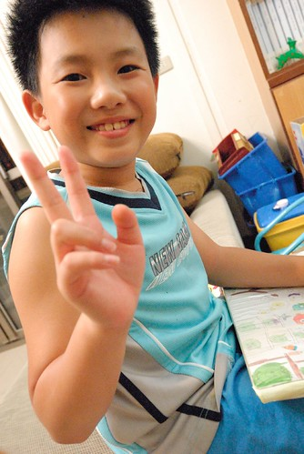 

雖然月考過後 阿徹對於課業有稍微"頂真"點 但因為第一次實在考太爛 所以即時最後還拿了個學業進步獎回家 阿徹的學期成績單還是難登大雅之堂 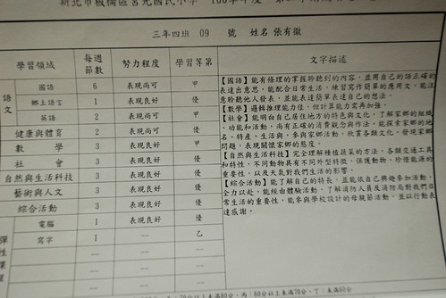 老師在學科學習上仔細的文字描述 也在最後的日常生活表現給予這樣的描述與建議: "這學期的有徹和同學相處的情況更為和諧了 雖然碰到與自己想法不合的地方 但能好好溝通不爭執是寶貝最值得讚美的表現 老師建議喜歡創造的有徹 記得時時創造良好的學習環境 東西記得收好也記得創造更好的學習成績"

而除了制式的成績單評比外 老師還用心的製作了每個小朋友的成長紀錄 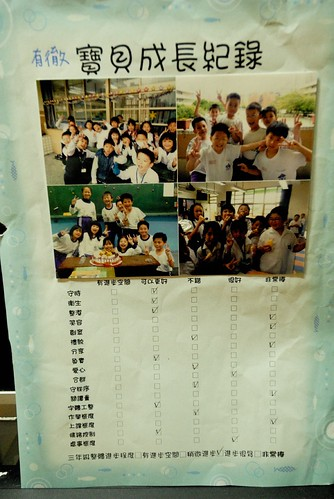 守時 衛生 整潔 負責 字體工整 情緒控制都是要多加強 可以更好的地方 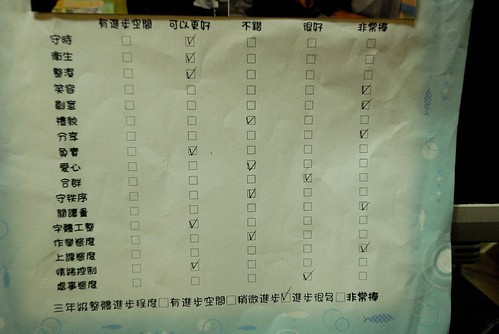 真謝謝老師也看清阿徹的這些弱點(話說阿徹的這些弱點也外現的太明顯啦) 這些的了解想必也是老師每天花費許多時間與心力的相處與觀察所得 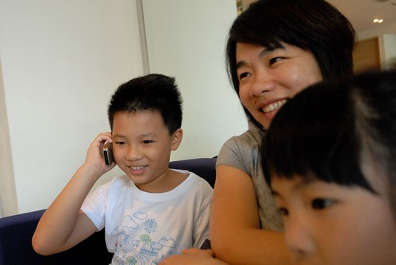 就如爸媽的用心 阿徹了解 書羽老師的用心 阿徹也了解 也因此當我們七月初在花蓮時 阿徹很是堅持且勇敢的打電話給可能回到花蓮的老師 然後害羞又緊張的去老師家登門拜訪 踏出老師家門後 阿徹如釋重負般的鬆了一口氣 但臉上盡是開心與得意 阿徹神秘的笑著說"我要寫信跟全班同學說我去老師家..." (最後是懶惰的不了了之) 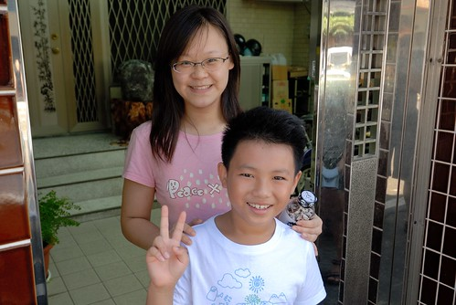 雖然阿徹不是個學習表現優良的好學生 但肯定是個天真的好小孩 尤其敢去老師家拜訪這點真是要大大給他個讚!(徹爸說的我們那年代誰敢去老師家阿) 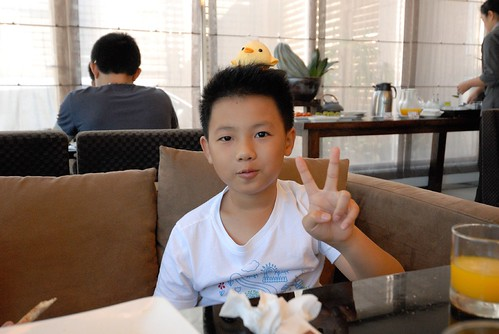

這學期很多人都說阿徹長高不少 我總笑說因為跳繩的關係吧 因為我不想再緊迫盯人的看著阿徹的作業 我立下跳繩處罰規則 忘記帶作業回家300下 每樣作業最多只能有兩個錯誤 有三個錯誤就跳繩300下 每再多一個就再加100下 而再訂正過後如果再有錯誤發生就200下 每多一個多加100 我說"既然書念不好 那起碼體能不要太差" 阿徹從小就是個精力旺盛的小孩 或許透過這樣的"運動"處罰也可以讓他發洩那好像永遠用不完的精力(偏偏都不是用在課業上)

一開始執行跳繩處罰的幾天 我看著揮汗如雨下的阿徹會擔心是否體罰太過 也總會當他上床睡覺喊腿痛時 心中不忍... 但真的希望他能養成自動檢查的習慣  所以還是忍痛的看著他每天數以百計的跳繩著 阿徹最高記錄一晚跳了1800下的跳繩 尤其在剛開始執行的頭一個月破千下是家常便飯 不過到學期的最後一個月 每天的跳繩數減少許多 有時候甚至完全不需要跳繩 連愛愛妹妹都會很讚嘆的說"哥哥今天不用跳繩耶 好棒" 看著阿徹因為跳繩而略顯精實的身材 我笑說"為了不要讓你太胖 媽媽會嚴格點檢查作業的" 然後總換來阿徹一陣哀嚎~ 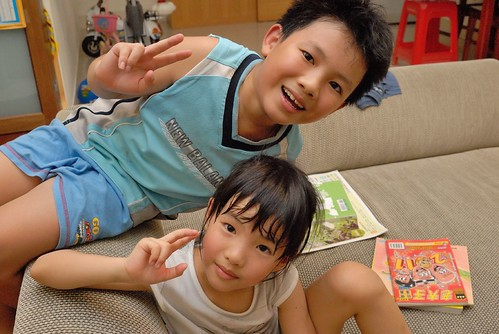 講真的阿徹是個很不優秀 傑出的小孩 不論是學業 體育 語言等任何可以被評比的項目 連他自己都明白自己的不優秀而有那麼點沒自信 但阿徹的創意好像真有那麼點"異"於常人 是他唯一自信過頭的地方 我常跟阿徹說"你的畫不是像參加美術比賽那樣優美 豐富 但我很喜歡你的畫 因為很有趣! 而且你可以把你所想的畫出來 這點很厲害" 阿徹也曾說"同學說他的畫 好像畢卡索" 阿徹問我畢卡索的畫是? 是因為阿徹的畫太抽象還是太天馬行空?! 我個人比較認為是後者 阿徹上三年級後 很幸運的除了有書羽老師這樣的班導  也很幸運的遇著好的音樂與美術老師 音樂老師每週的音樂賞析 讓阿徹常會跟我們分享許多我們不知道的音樂家小故事 能說出口的音樂家名字與名曲比我還多 而且還吹得一口好直笛 讓我們覺得聽他的笛子是種音樂享受 而美術老師那希望學生一定要怪 盡量怪 怪到最高點的畫圖啟發與要求 讓阿徹上美術課如魚得水 總是熱切的期待每週五的美術課 我真的很高興在常規的小學教育中 阿徹能獲得這些很棒的學習與帶領

每次阿徹把他的畫畫作品帶回家時 總會熱烈的跟我介紹他的"心路歷程"與所費心力 而我常在他入睡後 拿出他的作品再三回味 我珍惜這樣的腦袋瓜~ 這是未全部完成的點點畫 但還是獲得校慶展式的肯定 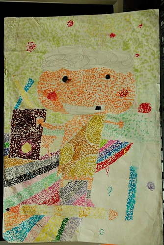 老師要同學想像健康的土地下的地底下世界  充滿著各式蟲類的豐富生態 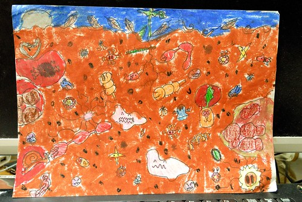 線條畫的練習 向來大辣辣 不喜歡花時間在精細 精準事情上的阿徹難得這樣仔細與費工 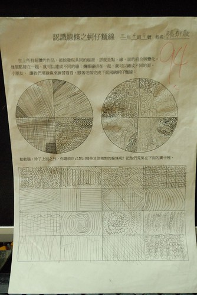 最後線條應用的素描畫 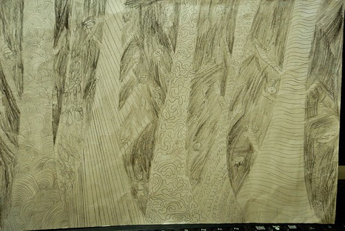 彩色版的素描畫 阿徹的畫中常可見可愛又優游自得的小人或小物 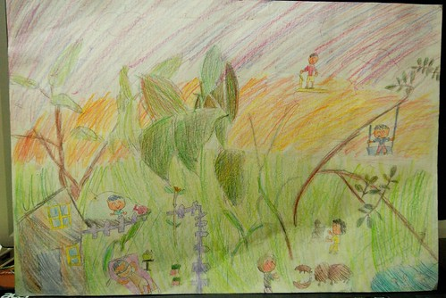 這個心情配色也是一絕 尤其那個黑嘛嘛的恐懼讓我直覺就想到阿徹的怕黑與不敢自己睡 太貼切了 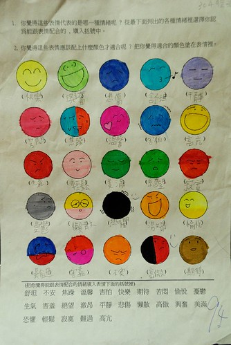 這是暑假參加YMCA活動中畫的四格漫畫 雖然故事性有點薄弱 但看起來漸漸煞有其事 如果我們可以繼續這樣不"扼殺"阿徹下去 說不定十幾二十年後我家也可以出個馬克 (我真覺得阿徹的創意是偏這類型的 也難怪老師總說阿徹是創意突出而非藝術表現傑出 難怪...我總算懂了...) 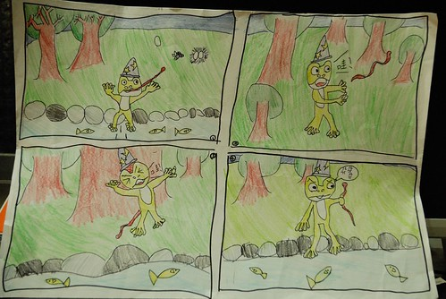 從中班開始到現在的黏土課也整整滿五年了 帶回的作品除了塞滿櫃子也打包了好幾箱 雖然礙於是幼稚園的才藝課 所以主題難免過於簡單 但阿徹的作品中總能讓人發現這老手而有的細膩與自己的創意 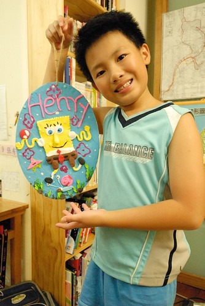 所以當阿徹的跟妹妹的作品擺在一起時 我總能輕易的就分辨出屬於他的 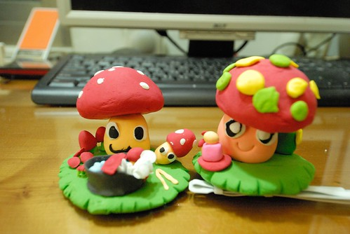 幾經掙扎後 阿徹決定暫時停止黏土課了 雖然我們都有些小遺憾 但我欣見阿徹明白自己所需所想 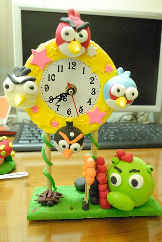 阿徹看到我在幫他這學期的畫作拍照時 開心的搬出這一兩年他喜歡的作品要我也幫他拍下來 恐龍世界 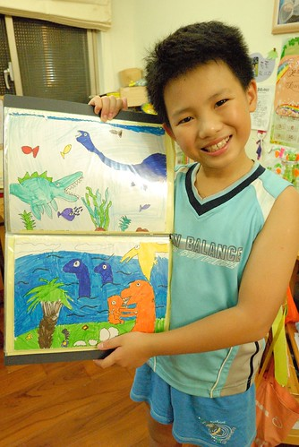 小學生很愛的摩爾莊園 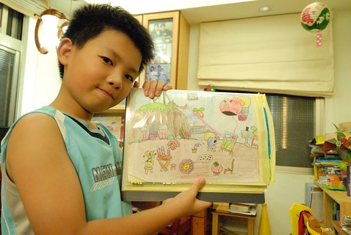 Angry bird 不騙你 阿徹曾經很認真的示範給我看這的Angry bird該如何手腦併用的進行 只是阿母真的沒有阿徹那樣的腦袋瓜 真的玩不起來... 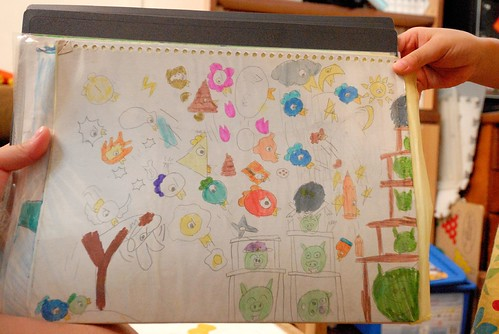 阿徹擬摩畫的奶油獅 很奇怪 阿徹畫下的人物常會有像阿徹那樣呆呆的特質 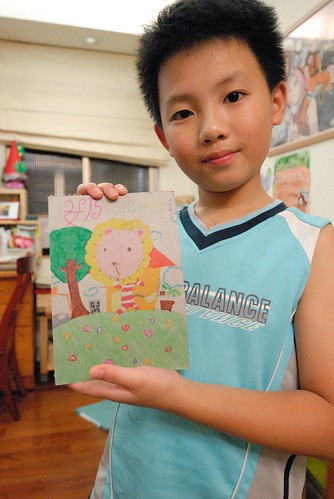 這是阿徹交代一定要拍的12星座  有一天他心血來潮所畫的 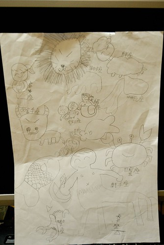 阿徹與妹妹是兩個很不一樣的小孩 特質 想法 做事情方式 面對逆境的態度與情緒處理都都很不同 不可否認對於老大 對於男生 我們的標準有時候是嚴苛了點 只因為我們堅信哥哥對於妹妹是很重要的影響 而男人以後更是要堅強的保護一個家 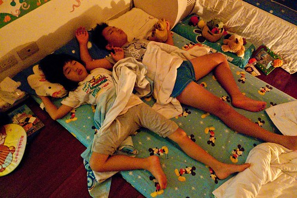 阿徹常說自己是個膽小的人 怕黑 怕一個人睡 怕意外的發生 但其實阿徹越來越勇敢 勇於嘗試新事物 新環境 就如這兩年的寒暑假總會幫阿徹安排去Y17 或中正運動中心上些營隊課程 這個暑假更是應我的利誘去YMCA上了一整個月週一到週五整天的活力營隊 每次到新環境學習的頭幾天 阿徹總是會有點緊張  有點孤單 去的路上顯得安靜 而回家的路上顯得疲累 但卻也總能在很短的時間聽到他說認識了什麼朋友 跟朋友一起玩什麼遊戲... 然後體認各式不同課程後 也漸漸有他自己的看法與認知 例如上過Y17一週密集的油畫與畫畫訓練後 他明白他不喜歡也不適合這樣以比賽為目標的美術教學 又例如上過運動中心一週的運動歡樂營後 發現原來很多運動跟他所想像不同 其實還挺有趣的 "交朋友"與"勇敢" 是我們讓他去參加營隊最主要的學習 很高興阿徹能夠一如平常的有著中規中矩的收穫 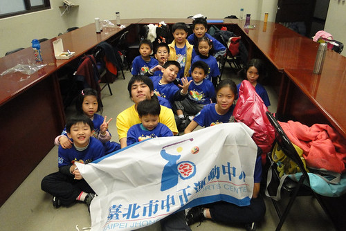 這是三年級寒假時候在中正運動中心的照片 一副緊張 放不開的跳街舞樣子 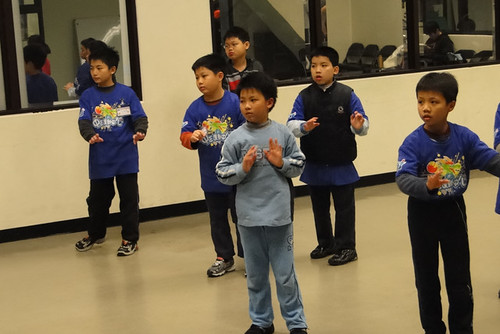 著重團體合作的樂樂棒球 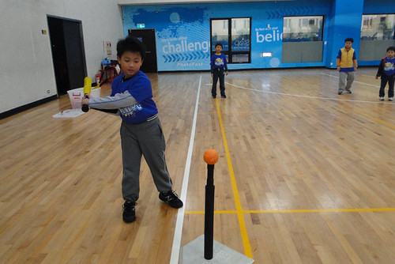 第一次的射擊體驗 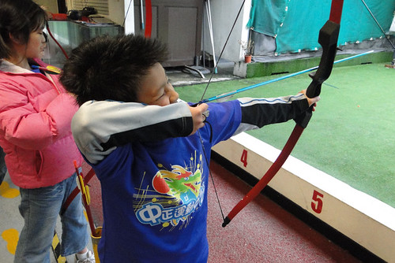 前陣子我跟徹爸不知道在哪各電影還日劇裡看到"天然呆"這一詞 兩人拍手叫絕 這真是套在我們家阿徹身上的絕妙好詞阿 那種有點拙 有點可愛 原汁原味沒"透染"過的呆 果然是天然的ㄚ~ 現在每當我跟徹爸兩人看著阿徹而臉冒三條線時 兩人總忍不住相視搖頭"果然是天然呆" ㄏㄏ~ 天兵天將的天然呆 勇敢又努力的繼續你的四年級吧!GO~~~~
