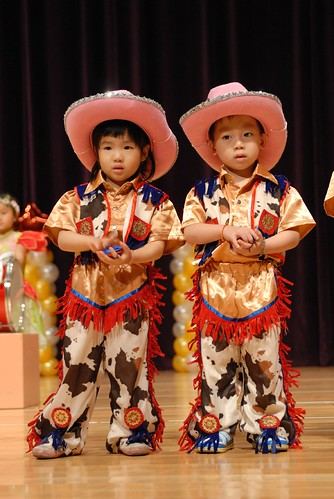

剛幫愛愛剪指甲時 我們兩人之間的對話如下 實在太好笑了所以媽媽要趁這機會趕緊寫下來  寫下4歲愛愛的愛情觀 愛情生活..

望著旁邊昨天做的樂高 愛愛說'那是巫婆的房子'  媽媽說'那是我這大巫婆的房子嚕' 愛愛又說'那是王子跟公主的房子'  媽媽說'你跟阿綠的嗎' 愛愛不害羞的說'是阿 是我跟阿綠的房子......' (在家裏的愛愛果然很勇於表達她的愛意) 媽媽問'為什麼 你都喜歡阿綠 不喜歡阿旗阿' 愛愛說'因為阿綠都會讓我!'   媽媽問'讓你?' 愛愛說'溜滑梯的時候阿綠都會讓我 讓我先..'  媽媽問'真的阿!? 那你會讓阿綠嗎' 愛愛說'會阿 有時候他讓我 有時候我讓他 我們會讓來讓去 輪流' 哇~媽媽腦海中忍不住浮現兩小無猜的模樣  不過媽媽還是問'那你們不會吵架阿?' 愛愛說'有時候會阿... 吵架的時候我就去跟聖君玩 他都不會跟我吵架' 媽媽又疑問了'聖君都不會跟你吵架 那你為什麼不是喜歡聖君' 被問的一臉ㄚ樣的愛愛說'我不知道啦~' 媽媽最 後只好下了這樣的結論'反正你就是喜歡阿綠 是嗎'   愛愛點點頭說'是阿!'

話說剛上段對話裏陸續出現的三男一女可是幼稚 園裏很出名很精采的四人行 我常可聽到老師們轉述她們四人間發生的爭風吃醋好笑事 例如 有一次A 男要牽愛愛的手 B男看到說他也要 然後C男也說他也要 徹爸問愛愛 '那你最後給誰牽'  愛愛說'她們好煩喔 我就都沒有給他們牽' 聽到這的徹爸笑呵呵的說'做的好 這樣就對了'   哈哈~真不知道徹爸跟著驕傲什麼...

有一次愛愛跟我說 剛開始上幼稚園的洪同學妹妹在學校會哭 我問'那 你有沒有多照顧她 在遊戲區的時候陪她玩' 愛愛說'有阿 可是他們三個男生常搶著要跟我玩...'   媽媽聽的一臉  一....ㄟ...ㄚ.... 不過她們這四個小人真的粉好玩 還常一臉認真 難怪學校的老師也這麼愛作弄她們 這就是無人能敵的 '青春'阿!!!!  (OS: 真的好青春阿)
