不信神的我 很信老天爺! 相信凡事自有老天爺的安排與用意 或許當下不好過 很難過 但關了這門開了那窗 或許更能看見海闊天空...

我們的小窩 在經歷喊了很久的規劃期 等了很久的開工日 不算短的施工天後 總算在冬令時分完成整修  邁入徹之家的下個十年階段! 

"以前我喜歡稱我們家的開放空間為遊戲區, 更甚書房或和室! 10年前決定打掉與客廳的這面牆時, 老師傅不以為然; 10年後老師傅依然難以理解的常碎念"當初就要..."或"就這樣放個床墊睡就好啦(難怪一直拖檔期)~" 年輕人我們的想法真的很令老人家們搖頭, 但不後悔每個改變, 也相信每個十年有不同的考量與需求, 我們不過是認真的想讓生活過得更貼心順意, 更況且過去的十年與接下來的十年是小孩與我們生活的最重要且美好時光! 幾年前曾想要換大房子,漂亮的房子, 甚至當投資好像也很不賴, 但隨著小孩長大, 自己也近不惑之年, 卻只想有個安心的窩, 過簡單自在的生活就好! 時間真的會改變人的想法!!!(計劃真的不要太長遠) 這回整修挺高調的常PO文報告進度, 是記錄也是心情的分享! 我習慣在網上找網友經驗分享, 而同儕中結婚生子算早的我也其實蠻多心得感受想分享..., 很高興被好些朋友問了床的事或有的沒的家事, 希望有小小幫助到! 最近努力的想從過去照片裡找張紀念我們遊戲區的照片, 沒想竟然挑不出一張經典, 但一幕幕徹愛的遊戲照片卻勾起許多快要忘記的回憶... 很高興徹家在這個遊戲區擁有了很棒的十年童年~" 以上是11/12那天在FB的PO文! 真是找了很多 看了很多年前照片後的非常有感而發  看著在這個家出生的愛愛 從坐到爬到走 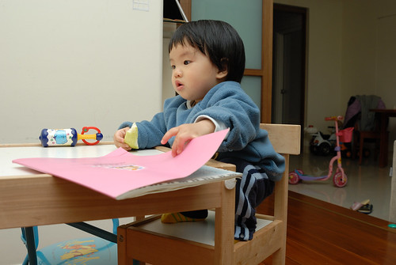 現在的越來越亭亭玉立  更別說從小調皮到大的徹哥 在這個遊戲區做盡了任何奇奇怪怪 或開心 或蠢的事 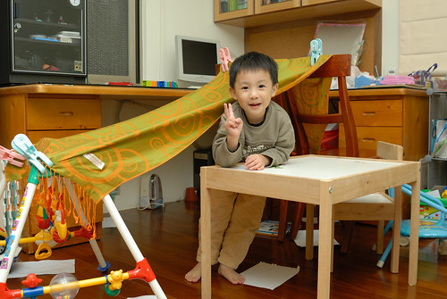 有時後會想徹哥如今的"天"性  會不會也是因為我們給他的環境所造成  完全的助長阿!  不過很開心我們給了徹愛一個可以樂在其中 盡情遊戲的空間(但其實一堆規矩) 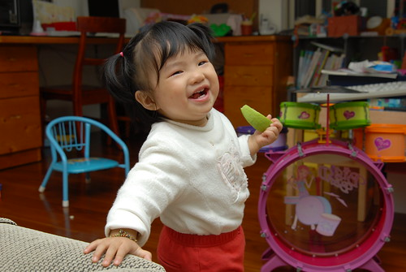 雖然一直明白愛愛從小就跟著哥哥玩大的 但再回顧照片 看到一幕幕兄妹一起遊戲的照片還是覺得好可愛好好笑 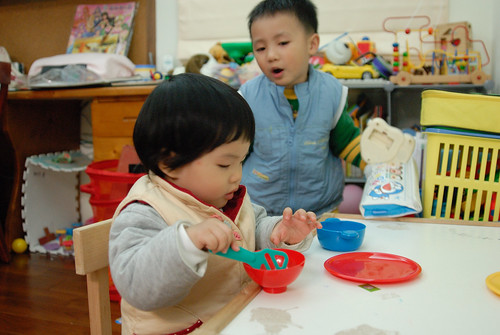 兄妹倆的成長 一個心智下修一個上提  漸漸地有時也搞不明白 到底是誰是哥哥 誰是姊姊了  隨著兄妹的成長 我們的遊戲區也一直"茁壯"著 一年年添增的桌子 櫃子 更別說累積越來越多的書與玩具 以及很多的有的沒的 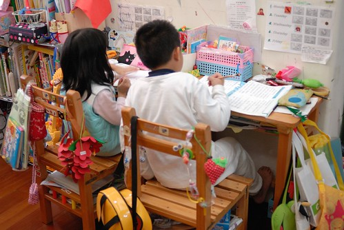 雖然不豪華但著實是一個發揮到極至 一家子最喜歡的遊戲區!  

10年過去 徹愛成長到該是男女分房的年紀 所以即使知道同室居住與施工很痛苦 我們還是決定長痛不如短痛的開工了 看著整修過程的一步步 心裡常格外有感觸與感動 也因此常忍不住PO文 是紀錄也是分享: 10/1: "我們的書房兼遊戲室，從徹哥小幼班到小六伴隨我們近十載，今天走入回憶! 這裏是鳥居台北我們的居心地，給我們踏實,安心與許多美好時光! 而為了下一階段的十年，即使不捨還是要改變! OS:可是得先熬過這個月的施工黑暗期阿!" 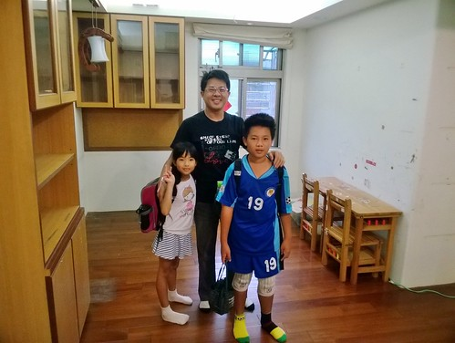 10/2: "好厲害的師傅! 把我們的書房與更衣室完全肢解， 不放過的保留每個櫃每片材好再利用 ，果然是不負我們期待的達人! 只是老師傅檔期很難等又很愛說”搞不懂你們年輕人在嗶啥咪...”， 不過幸好他是我最親愛的小舅舅，所以什麼都不是問題啦~"  10/3: "我們的工寮生活正式展開~ 體驗到前輩們說的地怎麼也拖不乾淨的痛苦，不過更令我們揪結的是沒有沙發來假死用... 幸好有這張早忘了當初為什麼要買這麼大的大書桌，讓我們現在可以繞著他吃喝玩樂! 我們的工寮比開工前不敢想象的好很多，因為還有帆布內是我們可以如常生活的乾淨小空間!" 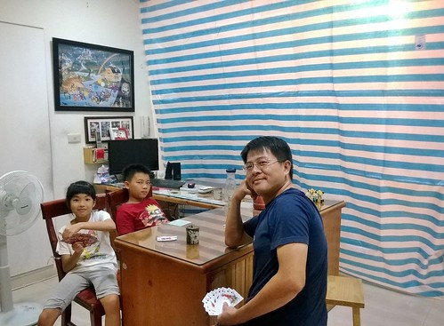 10/22: "我們的工寮比開工前不敢想象的好很多，因為還有帆布內是我們可以如常生活的乾淨小空間! 第十九個工作天，完工日也總算指日可待了~"  沒錯! 這個月的施工真是如火如荼進行著 不只師傅沒任何休假的每早七點半就開工 做到天黑六點多才收拾回家 徹爸的週末也完全貢獻 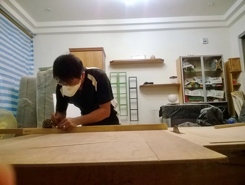 雖然跟老師傅吵吵逗逗 但以學徒之姿為我們家盡了份心力  總算歷經30多天 來到最後的施工週末每個人喜上眉梢 [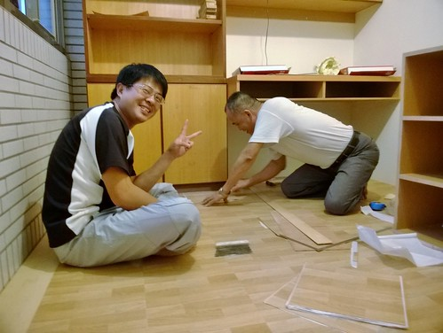](http://flickr.com/photos/33703965@N00/15645682270) 11/2: "接近完工的收尾日，開心也玩翻~ " 最後油漆工程的兵荒馬亂 兄妹倆拾獲一只空紙箱大玩特玩 讓忙翻的媽媽好氣又好笑  趁著整修 也剛好把家裡全部粉刷過 但走到這步也才深刻體會到整修的最大辛苦!  為了把房間逐一粉刷過 我們像趕羊般先是把原主臥的整間東西搬到新主臥 這樣才能漆原主臥(愛房間)的牆 [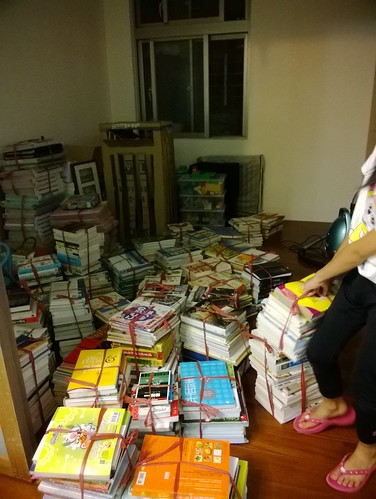](http://flickr.com/photos/33703965@N00/15832076702) 等到原主臥漆好 再把施工期間一家子睡覺的原小孩房(徹房間)全部清空好繼續漆牆 我們轉移陣地到原主臥睡了幾晚 我們從沒有在家裡這樣打地鋪 四個人連在一起睡 徹愛好開心 笑說好像住民宿阿! 這是連著幾天每天晚飯過後就忙到10點過後的苦中作樂與自我安慰! [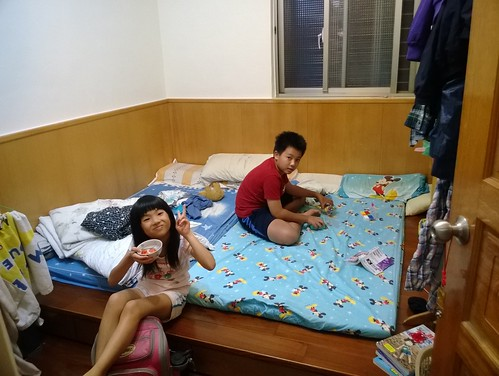](http://flickr.com/photos/33703965@N00/15830510835) 11/4: "來到最後的油漆才體會工寮生活的最艱辛與難熬，給自己與彼此打氣”熬過這一星期就好... 幸好我們的老公寓已40歲，不會再有下一次整修了~" 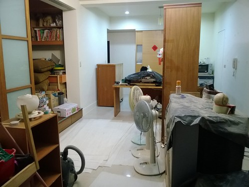 11/5: "雖然還有很多工作沒完成，但總算熬過最苦的一段! 看到休機許久的電視重新放送，大人小孩都忍不住感動..." [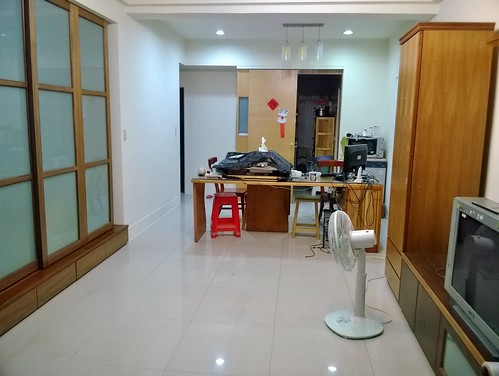](http://flickr.com/photos/33703965@N00/15210552034) 除了電視 一切都沒就序的客廳寬敞的讓徹愛又跳又玩 尤其玩著久違的wii遊戲 特別過癮 [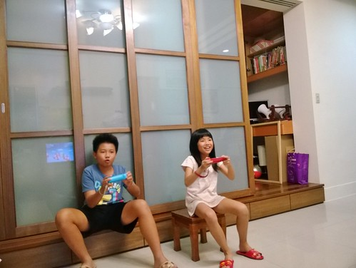](http://flickr.com/photos/33703965@N00/15828779802) 11/7: "玟姿今天問”你每天po一點一點，到底是整理好沒?” 唉~要把原本書房與置衣間滿滿的東西都歸位真的不容易阿! 起碼今天進展到沙發與我們的床就位了! 看到睽違三個月的床，我跟徹爸突然沒力，想睡”大”覺了! 一季過去，我們總算可以好好睡覺了~" 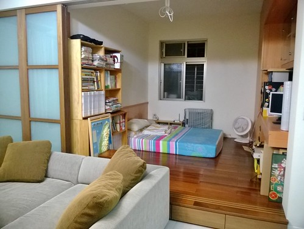 11/8: "床分了，房也分了! 希望今晚不會有小孩睡不著覺... 一切的涯給就為了這~" [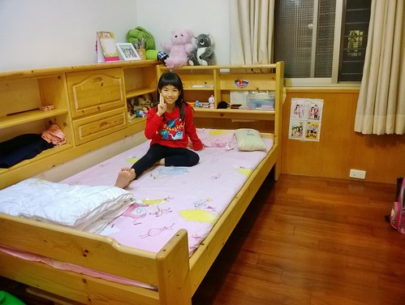](http://flickr.com/photos/33703965@N00/15825339961)  這一晚開始兄妹倆分房而居 各自擁有自己的小空間了 只是整修還剩下如換電燈 裝電燈 東西都歸位的許多小事仍得忙碌...

11/11: "忙了一週，總算近尾聲! 也該謎題揭曉”一切如舊”的整修搞什麼! 大房間，以前借了右邊1/3給隔壁房的主臥室做更衣室，這回討了回來，但卻又借出左邊1/3給陽台做老爺的秘密基地，同時必需是功能俱全的新主臥! 看似沒什麼，但早晚看著老師傅傷神費心才明白舊物改造真的比從0開始困難許多! 哀心感謝小舅幫想洞想縫的我們再次實現家的藍圖! 另最感動的事，十年間拉不到5次的6片折疊拉門換個形式重生了，而且還驚喜的偷藏了個小書櫃~"   總算! 我們的整修完成了! 那幾天我跟徹爸二人常看著家裡就忍不住感動 我們真的完成了! 我們真的邁入徹之家的下一個階段十年!!! [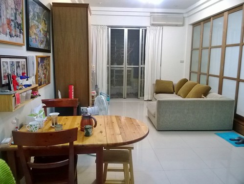](http://flickr.com/photos/33703965@N00/15645101638) 完工至今 我們很喜歡我們的"新"家 除了因為兄妹倆各自擁有房間而開心滿意 也感動我們還仍如過去十年一樣 有個一家人可以窩一起的"遊戲區"  雖然這裡同時是我跟徹爸的房間 所以私用少了些隱密  公用卻多了些限制 但卻挺有住民宿的浪漫氛圍 讓我們很是喜歡 且更是能窩的窩在這裡! 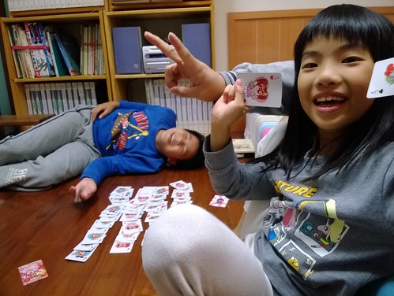除了原本的遊戲區大工程變身  整修也包含了 在愛愛的房間做了個大衣櫃 好收容原本更衣間的滿坑滿谷衣物與被物 我最愛傳統木工的地方就是可以做通到天花板的大衣櫃 是簡單俐落但超好用的收納空間  整修的另一動機與讓當初規劃費盡心思的就是許徹爸一間工作室 雖然小小的 雖然收容了許多原本的舊櫃體 但也盡力的該有的也都有了 這是老婆對老公的打發(去去去!) 但也是如對小孩般的寵愛阿! (別說媽媽只愛小孩)  以上 總算完成徹之家的變身紀錄!  Good~
