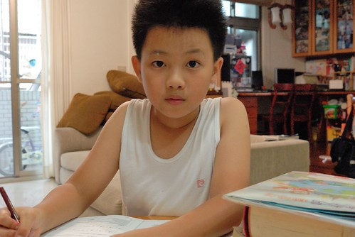
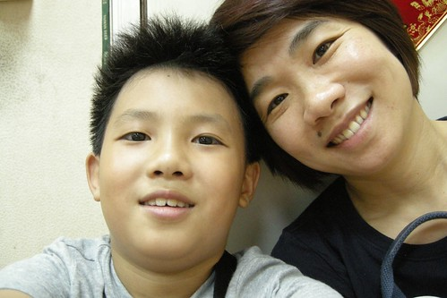
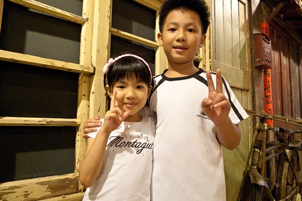
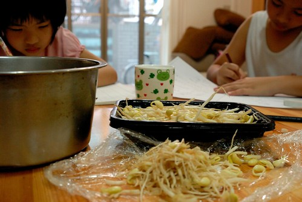
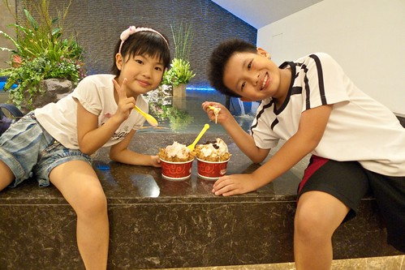
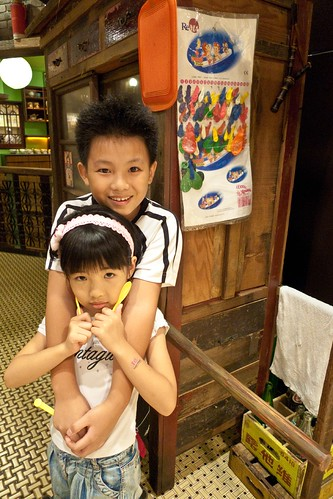

好多年前我就一直以陀螺來形容自己的生活 雖然因為工作性質與個人志向因素 相較於大部分的台北職業婦女來講 我已經是很幸運與幸福的了 也曾經徹爸不只一兩次的告訴我"現在這樣的生活模式 很好阿! 起碼沒有不好!" 我百分百的同意徹爸的看法 但我心裡總覺得生活可以不一樣點 可以再多些時間做些什麼事的 尤其在阿徹升上中年級 全天課越多 課業也越來越重之後 看著小孩也像個陀螺一樣 打轉於家裡 學校 安親班之間 我好想給小孩不一樣的生活方式阿 尤其是我們小時後放學回到家後那種無所事事的"兜阿兜"!  

於是我開始考量 打算 模擬著任何可以改變陀螺轉速的方法 總算在鬱悶 掙扎 失望與希望的來回交錯中 我任性的找到了一個於工 於家 於個人都"似乎"最能接受的模式 三個月前第一次開口跟小老闆(計劃的博士後)徵詢時  小老闆問我另個計劃也是媽媽的同事怎麼處理小孩 我心虛的像是一刀被砍重的老實承認"是我自己的貪心" 真的是自己自私的想法 想要給小孩一個不同於安親班的童年生活 之後正式的向大老闆(教授)提出請求時 那真是我這輩子最感到難以啟齒的一刻 雖然老師面有所思了三秒鐘 但馬上給了我一個超肯定的點頭 而且老師還殷切的跟我說 "要相信自己的價值 自己的能力 不必在意外界那些虛假的公平性" 那刻 我感動的只能猛點頭 對老師的成全 內心感激又安慰的說不出任何話來 於是在不影響工作(安排與成果)以及團隊會議(一個月三四次 那些天小孩就照例去安親班)情況下 藉著提早上班 縮短午休時間以及必要時後的帶工作回家處理 我開始跟著阿徹的轉速運轉著 阿徹出門上學我也出門上班 阿徹放學走出校門我也下班走出辦公室 那個打從阿徹出生起我便一直盼望著的媽媽牌安親班總算在好老闆 好同事 好老公的成全下 開張了!

這一兩年一直嘟嚷著不喜歡去安親班的阿徹當然是最高興的那個 而愛愛則還搞不清也不懂得媽媽牌安親班的初衷與優劣 雖然我對於愛愛有那麼點愧疚 畢竟所有的考量與安排都以哥哥為主 愛愛一週中有兩天哥哥上全天課而她上半天課的日子還是得去安親班 所幸沒上過安親班的愛愛很是高興還能有這樣與幼稚園同學一起寫功課 遊戲的時間 甚至有時還會叮嚀我不要太早去接她 讓她可以多跟同學玩牌(Orz)  老實講 我真的無法說明與保證這樣的生活轉變能給小孩子帶來多少的"效能"與"前景" 但我著實的喜歡小孩子踏出學校後 如釋重負的回到家 吃個喜歡的點心 心情穩定的寫完功課 媽媽沒有時間壓力的即時做好檢查與簽名 然後便是他們的時間 自在與隨性的玩著遊戲 或是看漫畫 吹笛子 跳舞 跳繩... 甚至什麼都沒做的ㄙㄡˊ來ㄙㄡˊ去 第一週時 我常看阿徹躺在沙發上 有次忍不住建議他"你可以去做啥 幹啥阿" 阿徹一臉讓我看不太透的呆樣 悠悠地告訴我"我覺得這樣躺著好舒服 好好阿~"  從此我不再主動給他們任何使用時間的建議 把這樣的"空白時間"完全的交給他們揮霍 而同時我那堅持且執行好多年的週間不看電視原則也放寬了 以前每天6點多回到家趕著煮飯/吃飯/看功課的日子裡 連講故事時間都常被犧牲了 看電視感覺是種時間的浪費 現在六點前徹愛便能完成所有課業事項與檢查以及隔日上學的準備 因此我讓他們也能像我們小時候那樣每天期待與準時收看某一部卡通或楊麗花歌仔戲 所以6點半到7點間是他們固定的哆啦A夢電視時間 而我則剛好煮晚餐 每當在廚房忙的我聽見他們從客廳傳來的哈哈大笑聲 我總也忍不住笑了起來.... 他們看完電視我也剛好煮好晚餐 然後三個人在比以前更是和樂氣氛下享用著晚餐 徹愛常意猶未竟地跟我分享著剛剛哆啦A夢裡超好笑的橋段 或是說著更多更平常的學校事情給我聽 有時候我們也會談一談那天餐桌上的食物以及很多不知道從哪來的聊天話題  等我們吃完飯又玩了/忙了好一會 爸爸也總算下班回到家 以前徹爸回到家時常見到我跟阿徹正因為功課劍拔弩張 總也忍不住跟著動氣 而現在回到家中時 家裡卻總是一派寧靜或歡樂 兒子女兒不只總會飛奔到門口熱烈歡迎爸爸回家 還常一家子坐在餐桌旁陪爸爸吃晚餐 我喜歡現在的生活轉速所帶來的好的家庭氛圍阿~ 而等徹爸也吃飽飯後  一家子也還有著一段不算少的家庭時間 有一天一起去公園散步 才發現秋天來了 涼風徐徐的夜晚好舒服 有一天跟愛愛玩跳棋 才發現愛愛真是進步好多 真是會玩了 有一天跟阿徹一起第一次玩大富翁孫子兵法 才發現其實遊戲沒當初所想那麼難且饒富趣味 而很多時後 其實一家子就是沒有預設什麼的在一起 (很奇怪常就會有事情做) 然後總能在9點半時讓徹愛完成所有睡前準備 心甘情願且好心情的上床睡覺 而且兄妹倆常一上床後 咻的很快就睡著了....  雖然徹愛睡著之後我依然要洗衣 要處理一些家務  依舊是一顆忙碌的陀螺 但跟小孩相處時間的放慢讓我更能有平靜的心面對每天這些家務與工作 甚至更有著效率 就如臨時起意買了豆芽菜的那天 趁著徹愛做功課時後 我一根根的拔著牙菜的根 這是我第一次這樣有時間有愜意的處理芽菜 而果然這樣炒起來的銀苗(拔了根之後 芽菜的身份就升等了)口感好清脆好順口 生活中 很多事情就是要這樣放慢轉速才能體會與獲得的吧!  我們也利用週三的下午時段 做一些平常週末因為人潮或沒時間而沒做的事情 去看了樂高創意展  去大遠百吃買一送一的冰淇淋  逛大遠百裡頭總是在週末人潮為患的大時代美食街  其實媽媽牌安親班也是挺忙碌挺充實的  只是那個當了很久幼稚園生的愛愛 在昨天充實的星期三下午後竟然告訴我 "今天感覺有點奇怪 好像是我幼稚園時後請病假在家" 哈哈! 看來過了五年週一到週五每天8點多到幼稚園 6點多回家日子的愛愛 還需要點時間來調適與適應現在的生活tempo阿  而除了愛愛 我想我們是很滿意與樂見現在這樣的模式 雖然對於未來很未知也肯定會有很多的考驗要面臨 但這絕對是現階段的我們(起碼是媽媽我)想要的轉速 不同的轉速 我繼續的轉阿轉~~~
