上禮拜做天然酵母吐司時 最後一次的發酵硬是讓我等了三小時之久 是之前的二倍 我同徹爸說起這事 沒想到他的回應是"怎麼你養的東西都長比較慢" 當下我明白他不只說酵母也說我兒阿~ 我沒生氣 反倒覺得有趣 大笑說"是阿~" 不過我說" 說不定也因為我有耐性 所以才能這樣等待(麵包最後還是成功了阿)" 所以對於那個天真隨性又氣死人的阿徹 我肯定相信這是老天爺對急性子我的磨練~ 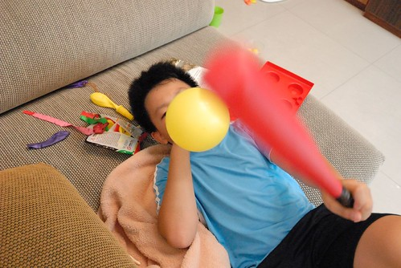 

繼期中考的數學驚心66事件後 期末考阿徹繼續丟了一個炸彈給我們 國語考了個全班最低的70幾分 Orz 雖然早明白他國語不好 尤其字都沒好好去認識 但這樣的分數真的還是太讓老師與我們難以接受 不過想想也好! 在升上高年級前是該好好銼銼他的銳氣 讓他明白讀書不是只有靠運氣的 (寫到這 徹爸剛好走過來看到 說"驚心66你也敢寫" 然後唱起"我的心好痛"... 當下我怎麼只覺得搞笑阿) 而接下來的暑假也將如期中考時的約定"考不好 暑假一切免談 全照媽媽安排" 我滿懷悲憤與期許 洋洋灑灑寫下七大項暑假公約與功課 我想阿徹這個暑假肯定會很充實的 (如果不夠充 就靠愛的小手幫忙吧)!  其實除了國語外 阿徹其餘科目的學習都還在可接受範圍內 尤其自然的表現一直出乎我們意外的輕而易舉 而數學雖然考試成績一直不理想 但態度與觀念卻有讓人肯定  帶了兩年的班導 在最後一學期的評語: "有徹依舊天真爛漫 單純可愛 有豐富的想像力和創造力 從平日的習作造句 作文和提出來的想法中可見一班 平時和同學相處融洽 國語和數學也都能維持在一定的水平 字體的部分如能再工整一些 多練習硬筆書法 會讓你的短文更加出色 寶貝加油 鄭老師愛你嚘 " 從幾次與老師在聯絡簿上或電話中的溝通 可以明顯感受出班導師對於隨興但天真阿徹的無奈與喜歡 真的很感謝老師在這關鍵的中年級 給予阿徹的包容 啟發與滿滿的愛 這是阿徹求學路上很重要的養份與美好的回憶!  

老實講阿徹這一年的成績真的很砸媽媽牌安親班的招牌 很漏媽媽的氣 但不可否認這一年阿徹的情緒變穩定 也越來越有用腦袋想事情了 這樣的成長也同時反映在他的作文上 雖然錯字連篇 平鋪直述不華麗 但阿徹越來越能表達出他的想法與見解  上學期最後一篇作文 格列佛遊記-讀書報告 心得部分: 在世界上有一個地方叫百慕達三角洲，經過那邊的飛機或船都會消失不見，可是幾年後會有壞掉的飛機或船出現，而且裡面的東西依然完好如初。我認為百慕達三角洲一個角都是一個世界，而格列佛經歷的大人國、小人國和天空之城可能就是那三個角的世界。如果是我，我希望我可以到忍者世界、卡通世界和漫畫世界，要是真的成真會多麼令人開心。 我看完這本書知道不管怎麼樣，都要勇敢的向前進不要後退，我也很佩服格列佛的運動家精神，永不放棄要回到自己的故鄉，如果是我，我有可能不夠勇敢去面對這麼多事情。  一開始阿徹因為抓不到厚厚一本小書的重點 漏漏長寫了好多瑣碎的摘要(寫在草稿本上) 而被我要求從中篩選出1/5內容 濃縮為兩大段摘要即可 但看到阿徹寫的心得 我眼睛為之大亮 我喜歡阿徹這特別的聯想與見解! 雖然每天在混日子 但腦袋真的在進化了... 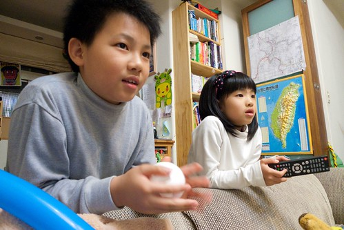 那天我說"真快 阿徹就要結束中年級 進階為高級了" 徹爸說"對阿! 那時候才在說BLOG裡"低級小學生"這詞真有梗 沒想到連中年級都要結束了" 是阿~ 阿徹已經長大為常有人會跟我說"你兒子都快比你高"的大男孩了 雖然還幼稚的很 膽小的很 無才的很... 但我很欣慰他一直照他的速度與方式在成長著 而且朝著正的方向! 

順道記錄小子開心事兩件: 學期的最後一天邀請了多年的好麻吉兄弟來家裡過夜玩耍 雖然四個小孩真的熱鬧的會掀屋頂 但看他們一個接一個玩不完的遊戲 卻很有趣 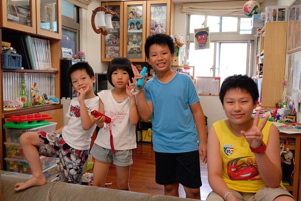 除了玩wii 玩樂高 阿徹平日收集的小東西 以及學期末從老師那接收的許多小教具也全上場 這是仿製夜市的丟小球遊戲  兩大籃的教具小球與保麗龍球灑出去很是壯觀阿 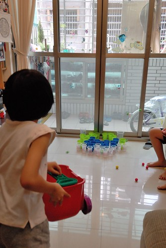 我問阿徹這些東西都沒有同學要阿 阿徹說對阿 然後他全帶回家了 學期末阿徹每天從學校揹回的袋子果然藏有寶物阿  這是射飛鏢 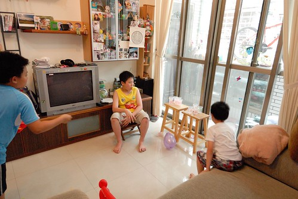 這是真人版瑪莉歐  雖然我真看不懂也真覺得他們很無厘頭 但四個小人卻超有默契玩著新遊戲 (這是遊戲中的大魔怪) 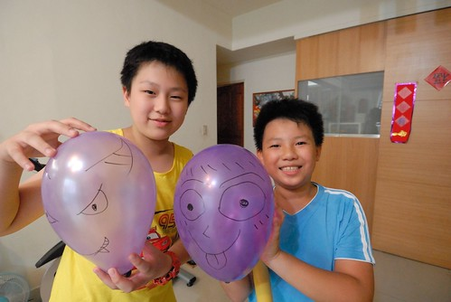 因為兩家子剛好都在前陣子去了氣球博物館  手上氣球都多的不得了 那天四個小人也氣球吹不停  還各各化身海盜 大幹一場架  講真的 我還蠻佩服他們的"無菜單"遊戲 (真的很像無菜單料理 有什麼煮什麼) 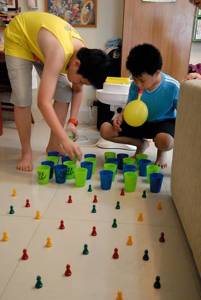 有這樣的玩伴 這樣的暑假一開始 真的很棒!  希望大家能一直保持這樣的童心與情誼~ 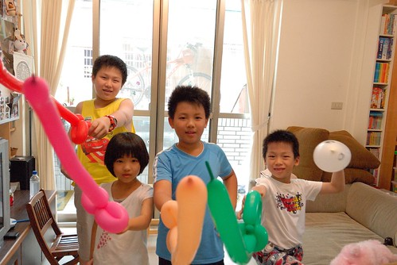 (最後等待回家前 四個人玩牌打發時間 又是笑聲不斷) 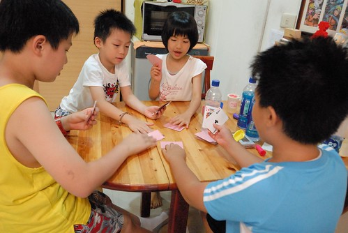

開心事之二: 阿徹這一學期非常熱衷玩樂高 而且是不照章的自行搭配與創造  明明很簡單不過的小組合 卻常可愛或傳神的讓人驚艷 愛不釋手 (這是拉姆三兄弟) 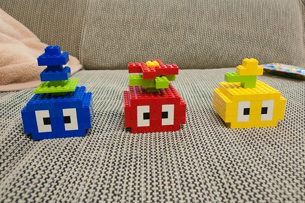 國語期末考中有個題目為"我的夢想"小作文 阿徹寫 他想當設計師 而達到夢想的方法是 要努力多蓋樂高的房子 我想除了父母外 大概很難有人可以理解這兩小題的前因與後果  也因此被扣了大半分 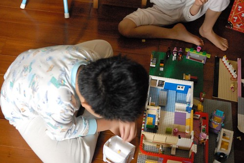 阿徹想買的口袋名單樂高系列還不少 常盤算著他要存多久的錢才可以買到 也常動腦筋到他妹妹上 可是妹妹說"你每次都不陪我玩 我不要!" 因為妹妹的樂趣在哥哥陪著他玩樂高家家酒 而阿徹的樂趣則在蓋樂高的過程 常用了好多天 花了好多心力 蓋好一個主題建物後 反倒不見他再去碰 即使捱不住妹妹威脅而陪玩(不陪玩 妹妹就更不願意出資了)也是敷衍了事.. 前一陣子阿徹完成主題"夢想的家"後 一直要我幫他拍照紀念 我一直延宕著 沒想到他自己就拿著爸爸的小DC 自己當起導演兼攝影 運鏡的手法與意境 果然比媽媽優秀阿! 下面就透過一張張的照片來窺見阿徹的異想世界

阿徹說夢想的家要是小木屋 要有大院子 而且要一家人睡同一張床  大門口要養隻可愛的看門狗 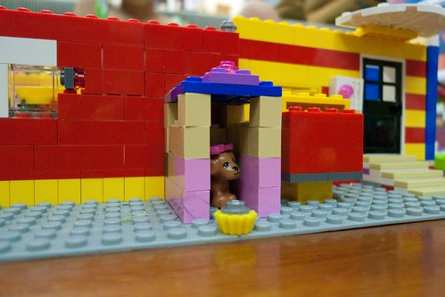 大門口還要有盞燈 讓人一到家就感覺溫暖 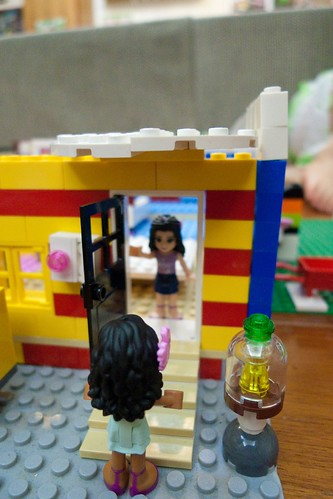 院子裡 有著游泳池 溜滑梯  媽媽陪著小孩玩耍 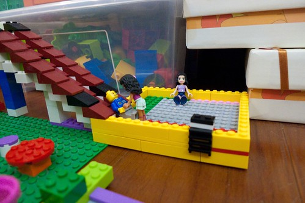 開放空間的室內 有大餐桌 大書桌  大床 大床前的大電視 大電腦 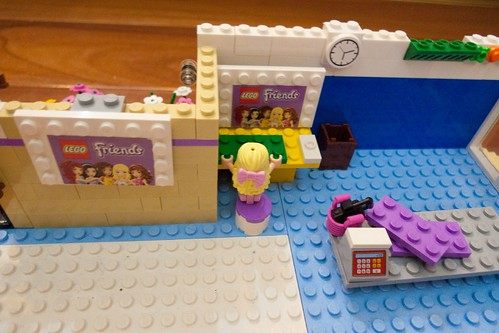 大廚房 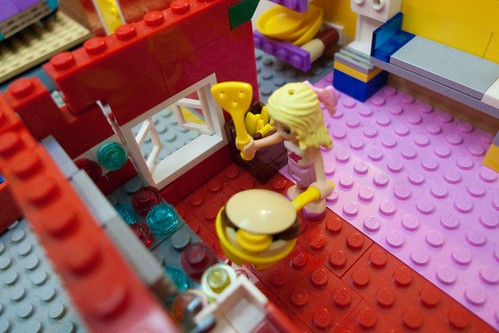 可以泡澡的大浴室 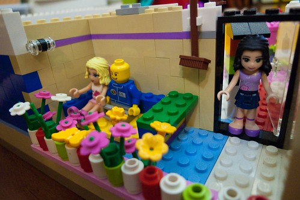 家小小的 但每個孩子都有量身打造的小貼心 小弟弟的嬰兒床 小姐姐的床上閱讀桌  媽媽還很會打掃ㄋ  一家人一起圍在餐桌前用餐 聊天是最幸福不過的事 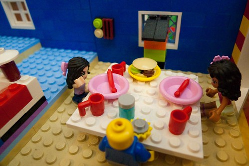 這是充滿愛與生活的家  也是充滿愛的阿徹創作品! I like it! (不小心又幫樂高打廣告了) 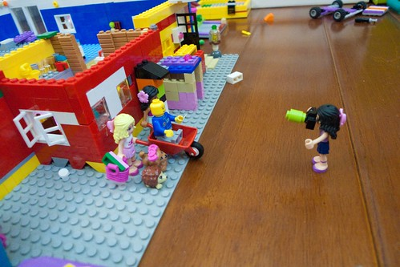
