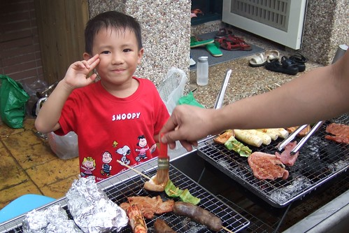
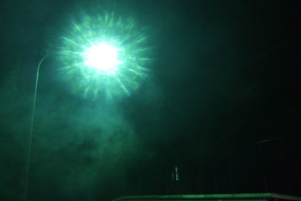
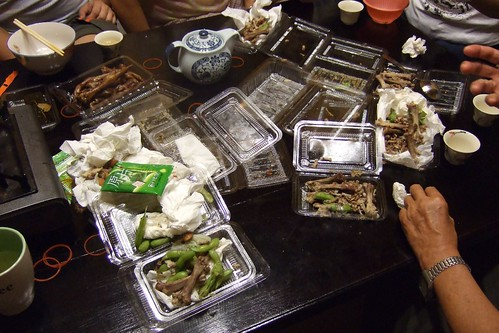
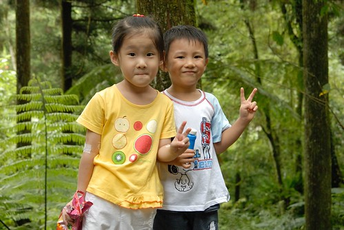
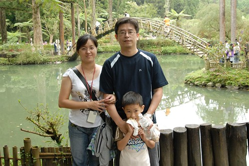
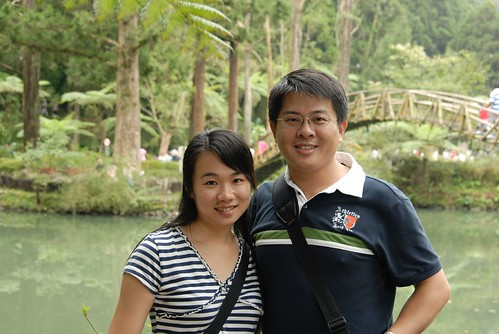
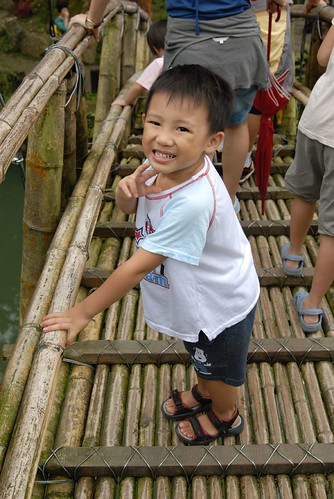
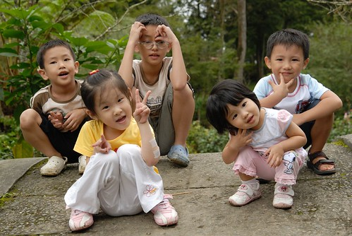
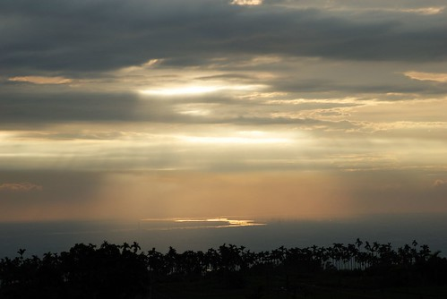
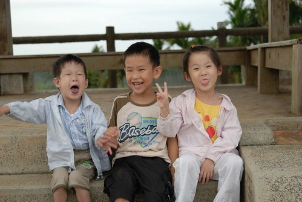

人說每逢佳節必思親...  
中秋大節可以這樣全家人一起去旅行那肯定是件幸福的事  
徹爸家的五個兄弟姐妹 加上徹公徹嬤   
六個家庭組成的大家族就這麼浩浩蕩蕩的出現在集集 溪頭  
其實家庭旅行的重點不在風景 也不在吃奇巧住享受  
純粹的一家子聚在一起 吃吃喝喝 談天說地 嘻嘻哈哈  
算是提供一個"機會"讓大家排除萬難 難得的在同一天聚首吧

兩天中最累的是"吃"的太累  
月餅午茶 => 傍晚烤肉 => 火鍋熱湯 => 水果 => 東海雞腳凍  
一早的牛肉麵 => 溪頭裡的香腸 水梨 各式零食 => 簡餐果汁鬆餅  
兩天吃的東西花了一週的時間才消化完  
我的肚子真的脹了一個禮拜之久   
原來媳婦難為是因為吃的太難為阿~~~  
  

下著絲絲細雨 哪也不能去就提早烤肉吧  
小孩子們聽到烤肉都很開心 興致勃勃的要參一腳  
但對她們來說這不過是個"活動"  最後還是紛紛回到室內吃白飯+火鍋  
  
  
  
徹嬤買的東石草蝦 一台斤450  有夠下重本(謝謝徹公慷慨無上限贊助烤肉)  
愛吃蝦的小愛啃了大大的2隻  
我想我也是吃了太多蝦 所以脹了一個禮拜 (東西太好吃也真的不是件好事情)  
  
  
  
所有小朋友中 小愛在戶外參與烤肉的時間最久  
雜食性的幾乎來者不拒  連爸爸給的啤酒也喝  
  
  
  
很奇怪 徹爸們很習慣在中秋節時要放個煙火 (南部人的習慣嗎)  
徹伯不知道哪拿的一大箱煙火(還跟國慶煙火同廠商 有經過內政部認證的哩)大大的驚艷了大家  
滿足了超愛放煙火的張三姊夫  
不過膽小的阿徹只敢玩仙女棒  
聽到越來越刺激 咻咻跰的高空煙火 還是拉著媽媽往屋內鑽  
  
  
  
小愛也有了仙女棒初體驗  畫個大大的"愛"  
  
  
  
就是這煙火嚇的阿徹四處竄  
真的很有國慶煙火的氣勢與聲勢  
  
  
  
烤完肉 放完煙火  有的人騎著腳踏車去鎮上逛逛  
有的人繼續吃....吃水果...  
  
  
  
洗完澡 打發小孩後 又到了宵夜時間嚕  
臨時起意去東海買雞腳的我與徹爸 果然骨頭貢獻度又第一名 (原來我的脹肚子也要怪這雞腳)  
  
  
  
第二天有人六點就早起去爬山散步(當然不會是我們 一定是徹公徹嬤)  
有人睡到9-10點最後得清空所有的早餐  
這樣的吃吃睡睡  真的該去走走路 消耗消耗卡路里的  
一行人六台車就出發前往溪頭嚕  
  
小愛的精神狀況不太好 睡眼矇矓  
重點是媽媽吃太多 狀況也不太好 實在不想挺個大肚南抱小孩  
許久不見天日的推車還是派上來吧  
  
  
  
阿徹與張二姐家的老四    
大阿徹4個月而已 但是女生真的看起來都比較熟  
  
  
  
張三姐 / 張嬤 vs.張大姐  
我跟徹爸說 女兒能有多少的機會這樣牽著媽媽的手慢慢走 說許多話  
這是家族旅遊最珍貴 值得每年這樣浩浩蕩蕩舉辦的心意阿  
  
  
  
張二姐/夫 & 雙胞胎老三老四  
雙胞胎哥哥的氣色好很多  也會調皮嚕  
  
  
  
張三姐/夫 & 老二  
張嬤常說的 小時候跟小愛長的一模一樣的張三姐  
每次聽到這 徹爸就擔心小愛以後會不會像張三姐那樣高中聯考數學考超爛  
  
  
  
張三姐家的老大 比較像是我們家的哥哥  
超照顧 疼愛阿徹與小愛的  
  
  
  
對溪頭的印象一直停留在大學時期的班遊  
看到大學池更是有種很"特別"的感觸 酸酸甜甜卻又澀澀的  
雖然唸書時沒跟徹爸一起來過溪頭  
但對我來說 溪頭就會想到大學生活  講到大學當然就又跟徹爸扯上關係  
所以還是值得來張紀念性的合照的   
尤其在這大學池前面   多少的年少輕狂回憶湧上心頭阿~~~  
  
  
  
阿徹跟著爸爸去走竹橋   看起來有點"ㄘㄨㄚˋ"的樣子哩  
  
  
  
徹公徹嬷目前有8個外孫 2個內孫  
全部聚在一起還真的有點壯觀  現代難得的多子多孫吧  
尤其年齡相仿的幾個小朋友兜在一起 真的可以把屋頂給掀了  
  
PART I  
  
  
PART II  
  
  
雖然徹公徹嬷抵死不承認自己偏心  
但是真的就是有ㄇㄟ...常開口就是"我們阿徹...小愛...."  
真的是寶貝金孫哩  - -'''  
  
  
  
不過我想姑姑們都很諒解徹公老來才得內孫的心情吧  
總是笑著 靜靜的聽著徹公徹媽 阿徹長小愛短的  
徹嬤把徹爸她們這些小孩子真的教的很好  真的是個好婆家  
  
  
  
離開溪頭後找了家咖啡店吃中餐  
本來對這種賣氣氛的店不是報予太大期望的  
但鬆餅 果汁/茶  餐點陸續送上來後 哇哇哇~~好吃好吃好吃  
  
  
  
最後去了彰化的松柏嶺  
徹爸拍的這張很讚  
  
  
  
而我只能透過照片想像那樣的美景  
因為我正在車上陪伴昏睡中的阿徹小愛阿  
唯三僅存清醒的小朋友們則個個都很開心喔  
  

