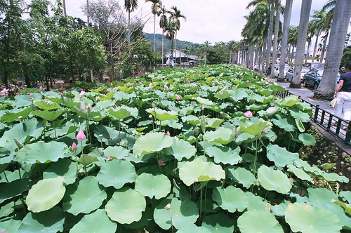
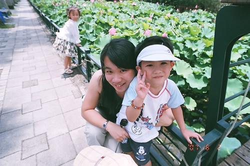
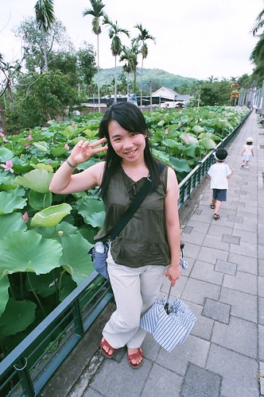
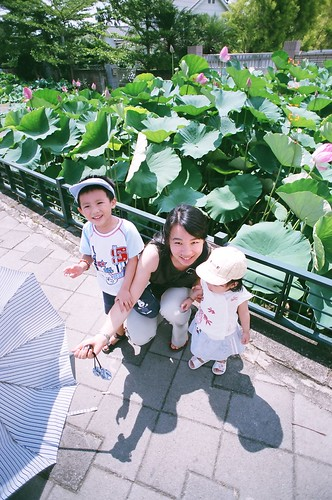
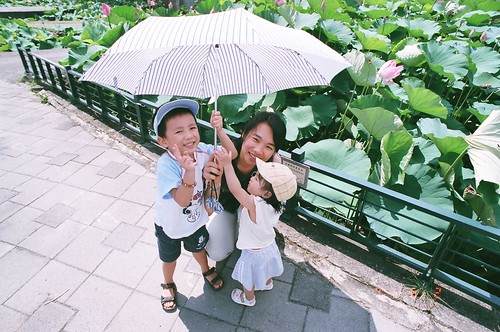
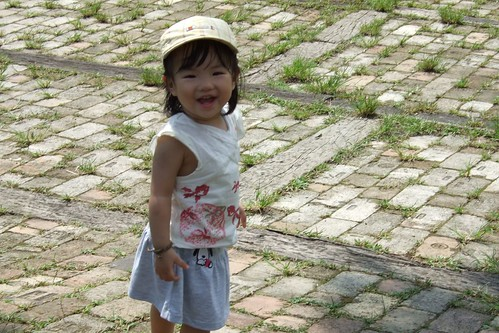
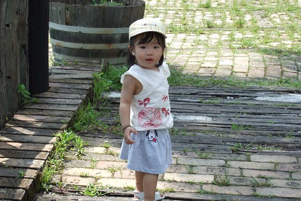
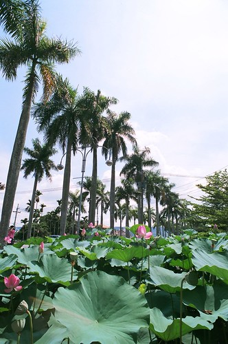

因為要等小八的照片   這花就這麼晾在那好一陣子了  
總算總算照片洗出來 總算總算見識到超廣角....  
  
去年寒冬去台北植物園時還想著夏日該來賞賞荷  
但所謂越近的地方越是遙不可及  
加上無意間在報紙上看到有關中興新村的旅遊介紹  
於是又趁著回嘉義的路途"順路"的去中興新村賞荷噜  
行前徹爸上網找了找相關資訊 看到下面這段荷花的介紹  
  
荷花花期大約三天，開花第一天約清晨四、五點，  
花苞會緩緩開啟，二個小時後即合起等待下一次的展開，  
第二天同樣時段開花，可持續開至上午九時左右又合起，此時花也較昨日大些，  
第三天則是完全盛開期，多數遊客平常時段，看到的荷花也就是最後一天，  
這時盛開的花朵就只能等待凋零了！  
  
算算最早也要8-9點才會從台北出發   
抵達南投不正是烈陽高照 只能看得那些待凋零的荷花  
果然...正中午走在原本嚮往的林蔭大道 荷花池畔  
不只花將凋零 人也待枯萎....  
  

這的荷花跟印象中彽矮的長在池塘裡的模樣不太一樣  
每株都長的既高且壯 高度也都參差不一  
看到一旁的警示牌寫著"噴有劇毒 勿碰"  
才恍然大悟 難怪這的荷長的這麼頭好壯壯  
  
  
  
烈陽不止穿透荷花 也快曬昏我們這些賞荷的人  
  
  
  
小帽子也發揮不了太多遮陽的效果  
  
  
  
熱到小子都不太想照相 需要老媽千拜託萬拜託  
  
  
  
躲到餐廳吹著冷氣 小子總算燦爛的笑了   
  
  
  
(愛) 來人阿 快來 姑娘快曬昏 餓昏了  
  
  
  
在餐廳吹冷氣吃飯的時間比賞荷的時間還久  
但....怎麼可以這樣就走人ㄋ  
好吧  小的不理老爸 就我這老媽子下海當Model了   
我得承認我蠻愛照相的 但是老爺阿別把我拍的太壯碩啦  
  
  
  
這高高低低的荷花真的跟印象中的很不一樣哩 真的...  
好熱...好熱 可是為了跟荷花一起入鏡  只好棄傘演出了  
  
  
  
小姑娘不看鏡頭就罷了 還搞破壞拼命要搶傘  
好在媽媽練就一身好本事 不管怎樣就是對著鏡頭笑啦  
  
  
  
上車前姑娘突然暴走的很開心 露出今日賞荷難得的笑容  
  
  
  
回眸一笑 百媚生阿 (哈哈 真是老王賣瓜 自賣自誇)  
  
  
  
賞荷真的還是透清早來比較好 看到的花會多些也嬌滴點  
要不然傍晚來應該也會不錯吧  
晚風徐徐踏著腳踏車在新村裡 應該真的會如旅遊介紹的那般愜意吧  
  

