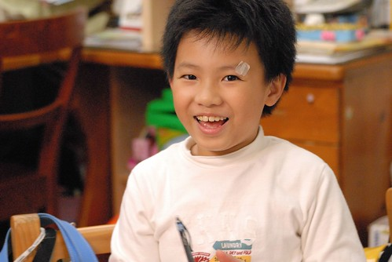
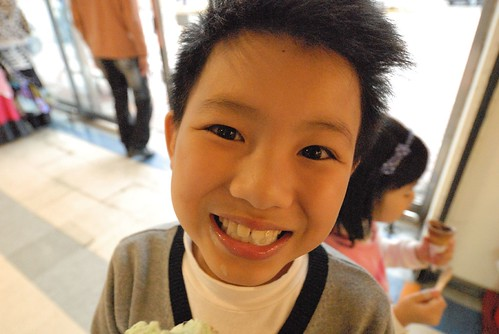
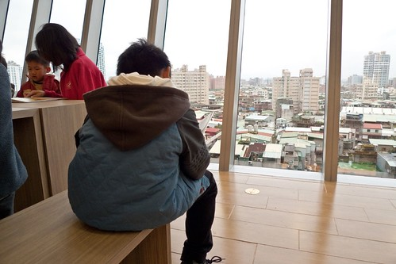

今天又是222了 時光飛也逝...還是很難相信我跟徹爸的第一個孩子已經滿九歲了 我跟徹爸兩人常會說起"如果當年沒有阿徹 現在的我們會是過著什麼樣的生活?" 可能不知道結婚沒 可能兩人過著醉生夢死 沒想以後的日子... 肯定的是 我們真的覺得有阿徹這個意外真的好好! 因為他讓我們接著發生/經歷了這十年... 雖然每當阿徹膩在我們身邊 或是耍賴的非要我多抱他一下 多親他幾下(最好還是嘴對嘴)時 我總笑他說 "你都已經這麼大隻了 還像個小嬰兒一樣要人家抱 人家親" (阿徹總說"人家就是愛嘛") 但我真的好高興 這麼大的阿徹還每天樂此不疲且發自內心的跟我抱抱親親與說"愛你喔" 我常想 哪一天小子會開始害羞於對我親親抱抱 甚至拒絕我的親親抱抱... 邁入10歲 感覺好像很多事將會開始變化 尤其離那個據說很恐怖的青春期越來越近了 但其實我並不會擔心 我總想從他出生後 我們在他心田慢慢灑下的種子  應該夠強壯的讓我們一起度過那些未知的未來  況且我們一直每天一起努力的做好爸媽 做好小孩! Overall, 我真的很高興我們家的阿徹越來越大(老) 越來越強壯了! 徹~ 今天晚上就讓我們一起用可樂來慶祝你的九歲生日!  

順道來補一下阿徹三年級上學期的紀錄 中年級對於阿徹來講的確是很跳檻的另一個不同階段 上學期間發生了不少事  我一直很想好好的記錄下來 但是學期間想著等學期末一起說(算總帳) 等到學期結束該動筆了卻又因知道自己一旦開始寫將會不可抑制的寫很多而遲遲沒有動筆 而拖到開學了又想著那等生日時再一起說吧! 好啦! 現在好多事都忘記了...  想想這樣也好 才不會紀錄了太多阿徹的不好  阿徹的三年級 因為年輕有活力的新導師 其實是很開心且過渡的很順利的 每天回家的路上 阿徹總是興高采烈的跟我說學校發生了哪些好事 有趣的事 雖然新老師給的學習任務不少 但阿徹總是明明是期待但卻故意像是抱怨似的說著"書語老師真的點子很多 不知道明天他又要出什麼奇怪的點子" 雖然年輕老師在某些事情處理上的確經驗略有不足 但我真的很高興阿徹遇到這樣的老師! 但是阿徹每天開心上學 開心回家的日子 卻在11月中的月考後風雲變色了 因為阿徹考了個我跟徹爸實在很難接受的分數 國語78分 數學83分(幸好社會 自然有hold住) 不只沒達到我們從一年級便訂下的規定(國語85分 數學90分) 更是讓我們在他的考卷與訂正中看到他的不認真 其實在月考前幾週我們便意識到阿徹的不夠用心 但捉不到辮子去要求他 逞罰他 只能一再跟他叮嚀"月考後 就知道了..." 果然! 所以其實我們不是太意外會有這樣的成績  但真的好難接受喔~ 發國語的那天 我氣炸了 因為真的很難想像國小可以考70幾分 徹爸難以理解為什麼我會氣炸 因為他覺得阿徹考前就是這樣啦 隔個週末再發數學那天 徹爸氣炸了(考前數學是徹爸負責的 因為他覺得他的方式比較能貼近阿徹) 徹爸不能接受考卷上的粗心大意 漫不經心 又再發生在考卷的訂正過程中 徹爸好多天沒跟阿徹說話  家裡空氣好低迷 那是我們養小孩這麼多年 最嚴重與最長的一次沮喪 揪到我的心都覺得痛 幾天後 我突然想明明平常我們都覺得這樣的阿徹好有趣 好我們家的小孩 為什麼就只因為這一次的考試就把阿徹都全部否定了 況且是我們養出這樣的阿徹的 我跟徹爸說起這樣的看法時 才發現N多年沒寫過信給我的徹爸竟然悄悄的給他兒子寫了一封漏漏長且文情並茂的信 而阿徹也回了一句話給他爸爸"爸爸 請相信我 我會改的" 原來他們父子倆早就暗通款曲了 而我竟然還一直在擔心著如何突破他們的僵局 徹爸恢復跟阿徹講話的那天 阿徹好高興 回家的路上跟我說"爸爸 今天跟我講話了揶" 後來我跟徹爸再次跟阿徹闡明我們的看法與原則 重點是作法做了一些修改: 請安親班老師不用幫阿徹檢查功課 由我自己看第一首作業 這樣更能了解阿徹寫作業的用心度 而作業跟功課也都由我看(因為徹爸氣炸時說"以後我再也不看你的功課" 後來徹爸多嘴時 我剛好拿這話堵他) 但是我看過一遍 告訴阿徹哪有錯誤後 剩下的阿徹要自己負責任 我不再反覆檢查好讓阿徹的作業100分 也跟安親老師說明不要寫評量 讓阿徹對自己負責 要上課認真 寫作業認真(評量他自己想寫才寫) 因為我們一再跟他強調 小學的功課上課認真 寫作業認真 就一定可以達到一定的成績 下半學期 阿徹的寫作業態度真的有改變 甚至他自己都說上課變認真了(學期初還會在上課時偷做美勞 畫畫 Orz) 雖然阿徹一樣每天回到家就是玩 考試前一樣過日子 沒特別準備 但阿徹的期末考成績讓他笑了 也讓我們鬆了一口氣 (這樣才能證明爸媽不是亂說的) 第一天考完 老師便告知了國語成績 阿徹在安親班門口告訴我成績後 母子兩個拉著手跳阿跳 阿徹好高興他達到標準了(哈 真的只有過標準一分) 那天晚上阿徹開心的像是已經考完試 要放寒假了 而第二天的數學出乎我們意外的只扣了3分跟計算沒關的錯誤(有一個還是因為圓規太爛 跑針的關係) 我笑阿徹說"你寫作業時的正確率都也沒這麼高阿" 但可以感受出阿徹很仔細 很認真的在計算 經過期末考的肯定 以前總會說自己不聰明 甚至說自己笨的阿徹總算說"其實我不笨" 雖然這樣的轉合過程 很苦還交雜很多淚水 但我們深信這樣的學習體認是真的屬於阿徹的 而且將會深深影響接下來的漫長學習生涯... 補充:當然事情不會那麼順利  阿徹也不會一直那麼盯針   所以剛開學的阿徹又太放鬆的被緊盯了  幸好除了月考事件外 我剩下的記憶幾乎都是好笑的事了 例如阿徹這學期當了幹部 一個我們小時後沒有的"午餐股長" 剛開始 我們實在很好奇到底午餐股長要幹啥的 幫忙打飯? 幫忙扛飯? 後來才明瞭原來午餐股長是要維持同學打飯時的速度與秩序的 阿徹甚至說"午餐股長其實跟風紀股長很像(權利一樣都很大) 只是一個管吃飯 一個管睡覺" 話說午餐股長的權力有多大 看到導師在BLOG寫的這段就能明瞭: "這讓我想到上次午餐長請在外頭看樺斑蝶的同學進教室 同學太興奮了不想進教室 「怎樣啦，我不能看歐」 「趕快進教室」 「怎樣，我要看啦」 雖然一開始我就發現了，但就想看看這兩人要怎樣解決 有徹走進教室，本以為他要跟我告狀 他卻很有氣魄的扣了小組分數 慢吞吞老師這時候才說 有徹做得很棒，大家應該在午休時聽午餐長的指示 這件事也是圓滿落幕囉 " 阿徹的午餐股長好像真的做的挺像樣的 而阿徹自己也很喜歡當午餐股長ㄋ 連下學期同學選他當學藝股長 他自己還覺得有點不習慣 很想繼續當午餐長 補充: 阿徹常說很多同學說他畫畫很厲害(我是覺得不是技巧厲害 是很能把腦袋想的東西給畫出來) 甚至聖誕節佈置教室時 有個跟他同工的同學跟他說"跟你在一組 真好" 因為阿徹有好多的美勞相關用具阿... 因為阿徹常會去跟老師要剩下的美術紙 或是問老師那美麗的紙打哪買...  一二年級時 阿徹她們一年中有一天得去別的班級做美讀 而三年級後 學校給的訓練任務是要去別的班級做3分鐘的故事演說(包含一張海報) 雖然演講題目跟內容都是老師給的 但要在30個不認識的別班同學跟老師面前演說的確是個大訓練 演說完 阿徹開心的說"那班的老師說我很大方  評分的同學說我的圖畫的很漂亮喔" 補充: 話說那個圖也是被我盯過 阿徹含著淚畫出來的 其實我向來不管阿徹畫什麼的 可是阿徹的第一版真的讓我太看不下去(講真的 有題目的阿徹通常畫的很遜) 因此我給了阿徹許多建議   幸好阿徹從一開始的含著淚到後來的越畫越滿意 越開心 而同學看過後給他的讚美 更讓他說"真是跟第一版差太多 美麗太多了" 所以小孩子到底該不該逼 那把尺真的得好好拿捏...  期末考後放寒假前 我們請了三天假去台東玩 阿徹明白請假去玩的好處與樂趣 所以並不擔心與遺憾(起碼在我們面前)不能過學期末的上學好日子 但就在我們玩回到台北的那天 徹爸在班級BLOG看到老師的對阿徹的呼喊 我們笑翻了 內容如下: 有個寶貝請假前認真的問我 「老師，如果我請假了，誰要幫我領獎」 我開心的告訴他 「那太好了，沒有來就棄權，我們把禮物轉送給同學」 他又很認真的問我一次 我又很開心的重複了一樣的話 阿寶們就這樣興奮起來 開心的贊成 然後鄭老師就很幼稚的跟大家說 抽到腳踏車要借老師騎操場一圈 玩具要借我玩一下 大家就開始討論這個話題 過了一下 那個寶貝又認真的問「老師，到底是誰要幫我領獎啦(擔憂狀)」  超級卡哇伊的 在這裡要告訴那個寶 全班拿到四個禮物(小玩具) 「你中獎了！你中獎了！」 大家在內庭豎起耳朵、引頸期盼 得到的禮物竟然比你還少 因為你得到兩個(你中獎了！你中獎了)~~所以老師把另一個捐出去了  老師又跟你開玩笑啦> < 補充: 看到老師的呼喊 我說應該是中了最大獎腳踏車吧 還跟阿徹交代隔天去上學如果真是腳踏車 記得請老師打電話給我 我請假去學校幫他搬車子回家 結果是兩樣像是39元商店賣的小玩具 我有點三條線但阿徹還是好開心 (這樣的背影 讓人覺得真的長大了阿)  學期末還有一件大事 就是可以把平常好表現累積的點數去換禮物 而換禮物的方式是有點像拍賣那樣 老師逐樣拿出禮物  由同學拿點數來競標(點數就像錢那樣使用) 阿徹換了一盒戲彩色筆回來 他說"當喊到40點的時後 我就說160點 然後沒人再出聲" 阿徹說因為他覺得只想要這個東西 彩色筆是他最需要又想要的 於是他把他所有的點數一次就全喊出去 怎樣~ 我們家的阿徹果然越來清楚自己的需求 也越來越有魄力了 給他一個讚

學期末老師在成績單上的文字描述: "有徹是一個充滿想像力和創造力的寶貝 對於藝術相關的事務 總是特別關注並積極參與 另外 有徹的領導能力也進步很多 不論是口語表達還是執行力都表現不錯 能舉一反三 老師建議有徹要再細心一點 做好事不嫌多 " 謝謝老師這麼樣用心的觀察與包容阿徹的特點 並且提出中肯的建議 我們真是太認同不過了...
