愛愛期待很久的上小學日子總算到來 今天起 阿徹哥哥再也不能笑他說"幼稚園的果然幼稚" 今天起 每天又可以一起跟著哥哥出門上學去 而徹家也今天起全面晉升為小學生的家庭~ 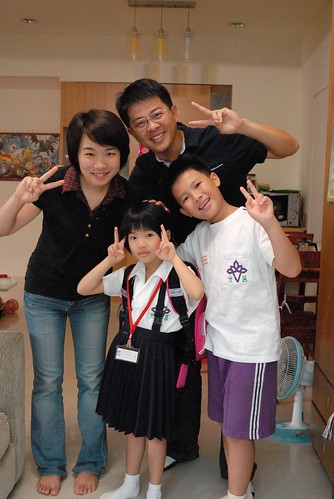 

開學的第一天 在我六點半起床後沒多久 愛愛便跟著起床了 我擔心的要她再回床上多睡一點 愛愛說"可是我睡不著 想起床了" 然後7點不到 愛愛自己換好新制服 坐在餐桌等她的早餐 向來早餐胃口很不好 向來不肯在早上吃水果的愛愛 在很令她跟我滿意的時間內吃完她的早餐還主動跟我要了片蘋果 小學生 果然不一樣 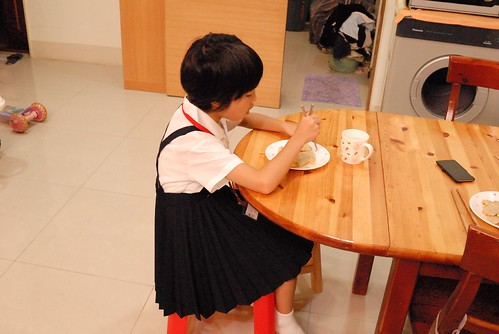 吃完早餐 盥洗完畢 揹上書包 有點緊張 有點興奮的愛愛r要去上學嚕~ 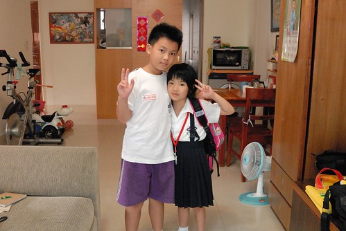 出門前 我們效法日劇在重要的日子拍張照紀念 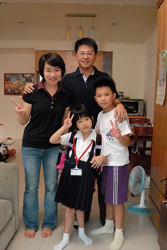 照完後 徹爸說"人家日劇都是站直直 隆重正經的 我們亂七八糟的" 急著出門上學的愛愛怎樣都不肯再來一張 我說"沒關係 這就是我們家的風格" 不過到家門口樓下時 還是硬被徹爸再來一張 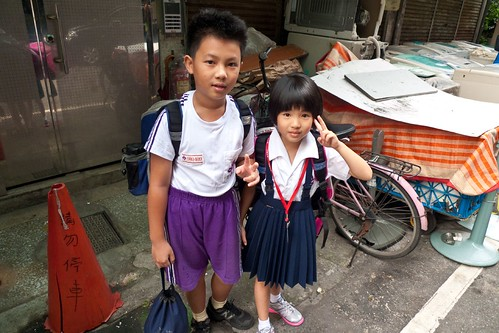 好一陣子前就答應了愛愛 開學日要全家人陪他一起去上學 於是左手是媽媽 右手是哥哥 愛愛在全家人的陪伴下邁往小學之路 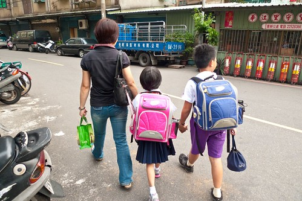 我們刻意的從會有迎新儀式的南側門進入(平常是由西側門) 一進入便被老師們招呼去給新生照張紀念照 這一刻起愛愛也是莒光人了 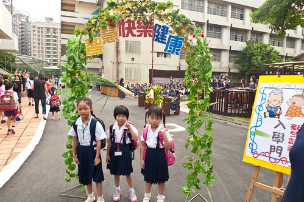 阿徹哥哥跟著我們一起送到愛愛的教室 聽說這一日哥哥有過來探過一次班 真是謝謝阿徹哥哥! 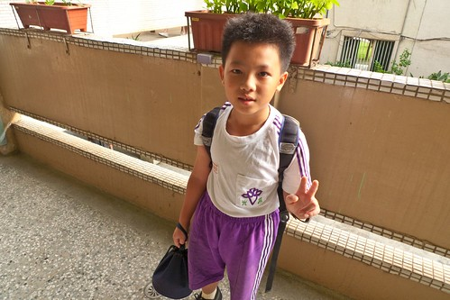 帶領愛愛進入教室找到位置後 我逕自的觀察起教室四週環境 而徹爸則負責拍照 記錄下愛愛的歷史性一天 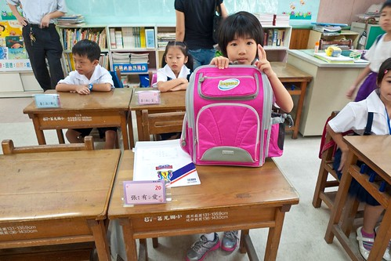 而再幫愛愛一起把書包掛好在椅子上 交代好要拿去交給老師的資料後 我跟徹爸一起退到教室外的走廊 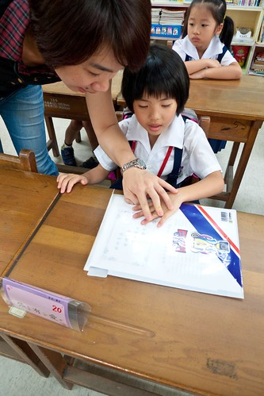 接下來便是愛愛獨自面對的開始 (再看照片 我真覺得愛愛很自信 完全不像哥哥當年的呆樣) 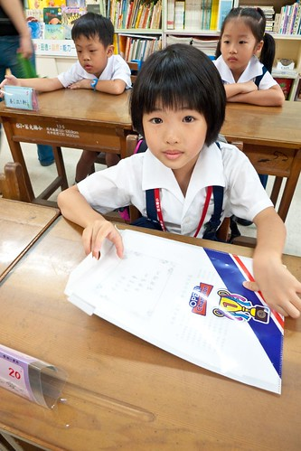 只是阿... 看到前面 老師那邊 一波波交資料的家長人潮 我掙扎著要不要去幫愛愛 因為我覺得要我是愛愛我也會畏懼於現場的氣勢 不敢自己去交資料 但徹爸一直說"愛愛可以的 愛愛在等人少的時候" 於是我按耐住 跟徹爸兩人等著愛愛出手的時機 同時間 我跟徹爸也嘖嘖稱奇於黑板上老師寫的字 "真是太強了 真的好像課本上的字"兩人看的瞠目結舌 徹爸應該總算明白我之前的心情 他也說"真的幸好不是阿徹 要不然肯定被釘到黑板上去..." 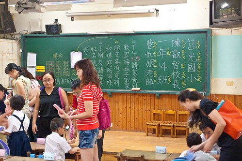 直到家長資料都交的差不多 時間也快到了 而愛愛還是一直沒有起身的動作 總是搞操煩的媽媽 我 總算忍不住進場關切愛愛一下 愛愛才有點惶恐的表情跟我說"我不敢去" 所以啦 我只好代女出征去 (排隊時剛好老師交待事情 然後我還跟一旁對我過度關切的媽媽拌了一下嘴) 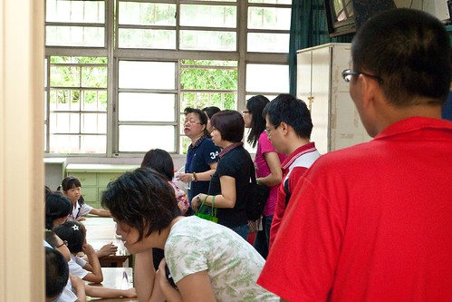 講真的 我跟徹爸真覺得現場有點混亂  而造成混亂的來源並不是那一個個呆呆坐在位子上的原本主角 幸好晨間時間鐘響後 老師請所有的家長退出到教室走廊外  把教室空間還給33位小新生 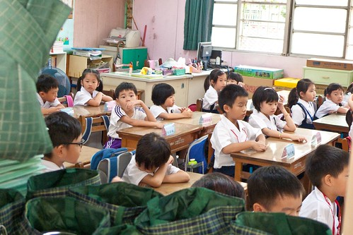 只是想不到老師對著教室外的家長們又足足解說了5分多鐘之久 鉅細靡遺的交代黑板上的注意事項 聯絡簿上的事 講真的 我們覺得有點太仔細 太...就像大人對小孩的過度叮嚀 徹爸下了這樣的看法"老師怕麻煩 所以一開始就交代好所有的事以省去不必要的麻煩" 其實規矩與規定某種程度說來 就是這樣的目的吧 (老師跟家長說話的同時 一個個新生癡癡的望著他們的老師) 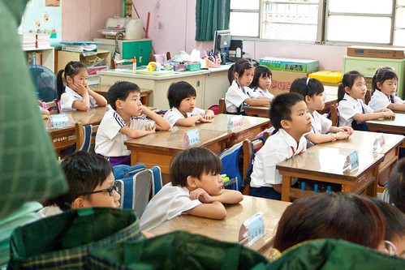 總算在徹爸形容的搞好久後 小新生們在老師的發號下跟爸媽們揮手再見 我們放心的把我們家的小新生交給老師 交給學校  但內心略為百感交集的上班去~

老實講 向來不喜歡甚至懼怕"制式"的我 對於愛愛未來的班導師是有著惶恐與擔憂的 我當然很欣見嚴格老師帶來的好的學習表現與寫得一手好字 但我也真的擔心嚴格的另方面會不會是熱情的扼殺 學習的僵化 尤其愛愛的個性 雖然讓我們可以安心她絕對可以適應 可以勝任  但也怕她會勉強過頭 能幹過頭... 每個父母對小孩的期望不同 每個小孩也讓父母對他們有不同的期望 但我衷心的期望愛愛能夠跟哥哥一樣喜歡上學 喜歡學習 喜歡自己的每一天!

(這是愛愛放學回到家後的模樣 出乎我意外的精神抖擻與清潔) 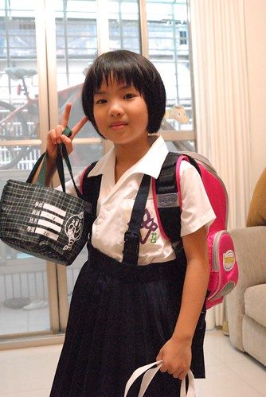 3點半我準時的出現在愛愛的教室外 教室外等候的家長紛紛嚷嚷 而教室內的小孩也因疲累一個個顯得更呆了 看到在窗外揮手的我 愛愛回了一個令我安心的開心笑容 那一刻我的心總算安了下來 且感動更甚於早上 後來回家的路上 在家裡準備學校用具的時後 以及接下來的一整晚  愛愛說了好多學校的事 "上小學好好玩" (感受的出 經過一天愛愛已經不緊張了) "老師給我們立體貼紙 因為我們午睡時都有乖乖閉上眼睛休息 睡覺" "我們老師沒有很兇阿! 她還說我很乖" "我覺得我們老師交代事情很清楚" 我問怎麼知道 她說因為她去隔壁班找幼稚園同學時聽到隔壁班老師在說事情 覺得那老師都說不清楚

"我今天有交到一個朋友了 坐我後面的21號 不過她不肯告訴我她的名字" 我問那她知道你的名字嗎 愛愛說"我跟她說我是張有愛 想跟你做朋友" 之後兩個女生就都一起去上廁所 "小學的下課時間好短喔 第一節下課我去完廁所就上課了" 還聽說那兩個小女生看到那沖不下大號的廁所(別人上的) 按了廁所裡的紅色鈴 然後告訴接聽的老師"那個廁所的大便沖不下去" 急的接聽老師問"在哪裡 哪間廁所"然後派人過來處理 "每次下課完 老師都會提醒男生要把衣服紮好 因為都會有南生上完廁所後衣服跑出來" 媽媽的OS:男生真的容易邋榻 就是我們家的阿徹哥哥

"我們班有33個人 老師說每天交一個朋友 很快就可以知道所有同學的名字了" "我隔壁男生的名字是XXX" 我問"你不是說你只有交一個朋友" 愛說"對阿 我只有幫忙的時後才跟我隔壁男生說幾句話 還不是朋友" 我問"那你就記得他的名字啦" 愛說"有時候我下課的時後 就會到處看同學桌上的名牌 用注音拼他們的名字" 我好高興愛愛用她的方式適應新環境 認識新朋友

填選活化課程的志願時 在我說完包含摺紙 律動 英文ABC 音樂賞析...的選項後 愛愛自己決定了"硬筆書法與閱讀"為第一志願 而且不論我怎樣拐彎勸說 愛愛說"這樣我的作業就可以寫的更漂亮了" 或許這是愛愛認為可以達到老師作業要求的好訓練吧

我真的覺得是老天爺用心良苦給了愛愛與我們這樣的可能考驗 很高興開學的第一天 我便看到了愛愛對於老師 對於新環境有自己的看法與適應之道 看到這樣的愛愛 我忍不住想給她好多的抱抱 好多的故事時間... 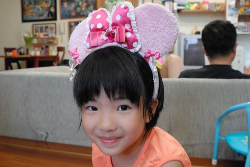 ps1. 話說年初才說要留長頭髮 好可以綁著兩隻去上小學的愛愛 最終還是在小學開學前自己毅然決定要剪短 不管為娘我怎樣挽留 騙說 短髮的愛愛不再睡覺時唉著脖子好熱 早上起床披頭散髮時嚷著熱到快爆炸 而且才一兩週的練習 愛愛便已能自己完成洗頭與沖頭 我想她肯定很喜歡短髮這樣的清爽與獨立吧! 只是短髮的她看起來真的"猴"很多 甚至有時調皮的讓向來支持她任何決定的徹爸也忍不住說"以後不要讓你剪短髮了" ps2. 有關我的惶恐 或許可以透過我FB上的兩則PO文來稍加註解: 愛愛的小學編班出來了 我好奇的將老師的名字拿去估 看到以前學生畢業前寫的文章: "我們老師平常很嚴肅，但真正了解老師的人才知道老師的嚴厲可以造就我們的一切，...。大家都很怕我們老師，其實內心怕得並不是老師，而是自己的行為，我從一年級就打好良好的基礎，這都多虧了老師，因為她的嚴厲造就了我。" "老師除了以身作則當我們的榜樣之外，她對品質的要求也很高，注音聲別若超出格子就會算錯誤或扣分，對我這種在意分數的人來說，方法尤其有效，也因此我能在很短時間內將字體做了很大的改變" 我真的覺得張嬤家菩薩一直有保佑著我們.. 幸好不是阿徹 如果是阿徹我真不敢想像會有多慘烈 這是我第一個想法 這對兄妹倆真的註定天生大不同! 祝福我們家的愛妹妹"

昨天回家後告訴小人們愛愛的編班結果 徹哥問"老師叫什麼名字" 我心想你這個只知道玩的學生會知道 但沒想到徹哥聽到名字後 瞪大雙眼 嘴張如O 徹哥說"那是(安親班)XXX的老師 他們班的甲比我們班的甲上上上的字還漂亮喔" 徹哥一臉不可思議 但亢奮的繼續說"他們那個字不只要寫在格子內 還要跟本子上的字(示範字)出現在一樣的小格子內喔" 我問"那XXX的字不就很漂亮" 徹哥說"沒有阿 所以他作業都整面紅" 徹哥接著說"他們班的都叫老師是曹操" 我忍不住敲了敲徹哥的頭"夠了! 愛愛可以的!! 我只慶幸 幸好不是你!!!" 莫非這就是傳說中那種要求寫字如刻印的殺手老師~~~ 還真被我們遇上了 我還是只能說"菩薩有保佑 幸好不是阿徹..." 不是看不起阿徹 而是阿徹真的絕對不是那個可以這樣扶的阿斗 而沒想到老天爺也看清楚這點 而且還用心良苦的讓愛愛接受這樣的考驗(或許我們家就要出將才了) 接下來就讓我們每天用滿滿的故事,遊戲與陪伴 與愛愛一起面對這可能艱辛的低年級~
