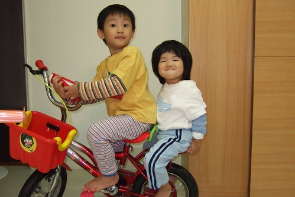
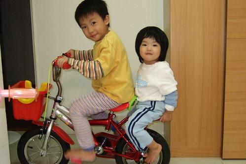
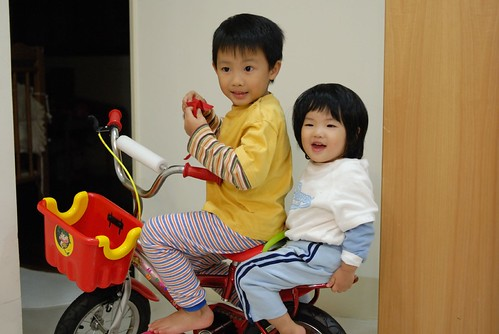
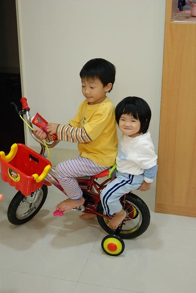
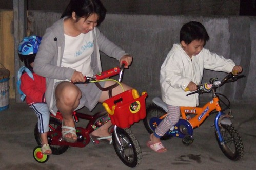

阿徹哥哥上頂樓練腳踏車的時候  
小愛也得扛台電動摩拓車上去溜溜  
偶而哥哥想騎摩拓車時 小愛便會被打發的放上哥哥的腳踏車上被爸媽推著走  
久了也懂得享受迎著風急速的快感  換她常主動要求要上腳踏車上溜一溜  
甚至自己坐上停放的腳踏車 小腳在那空踏 踏阿踏  
於是跟徹爸決定用奶粉累積的點數換台腳踏車給小愛  
想說用換的腳踏車應該比較像玩具 比較小台點 比較適合小不點愛吧   
(徹爸還用比較多的點數換非泡棉輪胎的)  
  
等了好幾週 總算拿到腳踏車了....  
但是哇勒 這未免也太大台了  倒比較像是給哥哥騎的  
阿徹果然很哈這紅色 而且後面有座椅的腳踏車   
但是這是妹妹的車 所以她只能巴巴的等妹妹不騎  
或是循循善誘的跟妹妹說"哥哥載你好不好"  
幸好小愛常在"踏哩瞴"之後 知道還是給哥哥載快活些  
只是愛~你這表情真的未免太臭屁了   一附"怎樣 這就是我的車"的樣子  
  

握好喔  哥哥要啟動了喔  
  
  
  
看到兄妹倆這樣載著 真的超級好笑  
  
  
  
真的看的出小愛很開心的哩  
  
  
  
以後哥哥在頂樓溜車 小愛也可以練車嚕  
我們相信很快的 小愛就將能自己踏著她的車跟哥哥尬車的  
因為小孩在大真的很快~~~  
  

