雖然下台中的原始與最大目的是要去喝喜酒 但不小心就讓司機兼伴遊的小姐擴充成豐富的一日台中行 從一大早10點的宮原眼科冰淇淋  喜酒前的誠實商店 到喜酒後的胡同咖啡 真只差最後沒再來個伴遊小姐極力推薦的鼎王晚餐 雖然有時候會想起在台北的父子倆在做什麼 但還是得不好意思的承認我們在台中玩的很開心 第一次這樣長時間的四個人分組行動  雖然有點不習慣但還還挺不錯的....

原本一直打算全家人一起去台中喝喜酒的 但到期的前幾天我突然想 既然阿徹這麼這麼的不喜歡喝喜酒 既然一個人的高鐵錢差不多等於全家去的油錢 那不如就我帶著愛喝喜酒的愛愛獨下台中 讓忙碌一整週的徹爸得以好好在家休息而阿徹也可以在家樂悠悠 雖然後來發生一些我不知道該怎麼形容的"狀況"  讓原本應該很美好的男女生分組行動蒙上陰影 但我佩服阿徹最後還是決定留在家的勇氣 因為他正在跟徹爸冷戰中且超級擔憂只剩他們倆的時候會不會又再惹爸爸生氣了 而其實我最佩服的是我自己  因為我依舊照原訂計畫的吃完早餐便出門直到天黑晚餐前才回到家 喝喜酒時 我嘀咕著" 哥哥在家不知道怎麼樣" 愛愛說"你可以打電話問阿" 我說"如果真的發生事情也只能擔心 那還是不要打了" 於是我跟愛愛ㄧ整天瀟灑又忘情的在台中大口吃冰 喝喜酒 喝咖啡 我想這也是一種放手的學習!

那天早上吃完早餐 我跟愛愛便出門趕9點的高鐵 除了高鐵試營運期間曾經從嘉義搭到高雄外 這是我們第一次的搭乘高鐵 老實講有點小緊張 所幸還真的就像搭捷運一樣便捷與好操作 去程的41分鐘裡 搭高鐵很興奮的愛愛假裝自己像是大人般的忙碌著 打發著在高鐵上的時間  安靜的模樣感覺很成熟 (話說後座在睡覺的婦人就這樣直挺挺的把腳跨到我們的座把旁讓人很OS哩 是今日最令人遺憾處) 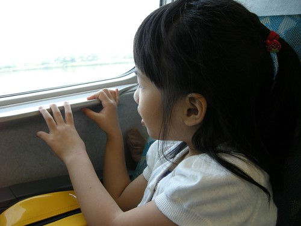 出高鐵後 依照今日司機的指示 順利的搭上車然後直驅台中火車站前的宮原眼科 話說我們那九點的高鐵就是硬玟姿所要求的 因為她說眼科10點就開了 加上好天氣很容易人滿為患 於是我這輩子第一次透早 連中午都還沒過的就帶小孩來吃冰 嘖嘖嘖~ 果然才開店沒多久 店門口前便排滿吃冰淇淋的人潮 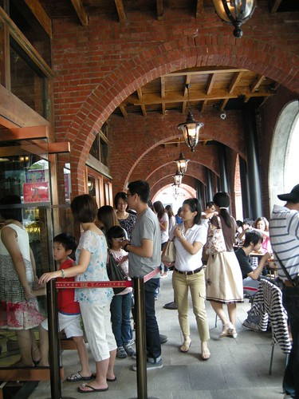 趁著玟姿排隊的時候 我把握時間入店內參觀 對於店內的各式糕餅 蛋糕或巧克力的展示沒太多感覺 倒是對於老房子被賦予的新生命 尤其是那讓陽光大量灑進的大天窗感覺很棒! 只是這麼棒的建築物裡竟沒有可以愜意吃冰淇淋的位子實在很可惜 於是"很多"的吃冰人潮只能苦苦等著走廊下"少量"的位置 或是想盡辦法的窩在任何可以的角落享用  店裡穿著如護士般的店員的確很美觀而且優雅地替大家的冰淇淋裝點得豐富又可口 有故事的房子 有創意的經營 有好吃的冰淇淋 難怪這裡成為夯點  我們幸運的 "只"等了20多分鐘就吃到我們的冰淇淋 愛愛的草莓 我的桑甚 加上裝點其上的蛋白餅乾 臻果粒 與酒漬蔓越莓桑甚 O.E.C. ~~ 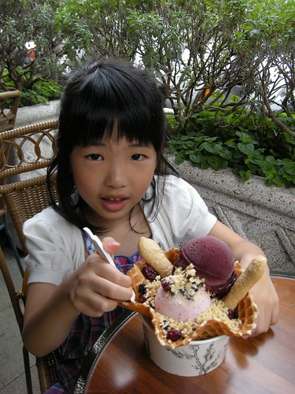 這是我們今早的一大一小伴遊小姐 一樣有著一盆漂亮的冰淇淋 只是看著她們的冰淇淋因為大人忙於打卡而融化中 我很是心疼哩 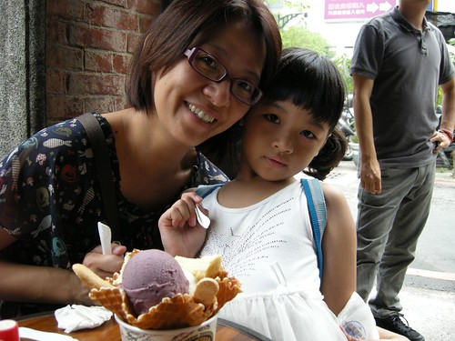 愛愛超級滿意這一大早的冰淇淋 不放過每口冰每口脆餅皮  讚! 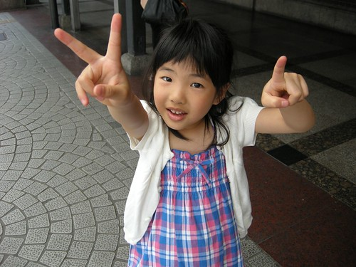 吃完冰後因為小人要如廁  我們意外的又多了個台中火車站巡禮  走在火車站外 在台中的那兩年大學時光 往事一幕幕掠過心頭 ~~~ 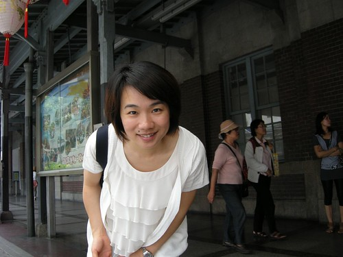 接著的喜酒前空檔  玟姿說就來去在她家附近也是喜酒餐廳附近的誠實商店吧 只是導航系統讓我們原地繞了好幾圈卻一直片尋不著 而時間一點一滴的流逝著 幸好就在我們最後一試中 臨時起意的一個左轉讓我們超意外的到達了  那一刻 玟姿開心的大喊"就是這裡" 雖然我超級存疑這樣的商店(所以找不著時一直企圖要玟姿放棄了) 但一看到靜巷裡的這間房子  我卻立馬喜歡上了 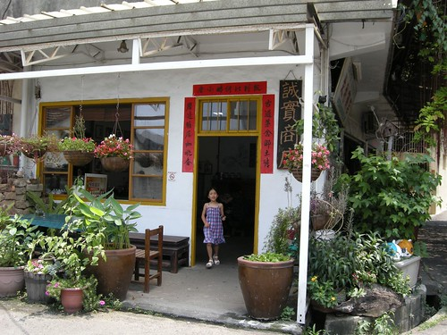 台中南屯區楓樹社區內的誠實商店 沒有店員 沒有收銀機 客人挑選東西後直接將錢投入「誠實甕」中 自然完成「誠實」交易  店內販售的物品從小包裝的糖果 餅乾 冰棒 到肥皂 杯墊 扇子 馬鈴薯 雞蛋等... 真的很像柑仔店 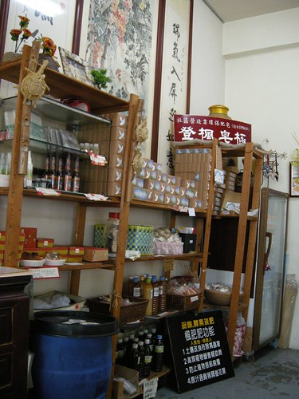 也有很雅緻的咖啡吧檯   只是煮咖啡也是自己來喔 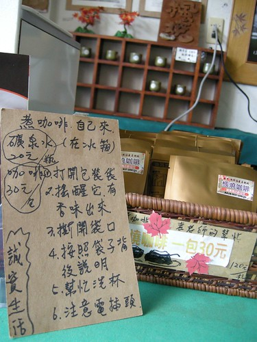 這又是一個藉由社區營造而凝聚當地再創美好生活的好故事  坐在屋子內或屋外簷下時  徐徐微風吹來 我說真是好令人舒服的一個房子阿 謝謝玟姿帶我體驗了這麼棒的一個地方! 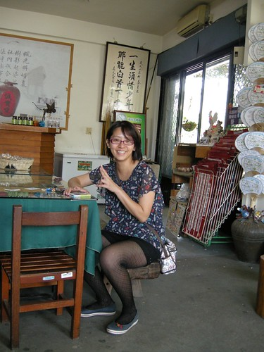 只是不小心玩過頭 耽誤了今日原本最重要的事 沒能來得及在婚宴開始前先給新娘子獻上滿滿的祝福 我跟愛愛匆匆的來到會場 然後在滿場只認識新娘子媽媽的狀況下找到剛好剩下的兩個位子 所幸位於紅毯入口的位置夠明顯 讓新娘子在進出之間總能把握機會的跟我用唇語交談一下 當大螢幕上介紹新娘子生命中重要的人時 看到她寫給我滿滿一頁的話 我感動的紅了眼框 那一年我大二她高一  我是每次騎著半小時腳踏車去家教的毛頭大姐姐而她是個還懵懂的大孩子 但如今我們都是大熟女了 都正過著當年我們難以想像的未來... 美麗的新嫁娘一定要努力幸福喔~ (ps. To新娘子: 那天投影片閃太快 我都還來不及把那一頁話看完說.. 不過我知道你是很愛我的) 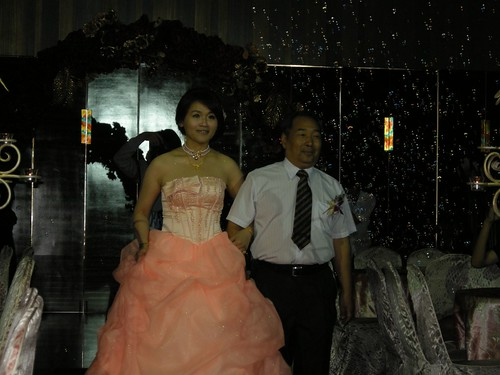 這是場難得準時開始 也難得不拖泥帶水結束的婚宴 因此回家裡睡午覺的司機在還沒睡飽的情況下 兩點初就又被call來繼續的行程 下一站是精誠路的胡同 有綠意 有陽光 有夠老的西式小洋房 讓人一眼就喜歡 我發亮著眼睛 頻問(其實是碎念)"這樣一棟房子不知道要多少錢阿" 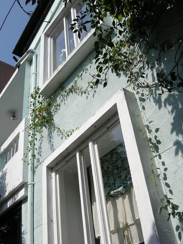 玟姿說這裡是廣受好評但又人潮不會太多的難能可貴好地方 只是就下午時段來講 我們可能真是來晚了  只先坐戶外座位區等候  其實有樹蔭 還有巷子風 坐在庭院裡感覺很舒服...  舒服到眼皮越來越重..  但可惜大玟姿跟小愛愛都是蚊子喜歡的類型   兩人猛抓發癢的手腳 有點慘 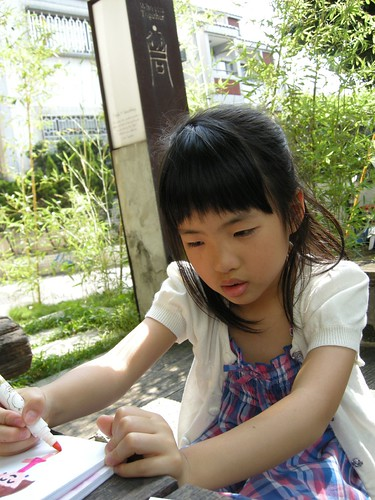 總算 在等候一個小時  我們的咖啡還沒喝完前  我們等到室內的位置了 入內後更能感受到胡同的好氣氛 看著一桌桌的人如在家般的自在(尤其是榻榻米區) 我說大家是來這度時間而不是喝咖啡的阿 愛愛也大發現似的說"哇 有四個人在用電腦揶"  她東比西指的告訴我  我們二大一小的三個女生就這樣在胡同窩了一下 直到傍晚時分該是啟程返家的時後 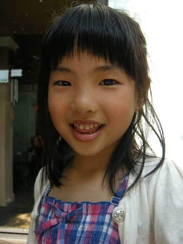 一手提著大喜餅 一手提著一大桶的嫩仙草  我跟愛愛滿載而歸的回台北 走在台中高鐵站 愛愛說了好多次的"今天好好玩喔" 而上車後也咻的一下就睡著在我懷裡(因為回程人多 不用票的愛愛只好抱著嚕) 然後在還不夠睡飽的40分鐘後 我們回到板橋 回到似乎離開很久的家 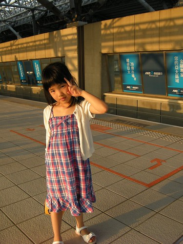 原來高鐵一日生活圈是這種感覺阿! 真的還挺不賴的 尤其這是我們兩個女生的小旅行 而這一切當然得謝謝家裡兩個男生的配合與最佳司機+伴遊小姐的支援!!
