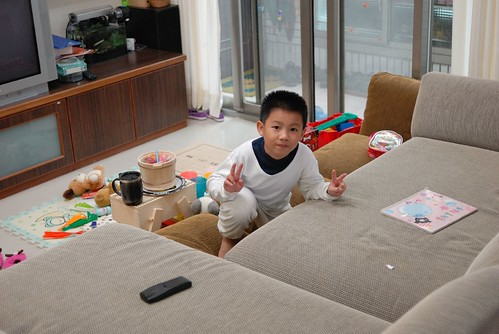
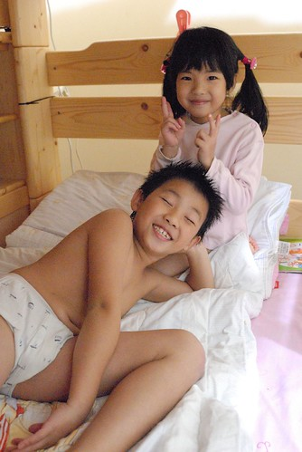

我們家的小學生阿徹又開始放寒假了 真快.... 從9月的開學 11月的期中考便一直想要紀錄一下他升上二年級後的甘苦的 沒想到最後卻是期末總的來一篇  滿腦子想著玩的媽媽實在該打屁股! 魚性的阿徹這學期當然又是過的又哭又笑 又苦又樂的 苦的是寫國語作業 寫作文練習 背孝經 背OOXX 點點的時後 而樂的則是下課後操場上的追逐嬉戲 多元豐富的生活課 閱讀課及美術課...  

一學期說長實在也有點長 很多事不小心就都忘了 所以下面就藉由照片想起什麼就寫點什麼 (結果還是又變成字很多歐巴桑了 唉...)

話說學期初有天回家路上阿徹很認真的問我"台灣有忍者學校嗎" 我說" 沒有吧但是日本好像有" 於是阿徹眼睛發亮的告訴我"我想要去日本的忍者學校" 我說 第一你要自己去當小留學生喔 爸爸媽媽不在身邊耶  第二國外不是想去念書就可以去的啦 阿徹很堅毅地表情表達出他想自己勇敢去忍者學校上學的念頭 甚至接下來的好多天回家路上都很認真的跟我討論著 他可以如何去國外唸書的方式跟可能性 後來我跟他說 "或許你現在可以先在台灣學功夫或跆拳(徹爸還以火影忍者裡的小李為例) 等你以後長大再去忍者學校"  向來不愛功夫這類體術的阿徹竟然點頭同意 雖然後來又是不了了之了 但我很訝異阿徹怎麼突然有那堅強的意志(起碼表現出來是)想去學當忍者 阿徹一直很喜歡看火影忍者沒錯　但迷了一年多也從沒聽他說過忍者學校這件事阿 後來多加探查後 猜想應該是受那陣子學校閱讀老師的介紹 阿徹喜歡上且自己很勤勞的常跑去學校圖書館借來看的神奇樹屋的影響 裡頭有一集就是在談忍者世界 有介紹忍者學校 這讓本來就很著迷火影忍者的阿徹更是熱血沸騰阿 連英文課萬聖節學習單上的一顆南瓜都可以變身成具有寫輪眼的鳴人... Orz 

然後又有一天回家的路上阿徹開心的告訴我 他們今天的美術課畫’未來的我’ 講完他還笑的很神秘的樣子 我很直覺反應的問’你畫忍者阿’（其實我真的只是開玩笑地鬧他的說） 阿徹驚訝的說’你怎麼知道’　ㄣㄟㄚ...因為我是你阿母阿 而且阿徹的志向還不止於只當一個平凡的忍者喔 他可是要當神之國的神影的阿 瞧~ 要有冠軍獎盃才能當神影 神影的外套帽子以及他的兵器樣樣都準備好了ㄋ 

阿徹對於忍者的嚮往讓他只要有機會可以表達他的夢想 他一定會好好利用且大加宣揚 身為爸媽的我們是還蠻'樂觀其成'的看著阿徹的發夢 只是我們真的很好奇他的老師每每看到這些 臉上會冒幾條線 會有幾個Orz阿!!!

這一年來每個親友看到阿徹都會忍不住說一句話"長大很多喔" 有的還會用雙手放在兩頰旁做出"澎皮"的樣子 或是擺出ㄩ表示強壯的樣子 沒錯~ 好胃口且食量大的阿徹 經過這麼多年總算有回饋到他身上 長了不少肉 四肢甚至強壯的小有肌肉 可以算是個肌肉男了 

有人會問"阿徹這一年吃比較多喔"  我總說"沒 他從以前就一直吃很多" 阿徹從幼稚園中班到現在一直是班上的飯桶 常可聽他津津樂道他又在學校吃了幾碗飯喝了幾碗湯 好胃口到反而是我們常給跟他說"吃少一點 吃慢一點"  一再提醒他吃8-9分飽就好而不是10分破肚阿 我們常提醒阿徹 "吃這麼多小心變成小胖子了  尤其如果養成這麼大的胃口後 如果以後長大沒運動習慣肯定變成胖子阿" 阿徹總是無奈的告訴我"可是我就是喜歡吃嘛... " 不過幸好他是個活潑好動的小孩 所以熱量進的快也出的快   除了偶而出現的小肚子外 依然還是小帥哥一枚... 

阿徹這學期當了兩個小幹部 一個是英文小老師 一個是體育股長 剛被選上體育股長那天他說"可能因為我一年級班級長跑第二名 跳繩第一名 所以大家選我當體育股長吧" 不過好像一學期結束了他好像還是搞不清到底要做什麼事... 阿徹這學期的跳繩以及桌球上下彈打又是班上第一   不過長跑退步很多可能因為變胖又再加上感冒吧 我們說"盡力就好啦"   不過這已經讓向來覺得家族很沒運動細胞的徹爸跌破眼鏡 到底是他兒子不像他想的那麼弱 還是台北小孩普遍都太弱 以致阿徹竟然可以靠著體育稱霸他們班上!? 不過我跟徹爸一致覺得阿徹學校對於體育課程及活動的有系統且積極安排很好 從一年級的 跳繩 搖呼拉圈  二年級的跳繩 桌球 以及每年都有的班級長跑 讓阿徹他們循序漸進的增強運動難度及強度  培養她們對不同運動的興趣與能力 跟我們小時後體育課就是放牛吃草的瞎玩很不一樣 希望阿徹可以藉此培養運動的能力 且能一直保持對運動的喜好! 

阿徹這學期的課業學習除了國語之外 其餘都還算穩定中求不退步 對於國語成績的不優 阿徹竟也會淡淡的說'我數學不錯 可是國語就不太好了' 或許阿徹覺得爸媽都是數學系的 所以他的數學好是理所當然 也因此就更有自信更有好表現 只是就這樣也覺得自己國語不好也是理所當然的就真的不太好了 (話說這還真的家有淵源 有人聽過大學國文被當的嗎 我家徹爸就是那個人) 其實照著學校每星期一課新課文  兩次國語作業 一次圏詞聽寫小考的安排與進度 阿徹算是學的中規中矩 該學的生字該背的課文也都能維持個90分上下 可是偏偏造句與照樣造短句讓他吃足了苦頭 我看了好幾回他的造句單被東扣西扣的慘兮兮  少個標點扣一分 一個錯字扣一分 很想告訴他'造句真是多寫多錯 短短一句有寫出答案就好' 可是徹爸覺得阿徹這樣充分融合生活 盡情表達很好阿 何必壓抑ㄋ 是的! 基於保護孩子創意的出發點真的是順其自然最好 只是當第一次月考成績發回來只有82分時  阿徹在回家的路上邊說邊哭 一發不可收拾的哭到讓我拜託甚至威脅他不要哭了 '我又沒罵你 你幹麻哭成這樣阿'(怕路人誤會我苦毒他) 阿徹說著'因為我難過嘛~'然後說完哭的更大聲 好啦! 逼的阿母我又不得不說重話了 '你每天去安親班就只需要把作業寫完 把要小考的準備完  回家除了玩還是玩 而考試前也不需要去安親班加強 或是在家複習  能有這樣的成績算是正常 如果說你這樣的唸書方式就能考100分  那對那些每天回家念書 考試前還得去安親班加強的小孩來講也很不公平吧 所以你只是就你的付出得到你的成績 如果你想要高分那就多寫評量 可是媽媽真的覺得現在這樣(的學習方式)就夠了 不過如果你想要考高分 希望我們配合幫忙你溫書我們也會幫 不過我們絶不會主動幫你複習' 阿徹好像聽懂又好像無話可說似的不敢再亂唉唉叫...

當然不可否認第一次月考那陣子 滿腦子忍者的阿徹 心很放 學習態度不是很積極認真 所以那樣的成績是很剛好的'當頭棒喝'  讓阿徹體會到考試的難處與現實 只是難過歸難過 阿徹每天回家後還是依然嘻嘻哈哈地跟妹妹一起玩日子阿... 很快過沒多久又要期末考了  考試前連阿徹自己都明白自己的弱點是造句跟照樣寫短句 甚至還說 他的造句要用背的  要背老師說的答案 聽到這除了'欣慰'他總算漸漸抓到考試訣竅外 其實心裡有點難過說... 而且平常沒燒香的阿徹 考前竟也想做評量抱抱佛腿 我說'剩下一兩天的時間做評量根本來不及 不如就把課文念一遍 圈詞空寫一遍 習作的造句我用唸的考他讓他複習' 結果小子竟然還不放心阿母所提出這麼的方案 想了好久後才願意接受我的建議 真奇怪! 這年頭不逼小孩唸書 不幫小孩考前溫書的媽媽好像很不實在的樣子 唉.......... 

結果悲慘的是考國語那天清早阿徹竟然還開始鬧肚子痛 甚至出門前開始吐個幾回 我跟他說"補考真的很麻煩 你就撐著去考完試 考的好不好沒關係 如果吐超過兩次再請老師打電話給我 我馬上去接你回家" 於是阿徹撐著又痛又累的身體去考他最不拿手的國語 結果我9點多在辦公室吃完早餐連正事都還沒開始做便接到老師的電話 "有徹媽媽 等會9點半國語就考完了 你還是來接阿徹去看個醫生回家休息比較好 他早上吐了2次很不舒服的樣子" 我說好 "馬上去接阿徹" 可是還不忘詢問那今天還有的英文口試怎麼辦? 我同事聽到這說我這媽媽真狠心  竟然要小孩撐著去考試 唉...補考真的很蠻麻煩的...況且好不容易到這一天了早點考完早點解脫不是很好嗎 只是老天爺真是太愛開阿徹的玩笑了 竟然要這樣考驗阿徹.... 相當然爾阿徹的國語期末考更是不出乎我們意料的不好 只有81分 原本期中考時還寄望的進步獎拿不到就算 還多退步了一分 但阿徹這次釋懷多了  或許肚子痛剛好讓他有個台階下"考爛有理"  呵呵! 話說進步獎大概是阿徹唯一有機會拿到的智育獎狀說 所以期中考國語82分時我們還都安慰他"這樣就有機會拿進步獎了" 結果機會也沒了 不過這學期阿徹的孝經背誦過關拿到一張小獎狀  看著獎狀是由學務處發的 徹爸竟然開心的說"阿徹有智育獎狀了"好像中大獎一樣 ㄘㄟ...不過阿徹除了體育常拿獎狀外 真的很難有機會拿智育獎狀 這是不爭的事實 

雖然阿徹目前的學習表現很普通 甚至在老師的眼中態度不夠積極 但我們覺得目前這樣的付出與收穫都還在我們接受的範圍內 甚至還有點小小滿意 起碼他能開心玩 認真玩 很愛玩  而同時也還有一定的品德表現以及閱讀習慣 

不過阿徹這學期在學校發生了一件我覺得挺大條的事情 學期中的時後 有一天阿徹的連絡簿上被老師寫著"有徹打了XXX一巴掌 請反省檢討" 打人? 而且還是打巴掌? 叫了阿徹過來問 他說上生活課玩扯鈴 (只有他是自己帶的) XXX一直要看 然後他就忍不住八了過去 好啦! 我承認阿母都是不願意相信自己小孩有這麼壞的啦 但是我養大阿徹八年我真不覺得他是暴力男 可是我相信他可能會在與人的爭吵中"不能控制"的做出粗魯的動作 雖然我跟徹爸私底下都很好奇 那個女生到底是怎麼樣激怒阿徹的 但徹爸還是得盡責地在連絡簿上寫下"抱歉 已告誡並處罰OOOOO" (我們真的有告誡也有處罰阿徹) 那天我跟徹爸兩人躺在床上時 兩人才忍不住說"老師這樣寫 好像是在叫做父母的我們反省檢討阿" 是阿~ 做父母的該好好檢討一下.... 隔天徹爸又突然想起什麼事的問阿徹"那老師問你的時候你怎麼說" 阿徹說"沒有阿 同學去跟老師講 老師就叫我去罰站啦" 恩~ 很好 阿徹你果然在黑名單裡了 再不就是你還真不長眼打了模範生.... 

徹爸常會笑我"寵孩子" 或是叨唸著"慈母多敗兒" 唉...我承認媽媽的心真的會比較軟 真的會比較不願意接受小孩不好的部分  但真有這麼糟嗎? 我還是樂觀的想望也相信 阿徹正朝著我們希望他朝的正確路上走著

阿徹常會在我接他們回家的路上就跟我報告他今天的好事 不好的事 以及他的心情 雖然有的時候我明白不好來自於他自己的問題 所以總免不了一番開導或雜唸 但有的時候卻也只能告訴他"孩子你要堅強 你要接受 你要適應" 我一直相信社會 學校與家庭是共同影響小孩的三大元素 我們無力去改變大環境但起碼盡力做好我們的部分.. 有的時候看了太多網路上 書上 雜誌上成功父母的教導方式 我會汗顏到有點神精質 但我漸漸明白且告訴自己 小孩要因材施教 父母也是因自己的材而去施 就如同徹爸說的 家長與小孩之間是互相影響的 我們希望也相信在一個好的"想望"之下 阿徹與我們家都自然會有一個出口的 所以活在當下最重要 每天努力的笑  努力的哭 努力的過活就好...

雖然我常跟朋友說 養小孩是小孩越大責任越重壓力越大阿 但每每看到阿徹跟愛愛這對兄妹倆的相親相愛或是綵衣娛親  我真覺一切都是值得的 而且這就叫做生活 叫做人生不是嗎?!......

洗完澡後乾淨的兄妹倆 

兄妹倆的扮家家酒家族 

阿徹已經比愛愛重多10公斤 常說我揹的動抱的動妹妹了喔    偶而可以兄代父職了 

吵歸吵但兩人的感情還是很好  一起玩遊戲 一起做功課 

哥哥還常睡前念故事給妹妹聽 

只是阿 很重視女生很愛妹妹的阿徹卻也常被愛愛氣的半死 一個淚眼婆娑 一個狠心無情 真的只能說"女人 算你狠"  偏偏魚性的阿徹就這樣被吃死死阿 唉~ 
