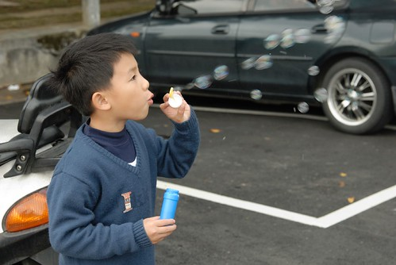
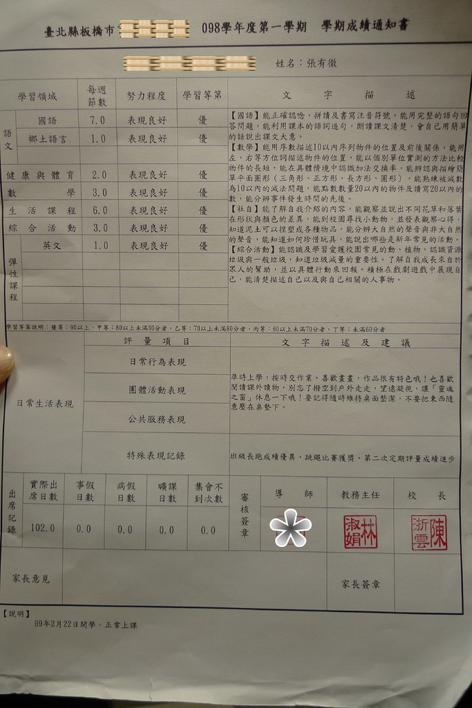
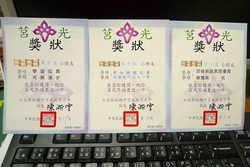
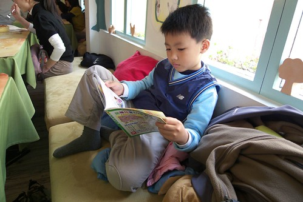
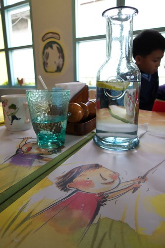

低級小學生阿徹總算過完他的第一學期了 雖然明顯可以感受出他感受到也正接受著不同於以往的小學磨練 但大體說來阿徹還算是個快樂的小學生 雖然常常在丟三落四  需要爸媽 妹妹 老師在後面嘮叨叮嚀 雖然常常大喊著功課好多 老師好凶 考試好多 雖然表現不算優秀但起合乎我們的預期與期望

結業式那天看到阿徹生平第一張成績單 我跟徹爸兩人忍不住都先哈哈大笑兩聲再說 老實說我跟徹爸都有點訝異全部的學習等第竟然都有優 (尤其國語) 雖然我們心裏明白這優是低標飛過90的優而非100的優 但還是打心裏覺得阿徹很棒 也大聲的跟阿徹說你很棒 

而老師寫的評語就如徹爸所說 雖然中規中矩該寫的都有寫 但我們想應該也算是有觀察 寫出阿徹的特點 優缺點吧

學期中的班級長跑 阿徹拿到了他小學的第一張獎狀 徹爸一直覺得阿徹的協調性 運動細胞不好的 想不到他的第一張獎狀就然就是運動類的 而更想不到的是第二張學期末發的獎狀竟然還是運動類的 我們私底下開玩笑說 阿徹在小學拿能的獎狀大概只有運動類了

話說拿到第二張的獎狀是班上跳繩的第一名 體育課考完跳繩那天阿徹鉅細靡遺的形容了當天他的奮鬥史 他說他原本只有跳6-70下 有通過50下的標準不用重跳的 可是阿徹自己去跟老師說他覺得他可以跳更好 想要重跳 於是全班好像只有她及格了但還去重跳 他說他重跳時跳到70多下就想說再努力一點就可以80多下了 等到80多下了就又想說再撐一下就可以100下了 於是他總共跳了110下 成了她們班上跳的最多的 然後有了這張獎狀 聽他開心的講完奮鬥史 我們跟他說"很好 爸爸媽媽平常跟你講的大道理你真有聽進去了"

而第三張獎狀又更更出乎我們的意外了 竟然是學業進步獎 其實阿徹的學期末考試國數都為93分 雖然令我們滿意了 但老實說絶對不突出 我又忍不住跟徹爸笑說 可能第一次考試時沒人像阿徹這麼爛 (國89 數93) 所以進步獎給了他 或許阿徹在小學能拿的學業類獎狀只有進步獎吧 呵呵 (我明白不是阿徹笨 是我們跟他都懶 所以....)

真的覺得阿徹一如我們的期望表現的中規中矩 但很欣慰阿徹在小學裏隨著學校 / 老師的安排逐漸拓展他的事也 嘗試新的事務/學習 我們忍不住的多期待如果可以一直這麼下去(當然還是要有進步 要改掉不好的部分) 如果可以這麼的一直下去...我們相信阿徹一定是個很棒的男生....

就算課業表現不棒 但起碼是個懂得享受學習/成長的快樂小子....we hope so.......................................

