前幾天跟阿徹複習完國語生字本上語詞與成語之後 我們家的徹爸總算很有感而發的跟我說"這些成語會不會太難阿" 之前我常私下跟他抱怨 一堆成語阿徹根本無法領會也不會應用 為了考試而記真是辛苦 這回徹爸應該真明白我這媽媽不是隨便亂唉這年頭的揠苗助長阿 雖然我也真明白我家阿徹的學校學習表現是真的不夠用心 沒達標準啦....

話說阿徹上三年級後 除了有寫字課(書法課)還有個作文課 因為作文都是得在學校裡完成 我看沒過三眼 不過我心裡很是納悶與佩服小小三年級可以寫出什麼樣的作文與面對這樣的作文訓練 畢竟寫作文不像日記或週記那樣隨興 想寫什麼就寫 不用太顧忌結構與優美問題 前陣子阿徹帶了作文本回家簽名與寫作業 我難得的看到了阿徹的"大作" 也難得的下海教阿徹寫了篇讀書心得 教完我忍不住呼了好大一口氣 雖然我常跟阿徹說"就把你的想法像說話那樣寫出來就好啦" 但我明白這中間的大gap 因為我自己念書時也是好怕寫作文 每次都抓破頭還是寫的又短又爛 雖說這事可以訓練 而這也是表達的學習之一   但我還是要說"寫作文"真的好難...

學校的作文本 很不小的一大本 非常的煞有其事 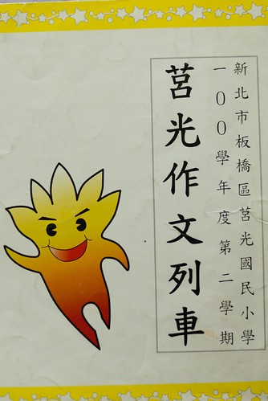 本子的第一頁是校長寫的序 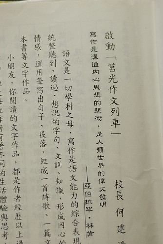 看到校長寫的這些序 我莫名的想拍下來  OS著"小朋友要好好學習寫作喔" 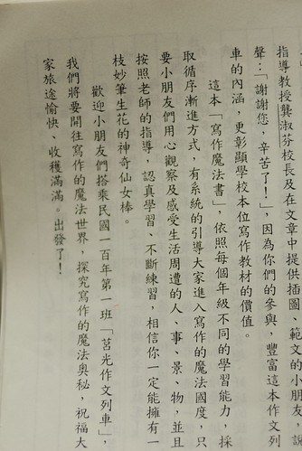 整個本子列了5-6個作文主題 每個主題下包含幾篇的佳作賞析與寫作理論 主題: 四季 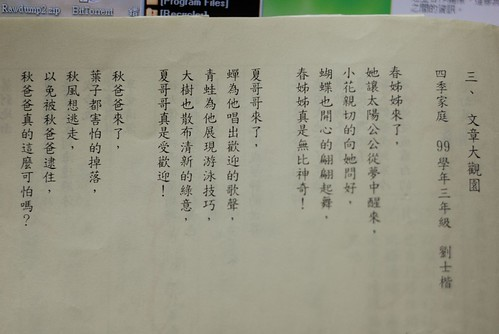 而阿徹的模擬如下: 四季魔術師

春妹妹來了 他幫大地換上了美麗的衣服 他幫太陽的家畫上了漂亮的藍色 他把小動物叫了起來 春妹妹真是厲害!

夏哥哥來了 蟬一直叫好像想把夏哥哥趕走 青蛙一直在水裡游來游去好像覺的太熱了 花也渴到不開花了 也好像覺得太熱了 夏哥哥有很熱嗎?

秋媽媽來了 她幫大地畫上了紅色 橘色 黃色 她把葉子叫下來說故事給葉子聽 她和風在玩抓鬼遊戲 秋媽媽真是好玩!

冬爸爸來了 他把大地畫上冷冰冰的白色 他叫小動物上床睡覺 他把梅花叫了起來 冬爸爸真溫柔!

我喜歡阿徹筆下的四季 尤其是春妹妹幫太陽的家畫上了漂亮的藍色 秋媽媽幫大地畫上紅橘黃色以及把葉子叫下來說故事給葉子聽... 看著看著 我突然想起武陵的秋楓  真高興阿徹有把旅行中看到的大地變化寫進詩裡

主題: XXX自述 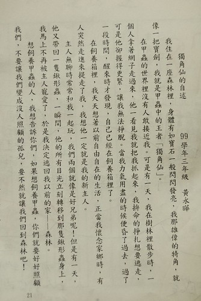 寫作前 老師帶領的結構分析 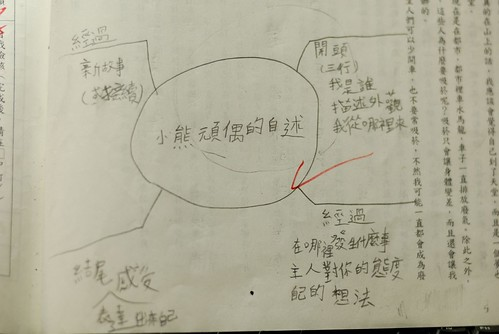 阿徹的小熊玩偶自述 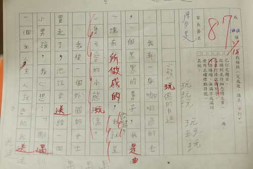 看到第二段 我便明白阿徹在說他最愛的小波的故事 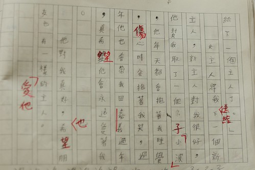 我很喜歡阿徹說的小波故事 很平實 溫馨 不過或許因為我跟小波很熟悉 所以我才這樣被感動 只是對於一篇作文來講 在老師眼中應該絕對不突出 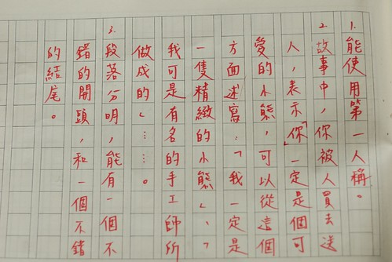

主題: 讀書報告 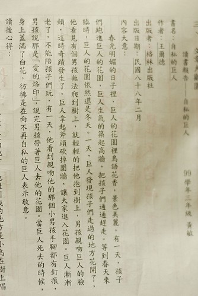 內容大意是在學校寫的 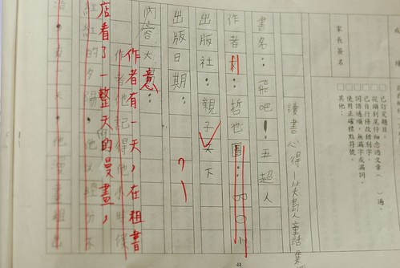 阿徹寫的漏漏長但沒重點 老師劃掉大半篇 評語也給的很忠肯 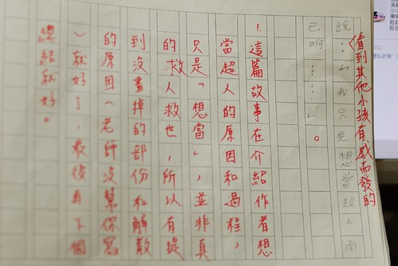 而心得則被當作週末作業帶回家寫 阿徹哀嚎  因為這是學校裡的書 不是自己喜歡的書 所以不知道要寫什麼(明明也是自己帶到班級書箱分享的書阿) 我如三年級剛開始寫週記時那樣"激發"他 Q1: 感想  A:有夢想要勇於實現 Q2: 覺得夢想都能實現嗎  A:(下面編號2) Q3: 那你的夢想是? A:忍者 Q4: 為什麼 A: 很帥 可以用分身去上課而本尊在玩電腦 寫輪眼可以把老師用昏倒然後偷用老師電腦 我聽得心裡一整個Orz 心裡念著"果然是張阿徹" Q5: 像這樣的夢想能實現嗎 A:當然不會 可是我們小孩子這樣想就會很開心ㄇㄟ.. 我說好啦 你把這些組織 拓充一下就是一篇心得啦 阿徹緊張的問"老師說要寫一頁以上揶 這樣會有一頁嗎"  我說寫了後再說吧.. (阿母已經太好心的把我們的對話邊說邊寫下來了) 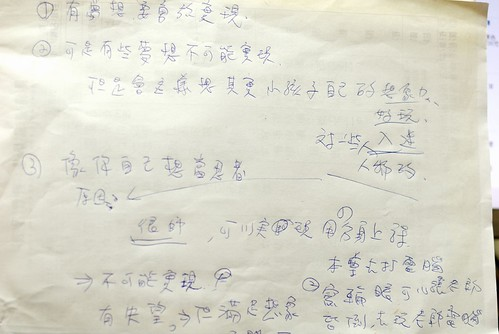 這是阿徹寫好的心得  當中錯字還是一如既往的多... 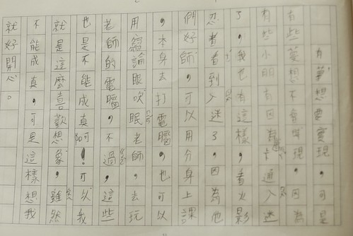

就如這樣花半小時跟阿徹"分享"讀書心得可以的內容與延伸 這半年來我幾乎事必躬親的看阿徹的每樣作業 越看我對於阿徹的學校學習表現/分數是越來越淡定了 一來是因為益加明瞭阿徹的長短處與優缺點 再者是清楚阿徹過程中的付出 那對於回報的結果也就不那麼患得患失了 我明白阿徹真不是傑出的學生也不夠認真仔細  但我肯定他是個單純的 只是愛玩愛幻想的好小孩 如果不是花這樣的時間與心力 我想我也不會益加發現/體會阿徹的好與不好... 雖然這是個大人喊累 小孩說苦的年代 照我們家現在這樣的學習模式也不知道以後會怎麼樣 結果是什麼 但我想相信這樣下去一定能走出一條路... 只是我也常想這樣的大環境對於弱勢家庭來講真是越來越可悲阿 我們是有能力的 幸運的 可以這樣幫助孩子茁壯 但那些沒有能力的家庭怎麼辦 教改 多元學習... 都不該是越來越沉重但卻以理所當然之道而大行其道 當這些立意良善的好卻不能跳脫舊有的模式而執行時 到頭來到底是好還是壞... (家有小學生之後 果真感觸很多ㄚ)

PS  1. 話說那些寫出佳作可供人賞析的小朋友真的好厲害阿 2. 阿徹的老師真的都很用心在改每一篇的週記與日記 希望老師說的話阿徹有明白也聽進了

0626: 補充上一篇阿徹前陣子所作的簡報 難得的佳作而且讓阿徹因此得到了一張獎狀... 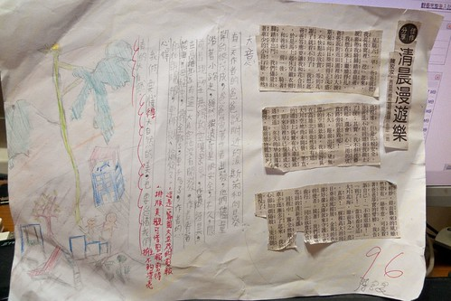
