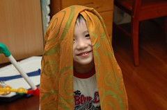

好久沒有說說咱家的阿徹了

常常在母子倆拖著疲憊的身軀爬上一階一階的樓梯時有著如此對話  
徹(望著我笑) "我們家好高喔"  
媽(回以溫柔微笑)"是阿 "  
徹 "我們家為什麼沒有電梯阿"  
媽 "因為爸爸媽媽買不起有電梯的房子"  
徹 "為什麼阿"  
媽 "因為有電梯的房子要好多好多錢"  
（情況一）  
徹 "我長大賺錢錢後　就可以買有電梯的房子了"  
媽 "真的阿　媽媽好感動喔"  
希望你長大後　娶了老婆後還記得在你３歲時給你媽的承諾  
（情況二）  
徹 "獨角仙有最多最多的錢錢ㄚ"  
媽 "獨角仙的錢錢不能買房子啦"  
徹 "可以啦"  
媽 "那你問問看獨角仙願不願幫我們買有電梯的房子"  
徹 "好ㄚ"  
媽 "可是爸爸媽媽好喜歡我們新家耶　阿徹不喜歡嗎　買有電梯的房子就要搬家了　就不能住新家了"  
徹 "我也喜歡新家阿"  
媽 "那你還想要去住有電梯的房子嗎"  
阿徹衝著我傻笑。。。

最近阿徹又被我發現會咬指甲　咬的比指甲剪剪的還工整  
自從３月底因為輪狀病毒住院後　就訂下處罰嚴格制止阿徹咬指甲  
這幾天又突然咬的有點兇了  
第一次發現　我非常生氣　  
（每次發現阿徹咬指甲我都會很生氣　很難得有件事會讓我這麼堅持要生氣）  
我問阿徹”為什麼又要吃手手　告訴我原因”  
阿徹想了想回答我”因為我受不了”  
對於他的答案我呆了幾秒 竟然會用”受不了”這詞了

第三天他又因為咬指甲被我修理  
晚上睡覺時我戳著他撒嬌的跟他說”你可不可以不要讓我生氣難過阿”  
阿徹用那甜到不行的微笑跟我說”你可不可以不要讓我哭哭阿”  
哇勒~小子 算你厲害　就這樣又撫平你媽媽受傷的心靈了  

