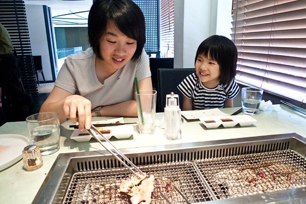
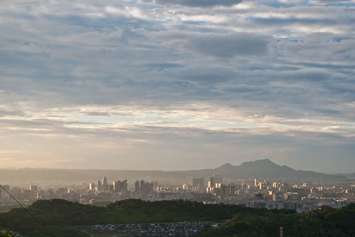
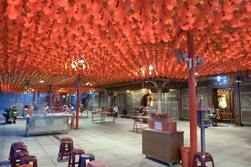

經由這兩年對於單車大小研究的徹爸嘴中 我有所聞烘爐地是練山路的好地方 這回趁著八月底週末的下午茶大餐後 我們突發奇想的去烘爐地"探勘" 那的上山路果然有得練阿! 而山上的view也真是棒 盡覽整個大台北! 

進入烘爐地主題前 得先提提那天讓我們出門的那個下午茶大餐: 前兩年因為徹爸公司發的餐卷 我們兩人偷偷去原燒約會了兩次 兩人對於那原汁原味的肉以及整體不錯的用餐氣氛還蠻喜歡 也一直想 有機會的話要帶阿徹來 阿徹一定也會很喜歡的 於是當徹爸同事拋售餐卷時 徹爸就撿便宜的買下了 只是這餐卷一放又是大半年過去 因為每每心情對的週末前要訂位時都訂不到位置 於是當8月底的週三跟徹爸MSN講到此事時 我二話不說的上網查電話然後打去訂位 只是唯一能訂到的時段是下午兩點... 好像去野餐烤肉的時間喔! 向來很重視吃飯時間的我 這回可真是橫了心 非得在週末吃到不可 於是那天中午我們在家打了香蕉蘋果牛奶當中餐 然後下午抱著像是郊遊烤肉的心情去吃餐!  到達店裡又等候了好一會 再加上點菜 上菜的時間 等菜開始上桌已經是2點半 一家子飢腸轆轆... 不過看到露續上桌的菜 阿徹果然如我們預期般的都很是喜歡  而且就連愛愛也很是滿意今日的下午餐 向來不太愛吃肉的她直嚷著好好吃 然後肉片一片接一片 我說這小女子果然識貨阿 知道這裡的肉好! (可見平常不愛吃肉 不是媽媽的本下的不夠就是廚藝還有待精進) 我們邊烤 邊吃 邊聊天 手沒停過 嘴沒停過 胃也沒停過...不知不覺地吃了兩個鐘頭 這對我們家來講是很難得的 花兩小時吃一頓餐 而且更難得的是能在外面餐廳 如此安靜 悠閒的好好享受一頓餐 (老實講 我們家對外面餐廳的觀感不太好 不是人太多太吵就是口味太重吃不慣)  我跟阿徹說 開學前請你吃頓大餐 希望你升上小三後一切多努力! (飯果然不能白吃)  等著最後甜點飲料上桌時 徹愛一人填寫一張問卷 跟愛愛解釋了 每個問題的左到右空隔 分別是從很喜歡 一點喜歡..到不喜歡後 小妮子便懂得反映自己喜好的勾選不同空格 看她認真作答的模樣 真是可愛! 問卷填畢 兄妹倆拿著筆在自己的手指頭上畫畫 這是傳說中的男女抱抱...  手背上 雙心的自己的名字  雖然花了一整個下午等待&進行午餐 但這真是個感覺美好的一頓飯!  飯後 我說順道去哪走走吧! 去消耗消耗熱量 要不然晚餐時間又快到了哩 而且難得雨後天晴的傍晚時分 天空這麼的美 空氣這麼的清新 於是我說"來去烘爐地走走吧! " 時間跟路程都剛好很適合 上車後徹爸準備GPS定位 兩人有致一同且不假思索的用"圓通寺"去搜尋and定位 然後依著導航上山... 開始進入山路後 兩人還沿途哇哇叫著"哇 這坡好陡.. 這很硬哩..." 可是最後停車時 我有點納悶這段上山路怎麼好像有點短哩 不過上山後 很是訝異台北(尤其又在我家15分鐘車程內)竟然有這樣清靜又莊嚴的地方哩  圓通寺創建於民國十五年 由妙清尼師開山 略具日式風味的仿唐式廟宇建築 廟正門兩側有獅與象的雕塑 一猛一柔 我很喜歡那頭象 線條真的很柔很美 可是又讓人感覺很沉穩有安全感  雙手合十誠心一拜後(上網查才發現 原來這不是正殿) 我們隨意走隨意看 這角度看過去 還蠻有京都FU的說  這時後 徹爸總算提出他的納悶 網路上看到人家爬上烘爐地後看到的大土地公在哪裡? 這裡好像不是烘爐地? 對! 這裡真的跟我印象中 小時候去過的烘爐地很不一樣 我記得有長長階梯阿 虧我們一家子還這樣陶醉...  離去前 我看著手舞足蹈的愛愛說"你要不要跳個舞獻給菩薩看阿" 愛愛害羞了一下竟也說好阿 然後就真的在菩薩前跳了一首短短的舞 希望保佑她吃飯要乖乖 長胖胖! 菩薩不知道能不能接受 喜不喜歡這樣的貢禮?!  

開車離去前 徹爸問了附近的一個小男生烘爐地在哪裡 果然..小男孩的手指向另一個山頭.... 我們用"烘爐地"在GPS搜尋 還真有個地方叫烘爐地 而且拜的真的是土地公 於是趕緊下山 依著GPS指示 找土地公去 下了一個山頭 穿過不少街道 再上另一個山頭 上山時繞過一個接一個的髮夾彎 嗯! 果然是狠腳色的練車山路阿! 看的我徹底死心! 而最後看到大土地公時 徹爸說這下總沒錯了吧! 是滴 這裡就是烘爐地!! 看著土地公 我跟徹爸兩人笑著"原來圓通寺不是烘爐地阿!" 呵呵  才下車 就驚豔於視線所及的好view  離市區短短10分鐘的車程就能看到這樣的市景(夜景) 我有種相見很晚的遺憾  老實講 我們真搞不懂烘爐地到底指的是一個地名還是一座廟 也不清楚拜的是什麼 後來看了些說明才好像清楚些 烘爐地是指中和南勢角後方的山區 又名南勢角山 山中有很多寺廟 又以南山福德宮最為有名 不過從停車場旁的南宮仙公廟得踏上百個階梯才能到福德宮 有著好長的階梯 這就是我印象中的烘爐地阿 因為小時後跟爸媽去烘爐地 每次都要提著裝滿沙的沙桶走過長長階梯才能拜拜  雖然在大餐之後 走上百個階梯還真有點喘 不過走的越高 所見的view越是好阿!  中途看到一個行動不太方便的阿婆賣著玉蘭花 於是買了盆花讓小愛端去獻給土地公(剛獻舞 現在獻花)  到達福德宮 整建中的大環境有點出乎我意外的不是太整齊說... 聞著臭豆腐香 我們繞著寺廟走一圈  然後坐在寺廟後方的石椅子納涼  此刻完全沒想到要賞景 只是單純的吹著傍晚的風... 吹的好舒服...  後來要不是徹愛好奇地要去景觀台看看 我們大概就錯過這俯視大台北盆地的好景了  烘爐地上不但可以俯視台北盆地 大漢與新店二溪 還可遠眺觀音 大屯火山群及淡水出海口 是台北著名的看夜景聖地  雖然沒看過這的夜景 可是我想比起夜景我一定更是喜歡現在的傍晚景致 因為5-6點的傍晚時分 天空的顏色很多變且變的很快  而映在山上 城市裡的光影也每分地一直改變著  很精彩很美麗  好棒的傍晚阿! 我舒服到眼睛都瞇瞇了  這樣美好的時刻當然也要來張涯給夫妻二人自拍嚕! 嘿嘿!!  可惜就在一切都很詳和美好的時候 愛愛開始嚕著要投錢用望眼鏡 我當然是二話不說的說 NO! 徹爸還很好心的跟愛愛說"可以用爸爸的相機當望遠鏡用阿" 可是愛愛還是開始臭臉..  後來看到我們都不理她 索性矇起臉鬧性子  不過我們還是專心的 開心的賞我們的景 (徹愛都知道我家的名言"哭哭鬧鬧是沒用的" 所以小人筋斷掉還是得靠自己修補)  天越來越暗 遠方的天空又更是美麗了阿  清晨與傍晚時分的光影有如神奇的畫筆 總能替筆下的畫布增色許多  幸好美景消逝前 愛愛的筋也修補好了  跟著我們一起數101大樓有幾顆閃爍的燈  城市裡點亮了幾個大招牌..  徹爸說"看著招牌跟路燈一個個點亮一定很有趣 很美麗" 我可以想見這浪漫... 不過風好大阿 我怕這麼吹到全台北的路燈招牌點亮 我的頭也裂了 所以還是趁著美景當前下山吧! 下回做好帽子與點心的準備 再來這野餐 數著一顆顆的燈點亮...   當我們下到停車場的仙公廟 一盞盞的紅燈籠也都點亮了 我想烘爐地最熱鬧的時刻才要開始吧! 因為夜景應該真的很美... 
