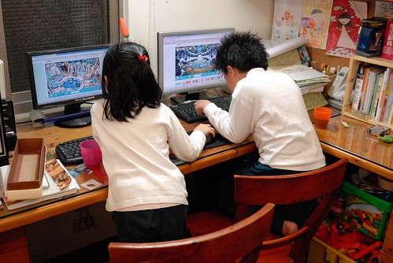
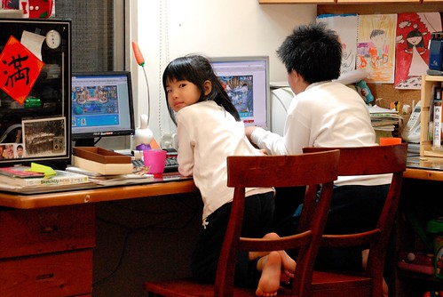
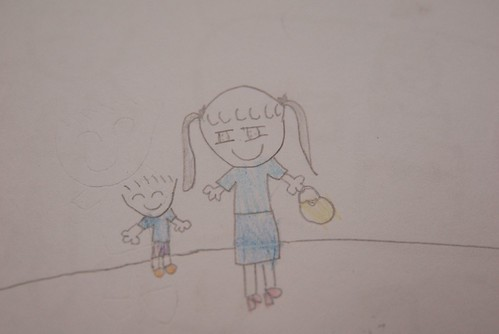
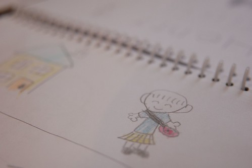
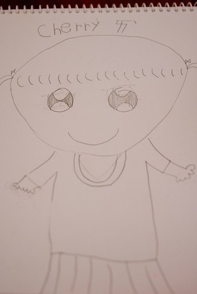
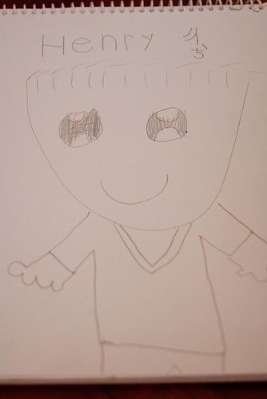
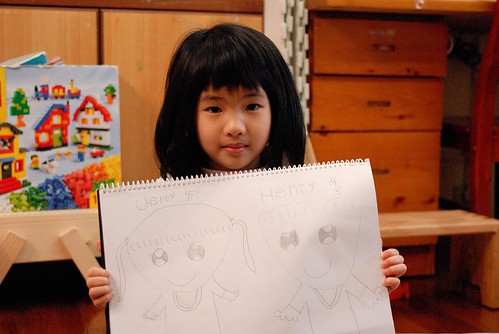

之一: 昨天接愛愛放學時遇到愛的導師 她有點難啟齒似的跟我說"今天愛愛被我罵" 我說"愛愛真的沒你們說的那麼好 不對的 該罵的 (請罵)沒關係... " 老師就說"有些小孩要用打的 有些用罵的 (指著愛愛)他用唸的就可以" 回家後我跟徹爸說起這件事 徹爸說"對阿 我們家另外一個就是要用打的" 這是阿徹跟愛愛兩人的大不像! 之二: 最近阿徹的國語 因為作業/考卷上太多的生字不會寫而被我盯得緊 昨晚哭過兩輪迴後去洗澡時 聽到我跟愛愛講起暑假去阿嬤家住的事 阿徹紅著眼眶跟愛愛說說"不行啦! 這樣我難過時後 就沒有人可以說話了"  再補了句"尤其不想跟爸爸媽媽說話時" 我心裡忍不住噗哧笑著 同時心也軟了! 覺得這對兄妹倆似乎不只是兄妹 也好像有著我跟徹爸之間的學伴 朋友與情人關係~~

之三: 因為哥哥的關係 愛愛的確比同年齡的小孩知道很多事也提早享受不少福利 就如阿徹這一年多來開始可以週末時後上個小網 玩個小線上遊戲 愛愛也跟著一起玩摩爾莊園裡的小遊戲 甚至前陣子還幫他申請了個帳號 於是家裡開始出現兄妹倆一起窩在電腦前的畫面  只是還看不懂國字的愛愛 得常問哥哥"這是什麼" "然後ㄋ..." 偏偏哥哥玩起電腦後就會像看火影忍者漫畫那樣完全進入自己的世界中 讓得不到回應又什麼都不會的愛愛常哭著投訴"哥哥都不理我"  媽媽只好下通牒給哥哥 不過幸好愛愛是個很容易"膩"的人  這一陣子她很少跟著哥哥一起玩電腦了 她說"電腦遊戲其實也沒有什麼好玩的"  (愛愛的善變真的不知道該說是優點還是缺點)  之四: 愛愛最近的畫風令人感覺大改變了 看著人臉上閃亮亮的大眼 我說"你什麼時後開始也畫這種眼睛了 好像哥哥畫的樣子" 愛愛笑著說 "我覺得這樣很漂亮 我學哥哥畫的" 亮晶晶眼睛還是咪咪眼 都是孩子在成長的證明 不過不管哪樣的眼睛  那有著大大微笑的臉都會讓我們看得嘴角也跟著一起上揚了起來  有一天 愛愛畫了一個有著亮晶晶大眼的女生 她說這是Cherry  也畫了一個同樣有著亮晶晶大眼的男生 我問"這是阿綠嗎" 愛說"不是 這是Henry" 也就是她的徹哥哥 (愛愛的ㄜ 左右顛倒了)  愛愛問"哪一個比較漂亮" 我說"都很漂亮阿" 愛愛說"只能選一個" 我只好說"cherry是漂亮 henry是帥" 愛愛說"我是問哪一個漂亮?" 我說"cherry阿 因為henry是男生是帥" 愛愛又說"那那一個可愛" ㄟ....兩個都很可愛 跟人一樣可愛 在我們心中 沒有阿徹就不會有這樣的愛愛 而沒有愛愛的阿徹也肯定不會是現在的這樣 所以別再問下去啦~~~ 不過我真的喜歡這樣崇拜哥哥的愛愛妹妹!  雖然這個妹妹很常吐她哥哥槽 很會告她哥哥狀....
