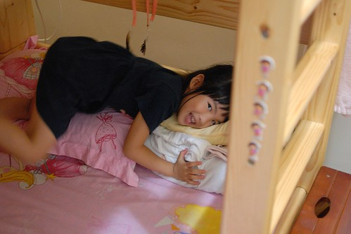

從三年半前(96年5月)買了徹愛兄妹倆的床鋪後 經歷幾種不同階段的使用方式 阿徹跟愛愛總算各自擁有完完全全數於自己的小天地了  

床是在愛愛一歲半 阿徹哥哥4歲多些的時候買的 那之前愛愛睡在我們房間內的嬰兒床內 而阿徹睡在我們雙人床跟牆壁間的小空隙中 那時後聽從了前輩的建議 先把兒童房的床準備好 先讓小孩子當游戲間適應  

而適應個一兩個月後便正式把小人"送進洞房去" 不過愛愛還是依然睡在自己的小嬰兒床裡 而阿徹哥哥睡下鋪  上鋪依然是遊戲的秘密基地 

剛開始時每晚總因為阿徹或愛愛的唉唉叫 得過去安撫個好幾次 有時候失眠或是小人生病唉的太過頻繁 就也乾脆跟阿徹一起睡在下鋪裡 雖然那時候真是有點辛苦啦 尤其大半都是淺眠的媽媽被吵醒 但真高興我們堅持了下去 因為這樣我們從此以後可以九點過後把小孩"準備"完畢 "溫柔"的說聲晚安後 便能"帥氣"的走出房門開始屬於我們自己的夜間生活 

愛愛的嬰兒床一直睡到她快三歲的時候 那時後還乾脆把輔助上上鋪的那張椅子放在他的嬰兒床爬以便他進出 直到發現愛愛的身長已經快觸及床底 而翻轉的空間也越來越小時 嬰兒床正式告別我們家 而愛愛也開始跟著她哥哥在下鋪過著兩人同床異夢的生活 同床而睡的她們常在入寢時聊的不可收拾(兄妹倆真的是像大人 朋友般在聊天) 有時甚至握著對方的手 抱著對方入睡  親密的模樣讓人好羨慕... 

只是兩人兩年間又長大了許多 哥哥胖了10公斤  妹妹長高了10公分 一張單人床的尺寸對他們來講越來越擁擠 常可在入睡時聽著她們抱怨彼此睡得"太舒服"擠到對方了 只是因為阿徹哥哥一直還太膽小 太依賴妹妹入睡 所以兩人只能像怨偶般的繼續同床異夢著 總算升上小二後的阿徹哥哥膽子變大了 勇氣變大了  於是兄妹倆總算"分床"嚕

在上鋪睡了一個月的阿徹對於她自己的小天地 越來越滿意了 這真是他的地盤 他最大了 只是阿徹偶而看了恐怖的書不敢自己一個人睡時 便得千拜託萬拜託的求他妹妹施捨他一個同睡的小地方 

而愛愛妹妹也越來越習慣自己一個人的小鋪了 只是只有她一個人床有時候看起來還真有點空蕩蕩 

我們跟阿徹愛愛說 這床以後就跟著你們到結婚了 甚至以後你們的小孩到阿公阿嬤家玩還有機會睡這床ㄋ 所以請好好保護愛護自己的床 別留下歷史的痕跡讓以後的男/女朋友跟小孩見笑了...呵呵

每每望著熟睡的她們 我跟徹爸總忍不住讚賞 睡覺的小天使真是可愛的!!! 
