早晚涼意越來越明顯 難耐的台北盛夏總算告了個段落! 今年的夏天是兄妹倆第一次的小學生共同暑假 兩人有點忙有些累 但也有好多的快樂與收穫~

兩個小學生的暑假 相較以前只有哥哥一個人 媽媽好計劃打理許多 總共8週半的的暑假 行程分別是: 第一週的中正運動中心歡樂育樂營 第二週的在家晃蕩3天與安親班的兩天一夜小旅行 第三到八週的YMCA活力營 以及最後一週幾天的跟著媽媽上下班 老實講.. 這樣的暑假 媽媽是最累的那個人 因為要配合她們時間的朝九晚五 尤其少了星期三下午的小悠閒 但不若以往的安親班安排 兄妹倆這個暑假多了許多學習新鮮事以及足夠的運動 媽媽真的只能說"再累都是值得的..." 這是真的!!!

這一篇純粹是用照片留下兄妹倆這個夏天的回憶 在中正運動中心上課時 每天從中心離開後母子三人都慢慢的散步到捷運中正紀念堂站  一整天運動過後的兄妹倆 肚子總是很餓很餓 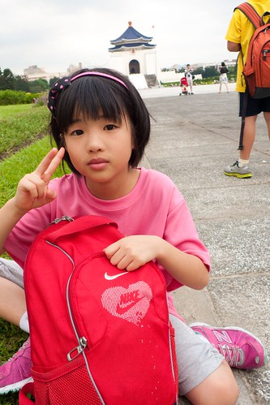 一瓶鮮奶 一個小麵包 兩人邊走邊吃 吃的津津有味  這是哥哥第三年 第三次參加中正運動中心的營隊 讓他一直想參加的動機是 他說他要收集所有12生肖的紀念衫 哈! 真的很天真 浪漫的小男生 不過運動是好事 所以為娘很是鼓勵與支持 其實不過一週的時間 課程的總類又很多 每樣運動都不專精 純粹就是讓小朋友認識與體驗每樣運動的基本與樂趣 飛盤躲避球 樂樂棒球 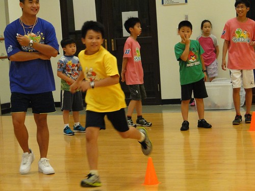 小網球 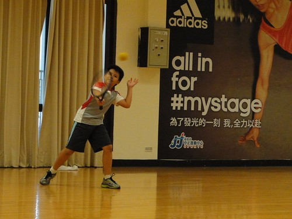 射擊  射箭  MV舞 (這應該只是暖身操) 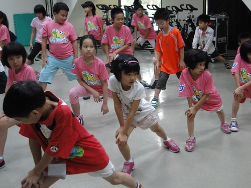 籃球  撞球 (有一天電視轉到撞球比賽 兄妹兩人竟然談論起 幾號球怎麼.. 嚇了徹爸好大跳) 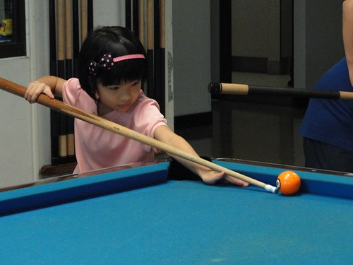 還有超多人的疊杯競技  暑假一開始 兄妹倆就好熱血阿! 

YMCA六週的營隊 每周三是固定的戶外教學日 去了滑冰世界冰刀初體驗 還有baby boss, 八仙水上樂園, 小人國, 8D電影公園, 醬油博物館  當中的八仙水上樂園 讓第一次去大型水上樂園的兄妹倆High番  兩人還曬了一身黑回家 身上各自多了一套脫不下來的內衣 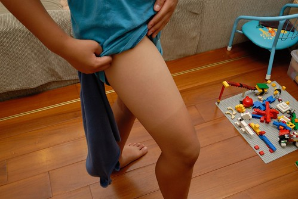 除了週三外的每天營隊內容包含三個自選的才藝/運動課程 游泳是媽媽堅持每天要有的項目 所以兄妹倆上了六週共24次的游泳課 只是六週下來 阿徹還是一直在調他的自由勢姿勢 但偷偷的練蛙式 而愛愛則學習跟水當朋友 努力的踢水 練壯腿 其餘 倆人一起上了二週的黏土課 剛好是以前幼稚園才藝老師上的黏土課 讓很久沒玩黏土的兩人玩的很開心 這是愛愛的笑笑羊 從左到右分別是她自己 哥哥 爸爸 與媽媽小人(爸爸好開心他總算入鏡了)  阿徹的彎彎小羊與跳傘人 讓人感覺很舒服的一個作品  而最經典的是 這個小盒子製作 櫻花池畔泡著溫泉的鳴人 爽然的模樣活脫就是阿徹他自己 真的意境很棒的一個作品~ 這張照片是我跟徹爸現在手機的桌面 每次看到就不禁莞爾  而營隊活動寄回家的父親節名信片 更是讓我對阿徹的巧手與腦袋瓜 拍手叫好 我好喜歡他筆下穿著紅色內褲的超人爸爸阿 而且原來讓小孩子有得吃 有得住 有得喝 有得玩 小人就會好開心~ 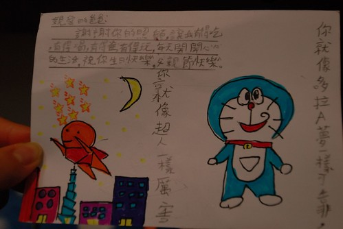

兩人還一起上了桌球課 這個最令我意外了 原以為他們會覺得無趣加上每天還要游泳而嫌累 但兩人竟興致盎然的上了兩階段共四週的課 而且"打王"打的回味無窮 即便家裡沒有桌球桌 兩人就也這麼打起來 讓小人喜歡運動 享受運動的樂趣 是這個暑假最大的收穫  除此之外 愛愛還上了烏克麗麗與巧手課 而哥哥則是MV舞及魔術與科學課 (徹主動說要上MV舞也是另一個跌破我們眼鏡的選擇)  我們都跟徹愛說 參加這樣營隊的最大初衷是想讓他們到不同環境認識新朋友 學習交朋友 跟平日生活不同人事物的接觸 肯定給他們帶來衝擊與學習  去YMCA參加營隊的另一個收穫是 兄妹倆越來越獨立了 除了第一天接送外 其他天都是我們一起搭捷運到站後 他們自己出站走7-8分鐘路到上課的地方 抵達時再打電話跟我報平安 然後每天傍晚接到我電話 收拾東西走到捷運站與我會合一起回家 靠著手機的連絡 讓彼此有信心與安心做這樣的突破(對我們家來講真的是很大的突破) 搞笑的是有一天11點多我接到阿徹打來的電話 很意外的我問"怎麼了?" 結果徹說"媽媽 早上我忘了打電話給你了" 我也才大悟說"對喔! 我也忘了你沒打電話給我.." 我一旁的同事聽得大笑搖頭............. 不過阿徹真的是很盡責的哥哥 努力保護妹妹的安全還有讓爸媽安心 (哥哥幫妹妹做的女忍者手裏劍) 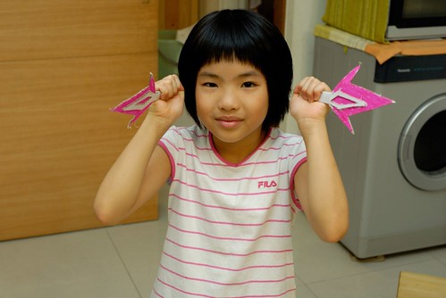

結束白天豐富的營隊活動後 回到家後才是兄妹倆愜意的暑假時光 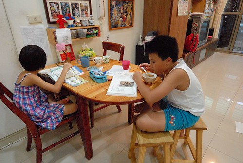 看看有的沒的書  或是高興的話做點正經事(阿徹完全沒有學校暑假作業 可是愛愛有幾樣作業得完成)  然後每天有層出不窮的鬼點子 用不完的活力 努力的玩 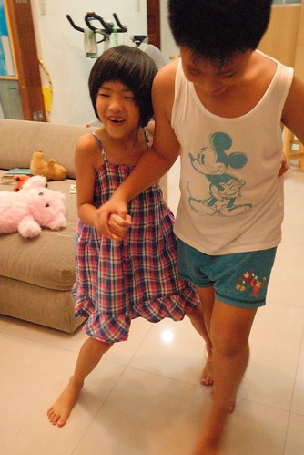 兩人三腳綁一起 好開心  撲克牌 每天都要來上好幾盤  看著哥哥與爸爸媽媽玩了二週的大老二後  有一天愛愛說"我也要玩 我要跟媽媽一家" 再過了幾天 愛愛說"我可以自己玩一家嗎" 不可思議的 愛愛還真的會玩大老二了  雖然只會認pair跟鐵枝 但後來經爸爸指點迷津後 現在胡阿 順阿 出的很順手 跟他們對戰 我跟徹爸完全不能心軟  要不然一個閃失就會敗給兄妹倆...  兄妹倆一起參加一樣的營隊 每天兩人都有好多話題可以聊 因為這樣 兄妹倆的感情變的更好 共同體的連結也更是緊密 而哥哥也得以每天開心的賴在妹妹床邊 兩人一起睡覺 

因為兄妹倆的暑假安排太豐富也太花錢 這個夏天幾乎沒有旅行的安排 連出門都有些意興闌珊 一家子只想在家空... 除了 跟陳嬤家的眾親友去坪林烤肉戲水 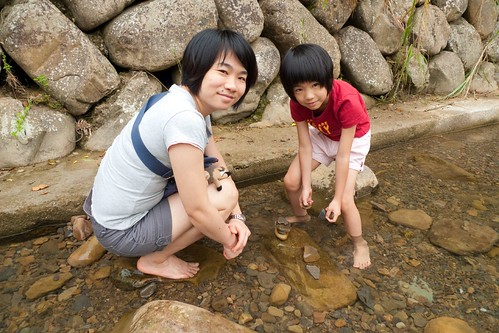 回了兩三次嘉義阿嬤家 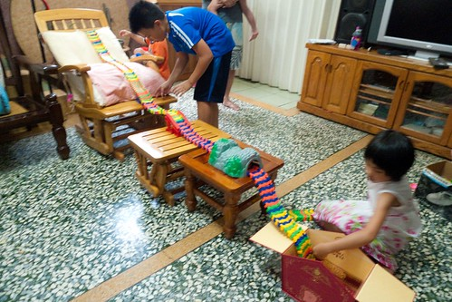 看了場舞台劇 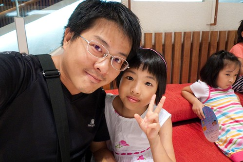 去了火影忍者展  還有台灣歷史博物館 裡頭的琥珀展 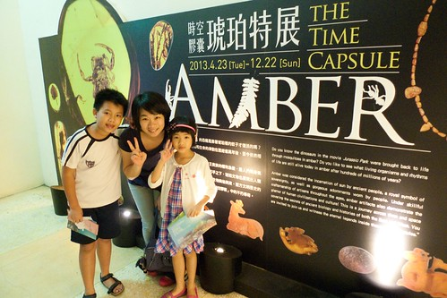 與東沙島特展很令我們驚奇  那個下午 我們從西門町走到228公園 再從公園走回到萬華去吃冰  阿徹聽說YMCA附近有家很好吃的冰喔  於是他憑著印象帶我們走到那家冰店  很像芋冰的冰淇淋真的很好吃喔~  暑假的最後個週末 我們也在嘉義多住了一晚 好隔天北上時順道下台中吃喝玩樂  徹爸慕名而來的眼科冰淇淋 人好多阿............. 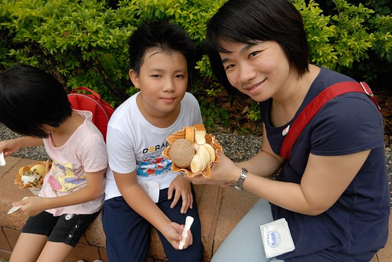 而且得坐在大排水溝排人行道上吃 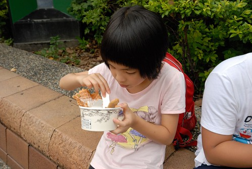 但兄妹倆吃的津津有味  去了原本要是今日重頭戲的科博館 買了太空劇場的票 趁著時間前到科學教育館玩一玩 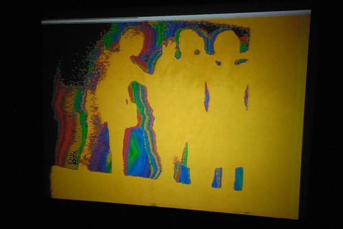 這是小學生變成小學生後第一次來科博館 長腦袋後 果然對科博館裡的東西會開始感到好奇  製造龍捲風  轉輪  管音樂打擊 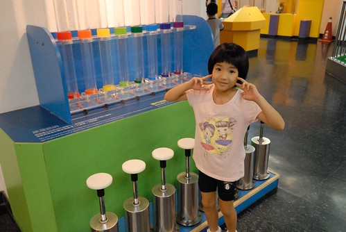 好大 好大的泡泡 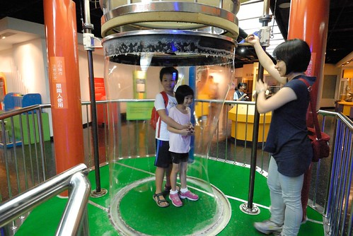 兄妹倆吹泡泡的技術比媽媽高明許多(媽媽失敗了好些次) 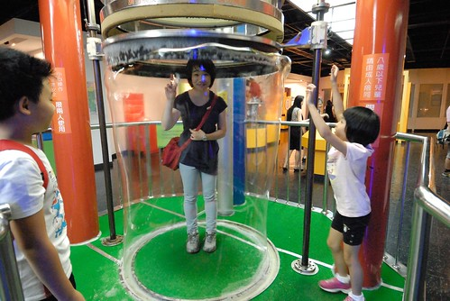 空間錯亂 砰砰! 

這個暑假裏 阿徹有了生平第一隻機器人 因為爸爸說"男生是該擁有一隻機器人"  於是全力支持阿徹實現擁有LBX的小願望  與機器人奮戰的男生果然好認真 好努力  可以專注一兩個小時不說話  好唄~ 男生是該玩點機器人的... 同時 因為我們的總算慢慢放手 阿徹也真的越來越man了喔 
