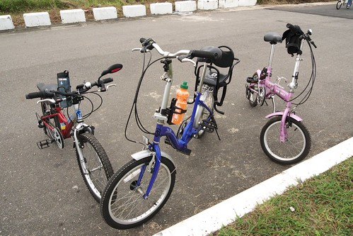
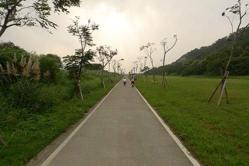
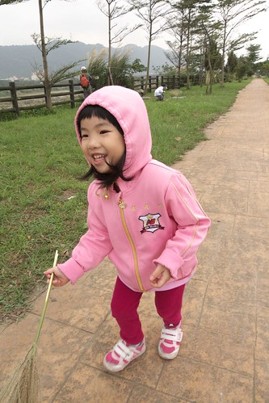
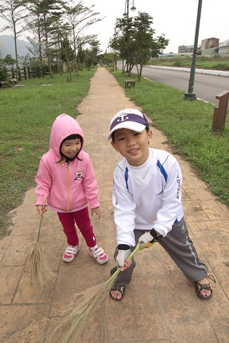
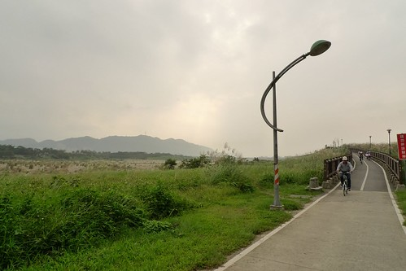
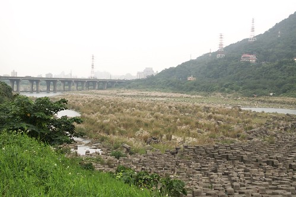
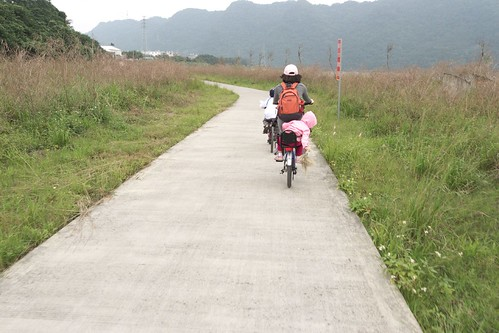
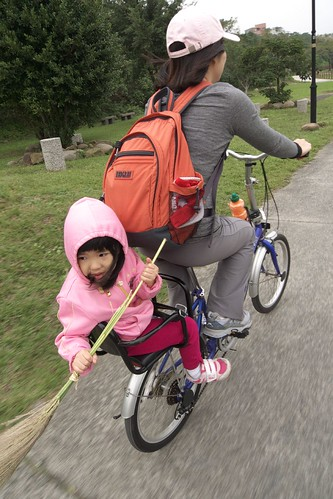
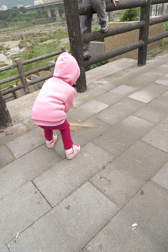
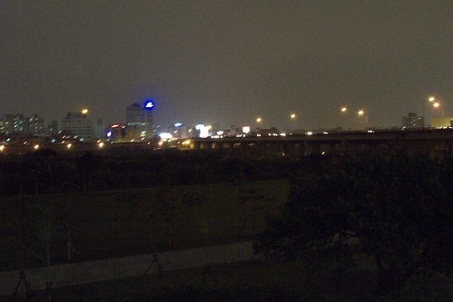

10月時 我們家多才多藝的徹爸動手幫阿徹的腳踏車大改裝了一下 裝了變速器 換了後輪 腳踏板 徹爸好不得意自己跨出改裝車的第一步 可惜礙於天氣以及包租公週末的忙碌 因此阿徹一直遲遲未能去試他的"變速"車 總算11月底的那個週末 父子倆約定騎去鶯歌試試車 而這陣子很黏徹哥哥的小愛竟也嚷著要跟 於是徹媽只好捨命陪愛女 第一次跟著徹父子倆來趟鶯歌單車之旅 已不是新手的阿徹 帶點驕傲但又像是分享的跟我說"媽媽 你總算跟我們一起騎車去鶯歌了" 而媽媽總算可以實地體驗好好感受之前阿徹父子口中的沿途一草一景一橋一幕了...

那早一家子6點半多便起床著裝準備出門 怎奈就在我們準備扛車下樓時老天爺竟下起雨來 於是只好取消計畫 我跟徹爸繼續窩回被窩裡睡覺(其實那週我們兩人工作忙到一整個累阿) 待補眠到10點起床後 該拖的地拖了 該洗的衣服也洗了後  也確定天氣似乎為頗穩定的陰天後 我們便在下午1點多一家四口從板橋出發往鶯歌邁進嚕~

阿徹不知道是因為經驗豐富了 還是因為變速器加持 或者因媽媽的同行 愛妹妹的陪伴 這一趟可是從頭High到尾 沒有絲毫的倦怠   尤其返程離家越近時 話越是說個不停 讓已經疲累不堪得靠意志力撐回家的媽媽不得不請他不要說話讓媽媽好好的踏著車子就好 回來後我的腿酸痛了兩天 甚至那天晚上睡覺時因酸痛輾轉難眠 被痛醒好幾次 隔天問阿徹 你有沒有腳酸或屁股痛 哪不舒服阿 小子竟一臉有點莫名其妙+沒有什麼的表情回我說"沒有阿~除了有一點累 所以睡的比較晚一點" ㄘㄟ~  果然是年輕人!!! 然後小子問了我為什麼會腿這麼痛 我說可能因為我爬坡時都用腳的力量而已小子竟然又很董似的跟我說"對阿 爬坡的時候要用上半身的力量幫助 你沒有嗎?!"  (徹爸說騎車不能只靠下半身) 是~  阿娘不知道 所以落得這般酸痛下場  阿娘會記住下回改進的 不過可見跟徹爸去騎過幾趟車的阿徹有把徹爸沿途教他的技巧放在心上喔! 很好~ 阿娘不才沒關係 小子有才就好....

接下來就看圖說故事 順道介紹沿途的風光嚕..

(徹爸的冬日騎車裝備) 

沿著大漢溪的板橋鶯歌段自行車道 真的就如徹爸說的算路況好也好騎極適合阿徹的車道 沿途從板橋過到新莊 然後經過樹林最後來到鶯歌 除了得扛車上新海橋過板橋到新莊 以及沿途幾個因為跨堤防或是穿越橋墩的上下坡外 其餘都是像這樣寬敞 平緩的車道

大半的時間是伴著大漢溪的沿途景色   偶而經過一些美麗的草坪公園

原本以為小愛這趟40K下來 不知道會睡幾番去 徹爸還特意帶了條帶子充當小愛的安全帶 所幸小愛只有在去程的 1/2路段左右小睡了10幾20分鐘 看著她的頭在後頭晃的像是隨時可能斷掉  徹爸鎖幸要小愛抱著他的腰靠在他的臀上

出發前小愛早就心裡又數自己會睡著 而且會睡的辛苦 可是她還是堅持要跟 講真的有點難以想像 小妮子心裡到底在想什麼 怎麼想的....

或許就像愛愛對於玩具的慾望不高 只要有阿徹哥哥能陪著玩就好 "超級跟屁蟲"的她就只是單純的想跟著阿徹哥哥吧

(最近照相不愛看鏡頭的愛 應是被哥哥C的笑了) 

很久沒有跟阿徹一起騎車了 怎麼覺得騎著車的他看起來長高長壯啦

抵達鶯歌陶瓷博物館後 我們接著繼續往桃園大溪方向前進 途中休息時媽媽折了幾隻芒草(愛徹家口中的掃把花)給阿徹小愛玩耍

幾隻掃把花就讓阿徹小愛精神為之一振  掃..掃..掃..

阿徹還搞笑擺出這仗勢  不想照相的愛躲在哥哥後頭躲的很好 (美賢阿姨你說愛愛最近照片很少 實在因為她最近不愛照 常躲鏡頭阿)

雖然是沿著大漢溪的車道 但沿途的景觀還蠻多樣化的

嘿嘿~胖胖徹爸徹媽來一張

板橋鶯歌段自行車道是徹爸研究很久後覺得最適合阿徹騎的 除了來回40-50KM(過鶯歌後可以往南往桃園方向繼續下去)很適合一個半天的騎乘 最主要還是沿途大都平緩且路況算很不錯的 除了幾個要越堤或是穿橋的上下波以及藉由新海橋從板橋過到新莊段得扛車上下橋外 所以徹爸對於這段車道可是很推推推的 適合有小孩的親子家庭路線

沿途還觀賞到不同的秋日風情

途中還經過鶯歌環保公園(確切名稱忘記了)的濃蔭綠地 粉舒服...

過鶯歌繼續往南還可經過XX壩  也可算是湖光山色

每次從嘉義開車回台北 經過2-3小時車程大伙開始念著"到家沒 要到家沒~" 只要看到這座山上的幾個紅白電纜高塔就會開始歡呼"要到Freda家了(三峽) 快要到家了..." 這回騎著自行車看到這幾座高塔 更是特感親切阿~ 哈哈~

本來阿徹今日的目標是50KM的 但礙於天色漸晚得避免摸黑騎回家 因此看到此自行車道終點告示牌時 徹爸剛好有了個藉口要阿徹回頭了 要不這小子還真打算等他碼表跑到25才要回頭的 所以今日的總騎乘數最後只有48.XX   沒破阿徹的紀錄

時間已經接近4點 從我們1點出發到現在已經過了三個小時 所以回程得更賣力的騎騎騎...

我們在前頭踏著努力  愛愛在後頭也掃地掃的認真賣力

因為掃地 愛愛回程的精神很不錯

還能給爸爸"啵"一個勒

媽媽腿軟得休息時 愛愛一樣繼續掃掃掃

跟媽媽一樣踏著車的阿徹 真的比媽媽勇猛很多 絲毫沒有倦態 每次都是媽媽在上坡之後喊著"不行了 得停會 喘口氣一下"

鶯歌樹林交接處最後的大休息時 把包包裡的餅乾果汁全拿出來補充體力了 大家的肚子似乎都挺餓的了 但是爸媽還是得忍飢讓大部分的餅乾都進了小人的嘴中 真後悔該多帶點糧食出門的

過了這大休息後 三台車真是全力衝刺的以時速15KM上下的趕回家 只是冬天太陽下的早 5點多些就天黑黑得摸黑騎車 其實大半的路段都還好 只是途中得經過個新莊垃圾場 吼~  之前徹爸曾經跟我談論過幾次騎車時如果遇到野狗追該怎麼辦的問題 竟然活生生的就發生在我身上 當我因為腳力快不支得憑著念力努力踏著車時 一不小心就這麼剛好的在接近垃圾場時領先了徹爸她們好一段距離 而當我發現5-6隻狗與我相反方向的前進時 退也不是只能硬著頭皮繼續前進 然後當中的一隻狗果然對我叫了起來 (在後頭的徹爸看到 這狗馬上就被另外一隻逼到一旁被痛扁) 可惜又有另外一隻狗追著我叫 那嘴甚至張大著隨時準備咬過去的樣子 我一個人看著那5-6隻黑狗 眼淚差點噴出來 真只差沒尿褲子 我沒法像徹爸之前上網看到大部分的網友說的 瞪著狗看或是下車扛車打/嚇狗 我想我只要稍微停下來  狗肯定就咬下去了 我腦海中都已浮現群狗瓜食我的影像 所以我只能讓我的腎上腺素催促的快點踏 快點踏 快點踏... 然後突然狗沒再追了 再吠了   我想我應該脫離險境了也才開始擔心徹爸她們父子三人怎麼樣 沒多久徹爸們跟上了問了我"還好嗎"  我還顫著音問他們"你們ㄋ" 徹爸說那當時他也沒法顧我 只能在哪吼   然後她們三人齊瞪著那群狗慢慢騎經過 我可以體會/體諒當下徹爸當下的處理 要我也是得先保護好阿徹小愛 只是阿...吼...這真的算是我有生以來所遭遇過離鬼門關最近的一次恐怖經驗

徹爸後來問我 以後還敢去騎車嗎 我說 敢 只是以後一定要騎早上的  可別再這麼摸黑騎車了(尤其冬日人少) 我想我這次騎完後腳之所以會酸痛的這麼誇張除了上坡逞強(因為跟阿徹在比不落地上坡)+用力不當外 應該也跟被狗追這事件大大有關....

6點我們總算接近大漢橋 即將回到板橋我們的家 看到橋上車水馬龍的樣子 阿徹喊著"好美 好美"  然後要徹爸拍下這一幕 可惜徹爸的小DC照不出

回到家6點半多 然後我們好好犒賞自己的去吃了涮涮鍋

今日鶯歌單車行成功! 媽媽以後也可以驕傲的說我也騎過鶯歌了 (雖然被狗追了...) 而對變速車滿意的不得了的阿徹又開始大言不慚的念著 下回騎去木柵動物園 ㄣ... ㄟ... ㄚ...就讓你們父子先去探探路再說吧!!!
