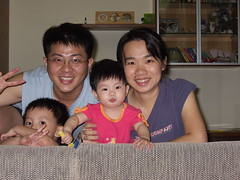
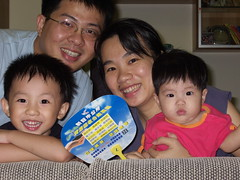
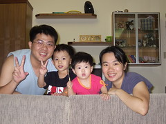
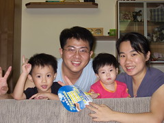
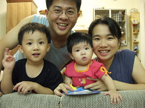
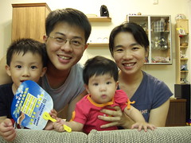

常常爸爸拿著他的小D拍照時  
阿徹便也會拿出他的相機canon S30 追隨爸爸後頭猛拍  
昨晚阿徹有樣學樣的拍完妹妹後  
突然喊著要拍全家福  
喔~當然好ㄚ  
不過他堅持要用他的相機拍  
太久沒碰小相機 徹爸搞了好一會才設定好自拍模式  
由於今晚是阿徹提出拍全家福的  
配合度超讚 自信100 笑容100  
只是難為了正在發水痘的小愛配合演出  
拍到第三張妹妹就開始"噗...噗"個不停  
本想作罷 (因為實在很想用D70拍 但阿徹就是不准)  
但阿徹又說"要拍four"  
呦赫~很難得這麼想拍全家福喔  
那就玩個過癮吧...

(小愛"噗"到最高點   氣質蕩然無存)

(很喜歡阿徹這樣的笑容 感覺像是個單純開心的小男孩)

因為小愛已經可以自己扶著沙發站立  
相機自拍功能發出的"d..d..d"也能吸引小愛的目光  
今天的拍照狀況已經不若第一次那樣兵荒馬亂  
一家四口鏡頭下的表現都不錯喔  
不過如果能用D70拍會更好的~  

