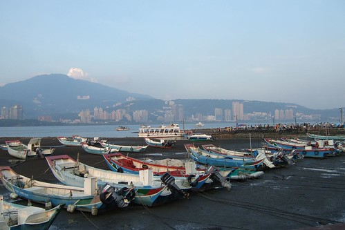

這個週六媽媽依然得去關渡上課  
徹爸也依然的當起超級奶爸 自個打理兩個頑皮豹  
準備早餐  煮海產粥中餐 邊罵邊督促小孩吃飯  
(媽媽中午打電話回家 聽到大的罵小的哭的聲音實在緊張心痛無比)  
拎著兩個小的去保養廠 然後回家安頓小的睡個午較  
然後去保養車領車 然後來關渡接媽媽...  
  
媽媽上課辛苦 徹爸在家帶小孩更苦更累    
可是就算身體怎麼累 也要一起去八里走走 放鬆放鬆   
迎著風踏著車 看著火紅的太陽或緩緩升起的月亮   
這週末算是值得了 這一天沒有白白的糟蹋了  
  
  

停好車 租了兩部前載的腳踏車  
跟徹爸兩人肚子實在太餓 只好先前往碼頭附近覓食  
80%來八里的人大概都聚集在碼頭邊吧  擁擠到讓人下車牽著車子走乾脆些  
而眾多店家販賣的各式各樣玩具則挑戰著阿徹的感官與理性  
"那裏有賣XXX 我要買XXX 可不可以買XXX"  
又熱又餓的媽媽最後忍不住下通牒"你是要來玩 還是要來買玩具的"  
而且這陣子媽媽每天幾乎都在嘮叨的"知足 惜福 節省"  
在這一刻徹底的蕩然無存(真的是唸假的) 媽媽深感挫敗.....  
雖然最後阿徹因為恐懼媽媽說的"再說 那就回家 更不用說買東西了"  
總算沒再吵要買東西 不過小子應該還是心心唸唸著(城府越來越深了)  
  
(再帥的小孩嚕起來時 一樣欠扁的讓人想破口大罵)  
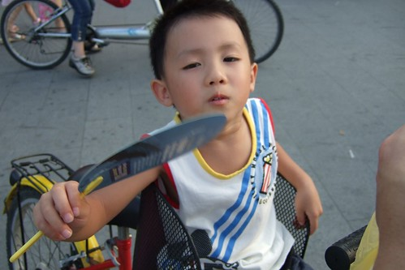  
  
相較之下 還是小愛沉穩乖巧許多  
不過終究也不小了 接受的感官刺激越來越多 物質慾望也漸漸多了起來  
  
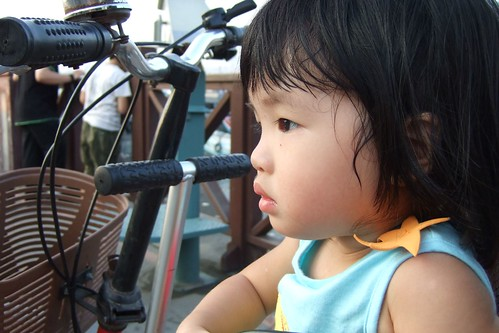  
  
花了半小時 買了烤豆腐 米血 玉米 香腸 炸花枝丸 飲料   
可以找個地方大快朵頤嚕~   
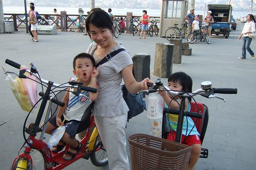  
  
(愛)人家好渴 要喝飲料啦~  
  
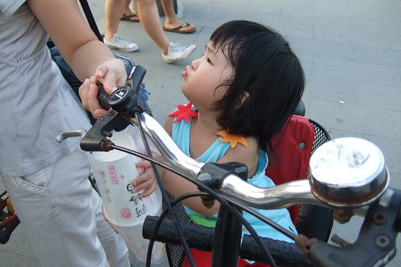  
  
小愛都還沒啃完一顆丸子 一根香腸就已經都進了阿徹的肚子裡  
快到媽媽都來不及拍下他大快朵頤的模樣  
按下快門的剎那  最後一口香腸入口    
串子空了 沒能替香腸留下隻字片語(哈 很爛的形容)  
  
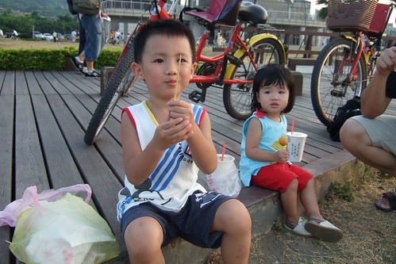  
  
阿徹張大嘴大喊"香腸在這裡啦"  
小心嘴巴張太大 香腸掉出來想吃也沒得吃了  
  
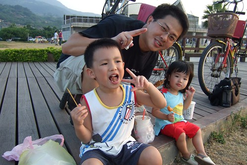  
  
吃完香腸 情緒平穩開心許多的阿徹(好像忘了想買玩具一事 錯...放在心上不敢講而已)  
  
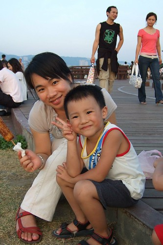    
  
吃飽點等會才有力氣騎去十三行  
  
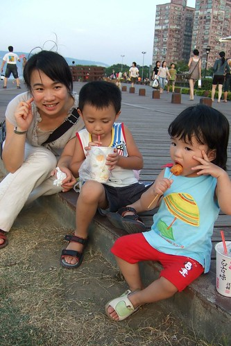  
  
可是微風徐徐加上即將落入水平面下的火紅太陽  
舒服的讓人想這麼的一直坐下去  
  
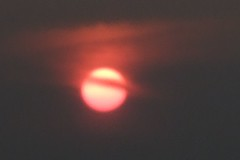     
  
鼓足力氣往前邁(騎)進後  
才明瞭在這樣的微風 太陽 月亮下騎車 更是令人振奮痛快阿  
小愛坐在爸爸的車上時而仰頭望著爹 嬌滴的喊著"把拔~"  
時而對著前方的媽媽大聲呼喊"馬麻~"  
讓爸爸媽媽忍不住興奮的尬起車來 他們笑的越開心 爸爸媽媽越是賣力往前衝  
  
十五的月亮真的很圓 很亮 很美  
像是做假的拿了張圓形貼紙貼到相片上一般  
  
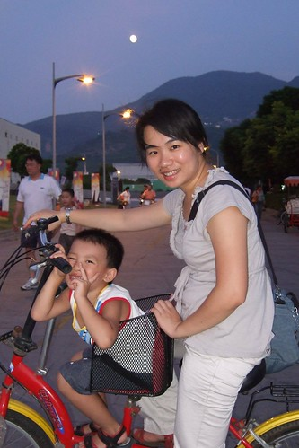  
  
媽媽的技術真的差爸爸很多  
幸好還有捕捉到父女倆開心的笑容  
  
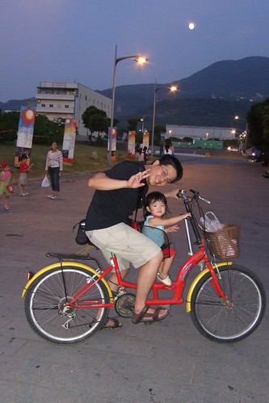  
  
再舒服在愜意 天已黑也該打道回府嚕  
握緊喔 可別舒服到睡著了  
  
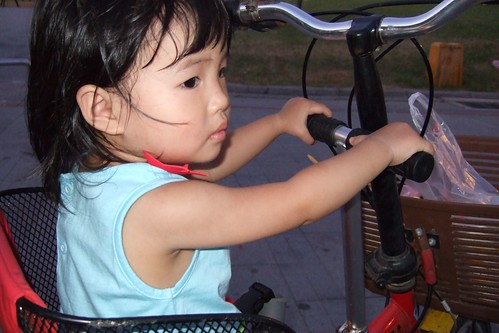  
  
七點多的天空不漆黑 色彩很多變很豐富  
  
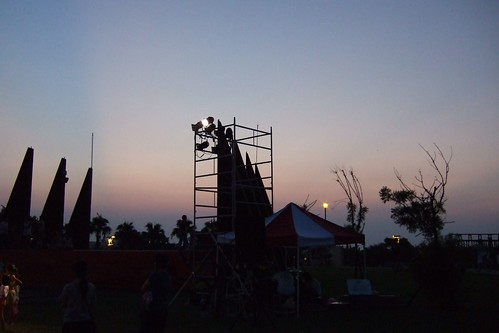  
  
很像阿徹用彩筆的隨意亂塗鴉  
  
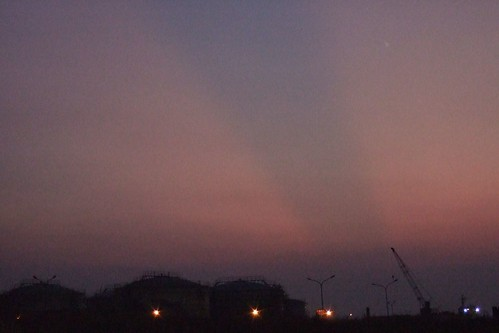  
  
八里行最後在人手一根冰淇淋後結束  
媽媽很難得的准允小孩吃這麼一球冰的（感恩　阿門）  
很久沒來八里　今天這樣的天時地利人和讓人很想再來。。。  
  
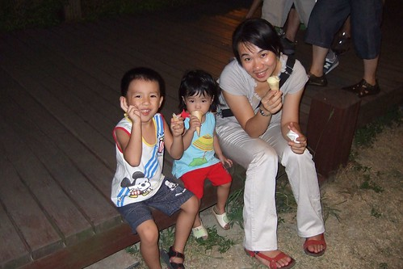  
  
八點半回到家　趕緊洗澡準備喝奶睡覺嚕　（因為爸媽已經又肚子餓想吃宵夜了）  
  
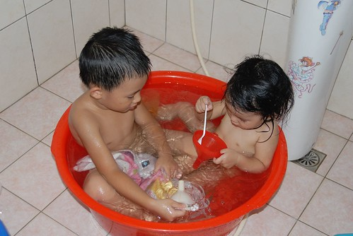  
  
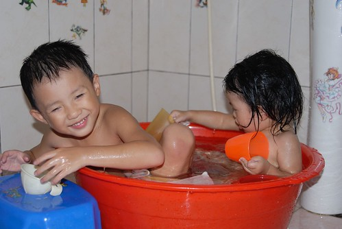
