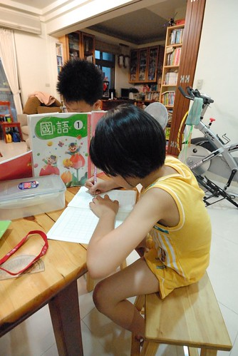

兄妹倆下週就要期末考了 我一樣的只叮嚀"記得要復習國語生字" 星期一兄妹倆都寫完功課後 兩人竟互相幫對方考生字 兩個小學生共患難的模樣 讓一旁翹腳看書的阿母忍不住拿出相機鬧鬧他們...

先寫完功課跑去玩的愛愛 百般不願意的從自超high的一人遊戲裡抽空幫哥哥考生字  不過小女子果然有兩下 可以一邊玩一邊幫哥哥考試 遊戲的小空檔趕緊記住下一個題目 然後立馬又飛去她的遊戲中 直待那一頭的哥哥喊了聲"好了" 題目就那麼行雲流水的從妹妹口中說出  哥哥考完 換妹妹考  哥哥一邊訂正他剛剛的考試 一邊出考題給妹妹  兩人合作無間的模樣 讓看到的阿母都想擠眼淚了~ 揪感心阿~~~  接下來的一週 雖然礙於兩人做功課時間的差異 讓我幫忙考了幾次 但幸好兄妹倆有照計畫 每天進行一課的國語生字練習 (這就是我們家唯一的考前付出 Orz) 甚至到週六 兩人又互相幫忙 一口氣拼了兩課完成所有 雖然明白他們最後這樣的積極 只因為想好好過週末 玩的無牽無絆 雖然周末我忍不住提醒兄妹倆 "沒事的話 那個書可以多少看一下" 但兄妹倆完全沒唉無聊 甚至忙的事多的很 阿母的話完全就像耳邊風 總算阿母忍不住又說了"明知國語不好還不多複習 如果又考不好 這次一定要打了" 賊頭賊腦的妹妹問"那如果有認真ㄋ"  阿母沉默不作答... 然後就在我們沒注意的那時  兄妹倆又一起坐在桌前互考對方之前寫錯的字 好唄~ 如果再考不好 阿母會打小力一點的...

真的讓人好氣又好笑的兄妹倆! 但這也是我們自己養出來的ㄚ~~~~ 
