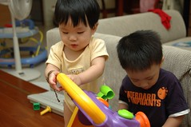
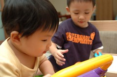
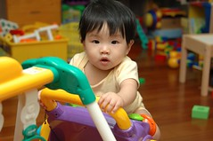
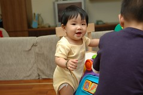
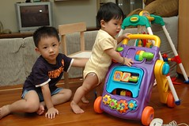
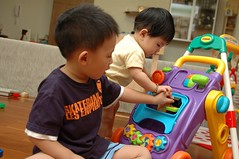
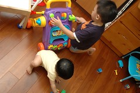
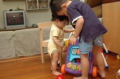
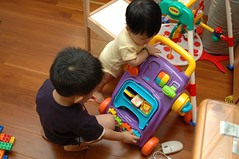

國外的月亮比較圓  
別人的玩具比較好玩?!

每每拿出以前阿徹玩的玩具要給妹妹玩時  
阿徹哥哥總會投予高度的興趣  
平日他不准妹妹碰的玩具 他會說"妹妹還太小 不能玩這個"  
但若他想玩屬於妹妹的玩具 他便又會一臉正義凜然的說著"玩具要大家一起玩 對不對"  
ㄘㄟ~好康的都被你佔光  
有時候實在忍不住的念他  
"你看 妹妹 這麼可憐 才兩三樣玩具 而且還都是阿徹以前玩過的 現在哥哥還要跟妹妹搶玩具 妹妹真是太可憐了"  
被念的有點不好意思的哥哥  
要不就是拿他目前不想玩的東西打發妹妹  
要不就是硬要湊在妹妹旁邊 等著妹妹走人接手  
螃蟹車如是 學步推車亦如此 哎~  
不過起碼樂見兩人共同分享玩具(雖然各玩各的)  

