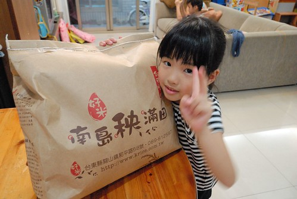
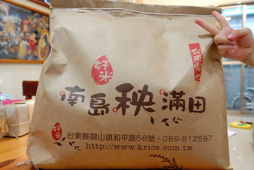
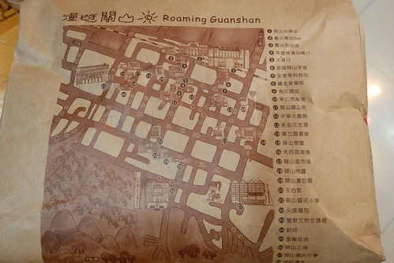
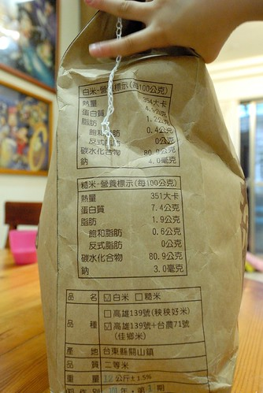
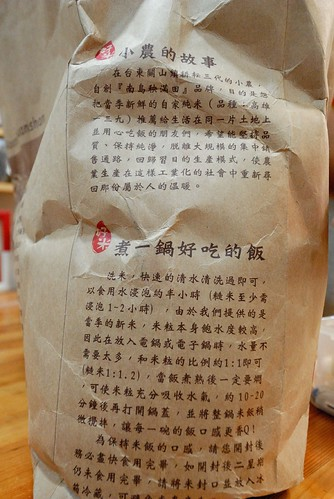
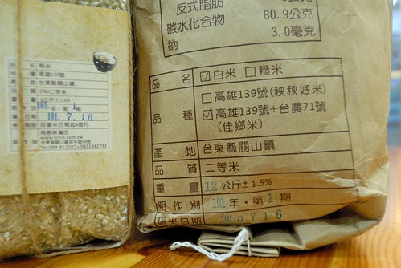
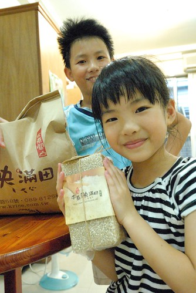

以前從來沒仔細計算家裡的米用量 現在為免斷炊 我得費心留意米缸的米量 再一次跟南島秧滿田訂米 才發現距離上一次也不過兩個月的時間 也就是說我們家在兩個月內煮了 吃掉了15公斤的米 再看到店家寄來的不算小箱的包裹 嗯~吃掉這些米的我們也算是有認真在吃飯吧!  

米到的那一天恰巧是上一批米的最後一鍋 而且那天也剛好徹爸腸胃炎 需要白米煮清粥 我迫不及待的拆箱拿米要煮粥 但一看到這回嶄新的米袋 我忍不住拿出相機拍拍拍 厚紙袋的包裝 襯的這米更是有質感了  米袋的背面印著關山鎮旅遊地圖 如果拿著這米袋去關山旅遊 去店鋪消費不知道有沒有多些折扣 不過我想絕對多很多的親切與認同感  米袋的一側標示著營養成份 徹爸仔細看後如發現新大陸似的說"原來這只是二等米阿" 看來徹爸果然吃米不知米價 我們家的伙食費哪吃的起一等米阿 不過這二等米就也夠好吃的讓人總想多吃一些飯 尤其菜色裡有香腸的時後 如果不是因為怕胖 每天晚餐刻意的控制米飯的攝取量 我想我們家的米量絕對不只15公斤阿  米袋的另一側寫著店家的小農故事以及一鍋好吃的飯的烹煮方法與技巧  一整個真的設計的很有"誠品"風格的米袋阿 讓吃飯這件事變的似乎也"文雅"了起來 不過這些漂亮的外裝都不是重點 最最重要的是這是今年的新米 101年的第一期稻作阿 我想著這些米可能在半個月前還插在台東的泥土裡 呼著台東的空氣 喝著台東的水... 而現在卻出現在我們家的餐桌 是我們吃的飯  這是我以前從未想像過的事阿  我跟徹愛們說這是剛收割 今年最新鮮的米 當我打開米袋的那一刻 阿徹驚喜的說著"哇~好香喔" 我得意的笑說"是阿~ 因為剛收割 所以這麼香" 雖然不是第一等 雖然不是最好 但是農家帶給我們溫暖的米~  PS. 看到我拿相機拍照 徹愛一直湊在旁邊要入鏡 我想他們一定跟我一樣喜歡這米! 後記: 那晚幫徹爸煮了半杯米的白粥 結果徹爸完全不像腸胃炎病人的吃了兩碗多的粥 全部吃光光 徹爸吃粥的時後直呼了好幾次 真是太好吃的粥了 真不知道徹爸是禁食餓過頭了還是真是被這新鮮的米給迷惑了...
