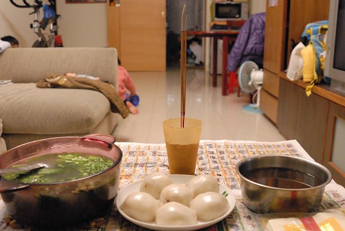
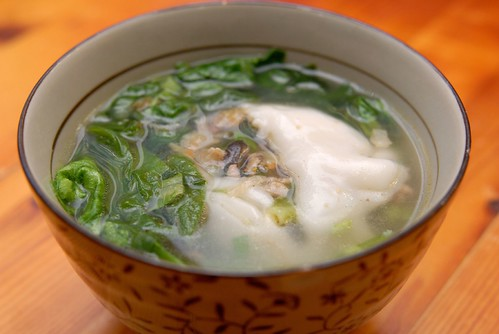
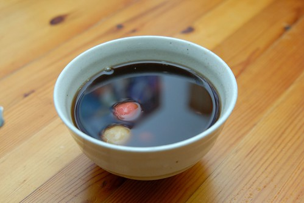
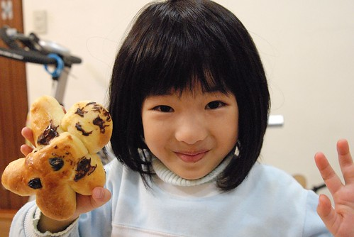
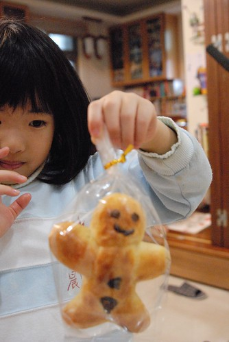

 

這一個禮拜滿足了兩個味道 一個是陳嬤給我的冬至湯圓味道  一個是我給徹愛的聖誕麵包味道!    

小時候總是很期待冬至的到來 因為吃湯圓就可以多一歲了 而且代表著就快過年了.. 打有記憶以來每年的冬至 媽媽都會包大湯圓還有搓小湯圓 大湯圓裡包著滿滿用蔥頭 蝦米 香菇 紅蘿蔔絲 青蔥絲 繳肉以及花生粉炒香的陷料 用一個平常吃飯的碗裝著一顆大湯圓再加點茼蒿高湯  這是我們家的標準湯圓味道(而且獨一無二)! 而冬至晚上這樣吃個兩三碗大湯圓是晚餐也是我們的冬至儀式! 直到現在 每年的冬至媽媽還是都會大工程的做湯圓 只是我們很少再全家一起聚著吃湯圓 往往都是冬至過後的週末回家時 吃點湯圓意思意思而已 上週末回新莊時 問起陳媽做湯圓了嗎 想說她應該會先做圓仔粹讓住新竹的大哥帶回 最近忙翻的陳媽才想起"對喔 冬至快到了 她都完全忘了這件事" 於是陳媽好像就此認為我想吃湯圓 然後莫名堅持的想要讓我吃到冬至湯圓 冬至前一天下午她做好湯圓就打電話說"讓陳爸送來板橋或是隔天她自己搭公車送過來.." 不想讓他們麻煩 而且還這麼忙 這麼冷 我一直說"不用了" 可是陳媽還是一個勁的直說"我坐公車拿去" 於是最好的解決辦法就是冬至前一天晚上 我騎摩拓車回新莊拿 回到新莊看到陳媽準備好的湯圓 我直唸著"太多 太多了" 想辦法少帶點 但一旁的陳爸直唸著"這麼少 這樣難看" 回到板橋後 當我把要煮甜口味的圓仔粹搓成一顆顆的小湯圓時 搓著搓著心頭百感交集了起來... 所以今年我也要給我的家一個充滿濃濃湯圓味道的冬至!

冬至早上熬好排骨高湯也燉了一鍋紅豆湯 下班回到家後 趕緊準備甜的跟鹹的湯圓拜地基主(難得這麼順從聽媽媽的話拜地基主 )  拜好地基主 鹹湯圓剛好就是我跟徹爸的晚餐..  話說陳媽這個長的很像肉圓的鹹湯圓 相信很多人沒看過也沒吃過 我也一直沒問過陳媽為什麼我們家的湯圓怎麼長這樣 但感覺這就是她們從嘉義帶上來的家鄉味道 湯圓包的像拳頭這般大(今年包的算小顆) 然後先入鍋蒸熟 要吃時 把一顆湯圓放到碗裡 然後淋上有茼蒿的高湯 最後再灑上點芹菜珠 這就是我最喜歡的湯圓味道 尤其是把湯圓搓破 讓湯圓的餡料跟高湯混在一起時  每一個入口都是滿足! 只是真的有上年紀了  以前吃個兩三顆當晚餐不覺得飽 現在兩顆下肚後卻已感覺有點撐  除了鹹湯圓外  也煮了鍋阿徹超喜歡的紅豆湯  來碗暖呼呼的紅豆湯圓 不過因為加黑糖所以黑嘛嘛 徹爸說看起來好像中藥喔!  但是真的很好喝喔!  一家子冬至夜一起吃湯圓 長一歲! 今年的冬至夜很冬至!!! 

除了湯圓外 我們家這個禮拜還有飄著濃濃奶油香的尼古拉斯麵包 前陣子在Carol老師的部落格看到他做的可愛尼古拉斯麵包  心想如果我也可以做出這麵包 徹愛一定很開心! 聖誕節的前一週六上午 在不是很順利的過程下(蛋不小心少放一半 麵包長不太大)  沒想到我真的做出我的尼古拉斯嚕! 看著徹愛開心的把麵糰擺成翹腳的 跳舞的 金雞獨立的尼古拉斯(只是麵團最後長大後都變形了) 還有最後用巧克力漿幫尼古拉斯畫上 可愛的 生氣的 呆呆的 像徹爸的各種表情 媽媽的搞缸都值得了!  愛愛一直說這是薑餅人 我說這是尼古拉斯麵包 還跟她們解釋尼古拉斯的故事 "法國阿爾薩斯傳統的聖誕節慶麵包,聖尼古拉  是小朋友的守護神, 牽著轤子到處分發糖果及歡樂,期盼孩子更聰明健康" 可是愛愛還是一直說這是薑餅人麵包 這是雪人麵包 愛愛還畫了一個有著亮晶晶閃亮雙眼的麵包要送給他最好的女朋友 (我問愛愛手臂兩旁的兩坨巧克力是? 愛愛說那是書包的揹帶阿)  希望每個小朋友在尼古拉斯的守護下都健康快樂!  大人也是!!!  ps 雖然配方有點錯 第一次麵包發酵也長不太好 但經過12小時低溫發酵的麵包口感還不錯 而且超高比例的奶油配方  很有過節墮落的氣氛 不過徹爸昨天整理照片時說 "麵包ㄋ? 怎麼最近家裡做的東西我都常沒吃到" 呵呵! 看徹爸沒有很想吃的樣子就不好意思一直提醒他要吃ㄇㄟ...
