上週二在FB開賣後 這一週陸續收到朋友的預訂 雖然果如預期 詢問的人並不多 且大部分都是熟到會讓我收錢收的有些不好意思的朋/親友所下訂 但看著訂購數量漸漸朝自己所設立的目標增加著 心裡真的著實開心! 九月的第一天 上星期日 是第一次的動工日 前一晚不知怎麼的有些睡不好  徹爸笑問"你在夢裡做了幾盤蛋黃酥?!" 是沒這麼誇張啦~  但有些緊張且更多的興奮倒是真! 而那一天的產品 雖然因為重量的錯估而讓芋頭酥爆餡又破盒 但真是開心那天的每個客人都喜歡我做的餅 特別是那真的醜掉的芋頭酥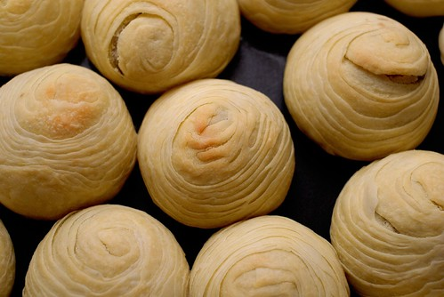](http://www.flickr.com/photos/33703965@N00/9659918373/ "20130901_1353-DS2_5847")

決定開賣讓我第一次這樣認真看待一個蛋黃酥(芋頭酥)的價值 認真的比較6年前救國團中點課老師與我最愛的carol老師的配方差異 認真的計算一次製作需要的所有材料 認真的紀錄每樣材料的購買單價然後第一次對烘培"成本"有了具體的了解 對自己來講 真的是很好且很有趣的經驗 突然能體會以前在電視上 網路上看到創業者說的"做了就知道"這句話的真意 真的做了之後就會明白體會很多事! 謝謝徹爸兩三年前的每次中秋過後就鼓勵我來年開賣 並且行動支持的用相機紀錄我的初體驗 我說真好 我有阿徹這個專屬設計師 還有徹爸這專屬攝影師!

下面就是徹家產出的有圖有真相: 透過平日素有交情的菜販  用批發價買到物美價廉的芋頭讓我起頭就有好開始好心情 蒸芋頭時  滿屋子的香味讓一家子興奮大呼"好香喔"  阿徹甚至形容好像烤玉米的香氣 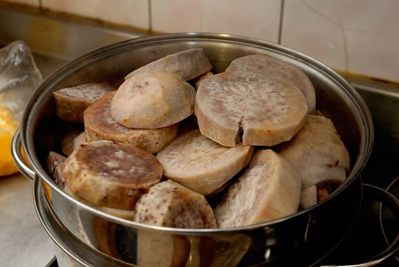 花了一小時些製作芋泥餡 (芋頭酥比蛋黃酥貴原因就在此) 接著兩小時的做麵糰及每顆的桿捲與包 (過程徹爸出門不在家所以沒圖沒真相) 總算第一盤黃酥排列整齊就定位 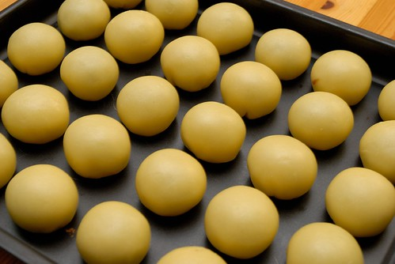 進爐前 刷蛋液 [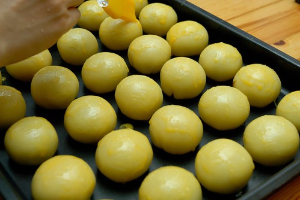](http://www.flickr.com/photos/33703965@N00/9659920777/ "20130901_1253-DS2_5835")等了一整天要幫忙的愛愛幫忙灑上芝麻 (包蛋黃酥餡的時候 愛愛有試了兩顆 不知道哪位阿姨幸運吃到) [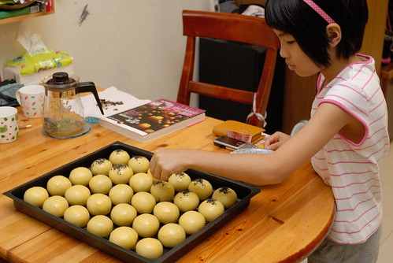](http://www.flickr.com/photos/33703965@N00/9659920559/ "20130901_1254-DS2_5837") 我喜歡蛋黃酥的芝麻有些多 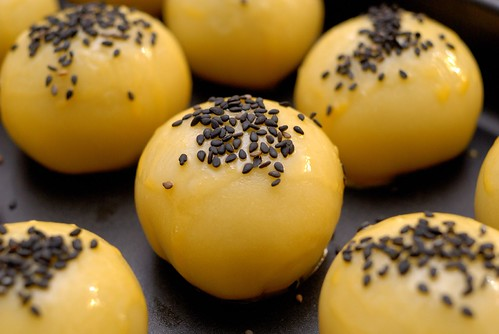 蛋黃酥進爐後 更是快馬加鞭的處理芋泥球 邊做我邊忍不住偷吃了好些"塊"的芋頭 (實在因為前面壓泥時壓到沒力 以致混雜不少芋頭塊得處理下) 還沒吃中餐的我越吃越覺得芋頭怎麼那麼好吃ㄚ 然後芋泥球不知不覺越秤越重 [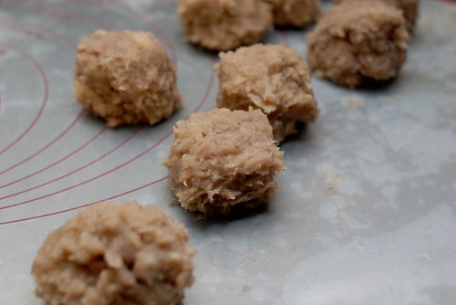](http://www.flickr.com/photos/33703965@N00/9659919187/ "20130901_1311-DS2_5843") 最後進爐前的芋頭酥各各都圓潤飽滿阿 (老實講烤盤出乎意外滿時 我便預期可能會爆爆爆) 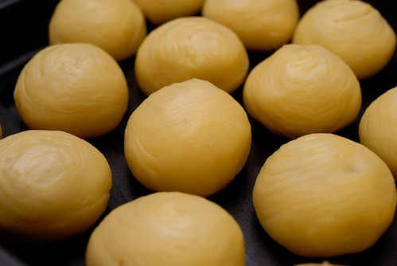 第一盤芋頭酥就定位的同時 蛋黃酥也剛好烤出爐 [ 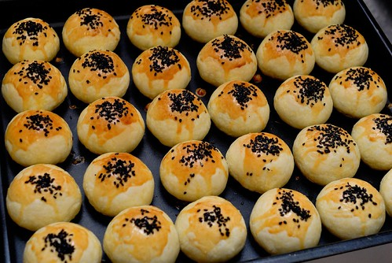](http://www.flickr.com/photos/33703965@N00/9659918803/ "20130901_1327-DS2_5845")接著的兩盤芋頭酥 果然有不乖的小孩爆漿啦~ 不過那一顆顆像輪迴眼一樣的相貌讓我看得真是滿意 (皮桿捲成功!) [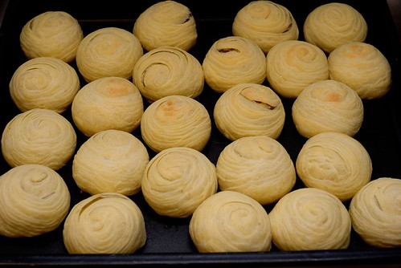](http://www.flickr.com/photos/33703965@N00/9659918129/ "20130901_1353-DS2_5848")好不容易等到餅放涼 趕緊切來瞧瞧 看到蛋黃酥那層層分明的餅皮 真是令我開心 我知道外面很多蛋黃酥的皮看起來與吃起來都比較濕潤 但我喜歡烤酥酥的皮 [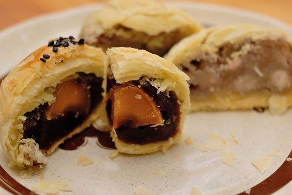](http://www.flickr.com/photos/33703965@N00/9663148446/ "20130901_1540-DS2_5853") 等到所有餅完全涼了 小幫手愛愛再次上場 愛愛超頂針的搭配紙杯的顏色與數量  真是做老闆娘女兒的料阿! 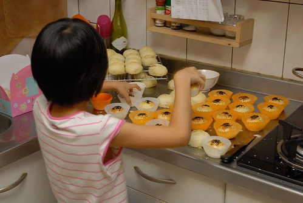最後依照客人訂購數量裝盒   [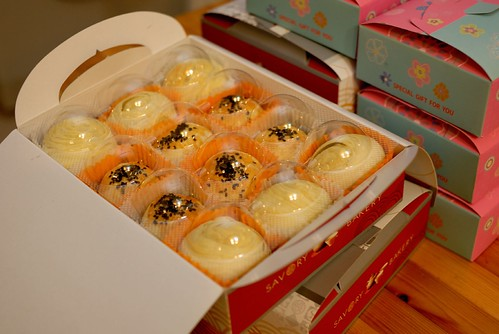](http://www.flickr.com/photos/33703965@N00/9663147126/ "20130901_1613-DS2_5859") 裝盒時 真是被那爆大顆的芋頭酥給大大為難 得很努力的把所有都"塞"進盒子裡 不小巧的爆漿還破盒的芋頭酥真的給他有失優雅與專業 下回得改進 而這醜但份量十足的模樣 就當作是我與第一批客人的美麗回憶吧! 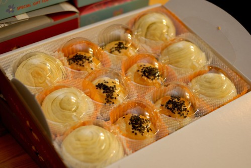 最後最後 放入一張由專屬設計師張小徹所繪製的小卡片 提醒大家保存方式 同時衷心感謝朋友的鼓勵與支持!!! 雖然徹爸笑我 明明有收錢怎能說分享 但我就是喜歡這字眼~ 而且我真的真的只有賺微薄的工資!

  跟徹家很熟的玟姿阿姨剛好很有緣的上台北看戲而當了我們的第一位客人 謝謝徹家頭號捧友的阿姨在FB分享了我們的新鮮並大大的推!  也真的真的很高興她與她的朋友 以及奶油媽與徹爸姪女跟我說"很好吃" 聽到客人的肯定 我的心頭更是堅定與踏實!
