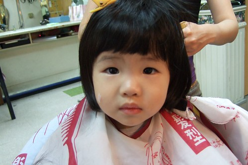
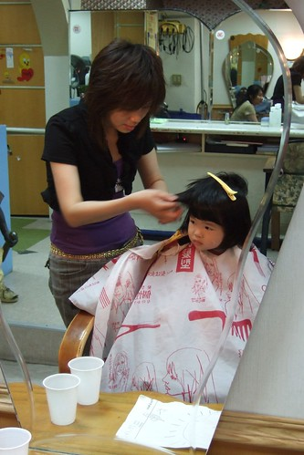
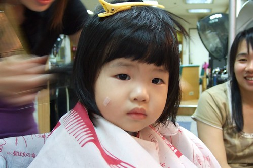
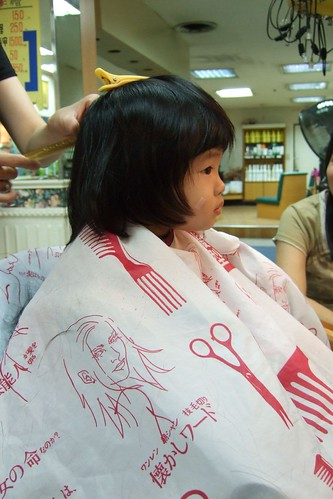
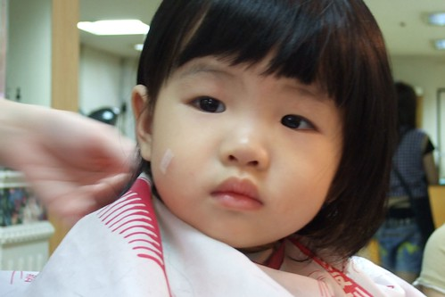
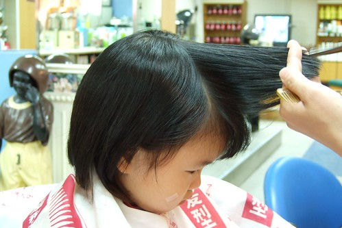
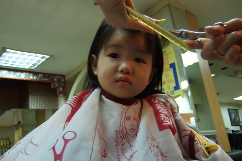
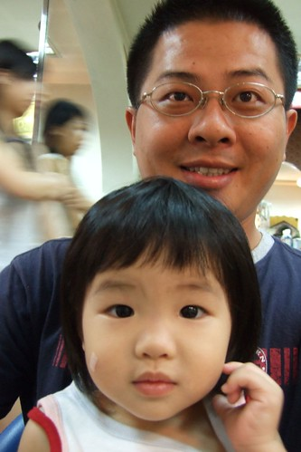
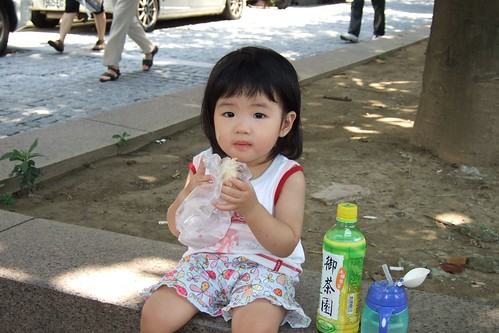

小愛已經很久沒有跟著上髮廊了  
反正想要留長紮馬尾就給他不管醜的留留留就對啦  
而且前面頭髮太長時 保母也會修的不著痕跡 恰到好處  
只是那頭濃密茂盛的頭髮 如果不綁起來實在真的很"恰訝"  
而且很容易就像小珠(胖虎的妹妹)去了   
前幾週保母又在幫小愛修劉海時   
小愛不小心轉了個頭 剪刀於是就這麼斜了個上去  
保母還不敢自作主張的給他都減了上去  於是小愛頂了頭流行的斜劉海  
看了一晚我跟徹爸實在看不慣於是又請保母乾脆給她剪上去 剪騎啦  
我是真的覺得挺可愛的 很像日本小女生  
但徹爸一直嘀咕像小珠 我說"哪那麼糟 是像日本小女生啦"  
徹爸說"小珠不是日本女生喔"  
唉呦~我說的是哪種白白淨淨 恬靜有氣質的日本"小"女生啦  
  
其實本來只預約要剪徹爸跟阿徹的頭的  
只是徹爸又直嘀咕著要把小愛頭髮打薄 俏麗點  
一開始小愛靜靜的看著哥哥坐在大椅子上的小椅子上剪頭髮  
等哥哥剪完洗完頭後 小愛便哀求的要我抱她到大椅子上的小椅子乾過癮 一附等著要換她的樣子   
於是剪完阿徹父子倆的頭就請阿姨也幫小愛的頭修一修  
跑去跟在交誼廳看卡通的小愛說"妹妹來 阿姨幫你剪頭髮"  
小愛快速的下椅往前快走   
然後靜靜的坐上大椅子上的小椅子  圍上披巾 夾上大髮夾  讓阿姨動刀  
  

即使只是"小人"的頭 阿姨可也不馬虎   
一切規格 標準比照大人 但收費少多多  
  
  
  
小愛一臉認真 認份的樣子  
  
  
  
頭髮真的很多 很厚    
長大後大概跟他媽一樣常要花錢離子燙  
  
  
  
剪了半邊 兩相對照 輕薄許多  
  
  
  
側面 後面都搞定 只剩下前面嚕  
阿姨說今年很流行這樣的妹妹頭哩  
  
  
  
頭低低 閉上一下眼睛喔  就快好了~  
  
  
  
噹噹噹噹~有沒有給她清爽俏麗阿  
(PS. 阿姨給徹爸剪了個跟阿徹一樣的髮型 徹爸說劉德華也這髮型哩)  
  
  
  
剪完頭髮陪著徹爸去相機街找側包   
餓扁扁於是在中山堂馬路邊野餐起來  
有上了年紀的夫婦經過看著小愛說"好可愛的小女生喔"  
徹爸說"這麼巧 剪完頭髮就有人說可愛了"  
ㄘㄟ...本來就可愛 現在是美麗加分~  
  

