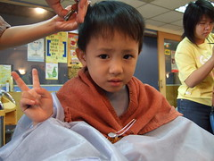
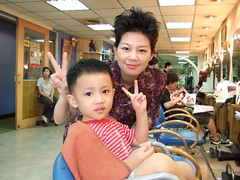
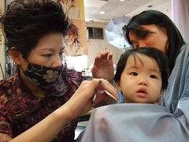
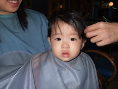
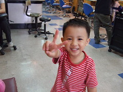
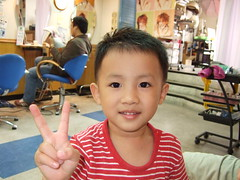
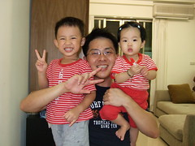
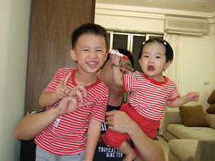
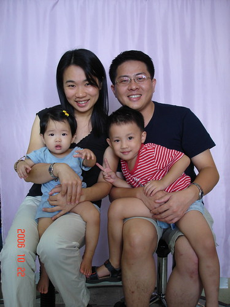

盼了好久我們家的設計師阿姨總算放完3各多月產假回來了  
雖然3個月前徹爸跟阿徹都有去給另外一個設計師叔叔剪  
但就是不習慣 尤其頭髮長了後就是沒阿姨剪的那樣順  
提前2-3週預約總算約到了阿姨

阿徹現在剪髮已經不會哭哭  
也不需要從家裡帶小椅子去坐了  
阿姨可以慢慢的剪 好好的style

距離小愛上次的西瓜頭也已經四個多月了  
雖然決心要給小愛留頭髮  
但還是該修一修  
要不然每天早上起床後或是玩的瘋時的髮型還真有點披頭散髮  
小愛不像剪西瓜頭時狂哭  
這次跟他說"剪水水"就乖乖呆呆的讓阿姨剪  
阿姨還可以跟我討論是否打薄 然後慢慢的剪  
小女生果然是給他愛美~

阿姨幫阿徹頭髮 用了點髮膠 上了點金色 抓了點造型 阿徹很愛說 原來也是愛美一族

剪完頭髮神采奕奕的三人

阿姨的店最近在幫客人拍照要做髮型書  
週日早上沒啥客人 無聊就給我們拍起全家福  
難得一家四口正經八百的一起拍照  
不用擔心要按快門 不用管攝影條件好不好  
就是擺好pose 笑就好  
感覺還不錯~很像在照相館照的沙龍  
不過唯一遺憾是(這是別人說的)媽媽的髮型糟了點

