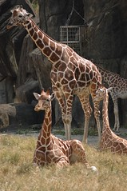
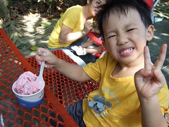
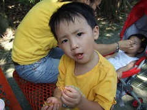
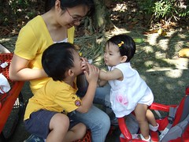
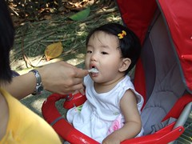
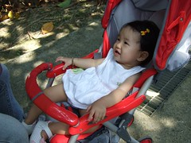
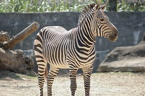
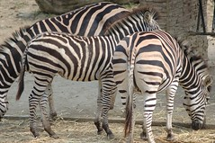
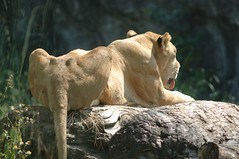
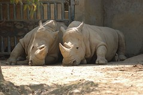

小孩子好像真的都很愛動物園...  
去年夏天阿徹第一次去動物園  
因為天氣熱走到後來哭鬧耍番討抱  
搞的最後大家敗性而歸

今年3月底宜人的春天再次帶阿徹去動物園  
阿徹遵守承諾的全程自己走  
全家人開開心心的悠遊於昆蟲館 企鵝館 爬蟲館以及非洲區中  
可是兩天後阿徹中了輪狀病毒  
病到住院吊了好幾天點滴...

5/1勞動節徹爸不用上班  
應阿徹的要求父子倆又去動物園尋找上次未看到的長頸鹿  
可是繞了老半天還是沒看著長頸鹿  
套徹爸說"明明就覺得快到了 在附近了 但就是找不著"

之後阿徹常唸著要去動物園找長頸鹿  
可是炎炎夏日很熱哩~  
等秋天天氣不熱再去吧!  
我總是這麼告訴他...  
九月天氣涼爽點了  
阿徹又開始認真的唸著要去動物園  
好ㄅㄟ~找個有空大家又都心情好的時候來去吧

原本上週日就要去的了  
一家子早早的吃了中餐  
媽媽整理好東西 爸爸也style好頭髮一附蓄勢待發的樣子  
結果阿徹突然喊卡 說"我還是去碗稞阿嬤家好了" ㄘㄟ~  
我們猜想也許因為我們一再要他承諾他會自己走  
阿徹雖沒把握但也只能答應  
但最終還是因為對自己信心不足所以選擇不去吧  
於是最後是媽媽帶著她坐公車去碗稞阿嬤家 若有所失的徹爸陪著妹妹在家睡覺

隔了一週大家還是都想去動物園...  
還是問阿徹"你可以自己走嗎 累的時候不鬧鬧嗎"  
這次阿徹說"累的時候就休息一下阿"  
哈~是阿 累的時候就休息一下又沒什麼  
於是一家子帶著動物園地圖 長頸鹿的地標 開開心心的出發去動物園嚕  
雖然秋老虎還是有點可 怕但微風徐徐  
秋天果然還是最適合郊遊旅遊的季節

進到動物園看了睡覺的無尾熊後  
便是尋找我們心心念念的長頸鹿  
地圖顯示長頸鹿屬於非洲動物  
但逛了一半的非洲區後覺得似乎又跟上回一樣距離長頸鹿越來越遠  
於是決定放棄地圖 照著徹爸遠眺看到的長頸鹿憑著感覺而去  
總算讓我們在澳洲區的入口找著了  
就在一開始我們待看很久的斑馬隔壁  
入口還矗立著一頭長頸鹿(假的)  
ㄘㄟ~果然明明近在眼前 卻不視長頸鹿  
看到長頸鹿總算了了我們一家三口的心願了

到看到長頸鹿我們竟然已經在動物園逛了二各小時之久  
可見動物園還不是太小啦  
買了冰淇淋獎勵阿徹今天的乖巧  
妹妹也剛好睡了一覺醒來吃她的中餐  
很久沒有這種野餐的感覺了 很舒服(雖然爸媽還是餓著肚子的)  
最後我們去了爬蟲館  
很怪!阿徹這次特別提出要看長頸鹿跟蛇  
他什麼時候對蛇這麼有興趣了

今天的郊遊算是很愉快  
小愛很配合的一開始坐在推車上玩她的水杯

  
吃魷魚絲吃到睡著

然後吃粥

  
而阿徹也很棒的一路自己走  
(除了最後上坡往爬蟲館的路上讓他坐妹妹的推車外)  
只是最後因為昆蟲館整修封館 而小鬧了一下脾氣外  
乖~不哭  
下次我們再來看昆蟲嘿~

附註: 今天第一次雙機出遊 我的小DC加上爸爸長鏡頭的小7  多了許多爸爸的照片也讓徹爸得以安心的好好拍拍動物 

覺得斑馬很漂亮 全身上下散發"力"的美 尤其是那屁股讓人很想"ㄍㄨㄟˋ"看看

瘦巴巴的獅子一點都沒有王者之尊的風範

兩隻像泥巴做的一動也不動的白犀牛
