下雨下了好多天 房子濕濕的 人也感覺快發霉了... 想起去年的這時候也是這樣的下雨天走了趟北投....只是雨沒這麼大....(貼了一年的照片總算重見天日) 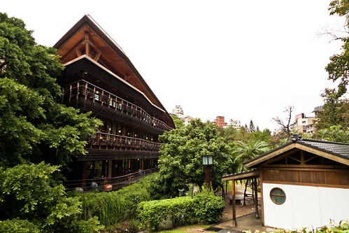

記得那天本來是要去北美館看皮克斯展的 可是望著館外繞了好長一圈的人潮 我們最終還是把車子直接往北投方向開去 去北投散散步.. 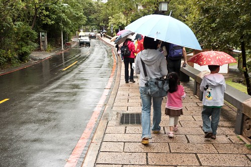 

把車子停在新北投捷運站後 走路到圖書館前的這條路讓人感覺有點浪漫 尤其是下雨天... 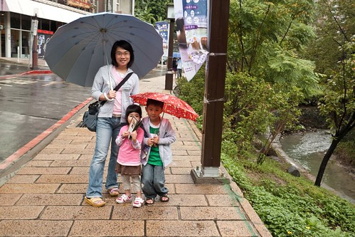

耳聞綠建築北投圖書館很久 親自走一遭後果然讚嘆於這樣一個建築藝術品 很漂亮 很怡人...當然也希望這樣的綠建築真的給人民帶來截然不同的綠生活體驗 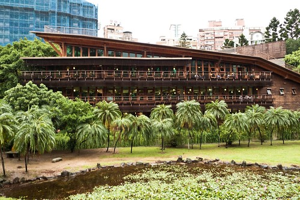

覺得來這看書的人應該不多吧  大家嚮往的可能只是單純的在這樣的沿廊裡 望著外面綠景  自在的看看書 聊聊天或是發個呆 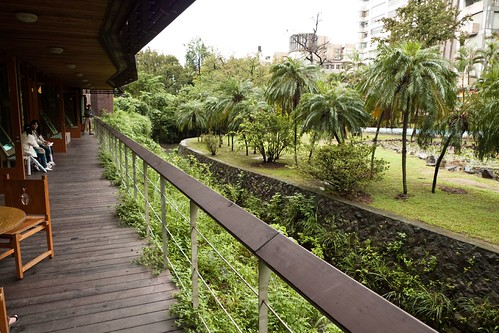

我們在兒童閱讀區裡呆了好一會 會自己閱讀的阿徹越來越能隨時隨地沉浸在自己的閱讀樂趣中 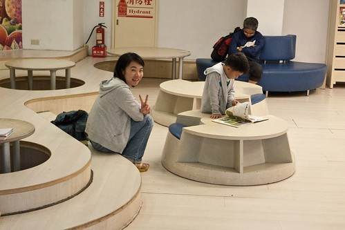

而還很依賴"伴讀"的愛愛則是拿著繪本要我們讀給他聽 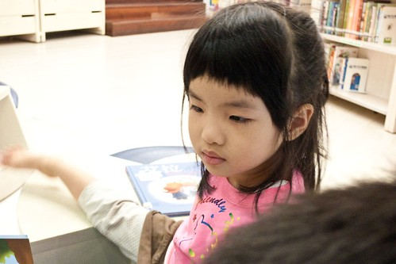

爸爸讀 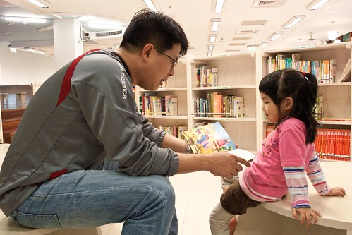

媽媽讀 瞧~阿徹早已光了腳丫 到處體驗不同座位的樂趣了 可以這樣悠哉的或臥或坐的閱讀是種幸福 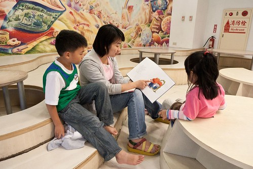

短暫停留感染一下書香氣息後 我們冒著細雨接著去附近的溫泉博物館 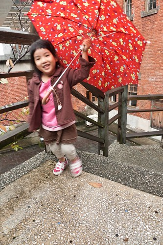

那時候生上小一沒多久的阿徹已經越來越有小學生成熟的味道了 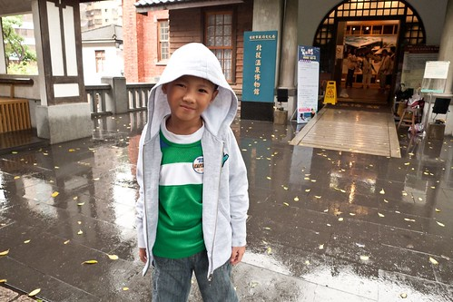

這樣的老建築物 這樣的大庭園  真是我夢想中的房子阿 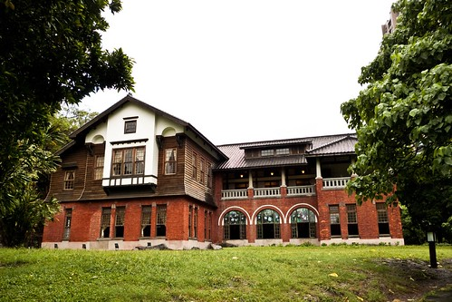

在二樓還有陽台可以遠眺庭園美景  吼~真是一整個有錢人大戶的感覺.... 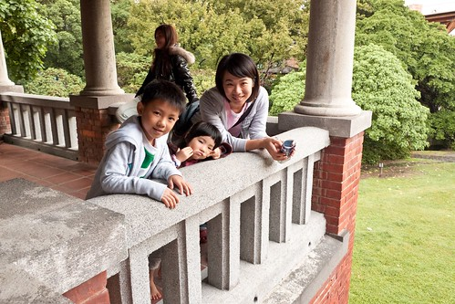

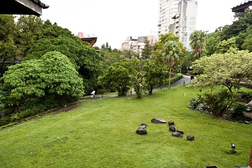

博物館從外觀看起來小小的 但實際走一遭後發現裡頭的空間還真不小ㄋ 二樓裡就有個出乎我想像大的大和室  這應該是以前的大宴客廳吧 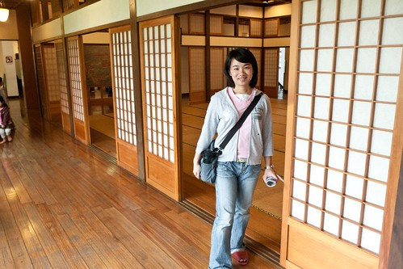

看著這廣闊的榻榻米地板 真是讓人好像躺下去滾來滾去阿 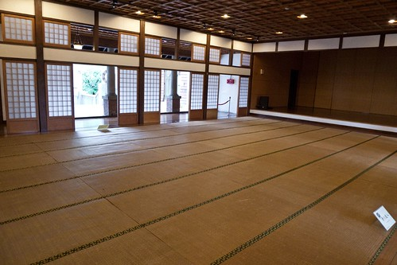

我愛這樣的日式建築愛的不得了  就算胖胖不上相還硬是要照很多相  哈哈! 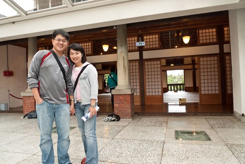

原木梁柱 階梯 扶手 在在充滿著歷史的痕跡 我喜歡這種溫嫩的感覺 就像家裡的木地板雖然傷痕纍纍但卻另有一番風味及溫暖 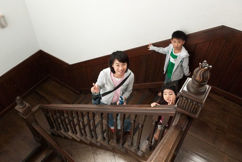

而一樓保留的"溫泉大浴室"又是另一個歷史的見證阿 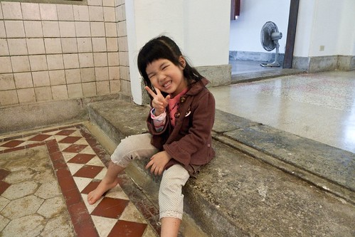

當我跟小愛很開心的坐在浴池內假想泡湯的樣子時 徹爸突然驚呼"人家寫說請勿進入哩"  嚇的我跟小愛三步併兩步的跑上岸 結果再仔細一看 人家是寫"請跨越入池"啦   別不小心沒注意階差摔倒了啦! 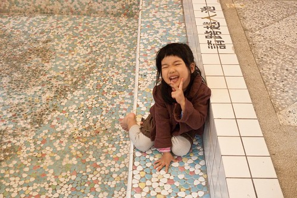

這樣的懷舊心情下 忍不住抓徹爸來多合照幾張 呵呵~ 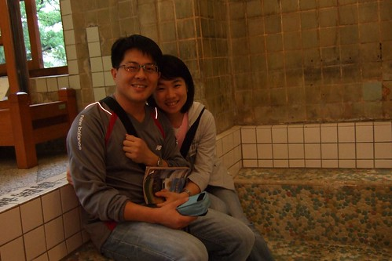

就連原木窗框也好有"味道"喔 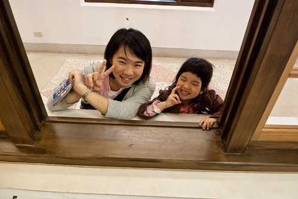

真的是保留很好的一個溫泉博物館.....讓我忍不住夢想以後也能住這樣的老房子阿... 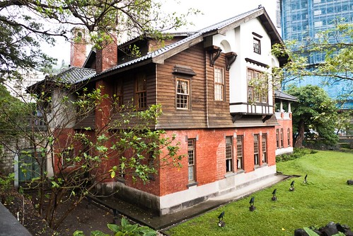

回程經過捷運對面的小公園看到噴水池的水舞表演  一家子駐足觀賞好一會 沒見過大場面的我們對這樣的表演便也看得嘖嘖稱奇 嘴巴開開(就是那個歐巴桑媽媽啦) 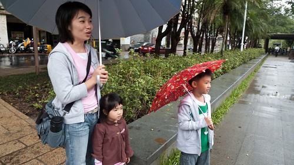

捷運站附近剛好有溫泉季舉辦的市集活動  我們跑去蓋了個博物館紀念明信片 (房子 樹..是依序蓋上去的喔  很有感覺 很搭配早上的博物館懷舊情愫) 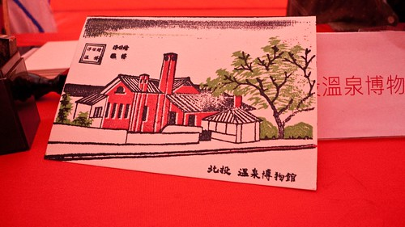

還有用厚紙摺了個超堅固紙飛機 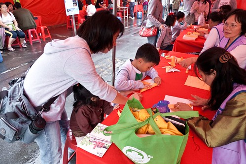

那日的北投半日散步行 很小品 很懷舊 很開心... 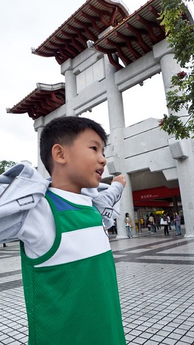

話說隔週五 徹爸很盡責(還是因為被媽媽凹了阿)的請了半天假帶兩小去看皮克斯展 而且還是搭捷運去的喔 光是想像台北車站裡轉車的人潮就得替徹爸拍拍手 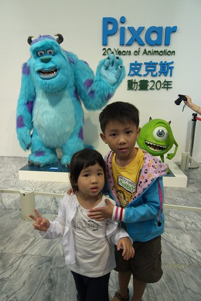

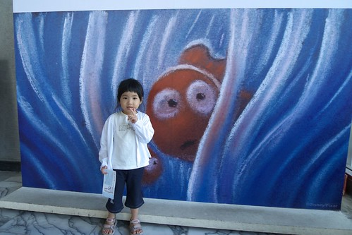

據徹爸的形容 其實展覽的東西太有深度並不是很適合小孩的味口 而且那樣的人潮...呵呵... 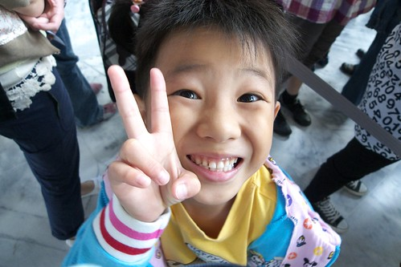

不過反正就是去朝拜ㄇㄟ 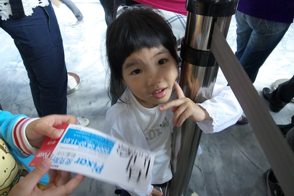

有買個紀念品送(打發)小孩 大家都開心就好嚕!!!! 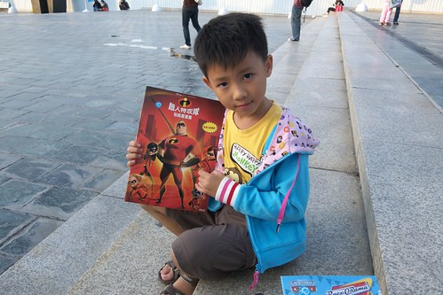
