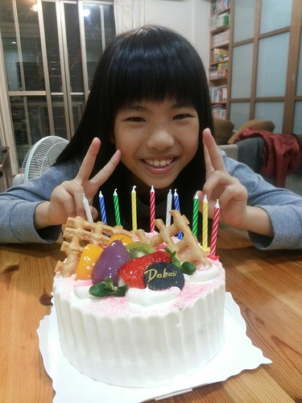
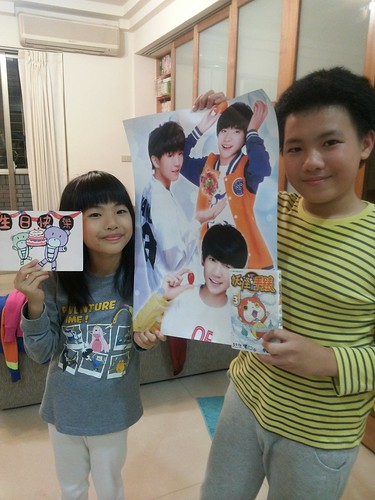
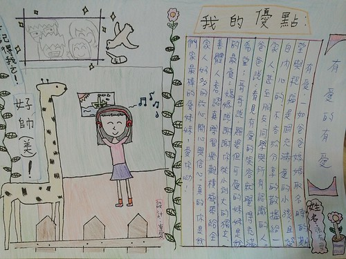
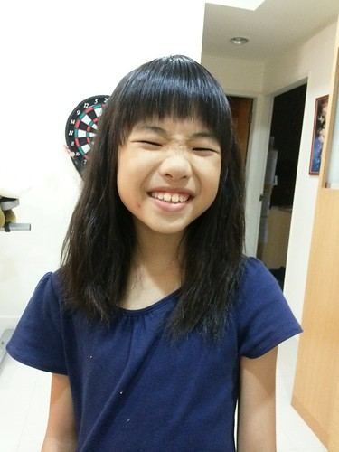
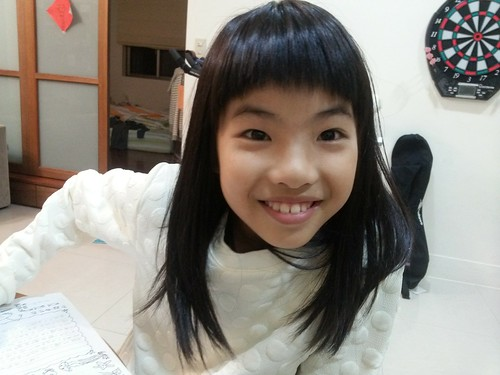
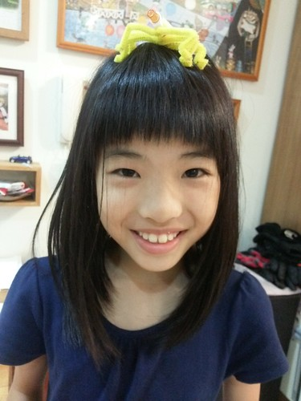
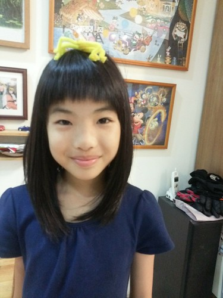
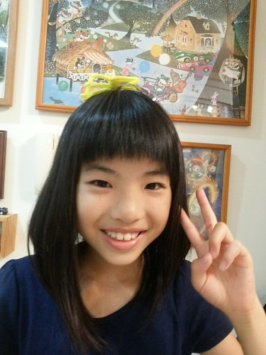

BLOG已經寫十年了... 蠻恐怖的數字 寫到徹哥早已不是當年可愛的娃而是燙手的青春期國中生 更別說當初還在肚裡的愛妹也已是亭亭玉立的女孩了 生活上有趣的事還是不少, 但隨著小人的定型定性其實更多的是日常與平凡 早已不若很久很久以前 小人會走路了 學會大便了 會寫自己名字了 會騎腳踏車了 開始上小學了...有那麼多令人感動 值得紀錄的芝麻綠豆大小事 BLOG還是莫名堅持地在寫 只是變成更多的家庭旅行紀錄 而小人的成長紀錄起碼重要的階段(日子)還是要繼續 為了留給以後的媳婦女婿們看...

愛愛期待很久的十歲生日 雖然只是多吃個蛋糕 但吃完蛋糕就如完成儀式般 宣告愛愛又更長大了](http://flickr.com/photos/33703965@N00/23254842089) 

11/25生日要結束前媽媽在FB上的紀錄: 逢五倍數可以吃鮮奶油蛋糕, 吹蠟燭的這一天 小女生整天笑咪咪, 喊著今天真是太開心 可是明明今天一切如常, 就連可以壽星點晚餐的福利也配合爸媽要帶便當的需求只是平日的四菜一湯(但點了最喜歡的豆腐肉餅,高麗菜還有煎蛋) 十根蠟燭,吸飽氣從左到右一口吹熄 生日禮物,只有每年總費盡心思準備的哥哥送上海報,漫畫還有親手做的生日卡 但這些就足以讓我們的寶貝愛妹妹帶著滿足與滿盈笑容進夢鄉~ (愛愛堅持要有滿滿鮮奶油的蛋糕才是生日蛋糕  本想自己來的媽媽在一次的烘烤失敗後還是決定交給專業) 

  (哥哥送上的禮物 禮輕卻情義重 最愛的偶像海報讓妹妹以後可以看著偶像入睡) 

愛愛生日前的那個周末, 班上的人物寫真主角剛好輪到他 小作文般的讓同學寫下對於這位主角的優點欣賞與祝福 作為三四年級同班的祝福與禮物 而這周的主角則很輕鬆的少了一份作業 因為是由家長來完成他的這一份 從嘉義回台北的車上  我們提出 欣賞著我們家愛愛的優點 爸爸說看見有愛的笑容就覺得充滿希望 真的! 愛愛的笑容有種莫名的感染力 哥哥說雖然妹妹很雞婆但是我的最愛 而且常保護我 真的! 其實徹哥跟愛妹都好重視對方 好喜歡對方 可常常也是最無情傷對方心的人 而媽媽很多的欣慰是 十年來愛愛一如我們當初取名時的期望與祝福是個充滿愛的小孩 真的! 謝謝愛愛是我們家的愛  很有愛的有愛 (徹哥代筆的全家福)  生日的前一周班上完成了模範生選舉 對於這件事媽媽的紀錄如下: "愛愛班上的模範生選舉總算在歷經二階段三次投票後結果揭曉 第一階段從五位選出二位進決選 二周後在班上三位同學請公假的前天行了第二階段投票 結果是班長二票領先副班長,三位請公假同學之後的投票將是關鍵 今天全班一起再投了一次票,結果是副班長贏了班長一票勝出 我問愛愛結果揭曉當下會難過嗎? 愛愛說不會啊!我有投副班長阿(一臉與有榮焉) 我問你有沒有想過如果你是投給了自己,那結果會是什麼? 愛愛說那就平手啦! 我說真的嗎?然後算給了他聽: 把副班長扣掉一票而班長加上了一票後... 愛愛總算才明白這一來一往的差距是2票! (班長的數學不太好) 傻笑說"沒差啦! 當模範生很累的(要當全班同學的模範)" 我說恭喜你! 沒被套上模範生這枷鎖! 如果你是模範生, 連阿母都可能偶而會說"模範生, 在家也要能..." 真的! 當我們全家最疼愛的愛妹妹就好~"  愛愛很厲害的真的完全不介意這件事 或許是這幾個月的班長生活讓她不想再多個身分束縛吧 我們笑她 怎麼沒有投自己 因為學期初班長選舉時 他投了自己 被我笑時還理直氣壯的說"為什麼不可以? 我覺得我可以啊!" 是! 沒錯! 想做的事的確應該積極爭取 可班長的壓力與繁忙超乎她的想像 雖然她不負自己與老師期望的做得很好 但她說 班長這件事讓她覺得投票給自己都沒好事 所以選模範生時完全不想投自己了 而且模範生在他們班是真的如被套上貞操帶般要做好榜樣的 雖然我總說小孩越大越不可愛 沒甚麼好寫的 但還是常很有感覺的拿出相機(其實是手機) 拍下當下漂亮的 認真的 搞笑的 令人感動的小孩   而對於自己內外在都越來越有想法主見的愛愛 也常會很喜歡自己的要我幫她拍照留下紀錄 十年 很快! 對於未來轉變也將很大的十年 愛愛充滿期待  喜歡愛愛不只是個作夢的孩子 也會努力讓自己朝著夢想前進 也期待接下來的雙十 愛愛實踐夢想 成長為自己所期待的大女孩樣   Good girl, love you~
