隨著七月中的畢業典禮過後  
讓人越來越深刻感受到"咱家的阿徹竟然已經要念大班"了  
是的...大班...混齡班中當了兩年的小蜜蜂 中蜜蜂後    
今年要成為班上的大蜜蜂 大哥哥了  
聽起來真的很嚇人說....  
   
3年多前第一天帶阿徹去上學 媽媽走出校門後打電話給徹爸邊說邊哭  
剛上學的第一個月 徹爸每天扛著哭哭徹丟進學校  
上學幾週後 阿徹會說"張有徹"會講句子會唱歌了....  
唉~ 一切似乎都彷如昨日才發生的說....  
怎轉眼間 今年已經是最後一次的在校生代表了  
日子過的快嗎? 很快!  
不是只有看別人養小孩過很快...自己養小孩日子過的更快阿  
快到讓人來不及細細回味珍藏....  
   
(畢業典禮兼英文表演發表會)  

中蜜蜂上學期老師對阿徹的學習表現評語為"好胃口方面表現傑出"  
而這回下學期的評語則為"活潑合群 長於繪畫"  
講真的老師得替班上每一個人想出這麼一句評語且每學期還得不一樣應該很絞盡腦汁吧  
   
(左圖為五月音樂發表會中舞蹈班表演服)  
   
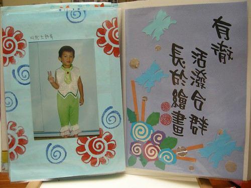  
   
講到好胃口 岔題講個笑話(其實也不好笑啦)  
話說阿徹在嘉義過一週的暑假時 從週一開始請假  
Freda在週四看到我時一臉無奈的問我"阿徹什麼時候回來阿"  
我說"下週 怎?啥事? 少了一個墊背阿"  
Freda恩阿了一下說"不是啦 是現在班上吃中餐時一片低迷 "  
"每個人的臉看起來都很難吃的樣子  問說青菜有什麼功能 沒人回答.... "  
"點名要吃飯第一名的回答  我自己很順的就說"阿 第一名沒來"..."  
我說"哈哈! 原來阿徹的價值在於吃飯阿"  
班上原本三個吃碗公的  二個畢業了一個請假中(就是阿徹啦)  
沒有那種狼吞虎嚥  搶著吃完好多盛一碗飯或一碗湯的同學刺激  
搞的其他同學都提不起興致吃飯了...  
總算...我總算找到阿徹在班上的存在價值了  
   
  
學校每學年都會發回一本學習紀錄照片 (上學期末會發回1週然後再收回繼續下學期的製作)  
家裡已經有4本了: 寶寶熊(幼幼班)第一年 第二年 咖啡熊第一年第二年(小班 中班)  
每次看著老師們的精心傑作總會想 這些老師應該真是愛小孩的  
要不然幼稚園老師薪水這麼低 工作這麼多  若不是真愛小孩怎麼幹的下去ㄋ...   
   
阿徹在家常三不五時拿出照片集或相本翻看  
很多的記憶靠著這樣的翻照片 mantain著  
所以誰說小孩是沒有記憶的  船過水無痕ㄋ  
老師們的愛會因著這些照片本一直陪伴阿徹長大的  
   
  
   
對於升上大班 阿徹的第一個感想是"以後不能跟\*\*\* ###玩了"  
然後似乎就是滿懷的期待了  
學校裡班上裡的最高年級   
學長"的身分也許真的讓人有點驕傲吧   
即使自己還幼稚似乎也該武裝成長大董事的大哥哥樣  
   
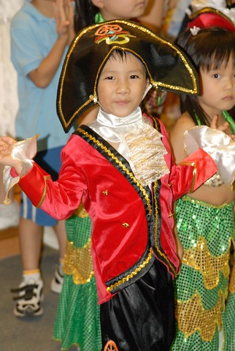  
   
接下來的一年一樣要繼續拜託Freda多多關照了  
不乖 / 沒寫作業 / 打人 / 上課不認真 就給他"噹"下去別客氣啦!   
   
其實我們真的是超懶惰又不積極的父母  
對於 ABC 對於ㄅㄆㄇ 或數學等正規課業學習  
保持著超隨緣 甚至沒啥要求的態度 (講穿了真的是懶吧)  
總想說這些等長大後自然就會了  
所以對於阿徹在學校的要求只有 不管做什麼事要認真  
不可以打人還有要跟同學好好相處  
  
其實阿徹的課業學習速度與吸收力算是有點慢  
總要比其他同學多練習幾遍才能稍微記得  
也總需要老師在旁邊盯著才會認真的拼字  
也許這是我們父母的態度所造成的結果  
但也也許這是阿徹的節奏吧 開竅開的晚(其實媽媽小時候也開的很晚的)    
   
只是講真的 阿徹升上大班後媽媽開始感受到壓力  
學校開始教ㄅㄆㄇ的拼音 練習筆劃  
作業份量又比中班重了一些(其實也都只要寫10分鐘左右就好了)  
連Freda似乎都有點明示+暗示的希望家長在家能多盯一點  
雖然我依舊厚臉皮的跟Freda說"還是麻煩你繼續多釘阿徹一點了"  
但自個心理也明白家庭這一環是很重要 責無旁貸的  
所以媽媽決定也要積極振作了....  
阿徹寫完作業後要仔細看過 且跟阿徹討論後(那個字寫的美 那個音怎麼念)才能准他放進書包  
哈哈! 就這麼點小事卻講的像是自己做了多大的讓步  
其實大部分的家長本來就都這麼做的吧....  
大家好奇我之前怎麼做的嗎?  
就是阿徹自個寫完作業後放進書包 我都是臨睡前才翻看的...因為要簽名阿...  
關於這"無為而治" 我與徹爸又有理由可以說了  
我們二人深深覺得現在小孩都被督促習慣了  
想我們小時候誰叫我們寫功課 誰叫我們唸書 誰幫我們複習功課  
所以等阿徹自己開竅的一天吧....   
   
雖然阿徹偶而還是對於鋼琴有幻想  
但等大一點定性夠了 願意認真認音符記譜再說了  
心癢的時候就帶去美賢阿姨家敲敲玩玩 過過乾癮   
   
除了吃 阿徹的另一個強項就是玩  
常有讓人噴飯的創意之舉  
自製的遁甲與寶劍 (左手是徹爸指導的忍者飛鏢)  
   
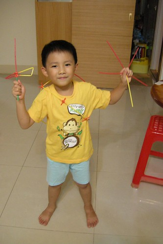  
    
武士的背影...  
當阿徹很奮力的自個想辦法要把遁甲穿上身時  
我還用疑惑的眼光看了這不知道在忙啥勁的小子一眼  
當他全副武裝好之後才又明白自己又被他給打敗了  
   
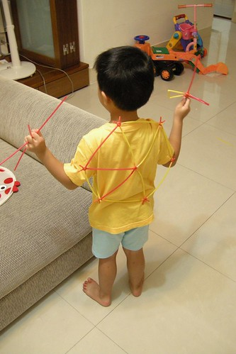  
   
上了一年的舞蹈課 認真擺起姿勢時還是給他有"架式"有優美的啦  
那一長串是阿徹做的數個打蛋器  
原來打蛋器接起來後還可以當彩帶跳舞用  
   
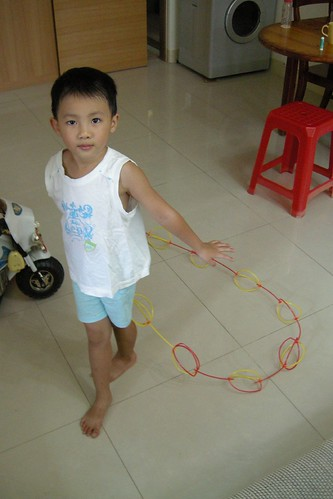  
   
阿徹現在很心愛 每晚要陪伴著睡覺的小熊"小波"   
妹妹的無尾熊叫小花  
阿徹說 她們是小波小花的爸爸媽媽  
我與徹爸是小波小花的阿公跟阿嬤  
   
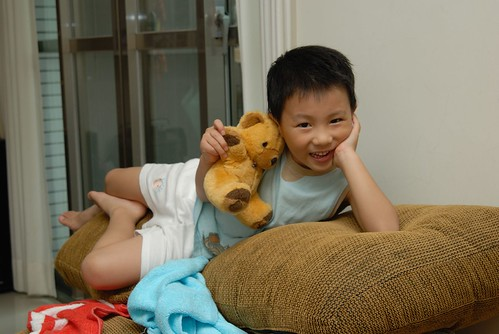  
   
很調皮的小波爸  
   
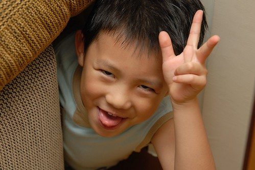  
   
很搞怪的小波爸  
   
  
   
這樣的笑容不知道還能持續幾年  
可不可以上小學後還能這樣笑 這樣玩  
   
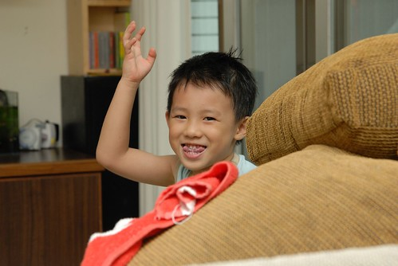  
   
對於大班這事 其實媽媽最害怕最擔憂的是  
小孩越來越不可愛而我自己也跟著變成虎姑婆了  
   
這身又是阿徹自個打理的舞蹈服  
   
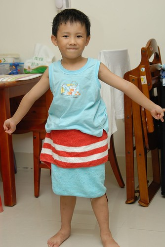  
   
自己玩不夠 連妹妹也慘遭他毒手 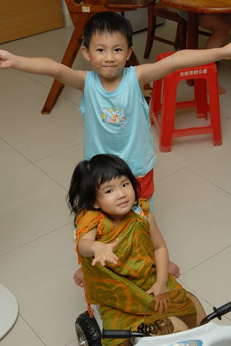  
   
"愛愛 你喜歡這裙子嗎?"  
   
  
   
"愛愛 我們來上課..."  
   
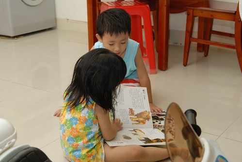  
   
"愛愛 我們來玩爸爸媽媽遊戲"  
   
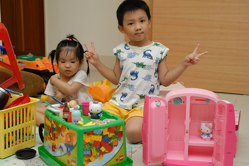  
   
有阿徹哥哥的日子真的不無聊  
希望升上大班後的阿徹哥哥還能一直這麼不無聊...  
  
(中間三隻是下學期陶土課的成品 遠看還蠻可愛的啦...)  
