"花75鄉道也就是「卓富公路」  在地圖上與台九線平行著 北起卓樂 過了卓富大橋後 一路向南 路順著中央山脈的腳踝走 輕輕地劃過玉里鎮與卓溪鄉的邊境， 也把卓溪四、五個布農部落連接了起來  串聯了卓清、白端、卓楓、崙天、石平…幾個部落" 我文筆沒那麼好也沒那麼博學 以上全濃縮摘錄自花蓮旅人誌(我的行為越來越像fans了) 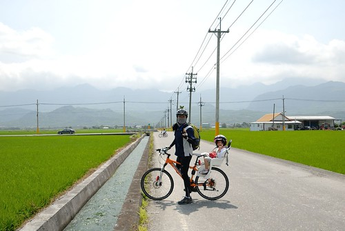

離開南安遊客中心後我們順著來時的台30回頭走 過卓樂轉往花75鄉道 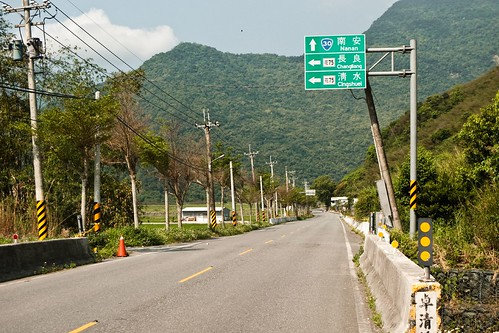 

沒錯 就是鄉道 甚至說它是產業道路一點也不為過 來往車子很少 兩旁都是稻田 只有在沿路的幾個小社區小部落裡見著人影 旅人誌作者下面的這段話是吸引我來這條路的原因 "喜歡放慢速度在這鄉道上騎車或開車 這產業道路上有我想要的清閒…。 站在「花75」路上 有一種構圖能力被重新矯正的感覺 城市裡的擁擠 讓眼睛塞入了太多 現在 視野又寬又遠" 很美的一段形容 尤其是"清閒"那兩個字用得真棒 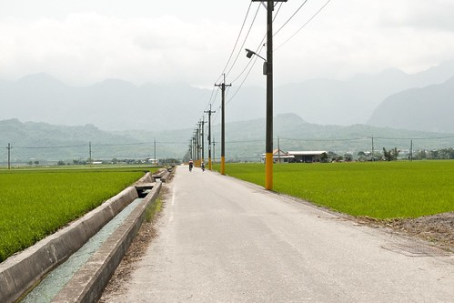

途中經過的幾個部落我們並沒有多做停留 只是左右張望地慢慢騎過去... 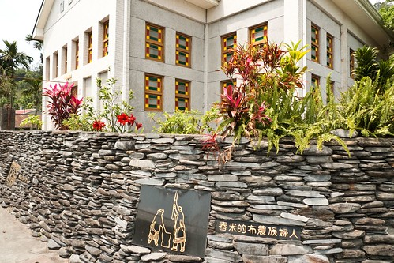

直到卓楓部落時 我們才停留在卓楓國小休息用中餐 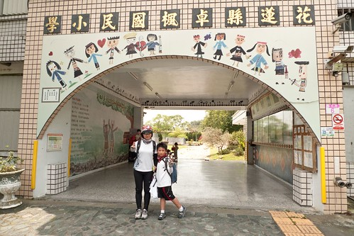

這是間感受到濃濃部落特色的小學 川堂牆上的族人熱切的歡迎著我們(這樣也算自我感覺良好吧) 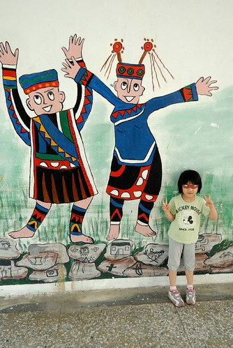

川堂裡最吸引阿徹的是這篇作文 阿徹問為什麼要用打獵來形容 為什麼國語是山豬 數學是猴子... 我說因為他們的族人很會打獵 所以希望自己上學就也像爸爸打獵那樣厲害與豐收 而山豬 猴子 飛鼠 則是他們打獵的對象 至於為什麼國語是山豬 數學是猴子 比喻嚕 停留的時候阿徹來回駐足觀看好幾遍這作文 不知道那時他的腦裡在想些什麼... 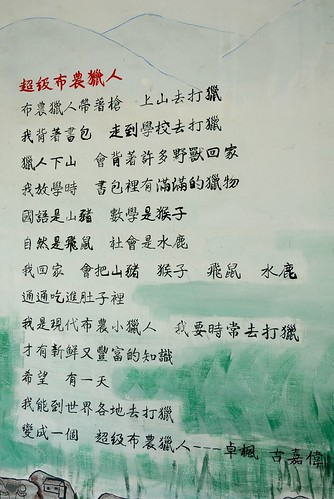

過穿堂後的校園裡立著一個"日用三晷" 可以從影子的方位知道現在時間 現在是11點30分 這還是我們第一次見到 很有趣 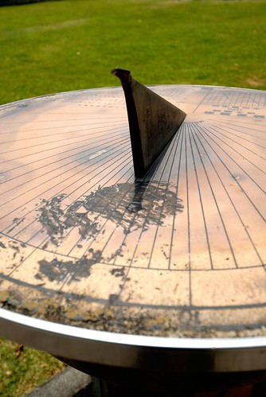

卓楓國小裡原本有座代表部落特色的石板屋 但現在已經傾倒 與我們聊天的部落族人說 如果有人住的話 房子就不會這麼快壞了 因為沒人住所以容易壞 原來房子的生命力某部分也來自於住的人的生命力阿 雖然沒能看到保留完整的石板屋有點小小失望 但族人推薦我們可以到校園裡的涼亭或是石板桌休息 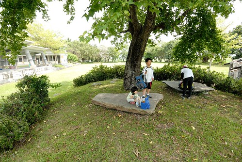

於是我們不客氣地在這美麗的校園裡野餐了起來 

4個御飯糰 4根香蕉2顆蓮霧是我們今日的午餐 再配上冰涼的礦泉水以及豆干 鱈魚條做小點心 

好像很克難的中餐 但這是騎車時最爽口又方便的中餐 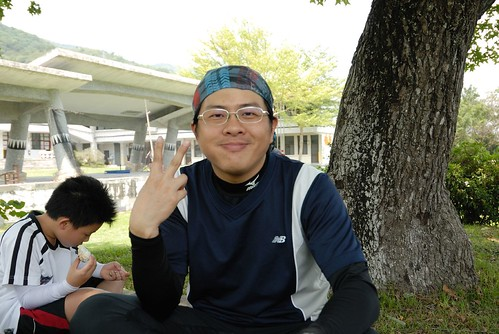

雖然原本吃飯的地方風景很優美 可是因為有小蚊子而且通風性反倒沒在川堂好 因此我們一家子又混回川堂裡 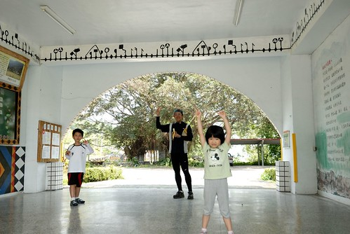

川堂裡有個周董的立牌 這兩天在花蓮騎車常看到這個立牌"No Smoking" 難得可以四下無人 好好地跟周董合照一張 我當然要三八地來一張嚕 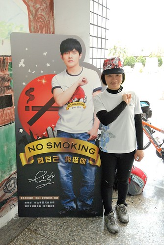

愛愛說她也要 (愛愛 你知道周董嗎? 要不然湊什麼熱鬧阿) 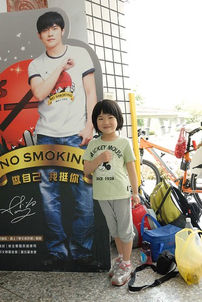

我們超級當自己家的午休了起來 

我跟徹爸各據一個柱子靠著休息 其實也沒睡著也沒閉上眼睛 就是覺得好放鬆 好輕鬆 

愛愛閒不住地在川堂裡跑來跑去 最後連鞋子襪子都脫了 甚至還跳起舞 做起操來 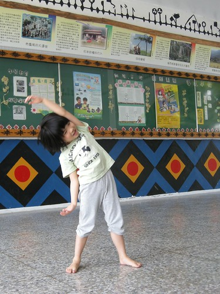

愛愛超High地 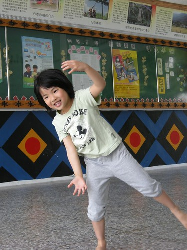

休息的時候當然又讓兄妹倆玩個Angry Birds鼓勵一下 (哈! 其實連我也脫鞋子了....被愛愛穿著跑) 

哥哥玩完換妹妹玩 不要搶才可以皆大歡喜喔 玩完後我們也要結束一個多小時的休息再度上路了 因為實在太舒服了 舒服到鬥志都快流光了 得趁著還有點鬥志趕緊再上路 

再上路時是正午一點時分 太陽烈阿! 曬阿! 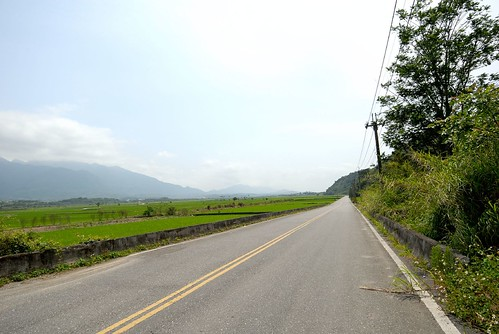

我們只能冒熱 咬牙努力地踏著 

不過有風的時候會覺得太陽曬得好舒服 

崙天部落那段田是我們這回賞道行中稻子長最高的 加上剛好吹著不算小的風 吼! 這就是傳說中真正的稻浪啦 

前一天徹爸聽到我跟阿徹說"稻浪" 不知道是沒放心上還是進不到他心坎裡 壓根記不住這詞 這時後徹爸問"你們說這是稻什麼阿" 我們說"稻浪啦" (連低級小學生都知道的哩) 稻草夠長時 風吹過時 像不像海浪般的潮起潮落且稻波粼粼 閃閃動人...徹爸努力地想要拍出這感覺... 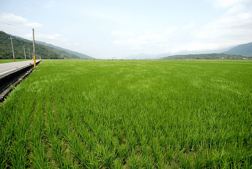

途經過一處涼亭時 看到一個阿姨帶著姪子在涼亭李吃冰淇淋(怎麼知道她們不是母子 當然是聊天的嚕) 然後小男孩拿出小涼被躺在涼亭椅子上準備睡午覺 我說這未免太幸福了 在這涼爽的天 美麗的風景前 吃便當 冰淇淋然後午覺 看的我們好羨慕阿... 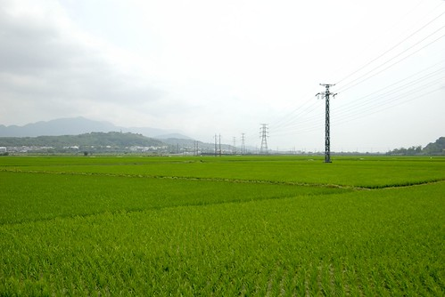

羨慕著人家睡午覺 而我們的路卻是越來越起伏越吃力阿 尤其經過最後一個石平部落後 那個路起伏的都可以媲美193了 

去年八月來賞金針時我們便曾開車來花75探勘過 當時覺得真是路緩 車少的好路阿 可是實際騎下來還是會小累的說 除了因為開車跟騎車的感受度差很大外 北往南真的比較耗體力吧 最慘的是就在我們一直覺得即將出運抵達台東的時候 最後竟有一座山考驗著我們... 我跟徹爸說如果這山得爬個2-3公里 那阿徹大概是撐不下去了 偏偏徹爸這回行前沒有認真做功課(徹爸覺得就是75騎到底 路沒有什麼)既沒印出高度表也不知道這山到底有多高路有多遠 因此保守的我們最後決定回頭切回走台九... 徹爸回家後上網查了地圖 原來我們只要再爬600M就過那座山了 真是扼腕阿! 切回台九後車多太陽又大(台九上的太陽真的比較大說) 但也別有一番景色 

尤其在這高架橋最高點處俯視的這片田 平坦的像是一片片的綠地毯 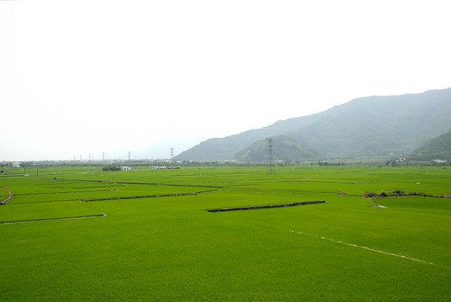

稻田 鐵道 最好再加列火車 是花東風景照的經典三大元素 可惜就在我們把相機收起來後 才剛好有列火車駛過  煞那我的臉上出現好多條線 -.-"" 

每次騎車切回台九後 都會有種想要趕快結束這一切的感覺 一家子拖著剩餘的力氣 數著碼表上的累加里程數 ㄍ一ㄥ著努力地踏...尤其是阿徹 一臉的"累"與"撐" 不過可別小看阿徹了 此時他的"堅毅"表現會讓我們很心甘情願地加碼給他的慰勞獎 

看到這一大片稻田還有稻田中的土地公廟 我忍不住大喊"我們到池上嚕" 再不用多久我們就可以抵達民宿 完成我們此回的騎乘嚕! 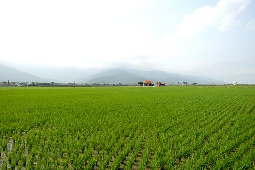

(看到這一幕 讓人有種好安心 好安心的感覺...) 

在民宿沖涼休息過後  我們去7-11兌現阿徹今日的慰勞獎  思樂冰一杯! 雖然在民宿時已經喝了涼水 但阿徹說無論如何他今天一定要喝到思樂冰 瞧他一臉滿足的表情!  辛苦過後的思樂冰也特別好喝吧!  恭喜阿徹 你又完成一次的旅程與考驗了! 
