在幾年前其實我對於花蓮是沒有很愛的 我愛的是台東而花蓮不過是往返台東必須停留的點 因為覺得北花蓮已開發的過度觀光 而南花蓮也永遠都是開車從台九駛過而已... 後來因為網路上看到花蓮旅人誌([www.hl-net.com.tw/](http://www.hl-net.com.tw/))的關係 我瞭解了更多我所不知道的花蓮 也更好奇及欲探訪作者筆下的一景一物 特別是南花蓮 這回的賞道行若要說是我這"迷"的追星之旅一點都不為過... 台30 卓溪 南安 花75... 那些我常在網路看且早已follow很久的地方 總算我也來過了 或許因為這樣 這回的旅行中我特別多的感動與感觸吧!

第二天早上我們七點起床 七點半吃早餐 完全照平常在家的作息 民宿準備了早餐有4人份的 超多料三明治 微量水果芭樂以及香濃的豆漿(這豆漿把早餐分數提及格了) 雖然不喜歡吃 可是媽媽說要吃飽飽才有力氣喔 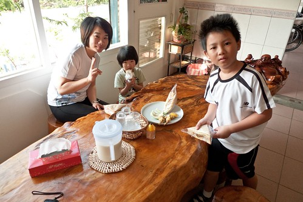 

吃完早餐再去seven補給好今日中餐的飯團後 從玉里開始我們今日的行程 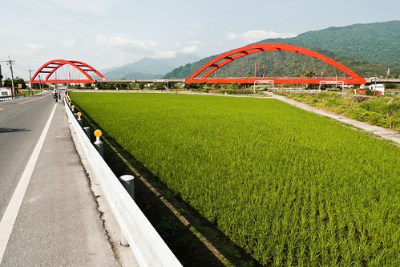

今日依然是個艷陽高照 野花遍地開的好春日阿! (4月騎車真的比7月涼爽 舒服許多) 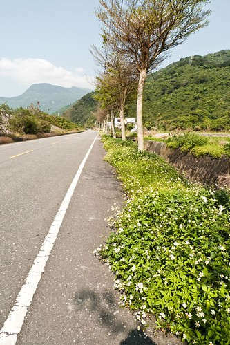 今天主要是要走花75到池上去   不過轉花75前得先走一小段台30 而台30的東段原來就是跨越海岸山脈的玉長公路(就是安通溫泉那條路)

而瓦拉米鐵馬道是由玉山國家公園南安遊客中心所劃出來的路線

路線其實就是台30線 由玉里至八通關越嶺道入口台30線的起點為止 原本的行程中我們並未打算多走台30到南安遊客中心的 但因上網查看稻浪情形時 看到好多的網友極力推薦南安遊客中心前的稻景是前所未見的最棒 我們當然就把南安遊客中心給加進來

旅人誌裡這樣介紹這條路 "四月的小葉欖仁剛吐新芽，一整排的清翠，排排站列隊歡迎我進入「卓溪鄉」。 我從玉里客城沿著台三十線騎來，往山裡騎，騎在「瓦拉米鐵馬道」上， 山谷的水田裡，幾台插秧機正勤奮地忙碌著， 騎來輕鬆愜意，田綠、山也綠， 這路像是卓溪的示範道路，來卓溪我會建議先到這裡…。" 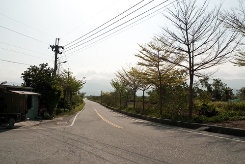

途中經過一個土地公廟 我刻意下車合手拜了一拜 祈求祂保佑我們的旅行一切平安順利 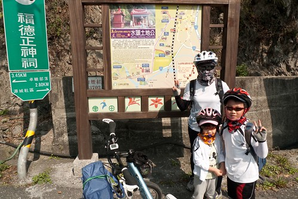

或許照片看來我們這回所拍的照片都差不多 一樣的稻田一樣海岸山脈 看的膩不膩阿?! 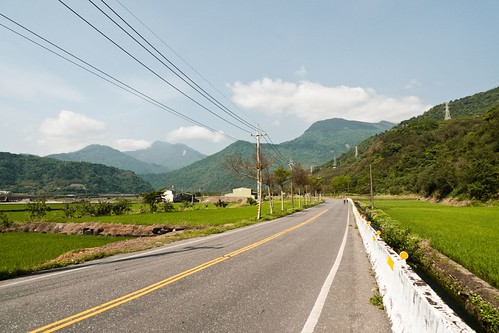

但想像一下風在耳邊吹著 在臉龐拂過的感覺...尤其是下坡的時候... 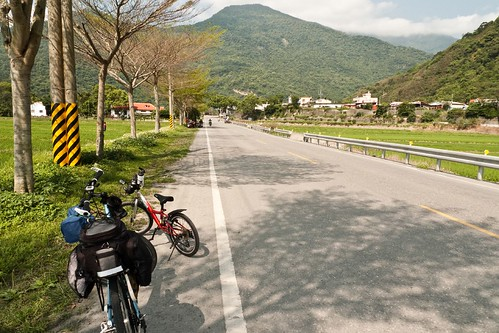

真的是讓人會上癮的棒! 而且精力百倍的棒阿! 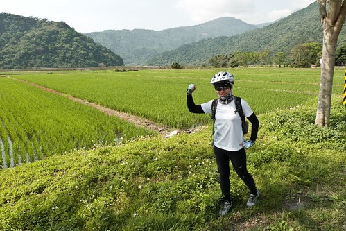

到南安遊客中心前的9公里路平緩好騎 尤其是在這樣宜人的春日裡 停好車 走到遊客中心前的平台上 迎接我們的是這片田 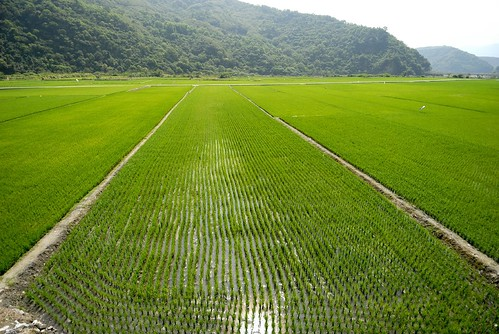

我們靜靜地看著這片延伸到遠方山腳下的綠浪 聆聽著風的聲音 鳥的聲音 還有自己騎車後的心跳聲 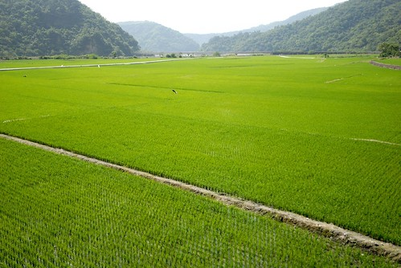

聽說遊客中心內有台灣黑熊的影片 所以我先帶著阿徹小愛進遊客中心尋寶去 服務台的先生看到東張西望的我們問了聲"要看影片嗎?" 我說"好啊 可以嗎" 先生說"可以阿 現在剛好是時間啊" 我看看手錶再看看視聽室門口的放映時間 對揶! 真巧 剛好是開始放映的9點半哩  那我們就不客氣嚕 (先生還很好心問還有人嗎 然後幫我們轉達給後到的徹爸) 等我們坐下來 影片開始放映後 我們才意識到 哇! 我們包場耶! 感覺真是挺酷的... 就像在武陵一樣 會去看生態影片的遊客比例實在很低  不過我們家尤其那個小學生很愛看說 雖然沒有台灣黑熊而是玉山國家公園的鳥類介紹影片  我們還是看的很過癮 我們發現小鳥的顏色都純的好漂亮喔!   那種紅 那種紫 我相信沒有任何的紡染技術可以做的出來 真的只能說 萬物真的很奇妙 大自然真的很magic 

看完20多分鐘的影片後 我們又在中心內玩拓印以及蓋章的遊戲 當阿徹他們念著想拓印時 我還苦惱一下該去哪生紙阿 所幸服務台的先生又拿了兩張專屬的紙給我們 一面是兩格可拓印的 一面是可蓋13個相關生態章的 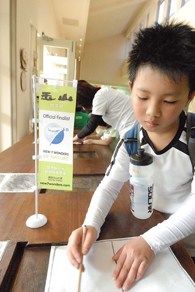

小學生阿徹自己完成所有 而愛愛則在我的幫助下完成 這又花了10多分鐘(時間在消磨真的很快) 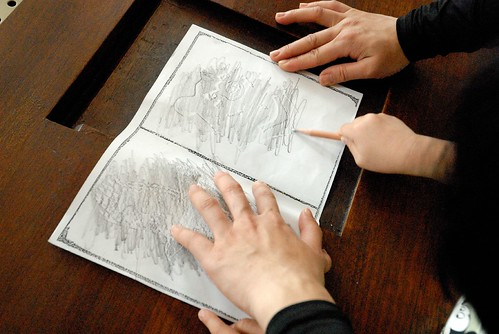

遊客中心內的桌上擺了幾個票選玉山的小旗子 有夠可愛的  徹爸偷偷念了好幾次"我好想拿一個回家喔" 雖然旗子沒有保育 不過真的不好不行啦! 所以拍個照留念一下就好 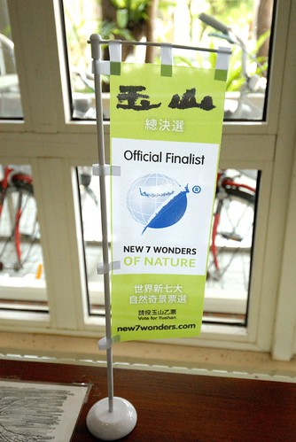

從玉里鎮開車到南安遊客中心應該不用20分鐘的車程 算是很親民的國家公園遊客中心 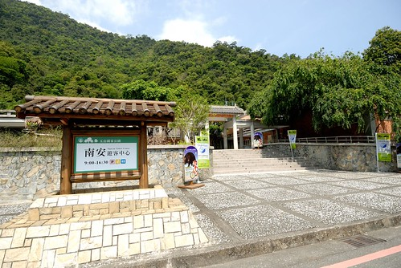

有機會到玉里玩的話 可以轉台30來這走走 看看稻田看看影片 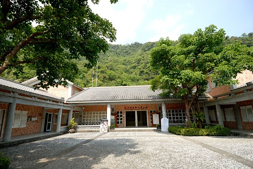

而遊客中心也有車況很好的腳踏車免費借用  就自己能力想騎多遠就騎多遠 難得地在山谷裡 在稻田旁 輕鬆愜意地騎著 不過小心不要騎到黑熊住的地方喔 呵呵! 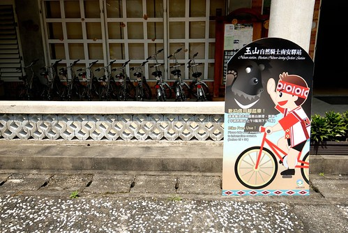

中心內用木材 用樹枝 簡單線條做的貓頭鷹圖案也有夠可愛的 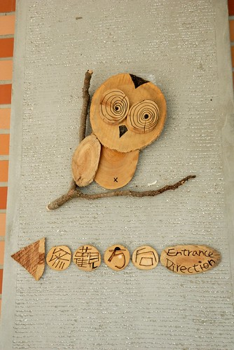

還"青"人勒~ 呵呵 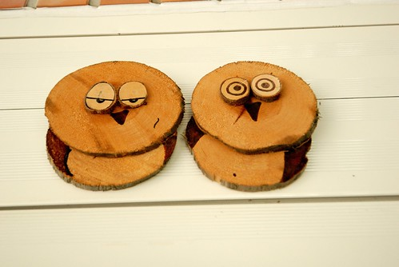

在我們停留的時候 中心旁的草地上剛好有部落的聚會活動 不知道是在慶祝還是在彩排什麼的唱歌跳舞著 所以我們不時聽到好聽寮亢的原住民音樂 甚至還有聽到布農族最有名的八部合音喔 雖然我們只是遠遠的看著聽著 但我覺得這也是我們旅行中遇到的幸運之一 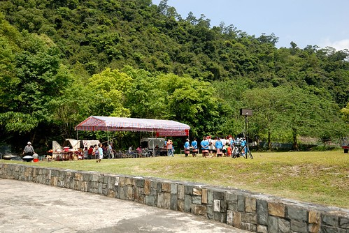

遊客中心再進去有南安瀑布 本來是打算騎到這看完瀑布再回頭的 但後來我竟完全忘了這檔事 而再進去約6公里 台30的底端是八通關古道的入口 原本出發前我還肖想著當日看氣勢或許可以拼到那喔 可是這回騎車實在愜意到有點沒戰鬥力加上網路上說過瀑布後是很陡的山路  所以我們還是認命下山吧! 沒關係 以後有的是機會 再不然以後也是可以開車來這專程去走古道!

回程前 再駐足好好地把這片田烙印在腦海裡... 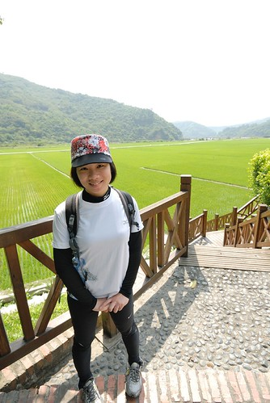

清晨或黃昏時分 應該又是更加美麗吧 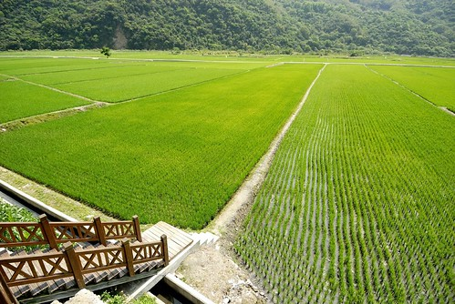

沒關係! 還有很多機會看四季 晨昏不同變化的景緻 就像看自己的孩子怎麼會膩ㄋ 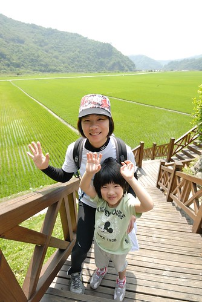 

(這不是徹爸的自拍 是阿徹拿著小兩幫我們拍的 阿徹的單眼處女照) 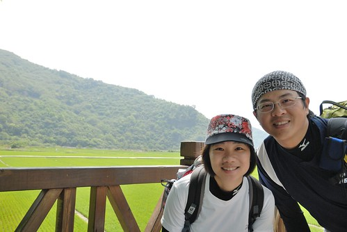

要讓小孩認識這片土地 認識不同的族群 最平凡但卻最有效的方式就是這樣帶著他們慢遊 很慢很慢而且還很沒有什麼的遊~ 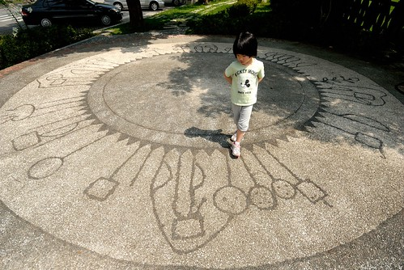
