上週日阿徹被一個安親班同學邀請去家裡參加party(徹爸說現在小孩果然了不得 小小年紀就有party了) 聚會結束我去接小孩時 同學媽媽對我說: "我們每天都會聽到阿徹的事情 熟到連樓下阿姨都知道阿徹這號人物 都以為是個調皮搗蛋的男生 結果沒想到阿徹竟然跟她們想像的完全不一樣 會跟女生玩芭比 會照顧妹妹" 真的啦! 我們家阿徹其實是個好小孩 好男人的... 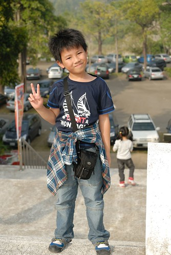

邀請阿徹的安親班同學是上學期因為一起排路隊走回安親班才熟稔的同年紀小女生 一起排路隊前兩人關係很陌生 後來阿徹說"我覺得跟XXX聊天很好玩" 又再過一陣子又說"我跟XXX現在是好朋友 我們路上都會吱吱喳喳講不停" 又再過一陣子果然阿徹開始抱怨"我今天跟XXX吵架...的"  我說你每次都這樣跟女生相處久之後就很容易閒人家煩.. 而到同學媽媽傳簡訊邀請阿徹去家裡玩的前幾天 阿徹才氣沖沖的跟我說"我今天差點跟XXX絕交.." 因此接到邀請時我跟阿徹說"你前天才跟人家說要絕交 結果今天就又興沖沖的說要去人家玩.." 阿徹說"差一點絕交而已又沒有真的絕交..." 唉! 真的 阿徹其實一直很喜歡跟女生玩也很能融入女生中 但是阿常常太在乎女生 當女生小團體出現而阿徹被排擠時 阿徹總是又氣又難過 跟我邊罵邊哭但又放不下 每次看到這樣我就覺得阿徹以後被女生吃死死的機會很大  只能心中祈禱以後他能遇到像她媽媽這樣的好女生阿 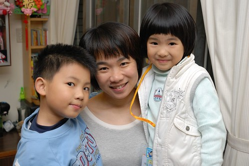 

這是阿徹目前生活中有最多交集的小女生: 每天一起吃睡的愛愛妹還有每天一起走路上學的洪同學 (元宵節那晚上的頂樓提燈籠) 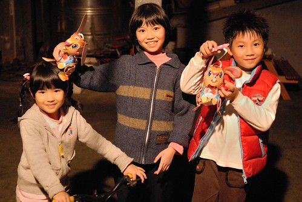

有時後會覺得阿徹不夠堅強 但有時後卻會感動於他的傻 徹爸常看著看著只能說"你喔~" 然後在他背後投予一個超級溫柔的笑臉(只有我這媽看到) 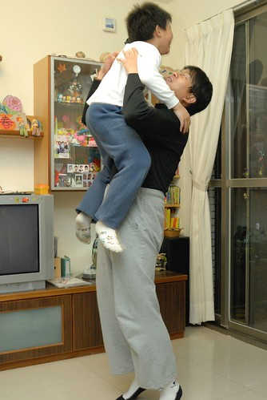

雖然爸爸疼女兒 但我知道徹爸一樣對阿徹好 只是好的方式不一樣(有時後是真的機車了點) 而且徹爸常說"阿徹真的很像他" 所以或許徹爸很能明白阿徹的內心世界 對於他的表現/發展也自有一套看法 因此我也要學著像徹爸說的 或許不要管阿徹 讓他去 是最好的... 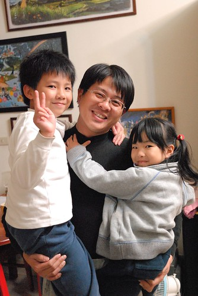

不過小學生阿徹是真的有越來越不一樣 越來越長大了 寒假時竟然一口答應我要自己去Y17上課(當然還是我接送)  我跟徹爸都很訝異 徹爸說阿徹真勇敢 竟然敢自己一個人去陌生的環境 誰都不認識的地方上課 (上了8天課) 要他都不敢 我想阿徹越來越明白自己想要學習什麼 嘗試什麼 從一開始只願意報名她最有興趣與自信的美術類課程 到最後的不亦樂乎開始央求暑假想要上直排輪 上什麼什麼... 勇氣也變大了 我相信有勇氣的人生 樂趣與機會也相對會增加許多的 兒子加油! (最後幾天課是下午半天課 早上跟著媽媽去上班 攝於媽媽辦公室) 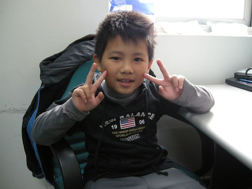

去Y17參加寒假課程時最後阿徹帶了相機要去紀念 結果搞了好幾張自拍 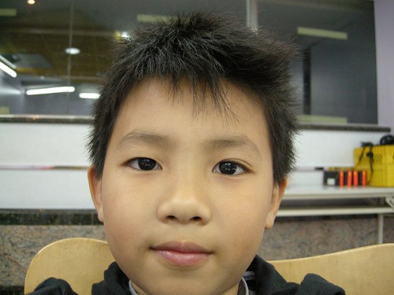

樂高課程作品紀念 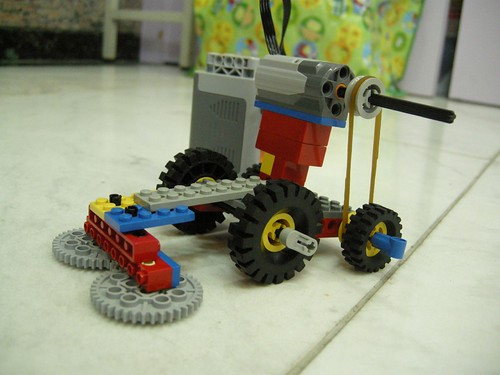

228假期回嘉義的路上跟愛愛兩人在後座也照的不亦樂乎 自拍一 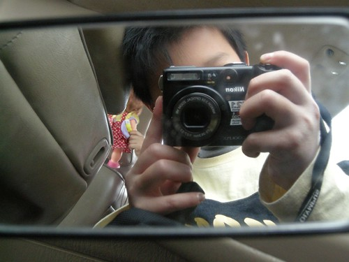

自拍二 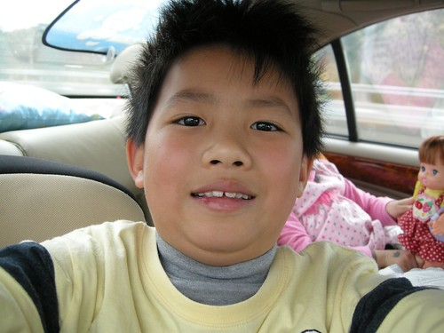

幫愛愛照 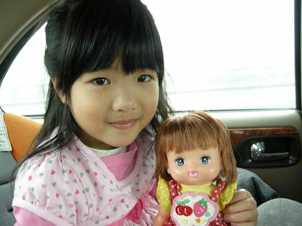

去年底聖誕節跟今年初生日的禮物 掙扎選擇許久後阿徹都選擇了小樂高 所以偶而可見阿徹一個人靜靜的拼著樂高 沉浸在他的樂高世界裡 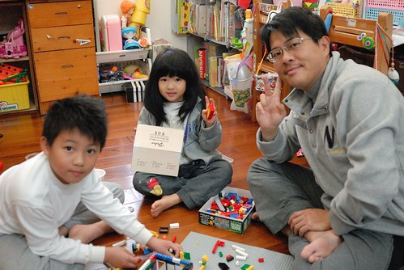

看阿徹的作品是件很有趣的事 (我也超愛看阿徹學校造句單學習單閱讀單上的插畫 超寫實有趣的) 相較媽媽的變不出花樣 阿徹的花樣真的很多 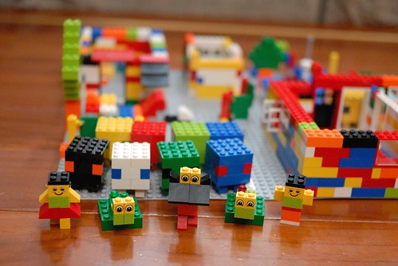

(樹旁就是電腦桌椅喔) 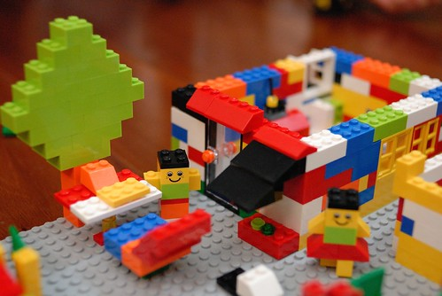

(窗台上的小花圃) 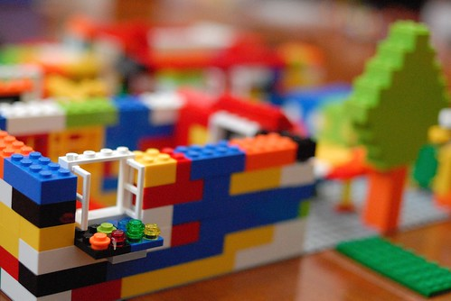

我跟徹爸不喜歡主題式樂高 因為這樣的基本款才更能激發顯現小孩子的創意 色彩繽紛的樂高積木絕對是阿徹童年回憶裡重要的玩具之一  (還挺羨慕他的說 我們小時後都沒有.........) 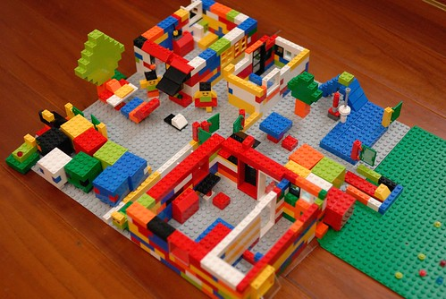

這是過年前 我難得花這麼久的時間 兩小時跟她一起完成他的寒假勞作作業 對於自己的作品要如何呈現小子超有想法超堅持的 我想這就是阿徹自己的自信吧! 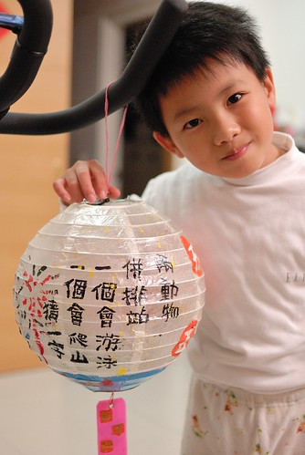
