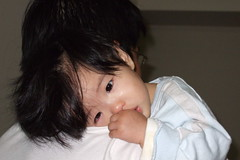
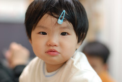
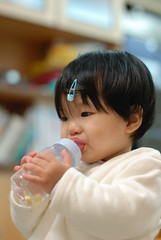

上週四趁著小空檔帶小愛去打了流感疫苗第二劑  
因為小愛曾經有打五合一發燒的紀錄  
加上我自己前年打了流感疫苗後感冒的不好印象  
實在很擔心打流感的副作用  
可不打又不安心...唉

打完的哪個半夜 小愛發燒了  
心裡實在忍不住嘀咕"啥疫苗 又發燒"  
但還是只能想也許小愛的體質容易發燒吧  
塞了半顆退燒塞劑 應該可以退燒好眠了  
結果週五早上還是燒 中午也還是燒  
打疫苗燒了一天實在有點怪 有點嚇人哩  
帶去看了醫生 喉嚨沒有紅腫  
無法釐清到底是感冒還是打預防針造成的發燒  
只能拿了退燒藥持續觀察  
如果燒退了也許真是因為疫苗造成  
如果其他病兆出現了 那就是錯怪疫苗了

週六早上還是ㄏㄤㄏㄤ的  
而且前一晚半夜12點起來嬉戲到3點多才再入睡 早上卻又7點多就起床  
不管是生理 心理狀況都不太好  
可是因為跟阿伯還有香香公主的約會推不了  
只好還是坐著阿伯的豪華轎車去八里吃海鮮 逛十三行博物館 喝下午茶  
一整天胃口超不好 東西吃各一兩口就吐掉  
看到奶不是搖頭不要 就是喝了一兩口就推掉抵死不要  
誇張的是明明滿臉疲累的小愛整各白天竟也沒再入睡  
看她這樣不吃不喝也不睡 實在有夠心疼  
回程的路上 小愛果然爆發了  
狂哭不已 不管怎樣安撫都沒效  
套徹爸說的打小愛出生到現在從沒這麼哭鬧難搞過  
難搞到爸爸媽媽也相互槓上

  
  
  
晚上再帶去看醫生  
醫生檢查喉嚨發現靠近舌根附近有幾個潰傷破洞  
"典型的腸病毒 咽峽炎"  
原來發燒 哭鬧都是為了這  
也原來因為這些破洞讓小愛食慾不佳甚至口水直直流  
醫生說"這幾天胃口會很不好喔 想吃什麼就讓他吃 冰的也沒關係"  
是的 沒錯 只要小愛願意吃就好  
回家灌了一包藥 那晚大家總算都好睡多了  
隔天醒來 小愛精神好多了 奶也願意多喝一些了  
不過溫的太熱的奶不行 對於溫到只有不冰的奶比較捧場  
回陳嬤家時 試探性的餵了幾口碗稞  
沒想到阿嬤做的滑溜碗稞竟然讓小愛願意吃掉1/4碗  
於是又打包了兩碗回家吃  
那天晚上小愛貪玩的不願意睡覺  
徹爸說"調皮表示應該恢復的差不多了吧"  
  
這幾天小愛史無前例的超番  
尤其吃定爸爸  
每次爸爸要哄他睡覺就得經歷幾個步驟:  
小愛大哭 -> 給他奶嘴不要 哭的更大聲 -> 抱著她到電視櫃上選擇他要的東西  
\->拿著媽媽的眼藥水 安靜 當奶嘴咬 -> 慢慢靠在爸爸身上睡著  
\->小心翼翼的放到嬰兒床 驚醒大哭 -> 重新抱起安撫  
就這樣往返3-4次 才能讓小愛安穩的睡在他自己的床上  
真是辛苦徹爸了  
不過誰叫他認你這個前世情人ㄋ~呵呵

  
後記:  
週一在媬母家願意吃麵條也不會超黏人了  
回家後也吃了一片蛋糕跟1/3碗碗稞 食慾恢復表示應該復原8-9成了吧  
只是那晚換哥哥小小發燒了  
不~會~吧~  
趕緊帶去看醫生 咽喉附近有點紅腫但尚未破洞  
(腸病毒典型症狀尚不是很明顯 所以醫生沒有通報衛生局  
 如果真的確診通報 就得在家隔離五天不能上學)  
希望及早的吃藥可以不要讓病情惡化  
這樣一個接著一個搞 給他粉累說  
而且爸爸媽媽最近工作小忙實在無法讓阿徹在家隔離  
不過幸好阿徹這兩天除了小拉肚子跟胃口稍不佳外  
精神跟睡眠都一切Ok  
菩薩保佑 菩薩保佑阿~
