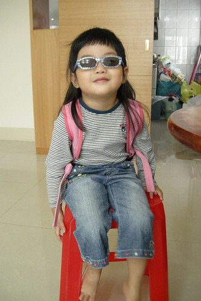
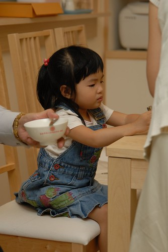
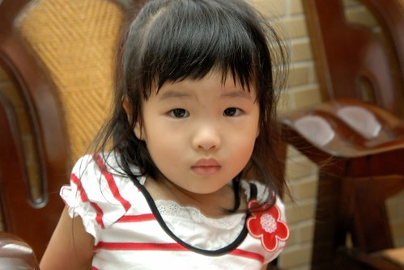
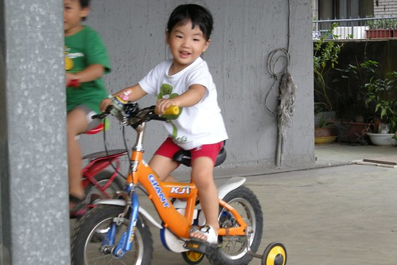
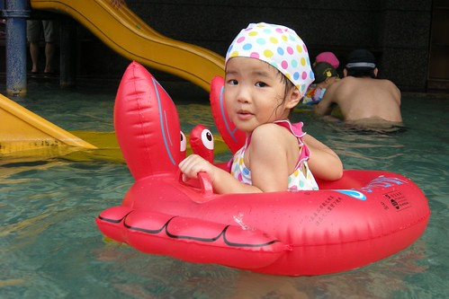
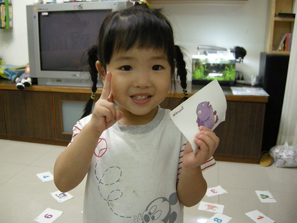

小愛最近在語言表達方面似乎又進入另一個層次了

使用的詞彙越來越多 連接詞/語助詞也用的越來越順

例如

我也想要…，只是（可是）…

好吧! 那我就…. 反正我也不....

不是這樣吧! 媽媽，你搞錯了吧!!! (對爬到床底下撿東西的哥哥) 小心點喔! 你的頭不要撞到了...

而小小腦袋瓜的邏輯思考也不含糊了

常常說的頭頭是道雖讓人捧腹大笑卻也無法反駁

這時候小愛的模樣就真的像是個長大了的大姐姐

雖然小愛常很得意他是大姐姐了

“我是大姐姐了所以我綁頭髮不會亂動”

“我是大姐姐了因為我有抱小弟第”

但小愛卻也常耍賴的只想當小姐姐

例如跟他說你是大姐姐了所以要自己走他會說”我是小姐姐(小baby)而已”

反正小姐姐還是大姐姐都是她說的就算…

對於每星期的活動也越來越有概念了 知道禮拜四有舞蹈課 三不五時問著今天是星期幾 如果知道明天是星期三  會叮嚀星期三要穿運動服 而星期三一整天便開始開心明天就可以上舞蹈課了 上到禮拜五換開心著再上一天課就可以放假了 所以越來越難呼巄她 隨便打發她了 很容易就被她抓包 然後被她的一堆"為什麼"堵的如啞巴吃黃蓮  

雖然已經不若學期剛開始時 每天在家換舞蹈衣過乾癮 偶而還是會招哥哥一起上上舞蹈課的

給她有夠認真的表情吧

可是最近媽媽也才赫然醒悟 "哥哥在愛愛這年紀都已經當哥哥 很多事得自立自強了說" 相較之下好像對愛愛有點太好了點 於是最近對於吃飯與走路這兩件事開始嚴格要求愛愛

以前過萬板民生路那個長長又車水馬龍的十字路口時 媽媽為了省事與省時都是抱著愛愛過馬路 現在為了讓愛愛自己走就分兩階段 小心慢慢的過馬路 才發現原來從學校走回家再爬上四樓對愛愛來講其實一點都不難

而有關吃飯這事也是從學校開座談會的第一天 因為爸爸不餵飯的堅持就這麼持續給他嚴格執行下去了 沒自己吃完晚飯不能看電視 不能吃水果 不能講故事 不能喝睡前奶… 截至目前的最高紀錄 一頓飯從7點初吃到快9點

愛愛曾經在餐桌賴了一小時 爸爸用激將法後毅然的下桌 然後爸媽也很出乎她意外的貫徹執行處罰 但她哭一哭後卻吭也不吭一聲 哥哥聽故事及喝奶時 愛愛一整個的漠然 十足倔強固執的模樣 所以為了彼此好還是得貫徹沒有吃完飯不准下餐桌

嚴格執行兩週來 愛愛現在已經能接受飯飯要自己吃完這事 吃飯的速度也有加快一些些 希望有朝一日她也能有像哥哥一樣有個大胃口 好胃口…

這是這陣子吃飯時 很常見到的憂鬱表情

另一種害羞放不開的憂鬱

慢歸慢但愛愛吃的東西其實也不算少 只是吃的一堆東西好像都沒有貢獻到體重上 幸好身高還有長高一些些 腦袋瓜也有在進展 要不然真枉費她每天吃飯吃的這麼折騰

(現在在腳踏車上已不若一年前那樣嬌小嚕)

很多人都以為愛愛是個文靜 內向 話不多 講話可能像小貓輕輕喵似的 但只要見識過愛愛清亮 宏大嗓門的人都會訝異於小愛跟她們想像中的相差甚遠 陳外公甚至形容"個頭小但大嗓門嘰嘰咱咱不輸人" 除了大嗓門外 小愛的耍冷耍寶功夫也算是有遺傳到他哥哥 兄妹兩常搞的我跟徹爸哭笑不得

這個夏天的頭跟夏天的尾泡了不少湯 小人們越來越得心應手與享受在水中的舒暢感

(哥哥五年前使用的游泳圈再度重出江湖)

留了一年的頭髮證明  愛愛跟媽媽一樣懶惰且拙於於整理髮型 但卻一樣的求變 雖然女生留著長髮的確氣質增添幾分 但愛愛還是開心期待著跟媽媽一同上髮廊 剪去三千煩惱絲

愛愛說"我要剪Dora頭 " 但那一頭粗髮 澎髮與亂髮跟媽媽一樣天生注定不適合Dora頭的 從坐上椅子 阿姨動刀的那半小時裡 愛愛滿是這種開心又期待的表情

剪完髮 心情跟著頭髮一樣"飛揚喔~" 雖然其實很不像Dora頭 但愛愛還是開心的到處跟人說"我是Dora頭耶" 剪完頭髮後 可能因為她的心情太好所以言行舉止跟著飛揚起來 也可能因為這樣的短髮更適合小個子的她 徹爸最近常說"怎麼覺得她剪髮後看起來變活潑了" (徹爸剛進一步解釋 留著長髮時好像會像女孩子一樣常有所矜持) 所以結論是...這個頭剪的好啦... 哪天要裝淑女時再來留長頭髮唄 反正跟媽媽一樣 全身上下就這頭烏黑量多的頭髮不輸人....

OHYA!!!! 我真的給他寫完啦!!! 來賓掌聲鼓勵鼓勵~~~ (幸好還沒有超過睡覺時間太多...)
