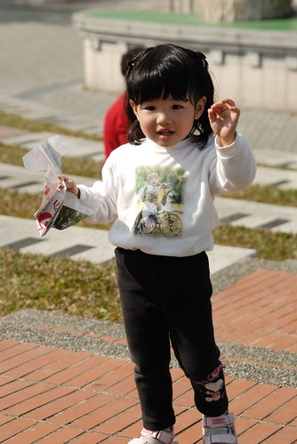
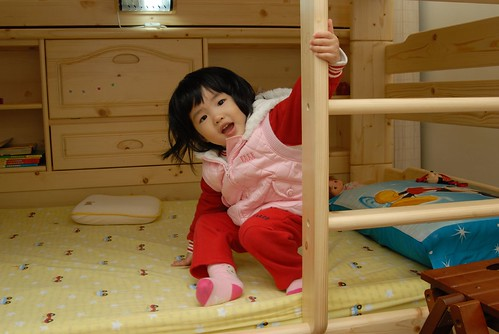
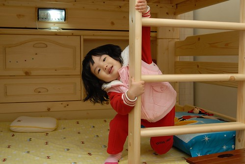
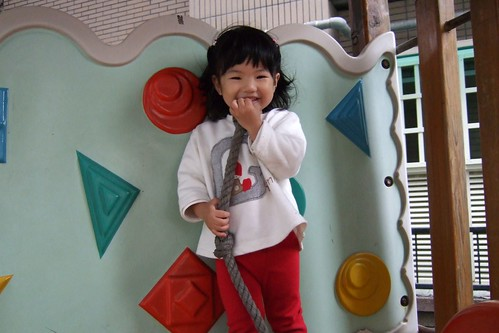
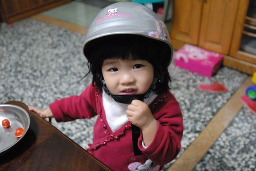
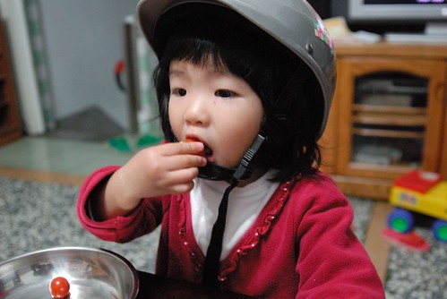
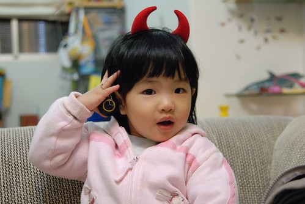
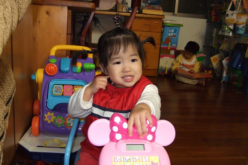
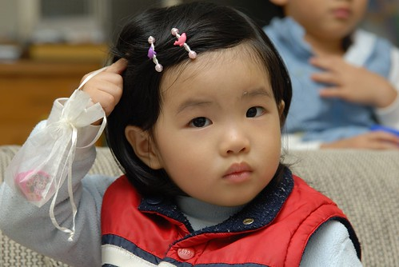
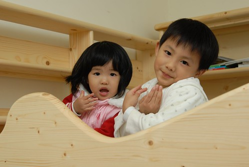

雖然當媽的永遠都會覺得"自己"的小孩是可愛 美麗 甚至天真的  
但我跟徹爸一致覺得兩歲的小孩是最最最...可愛的  
兩歲娃~可愛的讓爸媽希望他能保持這模樣下去 可愛下去  
  
語言爆發與心智成長的相互作用讓兩歲娃要不可愛都很難  
真的...隨便講句新的話 做個新的動作都會讓人更愛她到心坎裡  
昨天入睡前 徹爸小聲的學著小愛嘀咕嚷嚷的模樣  
不小心被小愛看到後 小愛又羞又怨的說"你幹麻學我啦.."  
雖然我們家是規定不准使用"幹麻"這詞的  
但聽到小愛會用"幹麻"這詞了 我跟徹爸忍不住大笑搖頭  
徹爸說"平平一句話 怎麼哥哥講就很粗魯 小愛講就這麼可愛阿"  
唉~~~偏心啦~~~爸爸媽媽都偏心啦~~~  
  
  
  

前幾天在房裡玩時 小愛看到哥哥在表演舞蹈課的動作  
竟然也學起芭蕾舞者墊起腳尖走路  
然後手握著樓梯擺起POSE 很像那個鋼管女郎哩  
這...真的不知道是去哪裡學的???  
  
  
  
雖然藝術無等級 但這...真的不太適合小女生的氣質啦~  
  
  
  
憨憨的小愛還是比較適合走青春玉女路線  
  
  
  
很愛"ㄌㄨㄚ ㄌㄨㄚ ㄙㄡˊ"  阿公阿嬤一招就走  
放假日常唸著要去嘉義阿嬤家 稞稞阿嬤家   
  
  
  
雖然身型真的很迷你 但食慾/活動力不輸其他小孩的  
  
  
  
也越來越愛漂亮嚕  可以接受別人在她頭上動手腳  
  
  
  
上學的時候 老師常常會把她的頭髮綁的像小公主一般  
  
  
  
沒上學的日子裡 手拙的媽媽只能夾夾小夾子或是鬆鬆散散的綁著  
  
  
  
雖然老二沒有享受到爸媽"唯一" "全部"的愛  
但卻多了哥哥可以一起疼愛她  這是身為老二最大的幸福阿....  
(遲疑生第二胎的媽媽們 真的別庸人自擾之的擔心第二胎會分散你對老大的愛 那只是藉口阿...)  
  

