之前六月中去國美館後 阿徹一直碎念著沒能好好的看看國美館一樓的展品 加上兄妹倆對於兒童遊戲室似乎也很回味無窮 於是趁著這次的埔里小旅行  央求徹爸大清早從台北殺下去 趕赴遊戲室9點的開場 6點半出門 8點40分我們便在台中的國美館...真是越來越佩服我們一家子可以這樣早起這樣拼命!

 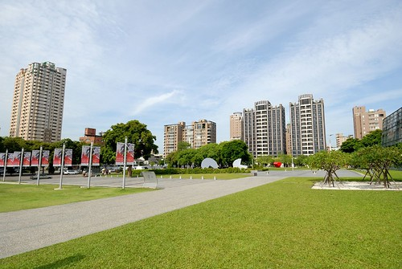 不到9點的美術館外圍還有著清早寧靜的氛圍 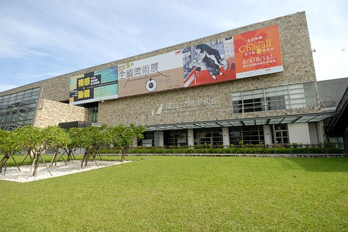 但其實入口處已經聚集不少的人潮 後來才發現原來是夏卡爾展覽的最後兩天阿 難怪... 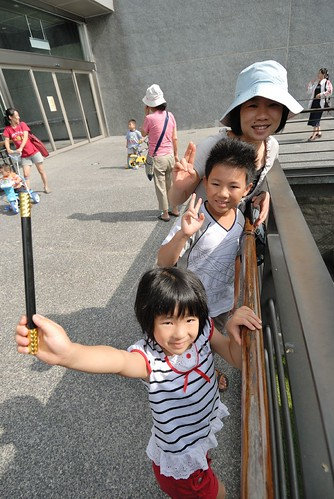 美術館的大門一開 我們便急趕往2樓的兒童遊戲室 每場限量的100人次 讓我們的腳步不自覺地就加快 深怕一個怠慢就撲空了! 短短兩個月內會再這樣千里迢迢造訪國美館的遊戲室 (雖然也都是順道 但是清早這樣殺下來也算有誠心誠意吧) 最主要的原因是玟姿阿姨說 遊戲室內的裝置活動又都不一樣了喔 而且還有每場限制10人的積木區喔  所以進入遊戲室後我們就直搗積木區 (上次來這裡還在整修準備中 徹愛看的心很癢) 小人們拿著工作人員發的童軍繩 圈出一塊領地 霸地為主 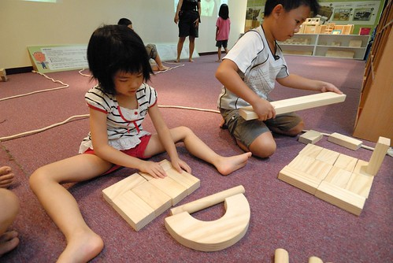 到此我跟徹爸算是完成階段任務 放任徹愛盡情的搬 盡情的堆 我們只消翹腳聊天 陪在一旁即可  其實我前一晚才為了烤個蛋糕 睡不到5小時阿 我自己都忍不住佩服自己怎麼可以為了玩 這樣的拼命阿! 不過這就是身教!! 很重要的身教!!! 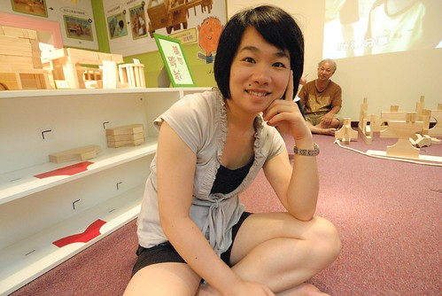 倘大積木區限制10人的進入(包含家長的樣子) 所以只有四組的親子在玩 而積木區的三面櫃子裡堆放著各式形狀的積木任小孩子拿取 小孩子都搬的很高興 堆的很高興...  尤其張小愛想進辦法的把各種積木都堆到他的作品上 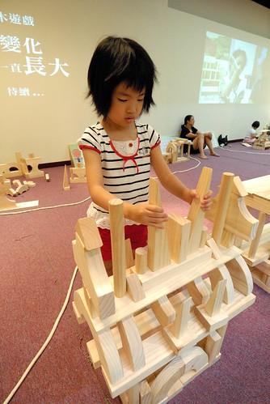 看她堆的很高興的樣子 讓我們忍不住提醒她"等下要把積木放回原來的地方喔..." 當然小人點頭歸點頭 還是完全地沉浸在她的積木裡 努力的搬 努力的堆...........  完成最後的"巨"作 然後最後花了10分鐘 而且還是我們三個人一起下去幫忙 才把所有的積木歸回原位  阿徹哥哥有目的些 但卻似乎綁手綁腳了點  不若愛愛的瞎堆 阿徹堆出他的夢想家園 還跟我解釋哪是房間 哪是客廳 哪是花園...  積木區每場的時間是50分鐘 可是遊戲區每場的時間是2小時 我們說這積木一玩 遊戲區的koda也用掉一半了  所以玩個3-40分鐘的積木後我們趕緊再轉移陣地 因為已經是第二次來了 徹愛很熟悉這的環境了 但相對也少了很多的好奇 所以這回阿徹好像就完全沒進入這區畫畫  直攻DIY區  倒是愛愛自畫了個單腳跳的小女生 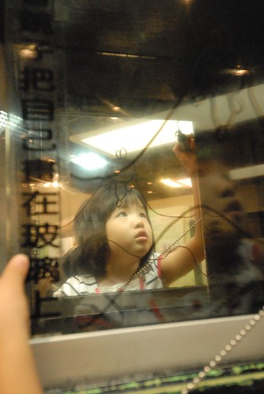 遊戲室裡有兩間DIY的教室 其中一間進行著人數限制的夏卡爾課程 所以只剩另一個廢紙條的創作DIY 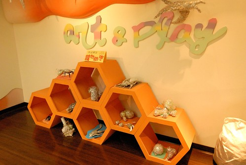 講真的 這次的DIY好難阿! 一桶廢紙條 一捆膠帶 要搞出個東西來 有點困難度哩... 而且一整個不是阿徹的專長 阿徹花了20分鐘也只弄出一根像是垃圾的掃把 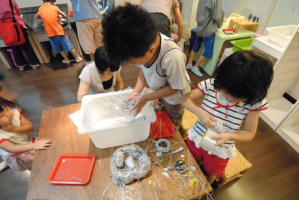 愛愛比較認命比較不貪心 說要做鳥蛋 (啥都做不出來 做圓球總該是最簡單的吧) 然後徹爸說那他做個鳥巢來裝蛋 阿母我又說那我來做隻孵蛋的鳥吧! 雖然最後鳥做的像是鴨 但難得我這樣參與小人的DIY中(沒美術天份的我像來都是在旁邊袖手旁觀的) 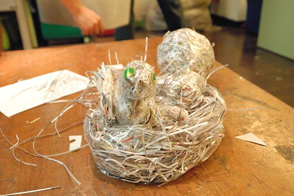 做完DIY 愛愛又很ㄍㄟ敖的拿掃把把桌子附近地板清一清 我只能說負責看場的志工奶奶真的好有耐心跟愛心阿!  看著我們一家子合作完成的鳥窩  還真有點煞有其事 有模有樣的ㄋ! 爸爸說如果一起擺在作品區裡 也還說的過去啦~  愛愛上次已經扮過美人魚了 可是徹爸沒親眼見過 所以又讓愛愛去扮了美人魚 這回不只多了Bar可以穿 還多個應景的背景可照相 這是我們家的愛愛美人魚!  而廁所外的水畫牆面上 阿徹畫了隻章魚外星人(怎麼是媽媽 因為畫者早就跳去玩別的了)  時間不到我們便提早離開遊戲室 好好看看美術館一樓的展品以及在館內"散散步" 期間徹愛問題不斷 一下子"這是什麼" 一下子"為什麼要這樣做" 還有"為什麼要把鹽堆成這樣(其實心裡的OS應該是這也是創作喔)" 阿母被問的招架不住(主要還是藝術涵養真的不夠啦)只能說"阿 這就是作者的創意阿" "阿 作者覺得這樣很有意思吧!" 不過老實講 美術館一樓晃個一圈後 真的覺得有點"空"的感覺說  我們好像還是比較適合來遊戲的.... 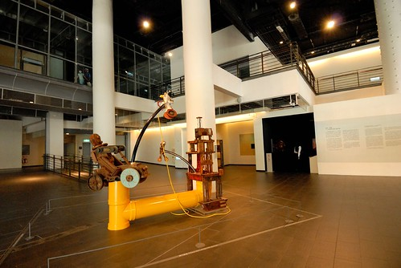 同時間 美術館充斥著來看夏卡爾的排隊人潮  我們忍不住自嘲"奇怪 我們怎麼都不會想來看夏卡爾 來看畢卡索阿".... 而我們只會端著我們的鳥窩 走在人朝人往的美術館裡................................ 哈哈! 果然這就是徹家!!!   

講到遊戲 我真覺得阿徹遊戲的功力真不是蓋的 雖然常會被他的不務正事氣的七孔冒煙 但不得不承認阿徹是個"會"遊戲的小孩 一樣的東西 日常的東西 他就是有本事玩出自己的一套樂趣 就像樂高到他手上 創造出一個個令你只能傻眼的"主題" 這是他說的寵物車  車子上關的載的是一隻隻的數碼寶貝寵物 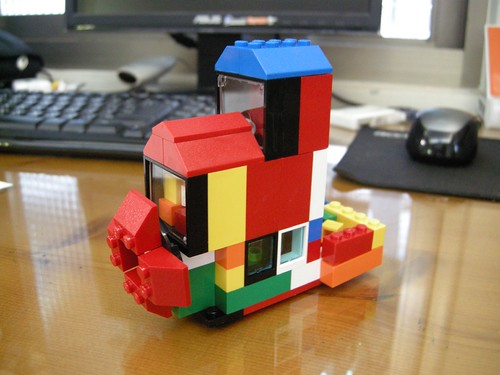 這是他的樂高版開心農場  除了樂高外 阿徹辦家家酒的功力也是一流 從他妹還是小嬰兒時就開始扮 扮到他妹都已經大班了還是很愛扮很會扮  偏偏就連愛愛也很佩服她哥這一點 曾經很羨慕的口氣跟我說"哥哥好有創意喔" 可能這樣 所以愛愛總是心甘情願的這樣被阿徹"扮" 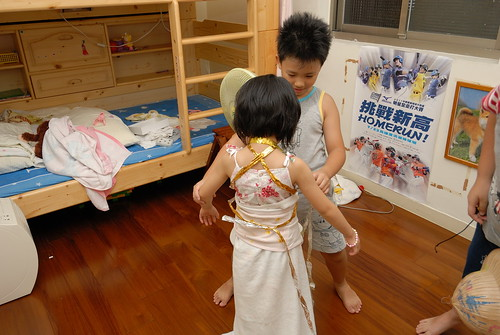 那天阿徹跟愛愛的好朋友兄弟倆到我家玩時  一群小人就這樣扮好久 扮的好開心  愛愛跟她的阿嵂紛紛變成公主與沙烏地阿拉伯王子 看到這一幕幕 身為爹娘的我們除了苦笑還能說什麼ㄋ.... 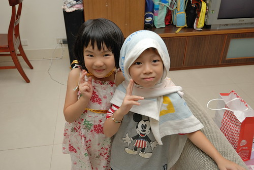 這半年 家裡平日多了個一起放學來家裡吃飯遊戲的小男生(愛愛四人幫裡的其中一男生) 相較兩個小孩 三個小孩的熱鬧度比倍數還多的提高著 這天晚飯前 當我從廚房滿身汗的忙出來 剛好看到他們背著包包準備出發去郊遊.. 看的我好想把這一幕按下 "f讚"!  我說 "停格一下 讓我拍照照片" 三個小人也還開心的讓我留下證據 (她們手上拿的東西 還都有典故有道理的安排的喔) 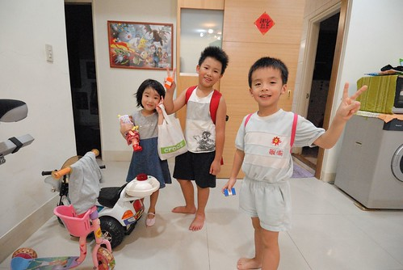 有一次我曾經問小男生"會不會覺得阿姨很兇? 在我們家一堆規定跟限制(尤其吃飯時) " 小男生點點頭說"會" 我又問"那你會不會不想來我們家?" 小男生搖搖頭說"可是跟阿徹哥哥一起玩遊戲好好玩" 我心裡忍不住懷疑很會玩扮家家酒的阿徹該不會是這個來我家前從沒玩過扮家家酒的小男生的偶像吧?!  真所謂天生我材必有用 原來"遊戲"是阿徹到目前為止最大的優點與價值阿! 好好努力的遊戲下去吧! 阿徹!! 但是該寫的功課 該做的事請千萬要記得!!! 不要在每次阿母我為了你的功課氣的快爆炸時 還在跟我說什麼好好玩 你發明了什麼... 理智的阿母這時候是一整個聽不下去的 OK?!
