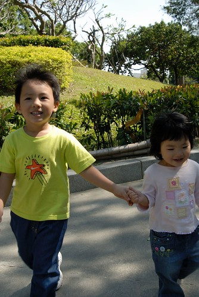

11/4 阿公阿嬤天未亮便啟程出遠門旅行去  
於是我們也早早從嘉義啟程返北嚕~~  
中南部這麼好的天氣加上難得的充裕時間可以沿途"七桃"    
於是車子就這麼順其自然的駛下了台中  只是目的地臨時從中興大學改成了科博館~  
  
大手牽小手 散步看恐龍去~  
  

睽違了4年多  在狠心買了張阿徹專屬汽座後   
媽媽總算重回前方寶座  終於可以不用再窩在後座任憑兩小揉擰...   
新椅子上路幾個月 雖然大半的時間阿徹仍是把頭探在我跟徹爸中間跟我們閒扯蛋  
也雖然阿徹還在適應調整舒服的睡覺姿勢    
但起碼小愛認命的一路被綁在自己的椅子上 而阿徹也漸習慣接受媽媽不在身邊任憑他玩弄  
總算一家四口都覓得自己的安身之處...暫時舒緩打消我們的換車殘念

車子下了台中交流道時 媽媽心情突然很high還拿出相機要幫阿徹跟他的新椅子照相  
跟阿徹說"有氣質點" 阿徹便這麼的擺出了有氣質 矯情的樣子(果然是有練過的)  
  
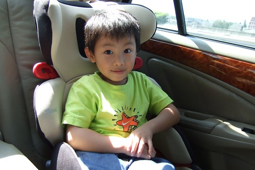  
  
耶!這是小愛的椅子  (這次娃娃也跟著我們回嘉義阿嬤家)  
看到媽媽不再坐後座 小愛真的很認命的上車就被綁在椅子上    
3-4小時的路程裡唉也不唉一聲  只有在想尿尿時情緒會稍為急躁不安  
不像哥哥可以用塑膠袋在車上小解或是包著尿布解決  
小愛就是得下車解放 不過起碼現在已經可以隨地就路邊噓噓了 (有時候廁所真的不是那麼好找的)  
  
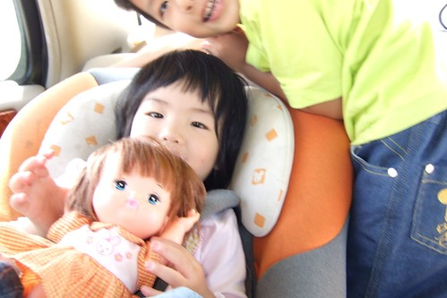  
  
可憐的徹爸這週病的很重  咽喉紅腫了整整一個星期 痛到常啥東西都不想吃  
開車時還得戴口罩以免傳播病菌給我們  
  
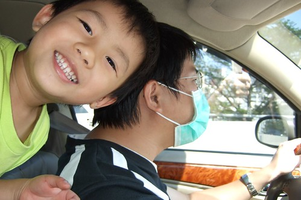  
  
相較之下 我們母子倆好像有點過High了 還搞自拍勒  
  
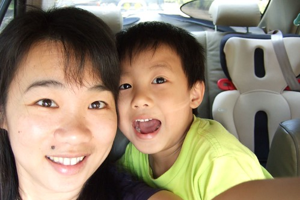  
  
很認命的在由中港路轉進科博館的入口就把車停在路口的私人停車場裡  
往科博館的方向走進 看到熟析卻許久不見的林蔭大道 心情開開開...開到最大嚕  
  
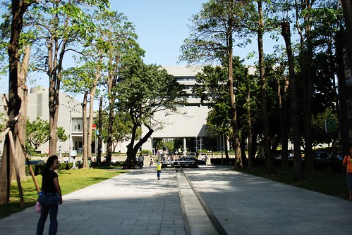  
  
走在文教區裡 人好像都會變的有氣質了  
  
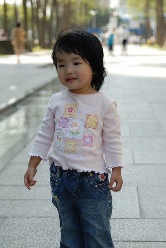  
  
連館方前的小荷花池都顯得超可愛  
我想這一切都是秋老虎引起的好心情  尤其對於極度不適應台北連日陰霾的我們  
  
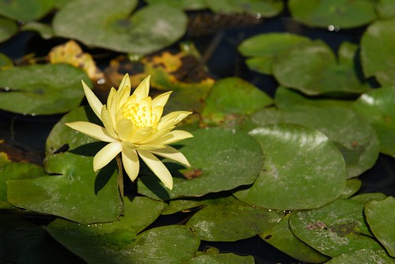  
  
唔~這啥咪咚咚.... 怎麼有大恐龍在這裡  
  
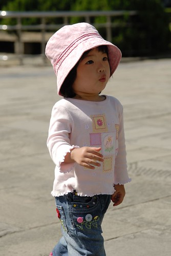  
  
YA! 矯情二人組  
  
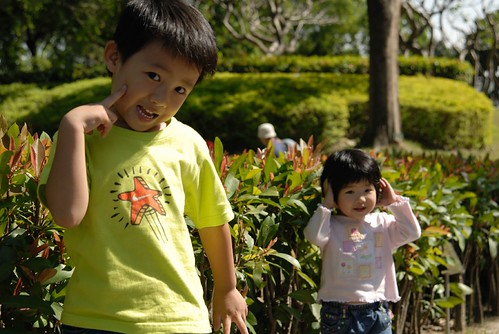  
  
這就是現在很夯的牽手護台灣啦  
雖然這圖給他有可愛 但也不用搞的無孔不入吧  到處可見愛台灣護台灣  
  
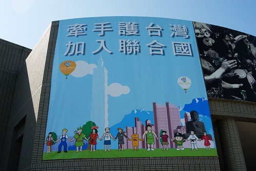  
  
很多事單純點好  
對我們這種平凡的父母來說 只想給小孩一個看的見 可以期待的未來...(唉呀 不小心露出我們的色彩了)  
  
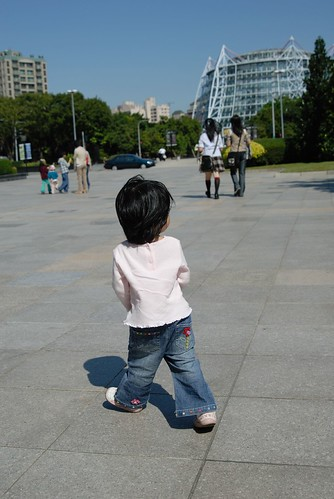  
  
阿徹原本滿懷期待的要第一個先去看恐龍館  
結果被1樓得經過的生命館(?)嚇的兩腳發軟 不敢進去  
連小愛也被嚇哭 直喊"怕怕" (其實只是移動中的器官圖像)  
只好先去別的館 昆蟲展覽晃晃了  
  
(兩個小人看展館內放映影片的認真模樣)  
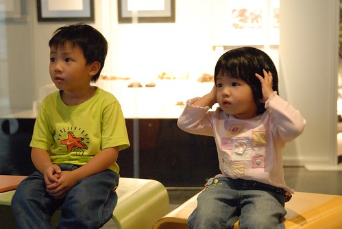  
  
晃到1點 恐龍館還是沒敢進去  
肚子餓餓的大家就先去2樓的M先生吃堡吃飽嚕 (從2樓進恐龍館就可以避開他們害怕的一樓入口了)  
  
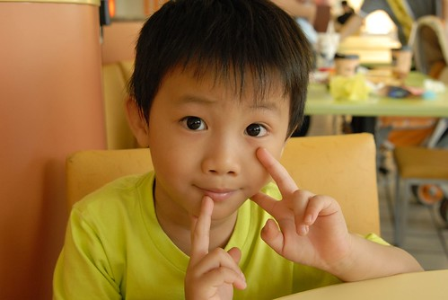  
  
小愛只吃M先生裡的薯條跟鮮奶 薯條一根接一根小手都沒停過  
  
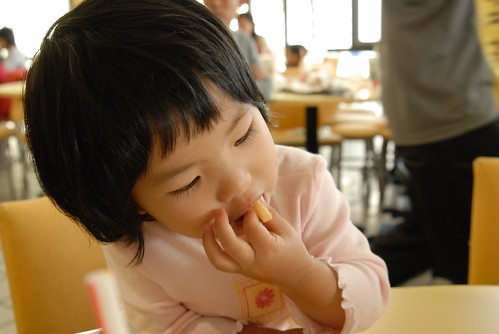  
  
剛好有麥當勞阿姨們在辦活動 ( 做氣球猜謎 耍寶搞笑) 兄妹倆遠遠不敢靠近  
直到活動結束時阿姨給參與的小朋友人人有獎時 兄妹倆才厚著臉皮去跟阿姨討氣球  
這是阿姨要阿徹吹氣 吹出貴賓狗的尾巴  
(阿姨的手腳很好 阿徹一吹氣的同時 阿姨就同時擠出尾巴 很像在變魔術)  
  
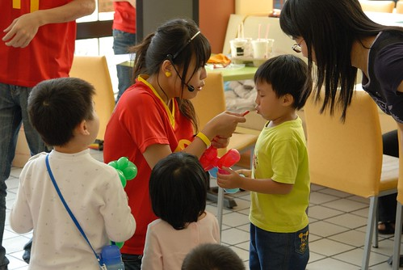  
  
兄妹倆一人一隻貴賓狗  感恩阿~  
  
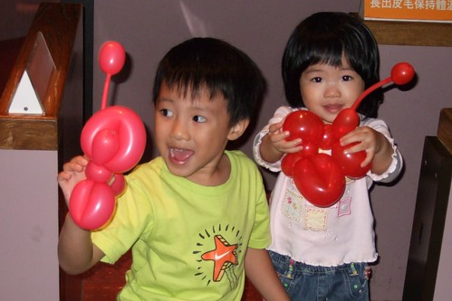  
  
從二樓要下到恐龍館前 先讓阿徹從上方窗口往下方恐龍展示場望望  
跟他解釋清楚那些都是假的啦  會動是因為有電池 就像機器人那樣  
阿徹總算總算願意相信那不是真的 願意硬拉著我的衣服往下走   
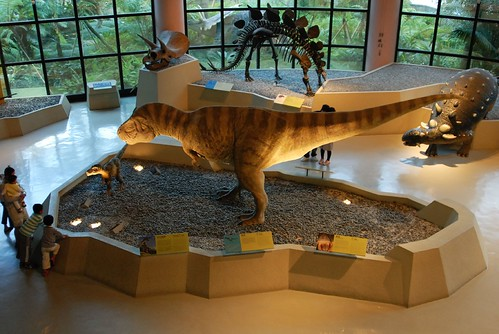  
  
小恐龍模樣不太優 但還蠻討喜的  
  
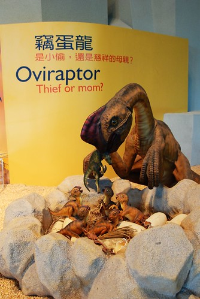  
  
就是這有對恐龍讓阿徹嚇的直躲在媽媽後面 直說"好了 我們可以走了"  
他還是覺得這對會動的恐龍是真的...  
  
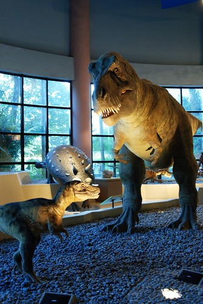  
  
進到較小的展場空間裡 看到這些小小恐龍就不怕啦  
知道這些都是假的 像玩具一樣啦  
阿徹最愛的就是他頭上的那隻劍龍 (很多事真的是當媽後才懂的)  
  
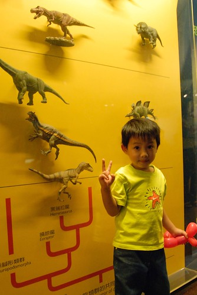  
  
覺得科博館真是難得少見的一個維護保持的很好的博物館  數十年如一日  
我說我高中第一次來的時候就長這樣  
歲月完全沒在館內任何地板 椅子牆壁或是展示品上留下痕跡  
徹爸說 他國小第一次來的時候就這樣...  
可見這20年來館方真的很用心在維持經營 給他們拍拍手~~  
  
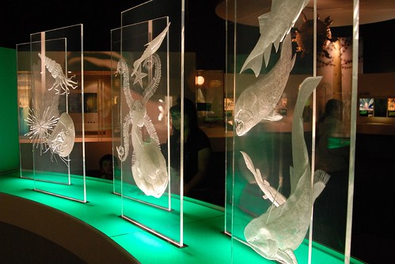  
  
看完恐龍其實前後也才在館內晃了2個多小時  
很多東西其實都沒去 也沒仔細品味  
可是天氣這麼好 我也很樂意跟著小孩敞徉在戶外的草坪 藍天白雲下的  
  
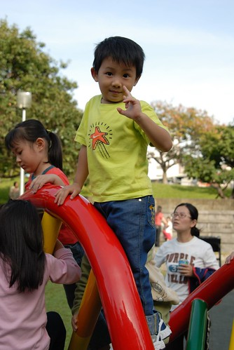  
  
微風徐徐 真的真的很舒服 (哈 這好像是這陣子遊記裡最常說的一句話 )  
連阿徹都說"台中的秋老虎好舒服喔"  
  
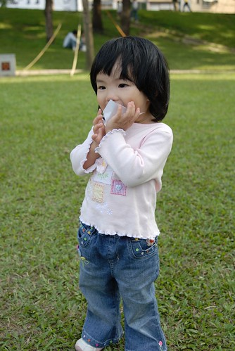  
  
(愛) 咦~人家也想要上去啦  
  
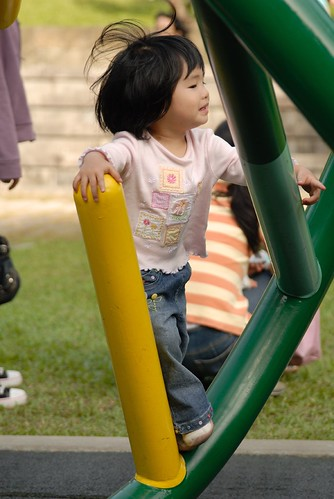  
  
可是腿太短實在搆不上去  
  
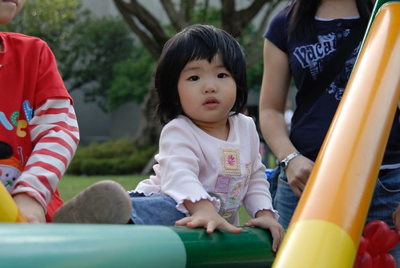  
  
小愛你還是回家多吃點飯 多練點再來吧  
這玩意還是比較適合像阿徹哥哥那樣的大小孩的 (中間那個螢光綠就是阿徹 上下來回爬了好幾趟)  
  
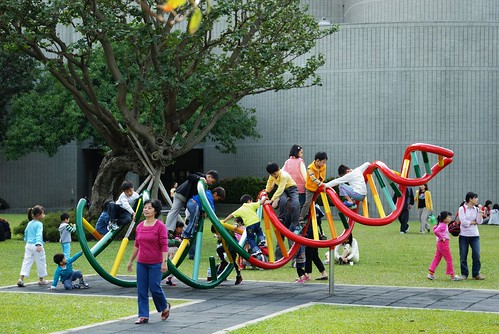  
  
嬌小的小愛好像只適合裝可愛 當爸爸鏡頭下的陽光女孩  
  
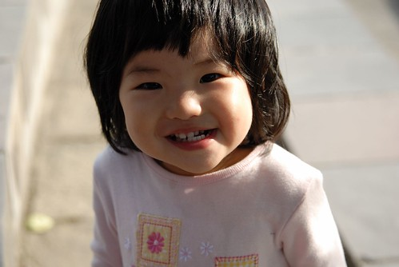  
  
看看這白裡透紅的小臉    
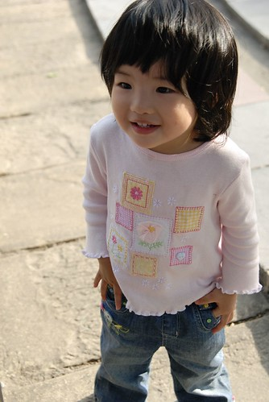  
  
再摸摸自己臉上的紋 吼~老天真的很殘忍~  
不過沒關係啦 我很樂意母以子(女)貴的  
  
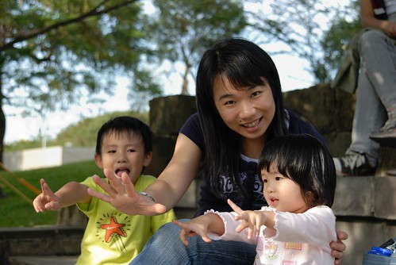  
  
徹爸應該也是父以子(女)貴吧  
  
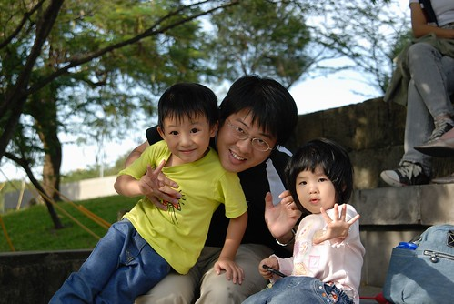  
  
小愛太小沒能進去太空劇場看恐龍電影(身高90以上方可進入)  
認命的跟媽媽在外頭散步 野餐等哥哥爸爸  
本來以為阿徹大概看個半各小時就會到達他忍耐的極限而出場  
想不到他為了媽媽說的看完全場送他個恐龍小禮物 看完整整45分鐘的電影  
爸爸說他有一半的時間用手遮住一隻眼睛   
不過出場後的阿徹直呼好好看 還津津有味的跟我講裡頭恐龍發生的事  
下次媽媽也要去看~~  
  
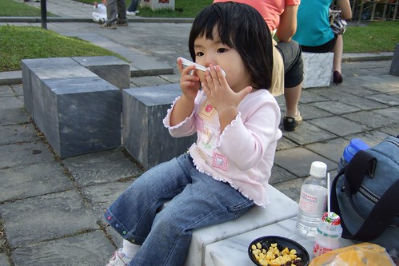  
  
太陽快下山了 我們也該回家嚕...  
  
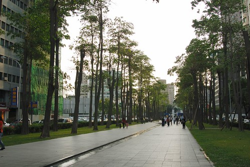
