花博開幕兩個月了 我們總算也趕上熱潮來了趟花博初體驗 之所以稱為"初體驗" 實在因為去過一次後便深深喜歡上這盛會的氣氛而且真的還好多園區好多館好多東西沒看到 所以我相信這回絕對只是我們的初體驗 我們絕對還會有下次甚至可能好多次... 從花博試營運到現在常在FB或是電視上看到那些去的誰誰說花博很棒很值得走一遭 實際體驗過一回後總算明白為什麼這麼多人說值得 那麼多人願意排那麼久的隊... 對於我們台灣也可以辦出這樣規模的盛會 講真的有被深深感動到... 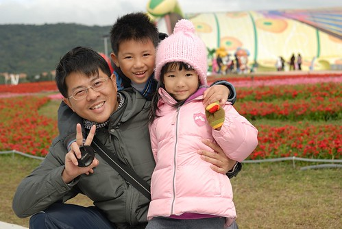  

從花博開始後 阿徹就常念著問著"我們什麼時後去花博阿? 到底什麼時後可以去花博阿?" 向來很不愛大拜拜似活動的我們 看著電視上報導著幾萬的入園 幾小時的排隊 講真的很怕阿 所以我們一直躲避著阿徹的央求直到他都快要開始嚕了 我說" 那就等你要期末考前的那個週末來去吧" 基於這兩年每次小學月考或期末考前高速公路車流量會驟少的經驗 我"賭"1/8也就是考前那個週末花博人潮應該也會少些吧! 我跟阿徹說" 反正你在家也不會溫書那不如就趁人少些去花博吧" 阿徹開心地期待的那天到來 壓根忘了擔心之後的期末考試阿! 只是最近的天氣濕濕冷冷的 也一直很擔心下雨的話這下怎麼辦阿

周六早上7點多起床看到天空毛毛雨絲想想還是別去了 可是躺在床上卻又苦思著今日不去那得待何日阿 於是8點多再起床確認遠方的天空似乎透出一點亮光後我們決定出門賭他一把了 讓阿徹愛愛喝了杯牛奶後 一家子九點半出門搭捷運去 為了避開台北車站轉車的恐怖人潮 徹爸貼心的建議從西門站轉小南門線到中正紀念堂站後再轉淡水線 雖然多花了一些些時間但避開擁擠的台北車站可以讓我們的心情更愜意更從容(回程亦如此 真是好方法) 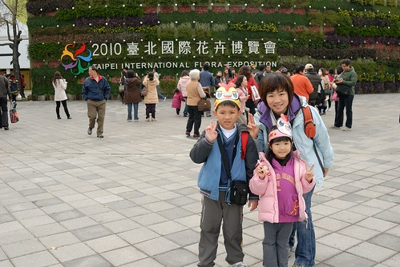

10點初從圓山捷運站出來後便被花博的入口廣場給深深震撼住  我說"這大門有大器 先給他個80分了" 或許就因為這第一眼的好印象讓我們接下來更能從"好"的面向去觀察/感受花博的一切吧

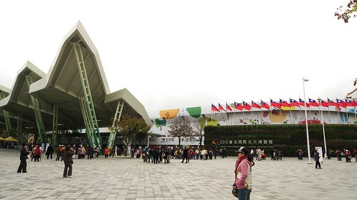

去年初花博的團購潮時湊熱鬧的買了六張 因此今日我跟徹爸拿的是4折票(或許因為這樣所以更覺得花博CP值很高) 阿徹則用優遊卡刷優待票(好像135) 而 學齡前的愛愛還不用門票 雖然在大門處就可以感受到花博的人潮 但起碼還沒到排隊入場的盛況  或許今日人潮真的不算多吧

入園後先去拿個花博DM再說 拿DM時志工還交代說拿一份共看即可 雖然不能多拿一份備著有點小小失望但這樣環保的作法還是該讚許一下 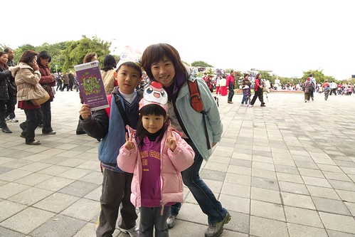

雖然徹爸說第一次去花博大概就是走馬看花 先了解一下而已 但行前我還是花了點時間研究 擬訂今日的大略行程: 大佳河濱公園毛毛蟲遊行 -> 圓山區七道彩虹 -> 舞蝶館表演 -> 美術館寰宇園區 很不貪心的就只鎖定兩個大活動以及部分園區而已... 毛毛蟲遊行11點開始 所以進園後便趕緊去搭遊園車到大佳河濱區 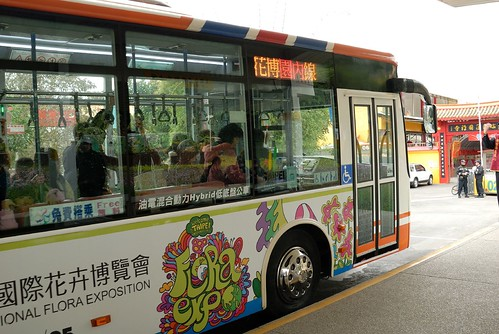

遊園車的班次很多 車況很新很優 每一站也都有服務人員貼心的指示/服務上下車 光是遊園車又讓我們對花博多加了好多分 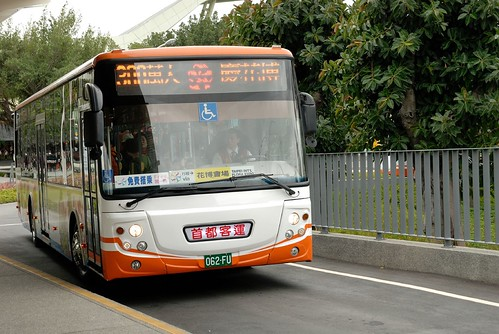

尤其坐上遊園車後觀賞著沿途窗外的景色 一整個好有跟團在國外旅遊的FU喔 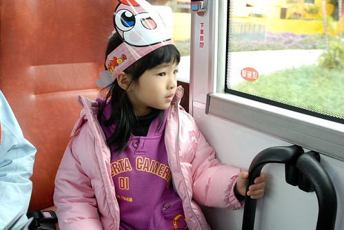

我們像觀光客一樣 對著窗外美麗的花草景觀又是好奇又是讚嘆 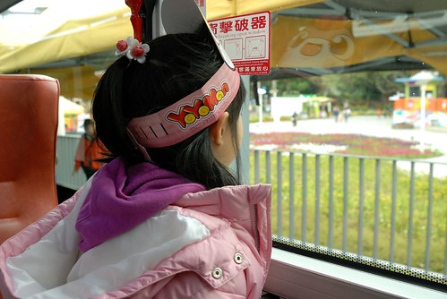

透過車窗看景物 感受變的很不一樣 (沒法出國玩 來花博過過當觀光客的癮也不錯) 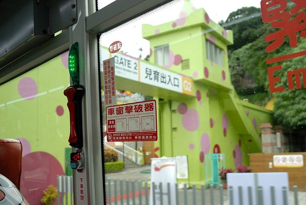

園內接駁車串連著花博四個園區 約莫10分鐘的時間抵達最終站"大佳東站" 一下車 看到這樣"大器"的景  我們的嘴又忍不住哇哇叫了起來 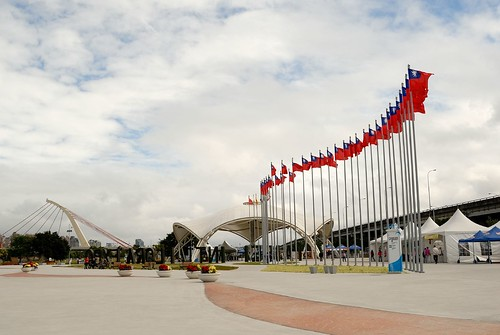

尤其這個可愛毛毛蟲造型的行動巨蛋館讓人要不注意都難 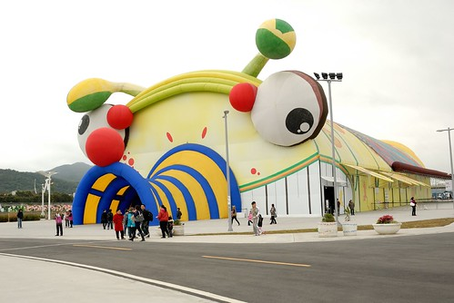

二話不說先來張有大片花海跟毛毛蟲當背景的照片 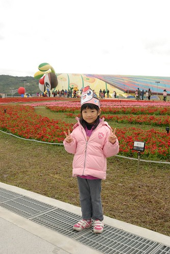

而在看到這五個可愛的花精靈時 阿徹跟愛愛更是開心到不行 愛愛要爸爸幫她跟花精靈一個個的照下去 阿徹則也是自己拿著相機一個個拍下去 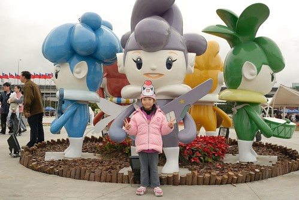

長大了的阿徹越來越像個觀光客樣的可以沉浸在興奮與好奇的觀光情緒中了 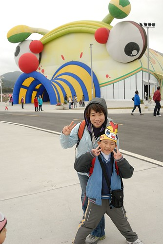

只是風真的好大阿...這真的好冷阿 而且我跟徹爸到現在都還沒有吃早餐 血糖急速下降中... 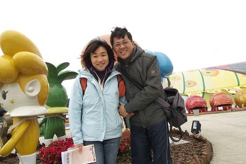

我們找了個地方頂著寒風渾圇吞了帶來的壽司然後便又急急到11點即將開始的遊行路線卡位 (真的只有當觀光客才會幹這種事的) 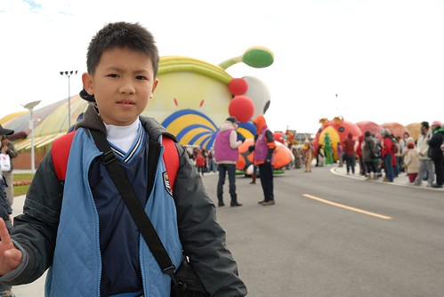

遊行行列的最前面是由幾隻開著電動車的瓢蟲以及河馬領隊 (看到河馬 阿徹問河馬跟花有什麼關係???)

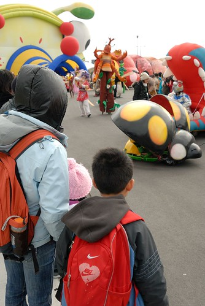

然後有蝴蝶 公主 蚱蜢 猿人 泰山先生...等由紙風車劇團人員扮演的各式人偶造型 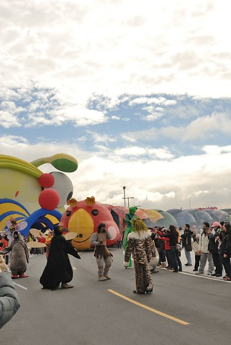

接著的最後是遊行的最大主角- 毛毛蟲 每個毛毛蟲身體打開後是美麗雅緻的花卉設計 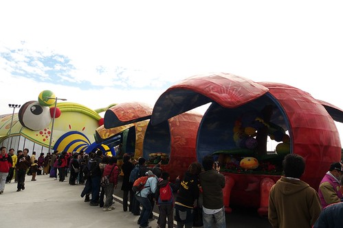

一堆人槍拍著那些美麗花卉 可我家徹爸竟然只拍了最後最遜的這張 我懷疑徹爸一定是衝著那張贊助公司的牌子才拍的 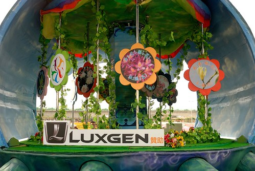

遊行隊伍裡最美麗的就屬這位公主而且她還踩高翹的喔 回家後好多天阿徹兄妹倆還是常念著"公主踩高翹不會跌倒嗎 真是太厲害了" 真的是很厲害  公主有練過小孩子可不要隨便模仿喔 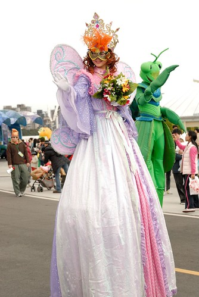

看著這些人偶 阿徹很喜歡但又害羞不敢合照 於是媽媽先示範跟蝴蝶小姐來一張 由劇團專門演員扮演這些人偶果然不一樣  個個或跳或舞 舉手投足之間都是戲阿 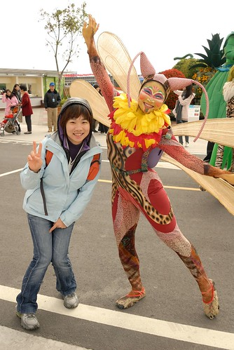

隨著遊行的氣氛越來越熱烈 阿徹總算開始要跟這些人偶照像 首先是跟他最近很喜歡的狗還有公主照相 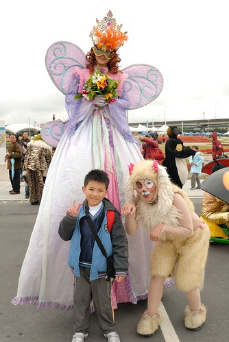

然後是這位企鵝先生 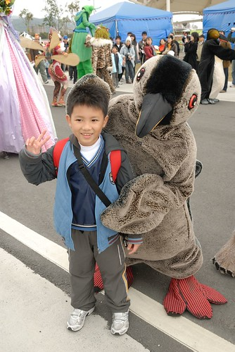

這位企鵝先生很調皮 看到躲我身後的愛愛越是想要逗他 一開始試圖著想要接近愛愛博取愛愛的歡喜 後來看到愛愛還是都躲著 他就在每次看到愛愛時故意表現出難過在哭哭的樣子 我們一旁是看得哈哈大笑而愛愛姑娘則是嘴巴越抿越緊 越往我身後躲 而且還越走越慢 刻意離遊行隊伍遠遠的   愛愛說"那個企鵝他都會欺負我!!!" 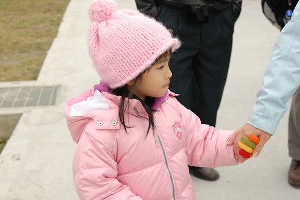

於是我跟著愛愛落在遊行的後頭 而阿徹則由爸爸領著跟著遊行隊伍 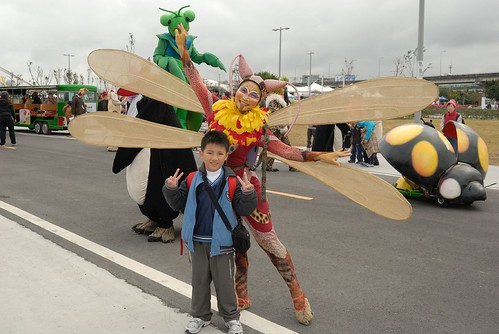

阿徹跟很多人偶照相喔 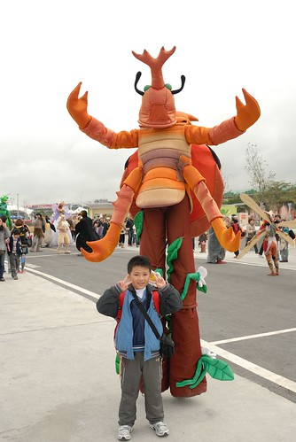

還跟企鵝握手哩 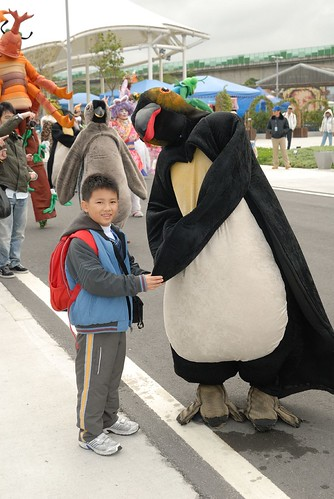

甚至來個大熊抱  這企鵝跟人類的互動也未免太好了 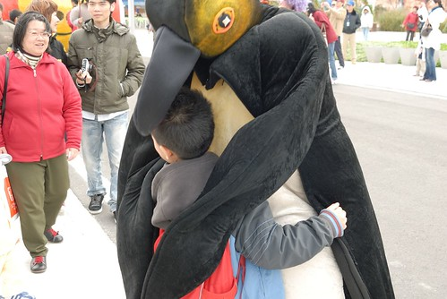

後來愛愛發現大毛毛蟲的最後面還有一隻企鵝後 我們便更是離遊行隊伍遠遠的... 遊行了30分鐘也繞了大半個大佳園區了 想說阿徹她們應該夠過癮可以轉移陣地了吧 狂call徹爸結果都沒接  後來總算看到他們跟著遊行隊伍回頭了 結果徹爸竟然就拿起相機開心的拍了我們一張後又跟阿徹一起跳走 繼續跟著遊行 挖勒~這對父子倆也未免太involved在遊行裡...我想應該很少人會這樣跟著遊行吧 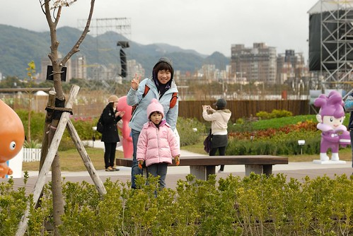

事後問徹爸 阿你們這樣跟著遊行一小時不會覺得無聊嗎 徹爸說"不會阿 看著那些人偶即興的演出還蠻好玩的" 瞧~企鵝還上遊園車打招呼哩 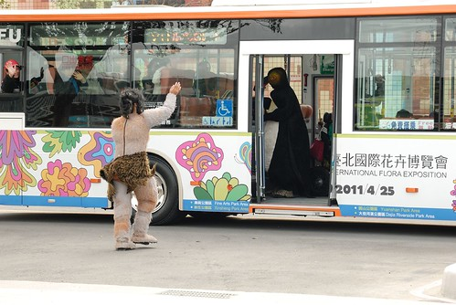

還手勾手一起走回遊行隊伍  真的有夠好笑的 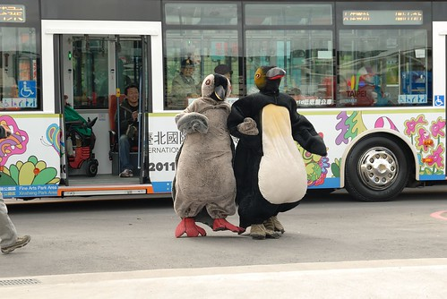

難怪阿徹看的樂不可知 傻傻跟著一起遊行一小時直到回到原點 (阿徹的裝備真的有夠像觀光客) 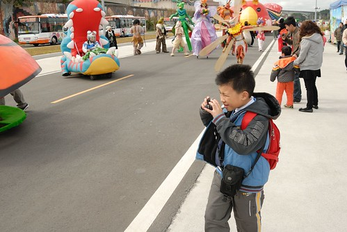

同時間我跟愛愛則在起點處苦苦等著徹爸父子的回頭阿(愛愛一直念著有企鵝 堅持得保持50公尺以上的距離) 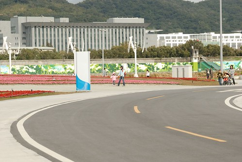

回來了回來了 辛苦的毛毛蟲總算逛大街回來了 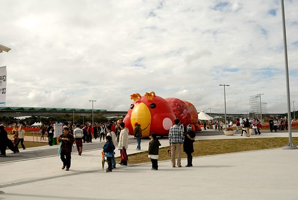

我們的爸爸跟阿徹也回來了 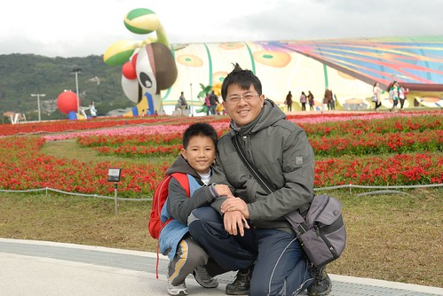

這時候阿徹第一次說"我覺得花博很好玩阿 誰誰誰怎麼會說花博不好玩ㄋ" 這一天阿徹講了好多次這句話 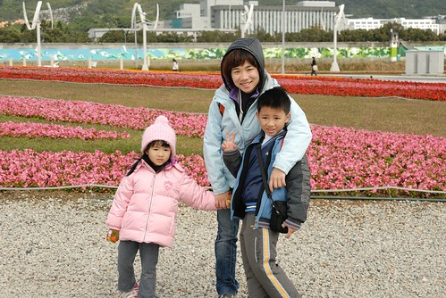

大佳園區相對其他三個園區應該算是空曠 景點少 風又大 但是光靠可愛的毛毛蟲遊行及行動巨蛋館就散發出濃濃的歡樂味 讓小孩子好開心... 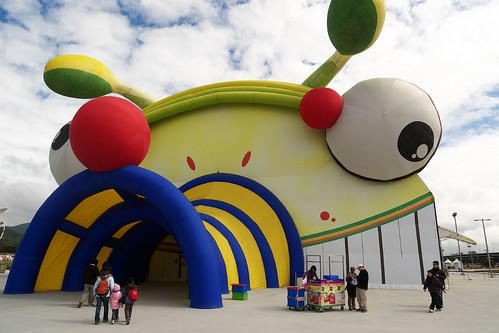

中午的時候在行動巨蛋入口旁看到賣花博便當的花車 徹爸一直很想買可是卻被我阻擋著 因為我聽聞花博園區內的美食都很不錯 所以一心想著到美術園區後再打算即可 阿知最後竟只能在風味館吃著飛機簡餐 真是懊阿....下回一定要買便當吃了....

離開大佳搭乘遊園車回到美術館園區前 中途在兒育站下車讓阿徹愛愛下去玩玩 來的路上望著窗外兒童樂園裡的遊樂設施時 阿徹跟愛愛的眼睛都發亮了 所以今日媽媽好人做到底 更改行程讓小人到兒童樂園裡歡樂到底 花博期間兒童樂園不用門票但是要玩設施得買遊樂票 一項設施一張票20元 給了阿徹跟愛愛三張票的額度時 愛愛還說"我一樣就夠了 玩三樣媽媽很花錢揶(對著不甚滿意的哥哥說教著)" 結果最後玩完第三樣的咖啡杯時竟是愛愛吵著還要  姑娘果真只是說得一口好話阿...

首先是旋轉木馬 這好像是很多小孩的夢想所在 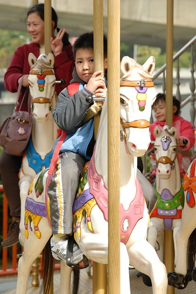

臨時又膽小起來的愛愛想坐但又不敢自己坐白馬 硬要媽媽也要多付一張票陪坐圈圈椅 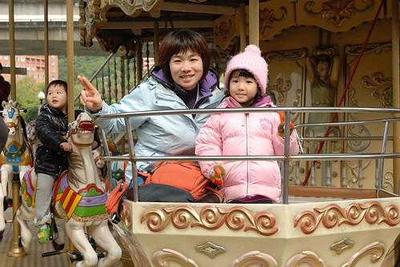

第二樣是兄妹倆一起去的火山小火車 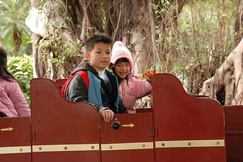

最後一樣 阿徹在咖啡杯與八腳章魚猶豫掙扎許久後決定自己一人勇闖章魚腳 (媽媽太遜沒照到相) 看著阿徹竟然敢坐章魚腳 我跟徹爸除了佩服外也更不得不接受"我家小男孩已經長大這件事了".. 同時間愛愛則在爸爸的陪同下去坐咖啡杯 (女孩子好像都愛這種夢幻似的) 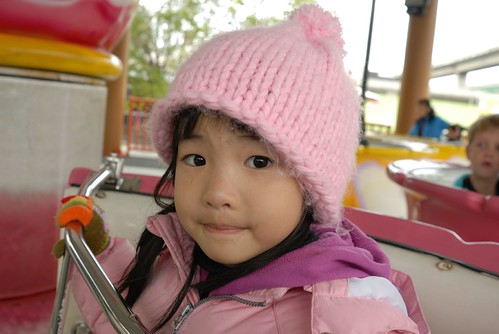

其實媽媽最想玩的是摩天輪  雖然也沒很高但是可以這樣在上頭俯瞰那感覺也夠讚了 可是沒有人要陪我去...他們都怕高...怎麼這樣啦...(下回一定要威脅利誘要小人陪我一起上去) 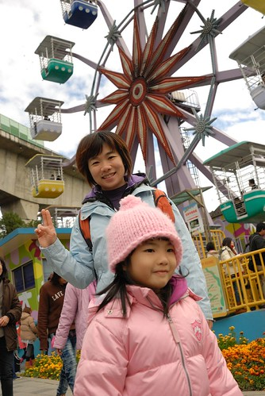

在兒育中心停留了一個小時後 我們總算回到媽媽原先的計劃要去美術館區.. 一早看著來來往往的遊園車 我跟徹爸兩人一致覺得"這遊園車未免太多了吧" 但是講真的 這樣上上下下搭遊園車往返各園區真的很方便說... 不同於一大早的陰雨綿綿 後來的天氣竟然好到可見藍天白雲  我們更是高興賭對了有來這一遭 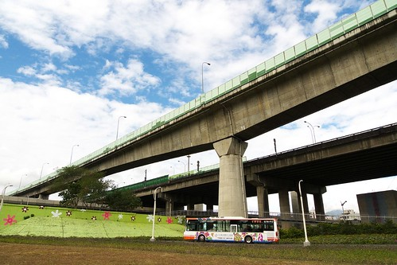

往美術館的路上 愛愛竟然唉著腳痠 累了 走不動 我問"你沒用你的吸盤腳阿" 愛愛說"我今天沒有帶吸盤腳" 我又說"還是你的吸盤腳被早上的企鵝嚇光了" 愛愛竟然點點頭說"對 都是企鵝害的" ㄘㄟ... 幸好後來徹爸小抱一下撒撒嬌後 愛愛再度發揮她的好腳力 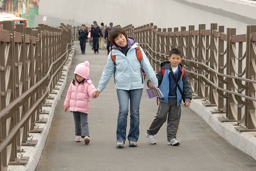

因為趕著要去排舞蝶館2點半的表演 因此中餐就在附近的風味館2樓解決 我說竟然會想到在這裡賣復興航空飛機餐也真是夠創意地讓人不知道怎麼形容... 因為真的從來不覺得飛機餐能夠算是美味的東西哩 不過反正就當作"圖溫飽"啦 而且還安慰自己迪士尼裡的東西也是又貴又不太怎麼樣啦 只是風味館的2樓風真是大阿  吃飯還得穿大外套戴帽子 要不然會頭痛阿! 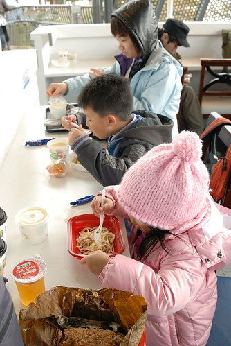

從風味館二樓往舞蝶館方向的view 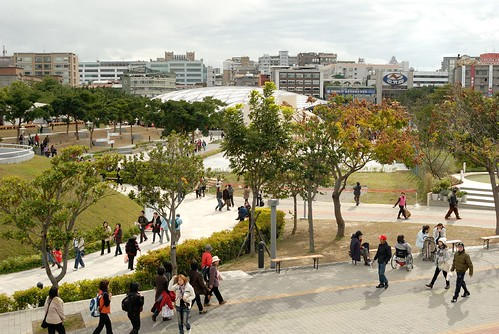

其實我本來一直打算隨便買個中餐果腹 先去舞蝶館排隊看2點半的表演比較重要 可是徹爸今日不知怎樣的很重吃  早上一直念著還沒吃早餐 中餐又一直掛心如何好好吃頓飯 雖然後來一家子花了半小時在風味館買飯吃飯 但我的心裡一直擔心著舞蝶館外的人潮到底成什麼樣了... 果然1點40多分來到舞蝶館的外圍時就看到長長的人龍阿 工作人員除了舉牌清楚定位隊伍的哪點以前才有2點半的坐位 還一再提醒告訴後頭新來的觀眾接下來排的是4點半的場次 我們抱著有沒有機會補上2點半空位的期望依然排在人潮的最後 待二點半場次的觀眾都已入坐 我們確定進不去時已是下午兩點鐘 雖然這時後排在我們前面的人剩下不到10位 但還有2個半小時下一場才要開始哩 可是如果現在去逛其他園區 等到3點多還是得回來排隊 而且還不能確保到時後的排隊人潮有多多 這時候真的很掙扎到底要不要繼續凹下去 凹下去雖然一下午就沒了 可是一定有很前面的位子哩... 跟阿徹愛愛仔細分析上述各種考量後 他們一致決定繼續排隊下去 因此我們最後花兩小時排隊 然後入場半小時後 才看到表演 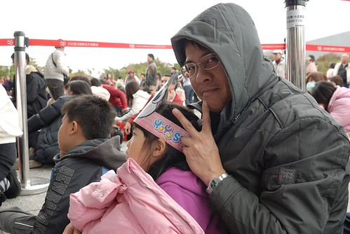

館內表演的同時場外也有電視同步的轉播 很多人就坐在電視前觀看(上圖徹爸後頭不是排隊的人潮而是看電視的) 可是隨著表演的進行越來越多看電視的人離去甚至排在我們後頭的年輕人竟然在念著"好無聊的戲後"便離去 而且3點過後 我們後頭的排隊隊伍一直未見熱烈的人潮與盛況 那時後對於我們花一下午排隊等看一場表演這件事 講真的有點像是陷入進退兩難的窘境中 哭笑不得 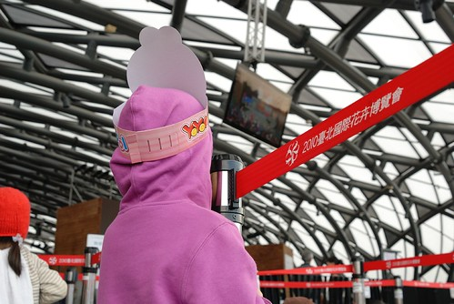

不過既然是阿徹跟愛愛決定的 而她們也都沒有抱怨或是想放棄 所以我跟徹爸兩人只能自我安慰"排隊也是種過程 一種體驗阿" (排第一位的那對母女 進場後我坐在他們旁邊才發現竟然是日本人說 外國人士也願意花這麼久時間排隊 突然間就覺得自己這麼做一點都不蠢了說) 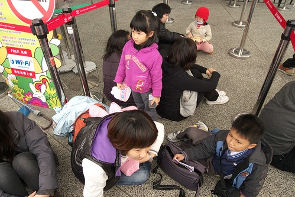

漫長的兩小時排隊時間能做些什麼ㄋ? 就是聊天 吃零食 看電視轉播 玩遊戲 發呆 還有看飛機... 

這是從我們排隊坐的地方望出去的景緻...真的也算愜意啦 (排隊時自我催眠真的很重要) 

排了兩小時隊伍進場後當然得挑個正中央第一排的位置嚕 這可是鼓勵我們堅持下去的最大動力阿 

可是正中央第一排只有五個位置 扣掉排第一位日本母女二位後只剩三個位置 那當下我們有點卡住 頓ㄟ不知道該坐哪裡了 看著後頭蜂擁而至的人潮 徹爸於是當機立斷的說 我們三個坐前面 他自己坐我們右後方的第二排位置 真是一個好爸爸 偉大的爸爸阿! 

進場後繼續等待30分鐘表演才開始  阿徹拍照打發時間 

還跟徹爸來個互照 

今日表演的是前一天才開始接替百合戀的舞玲劇團"秘密花開了" 可能因為前一天便跟最近很熱衷扯鈴的阿徹說要去看利用扯鈴做的舞台表演 所以阿徹今日才這麼有耐心且堅持的要看到表演 

整場40分鐘的表演很棒  一點都不輸之前花大錢看的兒童舞台劇(很多兒童劇的CP值其實好低喔) 尤其我們第一排正中央的位置可以完全感受到表演者的聲音 臉部表情 情緒 以及扯鈴動作的每一個手部變化與細節 看完真的就覺得一下午辛苦的排隊好值得阿! (基於對舞團的尊重還是懶 徹爸沒有照下任何的表演紀念照) 徹爸還說 電視轉播真是完全不能表現出現場氣氛阿..真的 因為電視轉播而放棄這場表演的人很可惜 

散場後當我們還在回味無窮時 竟然還在入口處看到劇團有扯鈴的販賣 這讓想買傳統扯鈴很久 但卻一直苦無地方買的阿徹開心到爆 而我跟徹爸竟然也很理所當然的就買了個傳統扯鈴給阿徹 阿徹提著新扯鈴 開心的直說"我可以做螞蟻上樹了" (阿徹原本的扯鈴是軸心可以轉動的碚玲 無法做螞蟻上樹) 

從下午的藍天白雲到我們看完表演步出舞蝶館天色已轉黑 真是一整個下午阿!!! 趁著步行回圓山區順道稍微逛了一下寰宇園區各國不同風情佈置 泰國 

台灣的竹編館 雖然小小的但很雅緻 

(下午經過的匈牙利) 

美術館園區與圓山園區間有坐人行天橋連接著 這是從橋上看過去的風味館 

天橋出乎我意外的寬真的又有大器  而且入夜後的花博園區又是不一意的聲光美麗了 

天橋下來的廣場地面上有台灣花卉的投影  可以看到魚在池塘裡遊 

還有人踩上去後便開花的花朵介紹  這些又讓阿徹小愛玩的好開心 對他們來講應該真的會覺得花博裡處處是驚喜 處處是樂趣阿 

雖然對於沒能在白天看到圓山區的花海跟七道彩虹心裡有點失望 但這樣隨遇而安 大人小孩都有開心的一天也很好 而且我們竟然從早上10點呆到晚上6點了 這可真是破了我們在台灣遊玩的紀錄了 我們從來沒在一個地方呆這麼久過 而且意外的發現花博的晚上也是挺美的說 

踏出園區時我開玩笑的跟兄妹倆說"好好玩喔 好想再看其他的地方喔 真想明天繼續來 你們敢不敢" 兄妹倆竟然異口同聲的回應我"敢~" 好啦...是阿母不敢...雖然媽媽也真的很想做這瘋狂事 但是阿徹要考試了還是不要玩太瘋 所以期待下回吧 而且經過這回初體驗 我們竟然也有衝動(還是該說憧憬ㄋ)去排隊看夢想館說 嗯...拭目以待花博還會讓我們這家子做出什麼突破性的事情來吧! 
