趁著阿徹考完試放寒假前 我們又去了趟花博 這次從透早不到7點出門到晚上八點回到家  看很多 走很多 很拼 很累! 愛愛吃晚餐時邊吃邊打瞌睡 徹爸則是喊著"他從來沒有走路走到腳底板在痛" 哈~ 要對花博免疫  好像也不用把一家子操成這樣 不過免疫了嗎?  好像也還沒  有機會的話還是想再去 只是真要走愜意散步路線了... 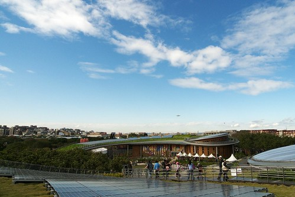

打花博開幕以來 阿徹便一直念著想去夢想館  看電視跟聽同學說很好玩的樣子 這回我跟徹爸也不知道哪來的衝勁竟然願意配合 不過為了降低落空的機率 刻意在上學期的最後一週的週二全家請假去花博 那天還是全天課 我說"這算是給阿徹這一學期上學辛勞的慰勞阿"

一早六點我們便起床換裝 吃好早餐六點半出門搭捷運 因為要去新生轉運站排隊領夢想館的預約卷 我們搭板南線轉蘆洲線到行天宮站 七點鐘出站時 我跟徹爸忍不住大呼"住在捷運旁真是方便阿" 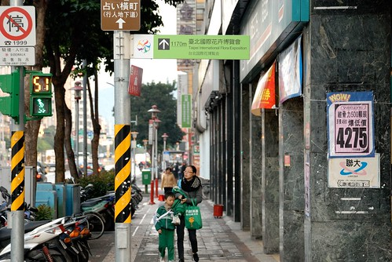

不過從行天站出站後還得走20分鐘的路程才能到新生轉運站 1170M是今早的暖身操 

越接近目的地越能趕受到各方湧來排隊的人潮 讓人最後忍不住會快走甚至小跑起來 深怕一個緩慢就領不到預約卷了 我們抵達排隊現場時已經是7點20多分  立牌指示著預約卷時間介於下午2點到6點間 雖然又比我們期望的晚了點 但該慶幸起碼可以領到了 (玟姿阿姨前一週五寒流 早上7點半領下午一點的劵 可見這排隊的結果變異數很大很難預測阿) 

就排隊定位點站立好後 我們便拿出有備而來的野餐墊以及撲克_牌以打發時間_

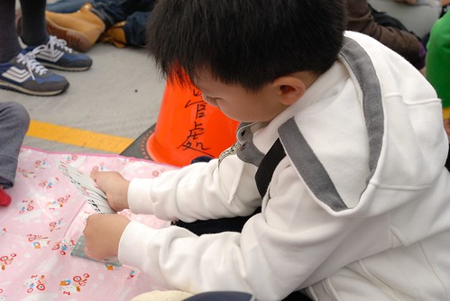

排我們前面的小姐突然拿出相機問說 我們是否可以讓他照一張 因為她聽聞夢想館排隊現場很熱鬧 大家像是來野餐 而她覺得我們的準備很充足很經典 聽到這我都忍不住有點小害羞了 不過我們還是厚臉皮笑嘻嘻的讓人家拍了張回去獻寶 哈~ 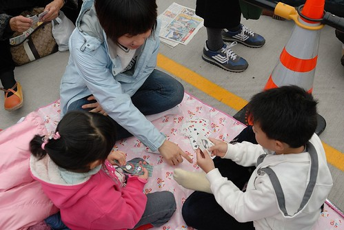

而且因為還沒開始放寒假排隊的小孩很少  我們也被前後左右的婆婆媽媽們多關切了一下 世人眼中 我們應該真是太放縱太不積極學業的父母了... 講真的若沒有阿徹跟小愛 我跟徹爸還真提不起勁大清早來這裡幹這種事哩 

接近九點開始發放預約卷的時後 站起身後仔細瞧瞧滿廣場都是的人阿 台灣人真的很熱情 真的很愛排隊哩 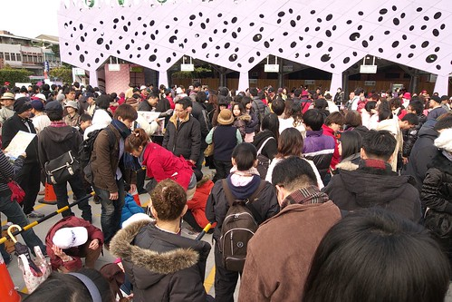

九點開始發放後 隊伍開始有秩序的緩慢前進  越接近發放處我們的心情也越是亢奮了起來 

九點半左右我們領到了我們的預約卷  下午4點10分的場次 四個人一人手拿一張 叮嚀阿徹小愛"要拿好 別飛走了哩...飛走早上就白忙一場了阿" 所以還是把四張票小心翼翼的收好在徹爸的皮包裡妥當些 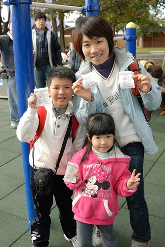

園內入口處旁是小孩的遊戲區愛愛吵著要玩 我說"千里迢迢來花博不是為了玩這到處都有的滑梯阿" 

開園才不過半小時的時間 新生園區內已是滿滿的人潮了阿(對照過年時看到的花博新聞照 這樣的人潮真的算稀疏了) 所以把握時間趕緊跑場比較重要阿 

新生園區的景緻又不同於園山跟大佳了  徹爸甚至覺得這裡的花草更是生意盎然有朝氣 

就在我們都還沒進入狀況時  突然有個媽媽志工熱切的告訴我們"從這裡照過去很漂亮喔" 現場指導起被照的人該站在哪 照的人該照在哪 

我跟徹爸兩人一致覺得花博的感人 很大的原因在於那數量多又熱情的志工 有啥疑問 幾乎轉個身就有志工可以問 而志工們個個有問必答又熱情 甚至有機會還會話起家常 真的很親切 揪感心 

光是一個花海區就讓我們一家子開心度破表  各種組合的合照照一堆 

尤其領到夢想館預約卷的阿徹更是如圓夢般的High到不行 

拿著他的相機拼命照 邊照邊喊著"真是太美 太美了..." 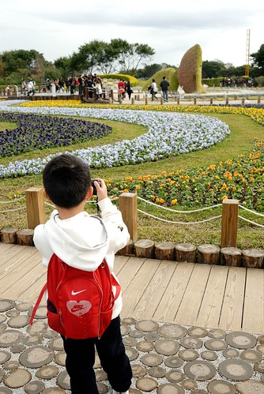

果然透過鏡頭看世界 視界變的有點不一樣 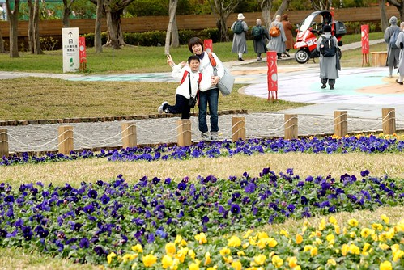

而穿著新衣服的愛愛也開心 因為新衣服上有她喜歡的兩個元素 粉紅色&米妮 

開心到在路上表演起她的金雞獨立 (路面是由一圈圈的木頭鋪成的喔 很特別很漂亮) 

這一天是打第一次從花博回來後 我就盤算好可行的日子 只是沒想到冷很久 陰霾很久的台北 在今天竟然是個大好天氣 讓人忍不住大呼"老天爺 真是太愛你了 你好棒阿" 美麗的夢想館建築加上這樣的藍天白雲 很漂亮的view 

好心情 好天氣 隨便走都覺得美 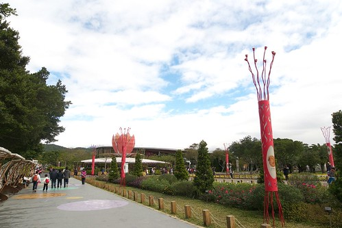

趁著藍天白雲 先前往我跟阿徹嚮往許久的樹迷宮 迷宮入口處前老榕樹成蔭  搭配舖滿地的小石子 讓人感覺似乎來到不同的時空中 

這是迷宮示意圖 徹爸很認真的研究了一番還照了張相以被不時之需 可是後來發現 圖上畫的似乎跟實際有些出入哩 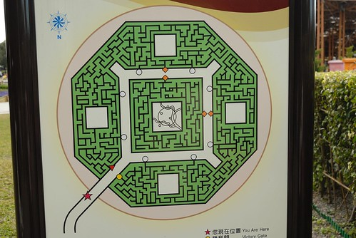

綠 綠 綠 一整片的綠 看了就舒服 

我們蓄勢待發 衝衝衝 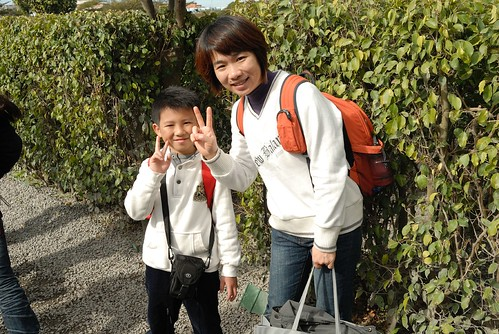

不過好幾次一不小心就從投降門走到中間了 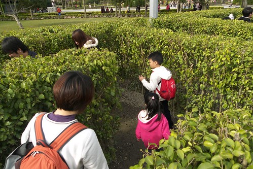

後來由爸爸領軍以他遠優於我們的方向感引領我們走完一圈迷宮回到起點 全程費時10來分鐘 真的是很大的迷宮說 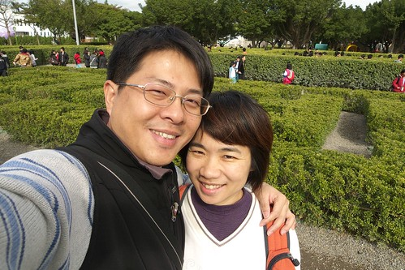

而在大迷宮的中間處還有一個小人版的小迷宮 較矮小的樹叢讓爸媽不用擔心 小孩子不知迷路在何方了 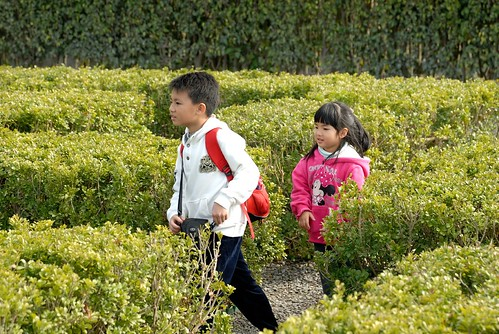

走完迷宮我們接著前往夢想館及未來館 打算來去看個未來館 經過夢想館後方 星巴克旁時 徹爸高呼"這裡來一張 這過去的view真是太美了" 

夢想館前面的樣子 果然感覺很神秘很夢幻的樣子 

打算要看的未來館 排隊的告示牌竟已到了需等候150分鐘 兩小時哩?!  我們內心好掙扎阿 一排下去又是一整個上午都沒了  可是不排好像又都啥館都沒看到了 (這是我跟阿徹在掙扎時 徹爸拍的一景) 

現場的氣氛與心情 讓我完全把前人玟姿說的"下午後排隊人潮少很多"拋之腦後了 所幸現場的志工告訴我們 下午後排隊的人會少很多  才讓我們決意先死心 同時間看到很多人從未來館屋頂散步下來  而徹爸探勘之後也回報大約只需排隊10來分鐘 因此我們便去排隊準備上"青青歨道"散步嚕 (排隊的時候 今日第一次拿出iPod讓兄妹玩angry bird發洩一下) 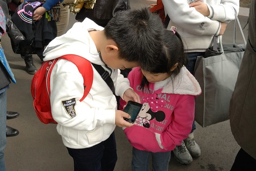

快要上歨道前的花圃一片紫色小花吸引了我們的目光 

很像小猴子臉譜的模樣可愛的很美麗 

而挺愛紫色的愛愛來個一張照 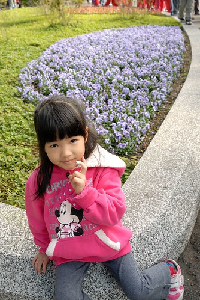

開始拾階而上後 每多走一台階就感覺離天空又近了一歨 尤其絡繹不絕的飛機從上空飛過時  哄巄哄巄的好震撼好過癮阿 覺得自己好像天空好近... (逛花博期間 看著聽著天空一架架飛機的起降 會讓人很驚訝於原來松山機場的航班是如此之多阿) 

青青歨道天雨時並不開放 而幸運的我們在這樣美麗的天氣下來到這上頭  四周放眼望去每一面向都是大景 美景阿 

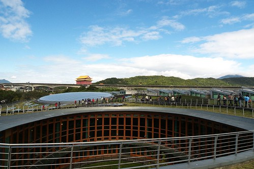

一梯次好像允許40左右的人上去 我們是那一梯次的最後一批人 因此得以慢慢的走 興奮的哇 盡情的拍 

今日請假來看花博 光衝著可以在這樣的好天氣上青青歨道 就讓我覺得好幸運 好幸福 好滿足阿 

不過即使再美還是得乖乖往下走了 把美景繼續留給後面的人潮 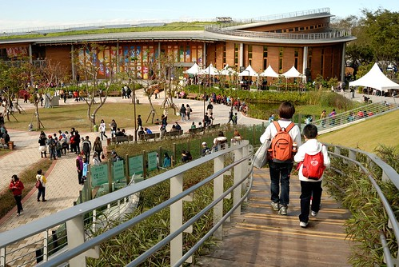

青青歨道下來後接著剛好去夢想廣場看11點的踢踏舞表演(徹爸這回去花博很積極 努力找看的 找吃的) 剛坐下來等著看表演時覺得這樣曬著太陽好舒服阿 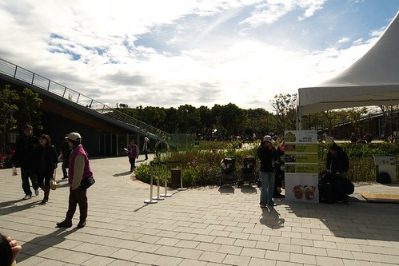

台北已經好久好久沒有出現這樣的冬陽了  身體難得有機會可以進行陽光殺菌 

可是坐個10來分鐘後開始覺得太陽烈的太火  洋傘 遮陽紙紛紛出籠 這天氣真的跟前一天還有接下來的日子差太多了  而我們身上的衣服從早上出門的4-5件開始脫到剩2-3件 

對不起原諒我 忘了舞團的名稱是什麼了.... 看完後雖然徹爸嘀咕著 團員的舞歨跟音樂節拍各走各的 回家後放個火焰之舞給阿徹她們見見世面 但是阿徹跟小愛還是覺得好好看 好精采  我想現場表演所帶來的震撼與感動是dvd影像遠遠比不上的 而且小愛回家後還在家裡踢了好幾天的舞ㄋ 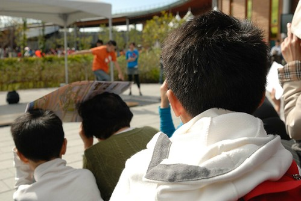

看完40分鐘左右的表演後 我們去新生園區的台灣美食區吃中餐 這的規劃跟攤位很像百貨公司的美食街 而人雖然不少但整體環境很乾淨 算是不錯的用餐環境 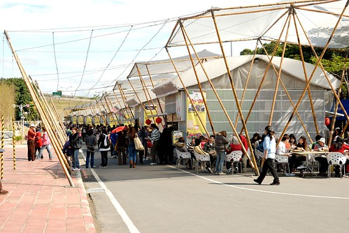

而東西也很好吃 好吃到我們花了好幾百元吃了好多的東西(我們這回完全的沒餓到 一整天光吃的就花了快1千元) 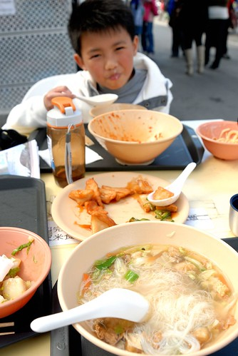

正中午時刻 阿徹的臉被曬的紅咚咚了 

小愛也被熱到必須努力控制自己的情緒中 

可是為了今日的長期抗戰 大家要繼續努力加油阿! 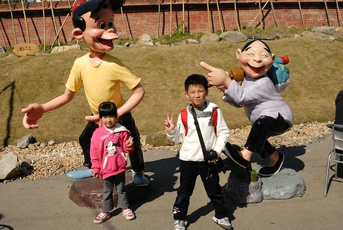

只是美食區東西好吃歸好吃 這時候想要找個飲料舖竟然沒有 如果這時候可以來杯冰涼的紅茶或是珍珠奶茶該有多好阿 後來在林安泰古厝前的小舖看到有飲料的販售 想也不想的就衝去了 只是竟剛好遇到一群戶外教學的小學生把我們擠在店內動彈不得 我跟阿徹說"請問你們小學生都是這樣恐怖的嗎?!" 

我們除了買了個花博紀念飲料桶外(180元的桶子 飲料免費送 滿滿一桶的檸檬紅茶也是怪恐怖一把的) 同時也讓阿徹跟小愛各自挑了一個紀念品 阿徹選了花博精靈自動鉛筆 而愛愛則選了花博精靈髮夾 

愛愛迫不及待的要我幫他的紀念品別上 我說"有了花博精靈翅膀的加持 愛愛是不是會更利害 更棒了" 愛愛說"對阿 有時候用吸盤腳 有時候用翅膀 我就會好利害" 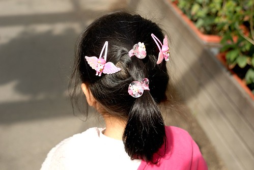

(廁所門口照的一景 今天在這廁所進出的次數應該有超過五隻手指頭) 

解渴之後 我們穿過花之走廊要去搭接駁車去圓山園區看彩虹 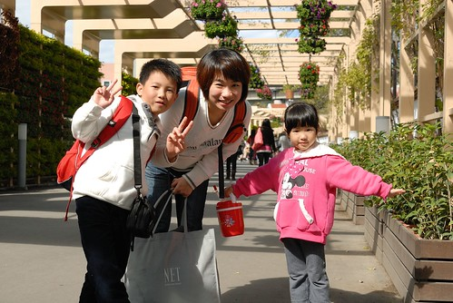

接駁站就設在這水門外  連水門也被莊點的這麼美麗 

花博第二戰要一回寫完實在是太大的工程 太累人了  還是不貪心的分次寫...下回待續....
