等了好久 總算寫到神祕的夢想館了 夢想館裡到底有什麼秘密讓每天都有一堆人透早就去排隊領預約卷ㄋ? 待徹家來揭密吧~ 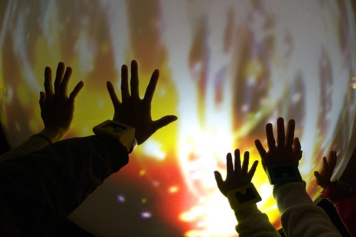

下午四點我們很從容地來到夢想館外 等著我們場次的進場 等候時 阿徹問我爲什麼這裡要叫做夢想館阿 我說 可能裡面會讓人覺得好像來到夢想的地方 讓人覺得很開心 很幸福吧 後來有一位志公伯伯拿了兩套的鉛筆+橡皮擦小禮物送給阿徹跟小愛 我跟阿徹說'這裡果然是夢想的地方 給了小朋友這樣的驚喜' 懷著興奮的心情 我們終於也踏進著超級熱門的夢想之門內啦 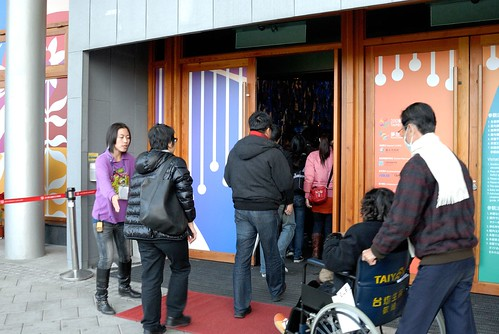 

(官網) "夢想館由臺北市政府委託工研院負責規劃，結合工研院最新研發的重點尖端技術與國內藝術家的創意，賦予科技嶄新的應用機會 工業技術研究院在夢想館呈現的尖端技術，內容突顯3D立體影像、即時互動、輕薄、撓曲或高靈敏度等特點，強調豐富感官體驗的科技，打造充滿想像力的故事空間，將帶給觀眾充滿無比驚奇效果的感官旅程。"

進館後首先是在大廳觀看約莫5分多鍾的寬達六米的巨型動力機械花朵「綻放」 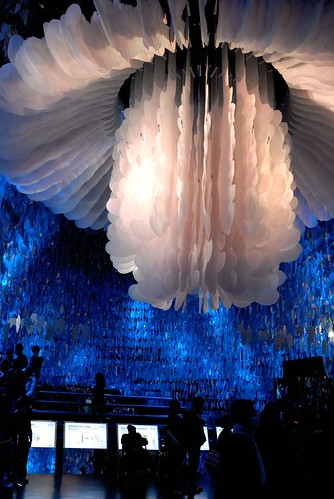

(官網)巨型機械花與緊緊包裹著的重重葉片，在燈光烘托下，花朵開闔間，流轉出視聽感官齊揚之美 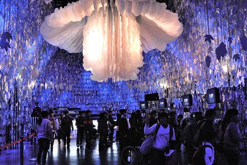

然後準備領取內嵌RFID標籤的智慧手環  每一台機器都有專人幫忙機器的操作 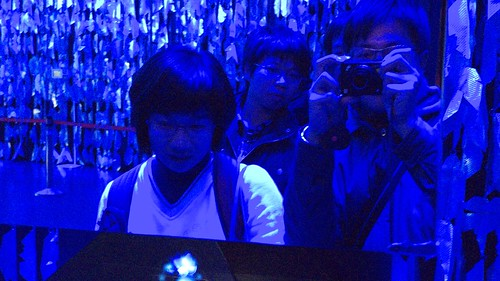

首先選擇自己的夢想 選項有五個: 感情 健康 事業 心靈 家庭 愛愛選了健康 阿徹選家庭 我選擇心靈 而原本想選擇家庭的徹爸則被我逼迫選了個事業 我說 這樣我們家就同時擁有四個夢想了阿  多好 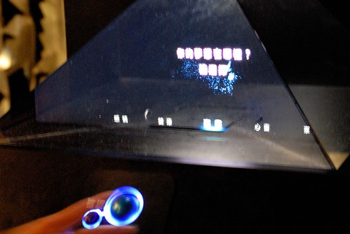

不同的夢想會有不同的花朵出現 然後領取自己的手環 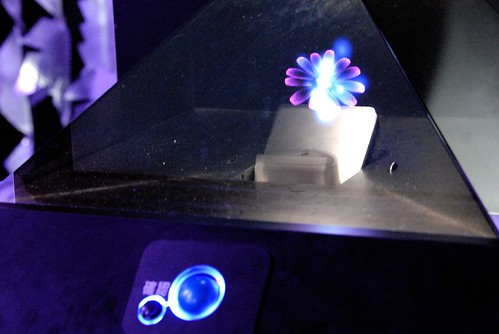

(官網)手環將紀錄觀眾在展館內的行為，並在旅程的最後，根據個人參觀行為，「召喚」出獨一無二的花朵 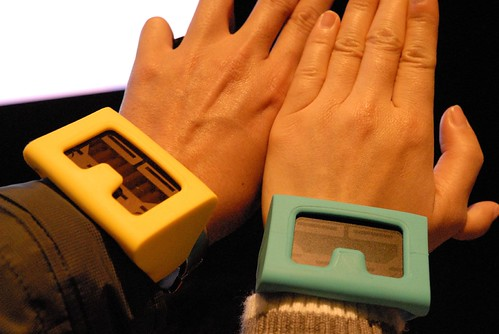

接著進入夢想館一廳的台灣特有植物的裸眼3D影像 (官網)在主題為「多樣」的一廳，觀眾站在大尺寸直立式螢幕前，不需佩戴特殊眼鏡，即能看到逼真的3D立體影像，並與畫面中多種臺灣特有植物進行同步互動，感受多樣驚奇 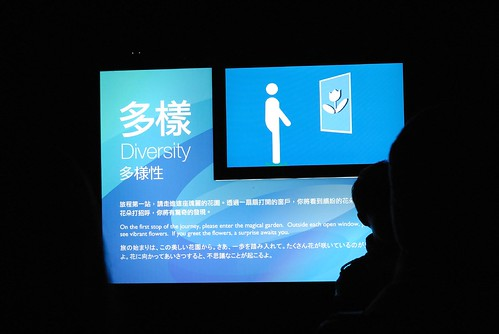

站在每個植物前面的方框內便會有3D立體影像的出現 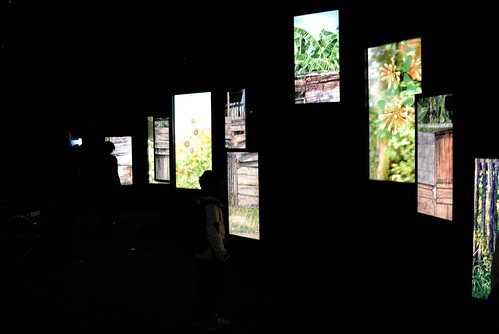

裸眼3D 這個真的有屌 不同於3D電視那種扁扁 影像只是凸出來的不協調性 這裡的3D立體效果十足 很受徹爸稱讚 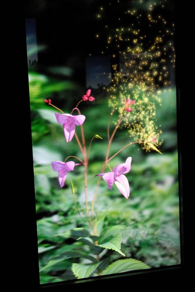

(官網)進入主題為「互利」的二廳，觀眾將化身成昆蟲，穿梭在花瓣迷宮間，穿越雄蕊通道，身上沾滿花粉，最後完成授粉，開啟生命之鑰。在這個廳，觀眾體驗了一場孕育生命的過程，也體會到昆蟲與花朵互利與共生的關係。

手上戴的手環第一次感應 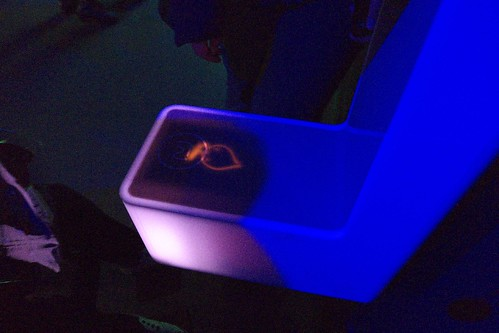

然後穿越雄蕊通道 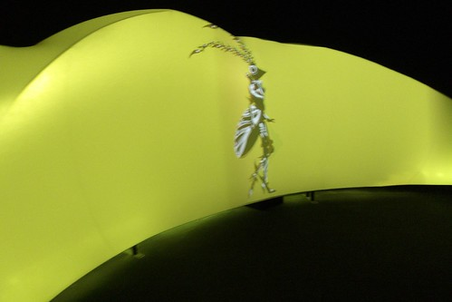

拍打花蕊 讓身上沾滿花粉 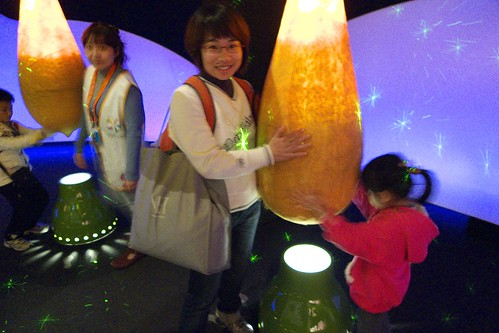

進行授粉 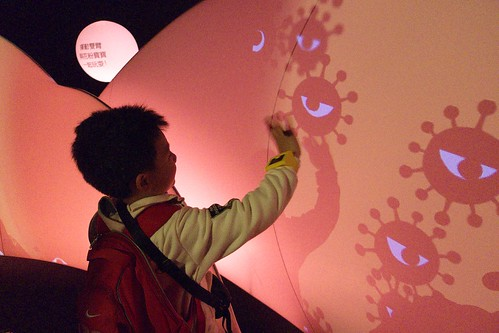

靠著大家的念力 開啟生命之鑰 

生命之燈因此點亮 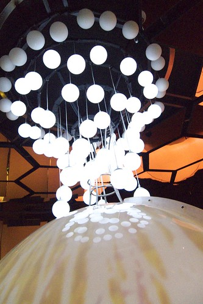

(官網) 三廳的主題為「共融」，在360度環型劇場中，影像快速穿梭位移，觀眾將深刻感受影像逼近的衝擊感。本廳結合工研院非接觸式超寬頻生理訊號感測技術，在不接觸人體的情況下，讀取觀眾的呼吸與心跳，並立即與螢幕產生互動，體驗全方位觀影經驗與感官震撼。

360度環形劇場 不同角度不同景緻 讓人一下看東一下看西 頭都快轉暈了 不過影像真的都很美麗 尤其放煙火那段甚至比真的101煙火還漂亮 還震撼說 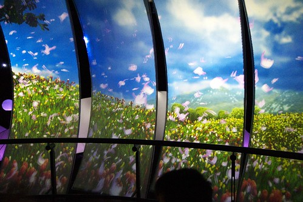

準備進入二樓的四廳前  再次感應手環然後可以在螢幕上看到屬於自己花朵的綻放 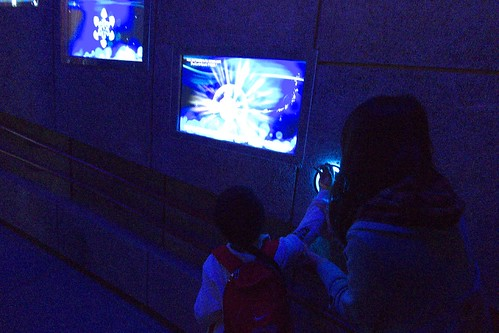

往2樓的迴旋道是全館內有自然採光的地方 把握機會大家一起來秀一下夢想館的認證標章'手環'  咱們的愛愛動作有夠像女打仔那樣酷吧! 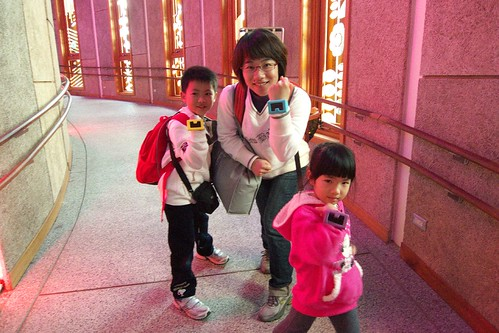

在夢想館彷若就像在另外一個時空中 而這小小的縫是唯一連接現實世界的地方 由裡而外望出去 別有一番意境 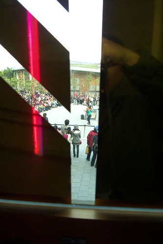

四廳的前段是機器花海的演出 因為太不感動徹爸 所以沒能留下任何照片

(官網)旅程的最後進入四廳「愛與夢想」，觀眾配戴的RFID智慧手環已完成全程運算，穿過「花械花開」之花海，觀眾將可召喚出個人專屬的花朵，將它栽種在城市花園裡，用愛讓每個人的夢想成真，也為民眾的夢想之旅留下美麗的記憶。

透過我們的手 把我們的能量傳給樹精靈 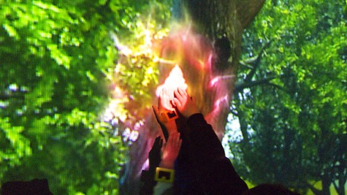

最後召喚出個人專屬的花朵種植在城市花園裡 到此完成整各旅程 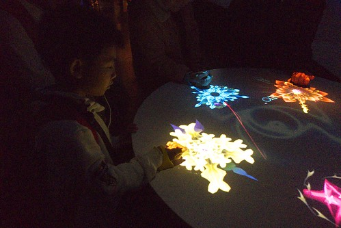

最後岀館前列印岀屬於自己的花卡作為排隊很久來到夢想館一遊的紀念 上面印有序號 個人專屬花朵 與一些像是星座小語的花語 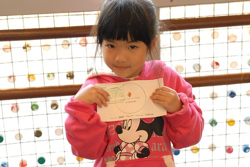

整個夢想館體驗歷時約莫40分鐘 徹爸看完後的結語是"工研院果然只能搞出這些東西" 而我的感想則是(我不懂科技 比較不嚴苛) 嗯! 的確很特別 也蠻酷的 但是看完後心靈依然需要滋潤哩(呵呵) 我總算明白當我問陳嬤花博好玩時 (陳嬤他們的花博初體驗剛好早幾天且他們透早6點多去排隊了) 他用著說不出好玩但也不會說難玩的表情告訴我"好累" 如果第一次去花博的透早就是辛苦的排幾小時隊 講真的真的會累 也真的會對花博打了點折扣 而且我覺得其實像愛愛這樣的小小孩或是像陳嬤這樣的鄉下歐巴桑 真的會看不太懂夢想館且容易被其快速的流程更搞的暈頭轉向的 所以結論是 來花博真的不要貪心 選擇適合自己的才能玩的真開心真盡興

(從夢想館2樓出口照往未來館的景)

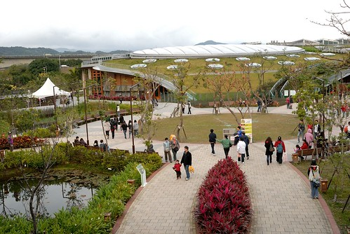

逛完夢想館接近5點 看著未來館外沒有滴點的排隊人潮  我們便又衝衝衝的衝去了 

未來館是以植物為主題的展示館 裡面展示有台灣特有種 不同海拔生長植物以及蘭花/蕨類/仙人掌等 而吸引我來的則是一樓的生命樹 據說有百年生命了 只是現場看到時很是失望 因為跟自己想象中茂密旺盛的樣子很不像 感覺就像是原本住在鄉下的老人最後礙於現實來到台北兒子家中居住一樣 老人的笑容少了 甚至沒有了... 至於其他植物的展示就也算是中規中矩也還蠻值得看的 只是如果得像早上那樣排兩個多小時隊才能進館的話   那就真的不建議這麼累了 

館內很有名的還有這顆跳舞樹 可是不管圍繞他一圈的觀眾如何呼喊他 命令他 甚至我們還要聲音響亮 辨識度高的愛愛來個愛的呼喚 他不動如山.... 讓大家最後都只能悻悻然的離去 嘴裡還邊唸著'根本不會跳舞' 呵呵 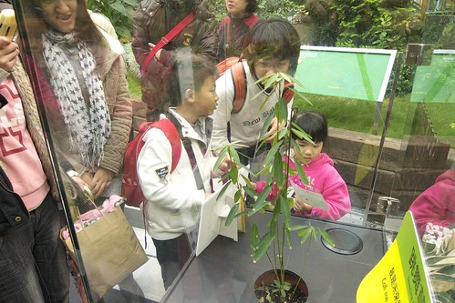

整個館內最吸引我們家注意與熱烈討論的是仙人掌區 每個仙人掌看起來都好可愛 水分飽滿新鮮喔 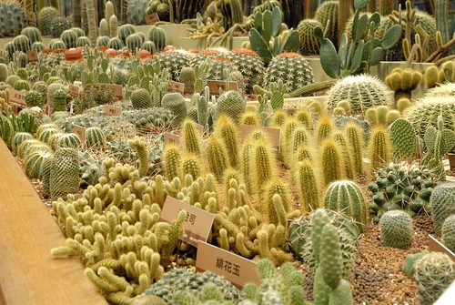

像是蝦捲或是起司條的 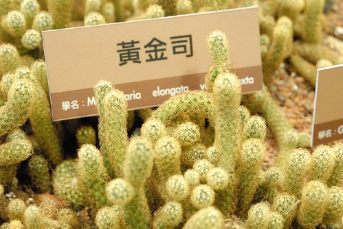

像是戴了帽子 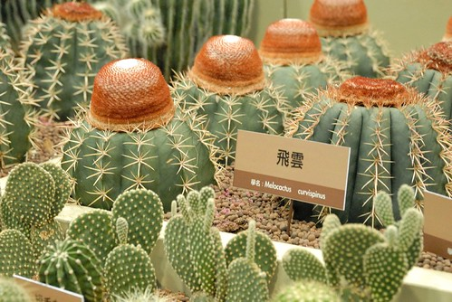

像是兔子的 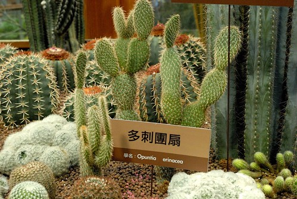

讓我們異口同聲喊著火影忍者裡藥師兜的兜 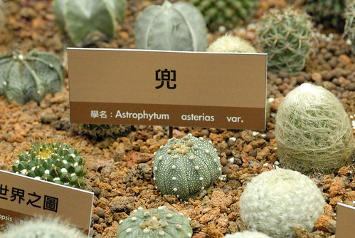

像是大便的 (較美觀的說法是 很像別在衣服上的造型花) 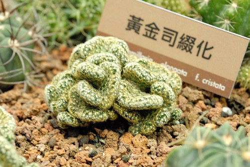

超級毛茸茸的.. 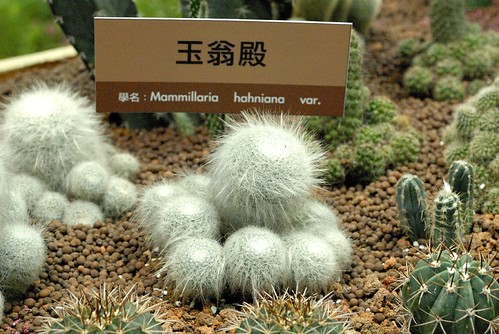 超級多的仙人掌 一次看的夠

館內樓梯一角還有這立著'不要再問了 我是真的' 的菇 雖然已經立有告示告訴大家這是真的 但是我們還是忍不住一直問 這是真的嗎?這是真的嗎? 

(樓梯轉角佈景之一) 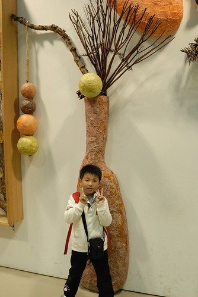

館內還有未來家庭 包含廚房 客廳 房間等的展示區  只是實在太未來 讓人感覺太虛無 太飄邈阿 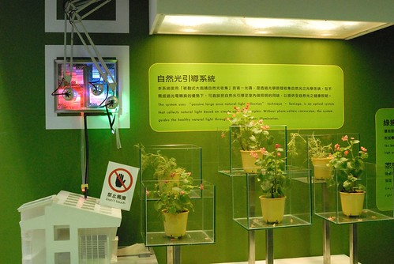

最後的蘭花館展示著台灣傲人的蘭花 

很像小猴子的籣花 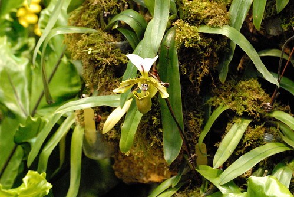

離開未來館 順道還可以去逛買1送1的天使生活館 等候時 控制館場人數的志工跟徹爸聊了起來 '你們有去看夢想館了嗎' '有阿 剛看完的' '哇 你們幾點來排的' '早上七點半到 排到4點10分' '那你們很幸運哩 前陣子都是早上七點排到晚上七點的場次 有的甚至清晨4點就來排隊了' 哇勒...原來我們這樣看到夢想館好像真的很幸運哩 

(官網)天使生活館展出期間將由天使美術館負責營運，落實生活美學，以「藝術生活化」為主軸，透過互動科技、影音呈現臺灣高山流水及花卉百變的面貌，結合綠建築做生活化的展示，結合藝術生活化等意念，傳達於世人面前

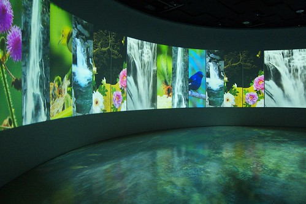

而就我們感受的是 就是一個180度環狀劇場的動畫貓影片 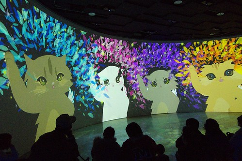

其他的賣場 spa還是瑜珈等付費療程讓人感覺太置入性行銷了啦 徹爸說 難怪是買一送一 排未來送天使  如果花兩小時排隊看到這應該會想打人吧 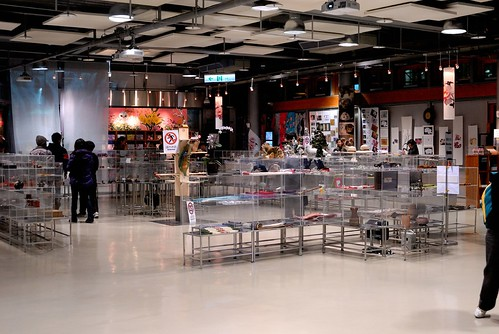

到此已經快六點了 我們四個人的腿都快不是自己的腿了 臉上也是倦容多於笑容了 可是搭接駁車回到圓山區後(得回圓山搭捷運) 我們還是決定給他豁到底 把流行館也一併解決了 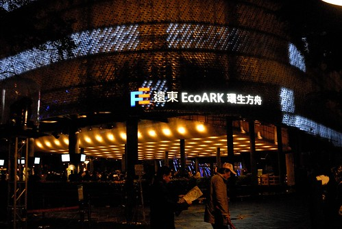

一樣不若白天的人潮 排了10分鐘左右便進入館內參觀 忘了是哪個親友形容的'就是那個塑膠瓶館'  流行館最大的賣點跟特色真的就在建築物本體 不過因為覺得這樣的建材難以實際應用在日常生活中 所以並未引起我們太多的共鳴 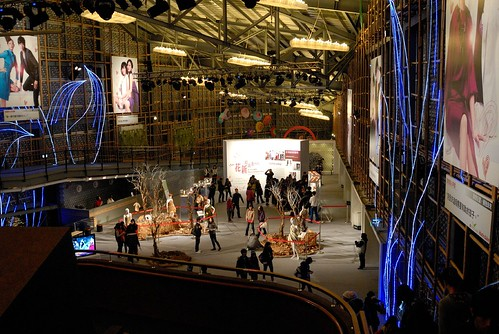

整個館除了幾幅巨大的明星照片以及芭比娃娃服裝區讓我們印象深刻外 其餘的感覺就是空空空 所以不到20分鐘便出館了 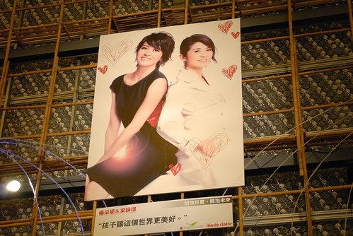

總算完成今日奮戰的我們到現在真的是又累又餓了 所以便又留在原內的異國美食區打發我們的晚餐(才七點這裡就像快打烊一般 很多產品都沒有了 人也很少) 愛愛真的是吃到眼睛不小心閉上 睡著了  我也做好扛她回家的心理準備了 所幸最後的一包脆暑讓她暫時的迴光返照 可以自己回家了

離去前的爭艷館沒有半個人在排隊.. 看官們~爭艷館真的白天夜晚看都沒差 買個星光票把這些館跑遍省錢省時又省力阿 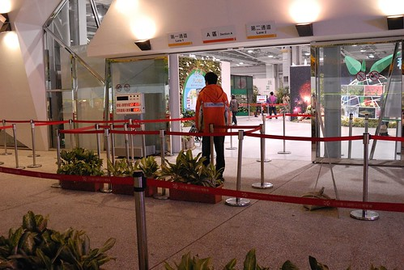

夜晚時的爭艷館外觀也顯得特別美了  不可否認花博裡的建築物真的都很美 各具特色與風采 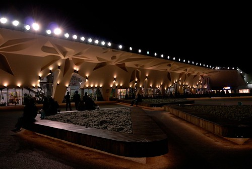

夜晚時涼風徐徐 三五好友坐在這聊天也愜意  可惜已經奮戰了一天的我們不適合 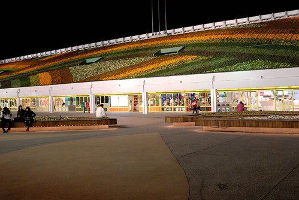

所以我說 就買個下午票或是星光票 抱著到大公園散步的愜意心情來花博真的就很棒了說 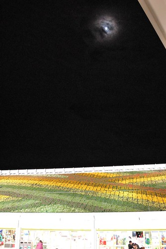

阿徹跟小愛在出場前 看到花精靈立排要求照個一張 粉紅花精靈愛愛看起來真的想睡覺的樣子了 呵呵 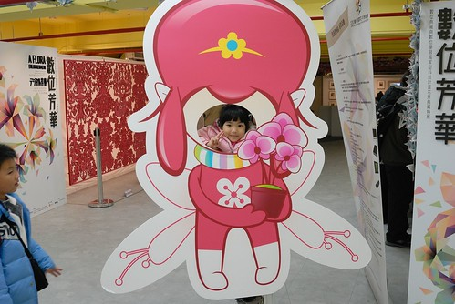

而小學生阿徹果然還是我們四個人中最厲害的 沒有腿酸沒有愛睏 叫他猛男啦! 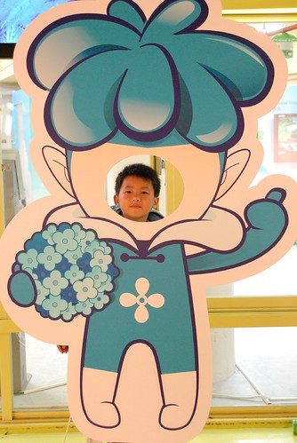

分三篇寫的徹家今日(1/18)花博大成功! 謝謝大家有耐心的觀看 也祝福大家都有個屬於自己 好玩又難忘的花博之旅~
