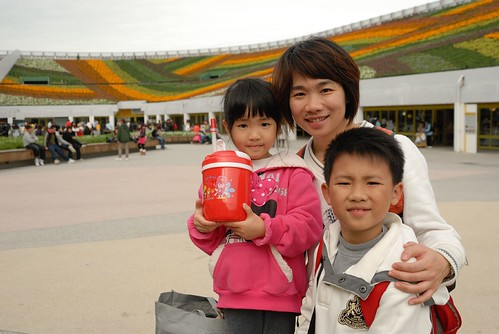

(一次寫個夠 看個夠 就來個花博大轟炸吧) 中午離開新生區後 我們搭接駁車到園山區 趁著這樣的好天氣當然得先去看我想唸許久的"七道彩虹" 

一直搞不太清楚 以為要進到爭艷館後才能看到七道彩虹 沒想到原來七道彩虹就在爭艷館的入口處旁 就算沒排爭艷館也是可以進來看彩虹的 是休憩的好地方  

不同於上回看到排隊一個多小時的人潮  下午2點時分只需排個10來多分鐘便能進入爭艷館內 

爭艷館大概是這次花博所有展館裡 最中規中矩但卻最貼題的展館 約大辦個足球場大小的展館裡(原本的中山足球場被一分為二 一部分成了爭艷館展館而另部分即為七道彩虹區) 展示著所有存在於台灣的各式農林漁業  讓人不得不佩服台灣土地之富饒阿 吃的菜 

觀賞的花 

而當中帶有濃濃台灣味的小布置常讓人看了會心一笑 (愛愛以後真的可以考慮去當展場小姐 手上的紀念桶跟DM每次照像時總不忘記要擺好) 

水果區裡利用各式水果的佈置也讓人嘖嘖稱奇  水果個個看起來都新鮮又好吃的樣子 看到這些各式各樣的水果 讓人覺得住在台灣真好 一年四季都有好吃的水果吃 

利用各式茄子跟番茄拼裝的臉譜 這也很屌 

而在五穀類展示區裡 除了有活生生結穗的小稻子還有應用各種穀物做成的創作品 

黃 紅 黑豆做成的小豬 

玉米為主的小豬 

土豆三兄弟 

團團圓圓可愛貓熊  阿徹小愛看到這些"好可愛"之聲讚不絕口 

而最最厲害的是在畜牧區裡竟然連小雞 小鴨 小豬也搬來了 

一顆顆孵化中的雞蛋跟鴨蛋 

剛孵化出來 毛茸茸的小鴨惹人愛憐 對於沒看過小雞小鴨孵化的我們來說 看著小雞啄著蛋殼想要破蛋而出的樣子很是感動 

海洋區裡的野生石斑魚 塊頭都快比人大了 

忘了名稱的海底生物 頂著一個安全帽跑來跑去超級可愛 

靠著尾巴前後搖擺移動的海馬也超級可愛 

當中有個角落播放著台灣海馬介紹的影片 我們站了10來分鐘看完整個影片 這是當中介紹的台灣特有海馬品種 很小很可愛 但是數量極少瀕臨絕種 

老實講那天看了五個館 爭艷館是我最推薦的館 很值得住在台灣這塊土地上的人透過這展覽多了解一些台灣的農林漁畜牧 雖然很沒賣點 很八股 但是展示的東西真的超級多 阿徹跟小愛從頭到尾有問不完的"那是什麼" "為什麼"... 讓我在逛了一個小時後因為說太多口太渴而急於出館 出館後坐在館外喝口茶 喘口氣 

然後好好在彩虹花海前照個相 

雖然親臨現場覺得彩虹的震撼度不若電視上所見但還是覺得很特別 尤其照片所呈現的色澤感真的很棒 

爭艷館讓我們逛的又累又渴 於是在爭艷館旁的異國美食區買了銅鑼燒 珍珠奶茶做下午茶(這回逛花博真的吃很多) 意外發現美食區旁的花圃有美麗的鬱金香花田 

第一次親眼見這樣大片的鬱金香 

覺得花美的有點不真實 

而一旁的小植栽也翠綠的超漂亮 

其實花博裏很多的佈景都只有小小小隅  但用心的妝點 巧思以及維護 讓人身在花博中處處有驚喜 

到現在已經下午3點 姑娘的精神還很好 甚至似乎越來越亢奮了 

接著我們去同樣在圓山園區內的大地花海 這也是我們上回的遺珠之憾 

那時候晚上黑壓壓一騙 根本不知道這片花海有這麼大阿 

置身美麗花海中 愛愛的情緒繼續高漲著 邊走邊踢 

愛: 看我有沒有好利害 踢的好高! 

結果越是誇獎愛愛 她越是踢地一發不可收拾(媽媽在旁邊一臉看你能有多會踢 能踢多久的樣子) 

媽媽: 乖 不要調皮了 好好一起照張相紀念一下唄(愛愛的臉又變成可人兒的模樣了 模式切換的真快) 

換跟爸爸來一張(突然覺得這裡挺適合拍婚紗照的說 呵呵) 

用小P的廣角來個大景照 真是漂亮 

若不是要去趕搭接駁車回新生園區看夢想館 真想就坐在這發呆阿 改天好天氣有機會的話 一定要來這坐他個好一會 多愜意阿 

沒來花博前看著那些新聞或廣告文宣說的 花博讓城市變美麗或是花博讓你看見不一樣的台北/台灣 實際來了後 真的得說 不論軟硬體 真的都讓人看見不同以往 很不一樣的視野與格局 一個美麗的城市 國家 可以讓住在上面的人們也很美麗很幸福的 只是如果這樣的美麗可以繼續保鮮下去 甚至範圍擴的更大 那就更有意義了 

快快快 剩下30分鐘而已 我們要趕緊去撘接駁車 去我們的夢想館了 

本來要一鼓作氣用一篇寫完第二戰所有剩下的部分 可是寫了三天竟然還只是寫了一半 好累喔... 而且也不要讓大家又得滾輪滾太久也看的很累  所以夢想館還是再待下回揭密吧! 待續.................................
