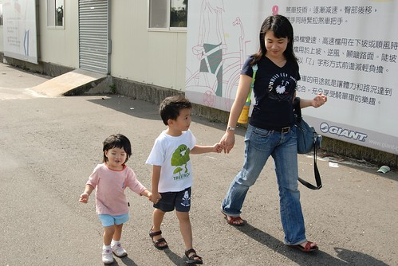

雲淡風輕 秋高氣爽的日子裡 好像就該大手牽小手一同去郊遊  
這樣的好天氣沒出去踏踏青 會很對不起自己  
只是原本該是在花蓮的海濱公園 七星潭踏砂逐浪的...  
  
上週臨時起意的訂了房打算去花蓮小玩的  
怎知東台灣與中台灣的天氣竟是如此的東轅西轍  
看了一週的中央氣象局氣象預報 花蓮每天都是大烏雲+陣雨 而台中都是大太陽  
只好這麼的在出發前一晚臨時喊卡了 (謝謝民宿主人可以延後住宿)  
雖然早有心理準備甚至早也考慮取消花蓮改去東豐  
但真的這麼臨時急轉彎 老實說心裡很落寞...  
想了很久 且最近"哈"的要命的海邊  還得再"哈"一個月 (煎敖阿)  
  

既然去不成花蓮 那就改去后豐鐵馬道及泰安溫泉  
週五晚還很不死心的花了很多時間上網找泰安溫泉旅館  
只是價錢真的貴三三 所以最後還是放棄在外過夜  抱著遺憾上床睡覺準備週六的給他玩晚晚  
週六的行程很簡單  
直殺台中 -> 后豐鐵馬道 -> 泰安溫泉 -> 回到溫暖的家  
坐足心理準備沒給他玩天黑黑是不回家的  
  
到達台中正值正中午  太陽大阿  
於是先繞去豐原鎮上解決午餐  
只是在火車站 慈惠宮那熱鬧地帶光要找停車位竟也花去一小時   
連上吃完中餐跟沿路的小吃 離開豐原時已經是下午兩點(時間真的很不留情的飛逝)   
  
(穿著長袖 外套的我們 相較於路上穿著短衣短褲的行人 我們真的像是台北來的觀光客)   
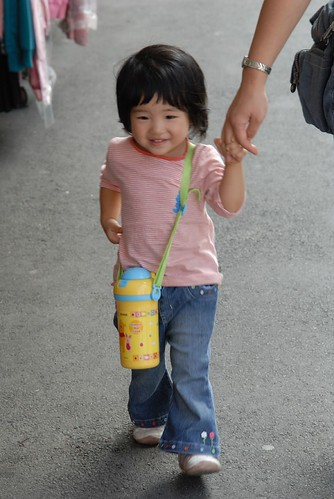  
  
小愛是今天全家中最開心的一個  
對他來說 太平洋也好 鐵馬也好 都是去玩就都是好玩  
  
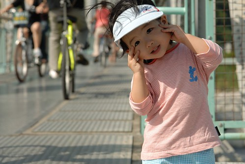  
  
阿徹今天的心情則不太好  
一來一直很難理解 怎麼不是去媽媽這一個禮拜一直說的花蓮玩沙ㄋ  
二來更難理解為什麼他不能自己騎一台鐵馬 而且在捷安特店裏就活生生看到一台跟家裡一模一樣的腳踏車  
為什麼? 為什麼? 為什麼?  
爸爸說 阿徹因為吃感冒藥所以情緒不好 筋很容易斷掉 斷掉後又不容易修復  
可是我越想越能理解阿徹blue的心情  
剛學會腳踏車的阿徹一定很"新師好棒賽"+"雀雀欲試"想要騎車上路  
況且他也讓步的要騎有輔助輪的腳踏車就好 怎爸媽就是不准  
如果我是他 我想我也一定會鬱悶很久...  
  
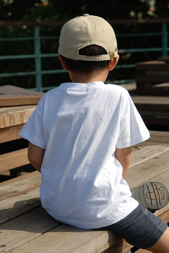  
  
算了 就給阿徹哥哥一點時間 慢慢平復心情吧  
小愛妹妹你就多玩點 多照點相  
  
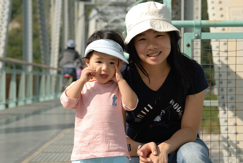  
  
后豐鐵馬道有名的"\*\*鐵道"   
親臨現場真的有被鐵橋嚇到的感覺  
  
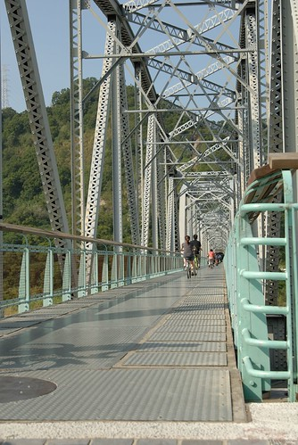  
  
騎到橋中放眼望去則是這流向大海的滔滔溪水  
  
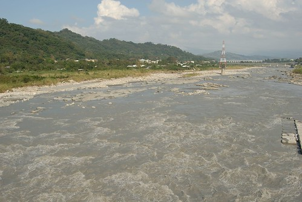  
  
老實說騎在上面聽到車子搌過鐵板的聲音加上溪水滔滔聲以及吹拂在耳邊的風聲  
我的雙腳真的忍不住發抖了起來   然後感覺車子似乎越來越不穩  
尤其對面來車頗多 我一直擔心會不會一個不小心就卡到別人  
或是不小心一個打滑飛出去了...  
  
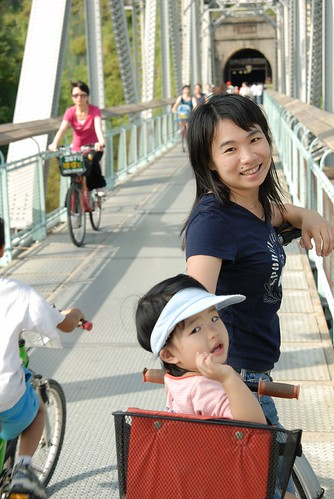  
  
不過還是得承認這是很難得的體驗  
難怪可以號稱中台灣最美麗的鐵馬道  
  
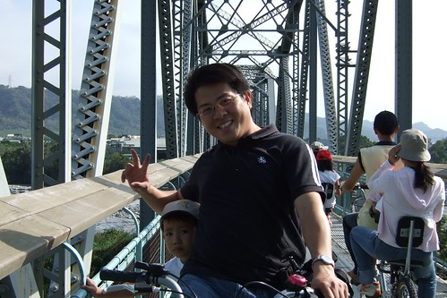  
  
騎完鐵道緊接著就是長達一公里的九號隧道  
進到隧道裡果然感受到些許的涼意 (陰冷嗎?)  
邊騎邊望著兩旁斑駁的牆壁 想像坐在火車上經過這黑漆漆山洞的樣子  
越想越覺得 這隧道怎麼這麼長阿 何時才可見天日阿  
  
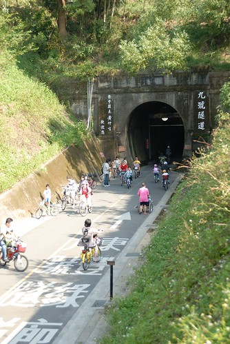  
  
這回騎腳踏車覺得自己一整個遜  
稍微點坡度 就騎不上去還得下車牽著車走 (真難想像上回是怎麼騎關山環鎮自行車道的)  
以為是自己近來沒有運動 體力變差了  
回程時卻騎來毫不費力 才恍然原來去程是一整個上坡阿  
幸好去程時阿徹生氣不讓媽媽載  
而回程時又願意讓媽媽載 加重我下衝的位能  
  
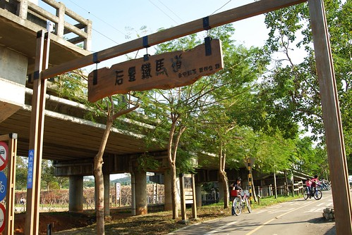  
  
台中的秋老虎很嚇人 所以帽子還是得壓低低  
(怎~~~怎~~~媽媽的魚尾紋這麼嚴重了ㄚ  泣~~~)  
  
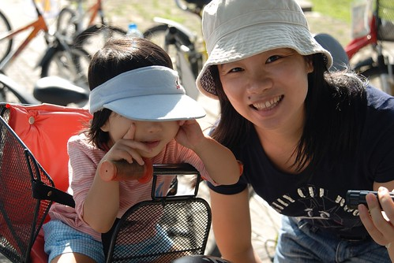  
  
小愛最近照相 兩隻小手很愛捏她的小臉 然後望向他方 怎麼喚也喚不回  
很enjoy在自己照相的樂趣中  
  
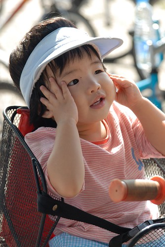  
  
騎車後果然會餓 豐原買的雞蛋糕雖然冷了還是很好吃  
  
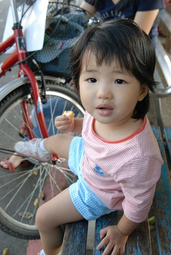  
  
阿徹的情緒有稍微好一點了  
不過還是一直叨念著"為什麼我不能自己騎"  
  
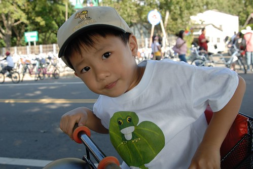  
  
最後4.6KM\*2 不到10公里的車程 花了100分鐘時間  
還騎的累呼呼 這樣怎麼騎單程12.5KM的東豐綠色車道阿  
多練練後再來吧  
  
小愛這頭會不會偏的太可愛啦  
  
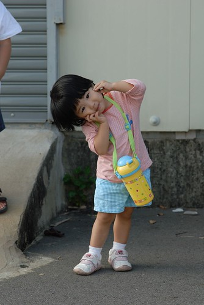  
  
揹起水壺遠足去 十足大寶寶的模樣嚕  
(雖然身型還是很迷你 常被問這麼小就這麼會走啦 滿週歲沒? 媽媽一整個的Orz)  
  
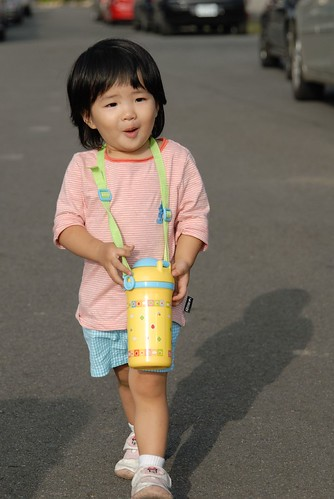  
  
雖然徹爸說"阿徹今天不乖 幹麻對他那麼好"  
但最後還是冷冷的問了我"泰安怎麼去" 然後路迢遙的往苗栗泰安前進  
媽媽本來真的以為泰安就在高速公路附近  
(中山高不是有泰安收費站 害我一直以為下高速公路就是泰安了)  
想不到離開縣道後竟然還要開半個多小時的沒有路燈的小山路  
這..這..未免有點偏僻了  
不過偏僻規偏僻 這的溫泉會館價位還都頂貴的  
(前一晚興致勃勃的上網找可以過夜的會館 價錢完全之讓人怯步)  
所以還是花點小錢泡泡湯就好  
最後來到爸爸導航系統裡有的日出溫泉洗溫泉  
  
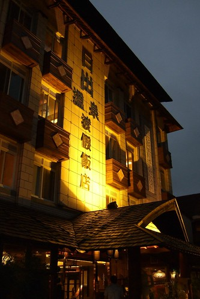  
  
小愛的小可愛泳裝又出現嚕  
剛幫小愛換上時 小愛好像不習慣肚臍"浪風" 拼命把上半截衣服往下拉  
  
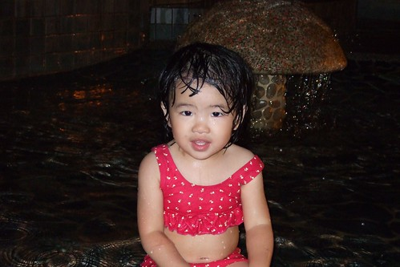  
  
爸爸說 小愛頭髮濕了後的樣子很性感 很美麗  
  
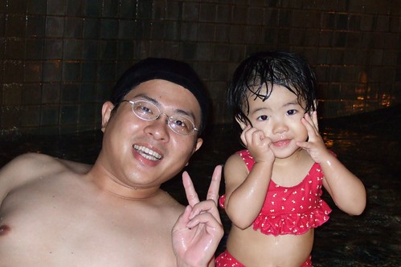  
  
睡過一覺且泡到期望的穿著泳裝的溫泉 阿徹開心嚕  
自己一個人穿梭整個泡湯區  
害媽媽常要大喊 阿徹你在哪裡  
幸好正值用餐時間 沒啥人泡湯(1小時中只看到10個以內外人陸續出現)   
不用擔心小孩被擄 只需要擔心小孩會不會沉下去了  
  
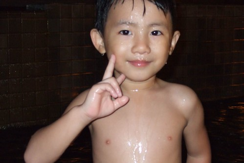  
  
不止濕頭髮的妹妹性感美麗 濕頭髮的哥哥也超帥  
  
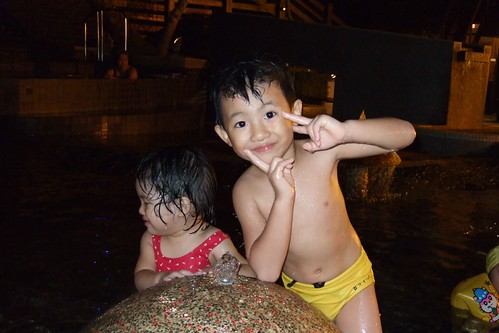  
  
唉呀~真不好意思 油光滿面的泳裝媽出現了 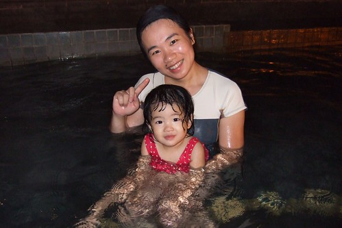  
  
阿徹問我"泡溫泉我身上的壞蟲蟲是不是就都會死翹翹了"  
ㄟ...娘也希望泡個溫泉後你的感冒就能不藥而癒了 但應該有點難吧  
不過溫泉起碼應該已治癒你今日下午的鬱悶心情吧  
  
  
  
泡完溫泉晚上7點多 一家四口都已飢腸轆轆  
一路覓食的下山 總算在高速公路反方向的大湖找到一家即將打烊的簡餐廳  
幸運的是 店家就剛好的剩下兩客簡餐的飯量 (這是在跟老闆央求多給一碗白飯時 老闆才說剛好只剩那兩份 )  
不過老闆還是很好心的"ㄎ一ㄣˊ"出一小小碗飯出來 而且還熱心的又煮了一小盤的義大利麵  
深怕阿徹小愛餓著了  感恩阿~  
下次如果我們有來大湖採草莓 會心懷感激的再度光臨的   
  
普羅旺斯的回憶:餐點飲料烤布丁都不錯吃喔  
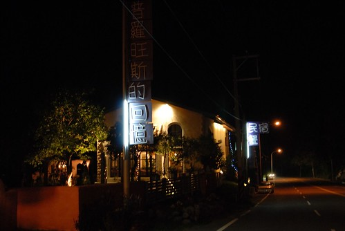  
  
(徹)餓...餓...餓...肚子快餓扁扁了  
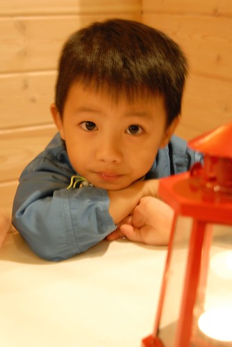  
  
(愛)飯還要多久才會上來阿....  
  
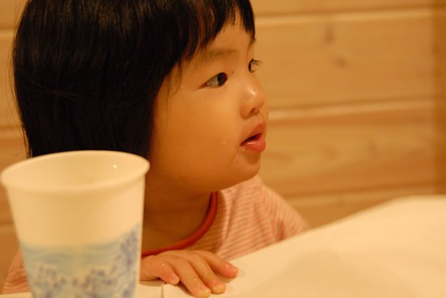  
  
不像以往認份且堅持的早早回家 好讓阿徹小愛盡量在10點左右上床睡覺  
這是我們第一次玩到這麼晚才回家  
連阿徹都忍不住直呼好晚喔 好累喔  
問他"很累 那下次不要去泡溫泉好了 不要玩這麼晚好了"  
阿徹又是一臉理所當然的說"下次就住外面就好啦"  
ㄘㄟˊ你這真是個好建議阿....娘會記取教訓的
