天氣涼爽的周六傍晚時分 一家人坐在東石漁人碼頭堤岸上 看著夕陽吹著泡泡... 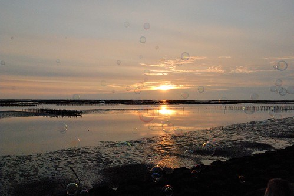

母親節那週 愛愛剛好拿回那月份的羊奶玩具: 泡泡三罐組 其實我很不愛這些因為上才藝課或是訂羊奶而得到的小玩具 總覺得品質粗糙且只會增加家裡的亂源 因此我都會用些技巧或理由把這些玩具收到儲藏室"冷藏" 可是阿徹愛愛很愛吹泡泡 去嘉義公園打彈珠換泡泡 連我們的車上也放了1-2罐的泡泡好出門時玩 因此這回的泡泡組沒有被冷藏 而是讓愛愛歡歡喜喜的帶著一起坐車回嘉義 原本就打算這週回嘉義時帶徹愛去東石漁人碼頭玩沙的 所以這泡泡來的真是巧 玩完沙後 看著夕陽吹泡泡多棒阿! 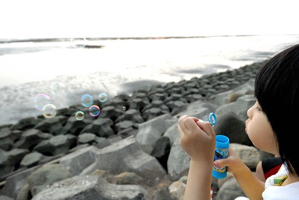 我們一家子第一次四個人一起這麼認真的做著吹泡泡這件事 一開始徹爸她們三個吹 我拍照(上下這兩張我照的) 後來換我跟徹愛吹 徹爸拍照 我從來沒當一回事的"吹泡泡" 想不到竟然這樣好玩 而且還讓我的心頭超級暖洋洋 甚至接下來的一週 一家子面著夕陽吹泡泡的那一幕常浮現在我腦海中 那樣的全心全意 那樣的笑容...我沉浸在這樣的簡單平凡小快樂中... 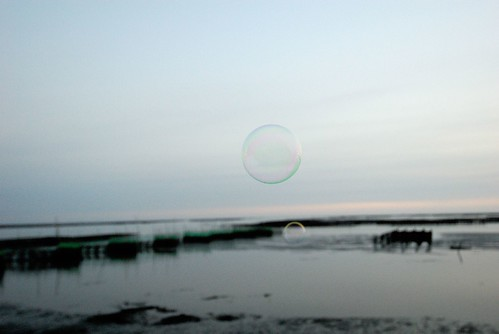 認真吹泡泡後 才發現原來吹泡泡的學問也不小 要吹的多? 還是要吹的大? "哇! 媽媽吹的好多!"  原來一口氣提上來後可以連續吹出這麼多泡泡.. 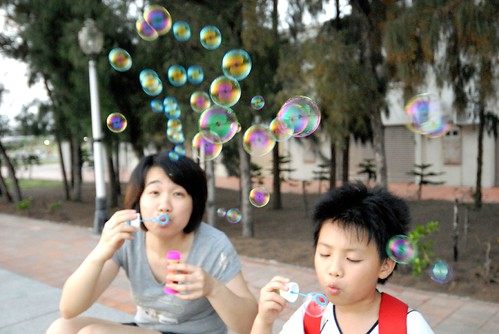 "這個泡泡好大! 爸爸 趕快拍下來" 而要吹的大則要小心翼翼的慢慢慢... 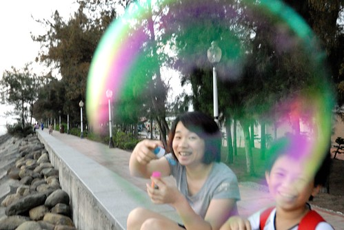 雖然阿徹跟愛愛平常的笑點就很低 就都很愛笑 但是我好喜歡阿徹跟愛愛那時後的笑容! 好像有魔法... 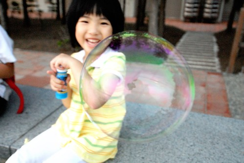 我們對著各式各樣的泡泡大呼小叫 外加越笑越大聲... 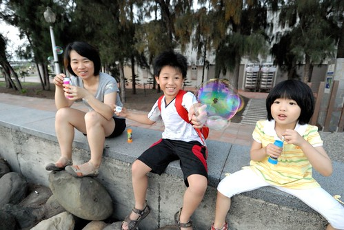 我們母子三人不停的吹而徹爸不停的照 徹爸說照個一百張總有一兩張catch到的吧! 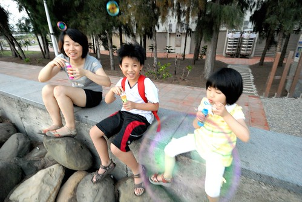 "阿! 阿徹套了泡泡頭可以當太空人了!" 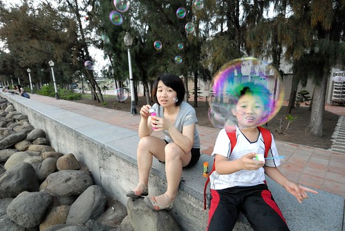 媽媽吹出去的泡泡遇到了阿徹 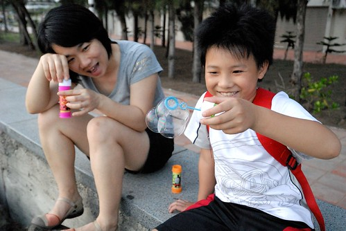 然後被阿徹補了好幾顆 變成了多體嬰泡泡 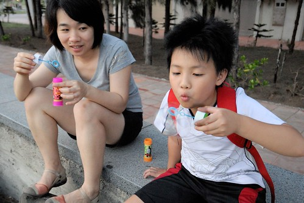 沉重的多體嬰泡泡竟然還能飛 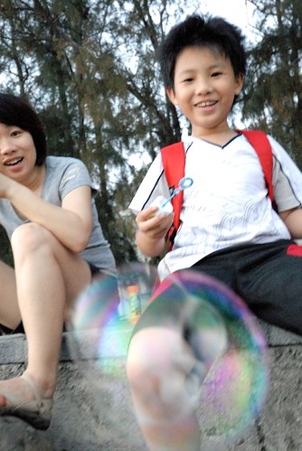 可是最後竟然落去愛愛的手上了  抓到泡泡的愛愛好開心阿! 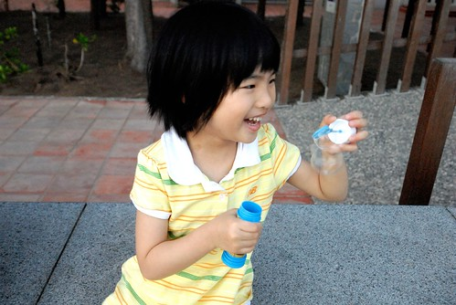 我喜歡這樣的天氣 這樣的黃昏 這樣的一家子!!! 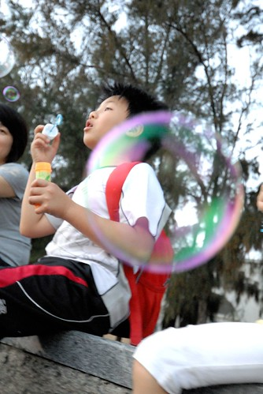
